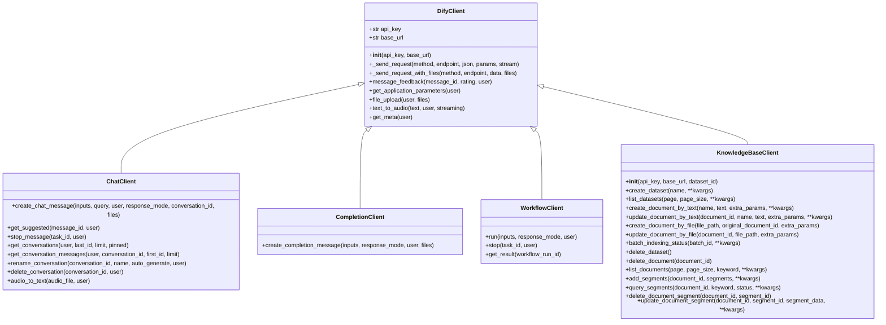

# Python SDK

<cite>
**本文档中引用的文件**
- [client.py](file://sdks/python-client/dify_client/client.py)
- [setup.py](file://sdks/python-client/setup.py)
- [__init__.py](file://sdks/python-client/dify_client/__init__.py)
- [README.md](file://sdks/python-client/README.md)
</cite>

## 目录
1. [简介](#简介)
2. [项目结构](#项目结构)
3. [核心组件](#核心组件)
4. [架构概述](#架构概述)
5. [详细组件分析](#详细组件分析)
6. [依赖分析](#依赖分析)
7. [性能考虑](#性能考虑)
8. [故障排除指南](#故障排除指南)
9. [结论](#结论)
10. [附录](#附录)（如有必要）

## 简介
本文档旨在为Dify Python SDK提供全面的使用指南，重点阐述其在Python生态系统中的集成方法。文档详细说明了pip安装流程、包导入方式和DifyClient类的初始化参数配置，包括认证凭证管理和自定义超时设置。提供了详尽的代码示例，涵盖同步和异步两种调用模式，展示应用调试、对话交互、知识库操作和工作流执行等场景。文档深入解析了返回的Response对象结构、流式响应处理方法、异常类型分类和上下文管理器使用。针对数据科学和机器学习场景，提供了与Jupyter Notebook、Pandas和Flask/Django框架的集成最佳实践。

## 项目结构
Dify Python SDK的项目结构设计清晰，主要包含客户端实现、测试用例和配置文件。SDK的核心功能实现在`dify_client`包中，其中`client.py`文件定义了所有客户端类和方法，`__init__.py`文件负责模块的导入管理。`setup.py`文件包含了包的元数据和依赖信息，用于pip安装。`README.md`文件提供了快速入门指南和基本使用示例。


**图示来源**
- [client.py](file://sdks/python-client/dify_client/client.py#L1-L470)
- [setup.py](file://sdks/python-client/setup.py#L1-L26)

**章节来源**
- [client.py](file://sdks/python-client/dify_client/client.py#L1-L470)
- [setup.py](file://sdks/python-client/setup.py#L1-L26)

## 核心组件
Dify Python SDK的核心组件包括`DifyClient`基类和多个功能特定的子类，如`ChatClient`、`CompletionClient`、`WorkflowClient`和`KnowledgeBaseClient`。这些类通过继承`DifyClient`基类，共享了认证和请求发送的基本功能，同时各自实现了特定于应用场景的方法。`DifyClient`类负责处理API密钥认证、基础URL配置和HTTP请求的发送，而子类则专注于特定功能的API调用，如聊天消息创建、补全消息生成、工作流执行和知识库管理。

**章节来源**
- [client.py](file://sdks/python-client/dify_client/client.py#L5-L470)

## 架构概述
Dify Python SDK的架构采用面向对象设计，以`DifyClient`为基类，通过继承机制实现功能扩展。这种设计模式使得代码具有良好的可维护性和可扩展性。SDK通过`requests`库与Dify服务API进行通信，所有HTTP请求都经过`_send_request`和`_send_request_with_files`方法进行统一处理，确保了请求的一致性和安全性。功能特定的客户端类（如`ChatClient`和`CompletionClient`）封装了特定应用场景的API调用，简化了用户的使用复杂度。



**图示来源**
- [client.py](file://sdks/python-client/dify_client/client.py#L5-L470)

## 详细组件分析
### ChatClient分析
`ChatClient`类是Dify Python SDK中用于处理聊天相关功能的核心组件。它继承自`DifyClient`基类，专注于实现聊天消息的创建、管理和查询功能。`ChatClient`提供了创建聊天消息、获取建议回复、停止消息生成、获取会话列表和消息历史等方法，支持阻塞和流式两种响应模式。

#### 对象导向组件：


**图示来源**
- [client.py](file://sdks/python-client/dify_client/client.py#L55-L155)

### CompletionClient分析
`CompletionClient`类专门用于处理补全消息的生成。它通过`create_completion_message`方法支持阻塞和流式两种响应模式，允许用户根据需求选择合适的调用方式。该类特别适用于需要生成文本补全的应用场景，如自动补全、内容生成等。

#### API/服务组件：


**图示来源**
- [client.py](file://sdks/python-client/dify_client/client.py#L49-L53)

### WorkflowClient分析
`WorkflowClient`类用于执行和管理工作流。它提供了运行工作流、停止工作流执行和获取工作流结果的方法。该类支持流式和阻塞两种模式，允许用户根据应用场景选择合适的调用方式。

#### API/服务组件：


**图示来源**
- [client.py](file://sdks/python-client/dify_client/client.py#L156-L168)

### KnowledgeBaseClient分析
`KnowledgeBaseClient`类专门用于管理和操作知识库。它提供了创建和管理数据集、文档和段落的完整功能集，支持通过文本或文件创建文档，查询和更新文档内容，以及管理知识库的索引状态。

#### 复杂逻辑组件：


**图示来源**
- [client.py](file://sdks/python-client/dify_client/client.py#L171-L469)

## 依赖分析
Dify Python SDK的依赖关系简单明了，主要依赖于`requests`库进行HTTP通信。`setup.py`文件中明确列出了这一依赖，确保了SDK的安装和使用过程中的依赖管理。SDK通过`__init__.py`文件将`client.py`中的类和方法暴露给外部使用，实现了模块的封装和导入管理。


**图示来源**
- [setup.py](file://sdks/python-client/setup.py#L1-L26)

**章节来源**
- [setup.py](file://sdks/python-client/setup.py#L1-L26)

## 性能考虑
Dify Python SDK在设计时考虑了性能优化，特别是在处理流式响应时。通过支持流式模式，SDK允许用户在数据生成的同时进行处理，减少了等待时间，提高了应用的响应速度。此外，SDK通过复用HTTP连接和优化请求头，减少了网络开销，提高了通信效率。对于大数据量的文件上传，SDK采用了分块上传的方式，避免了内存溢出的风险。

## 故障排除指南
在使用Dify Python SDK时，可能会遇到各种问题，如认证失败、网络连接问题、API调用错误等。SDK通过返回详细的HTTP响应状态码和错误信息，帮助用户快速定位和解决问题。对于常见的认证问题，用户应检查API密钥是否正确；对于网络问题，应检查网络连接和防火墙设置；对于API调用错误，应参考Dify服务API文档，确保请求参数的正确性。

**章节来源**
- [client.py](file://sdks/python-client/dify_client/client.py#L5-L470)
- [README.md](file://sdks/python-client/README.md#L1-L223)

## 结论
Dify Python SDK为开发者提供了一套完整、易用的工具，用于与Dify服务API进行交互。通过清晰的类设计和丰富的功能集，SDK简化了API调用的复杂性，提高了开发效率。无论是进行简单的文本生成，还是复杂的工作流管理和知识库操作，Dify Python SDK都能提供强大的支持。随着Dify平台的不断发展，SDK也将持续更新，为用户提供更多功能和更好的使用体验。

## 附录
### 安装命令
```bash
pip install dify-client
```

### 基本使用示例
```python
from dify_client import ChatClient

api_key = "your_api_key"
chat_client = ChatClient(api_key)
response = chat_client.create_chat_message(inputs={}, query="Hello", user="user_id", response_mode="blocking")
print(response.json().get("answer"))
```