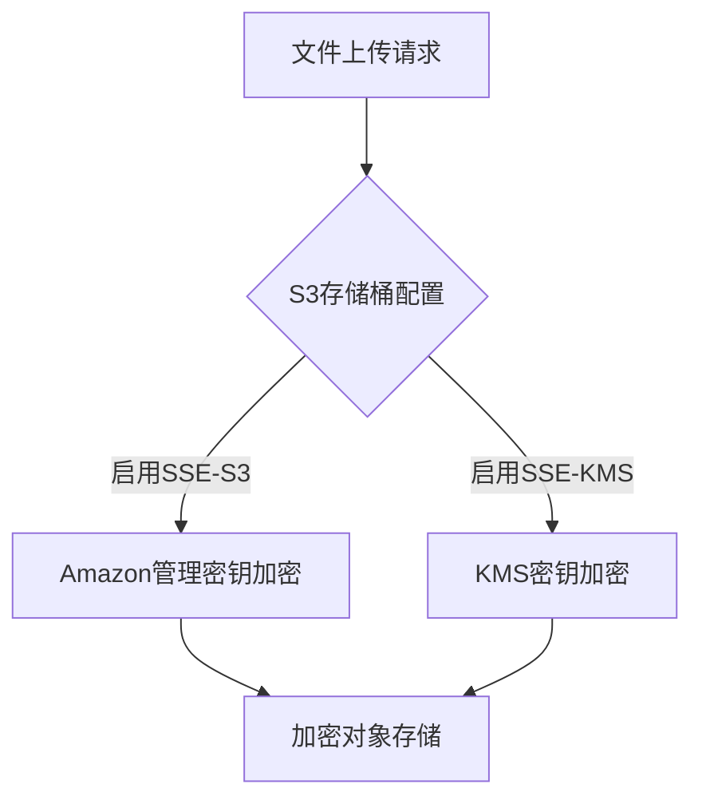
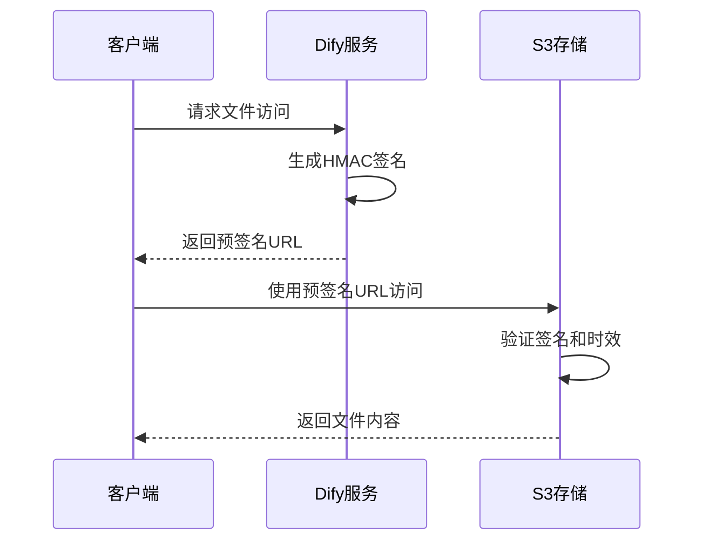
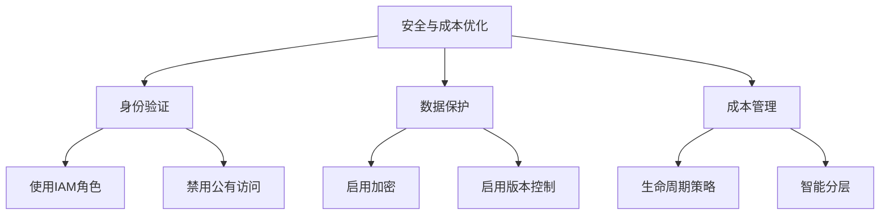

# AWS S3 集成

<cite>
**本文档引用文件**  
- [aws_s3_storage.py](file://api/extensions/storage/aws_s3_storage.py)
- [amazon_s3_storage_config.py](file://api/configs/middleware/storage/amazon_s3_storage_config.py)
- [file_service.py](file://api/services/file_service.py)
- [helpers.py](file://api/core/file/helpers.py)
- [app_config.py](file://api/configs/app_config.py)
</cite>

## 目录
1. [简介](#简介)
2. [IAM角色与策略配置](#iam角色与策略配置)
3. [S3存储桶创建与配置](#s3存储桶创建与配置)
4. [服务器端加密配置](#服务器端加密配置)
5. [预签名URL生成与权限控制](#预签名url生成与权限控制)
6. [分片上传实现](#分片上传实现)
7. [CDN（CloudFront）集成方案](#cdncloudfront集成方案)
8. [存储类选择建议](#存储类选择建议)
9. [生命周期策略管理](#生命周期策略管理)
10. [跨区域复制设置](#跨区域复制设置)
11. [成本优化与安全最佳实践](#成本优化与安全最佳实践)

## 简介
Dify支持通过Amazon S3作为文件存储后端，实现高可用、可扩展的对象存储解决方案。本指南详细说明如何在Dify中配置和使用AWS S3，涵盖从IAM权限设置到安全最佳实践的完整流程。

**Section sources**
- [aws_s3_storage.py](file://api/extensions/storage/aws_s3_storage.py#L1-L87)
- [amazon_s3_storage_config.py](file://api/configs/middleware/storage/amazon_s3_storage_config.py#L1-L45)

## IAM角色与策略配置
Dify支持两种S3认证方式：使用访问密钥（Access Key/Secret Key）或AWS托管IAM角色。当启用`S3_USE_AWS_MANAGED_IAM`配置时，系统将自动使用EC2实例关联的IAM角色进行身份验证，无需提供AK/SK。

推荐的安全实践是使用IAM角色而非静态密钥，以避免密钥泄露风险。IAM角色应具备以下最小权限策略：

```json
{
  "Version": "2012-10-17",
  "Statement": [
    {
      "Effect": "Allow",
      "Action": [
        "s3:PutObject",
        "s3:GetObject",
        "s3:DeleteObject",
        "s3:HeadObject",
        "s3:ListBucket"
      ],
      "Resource": [
        "arn:aws:s3:::your-bucket-name",
        "arn:aws:s3:::your-bucket-name/*"
      ]
    }
  ]
}
```

**Section sources**
- [aws_s3_storage.py](file://api/extensions/storage/aws_s3_storage.py#L15-L30)
- [amazon_s3_storage_config.py](file://api/configs/middleware/storage/amazon_s3_storage_config.py#L38-L45)

## S3存储桶创建与配置
Dify在初始化时会自动检查并创建指定名称的S3存储桶。如果配置的存储桶不存在，系统将尝试创建；若存储桶存在但无法访问，则跳过创建步骤。

存储桶命名需全局唯一，建议采用`dify-{region}-{environment}`格式。必须启用以下安全配置：
- **阻止公有访问**：防止意外暴露文件
- **启用访问日志记录**：记录所有访问请求
- **启用版本控制**（可选）：防止误删除

**Section sources**
- [aws_s3_storage.py](file://api/extensions/storage/aws_s3_storage.py#L32-L45)

## 服务器端加密配置
Dify通过AWS SDK自动支持S3服务器端加密。S3提供两种加密方式：
- **SSE-S3**：使用Amazon管理的密钥
- **SSE-KMS**：使用AWS KMS密钥，提供更细粒度的访问控制和审计能力

加密配置在S3控制台或通过CLI设置，Dify无需额外配置即可继承存储桶的加密策略。



**Diagram sources**
- [aws_s3_storage.py](file://api/extensions/storage/aws_s3_storage.py#L50-L55)

## 预签名URL生成与权限控制
Dify通过HMAC签名机制生成安全的预签名URL，用于文件访问授权。签名包含时间戳和随机数（nonce），并在`FILES_ACCESS_TIMEOUT`（默认3600秒）后失效。

预签名URL生成流程：
1. 构造签名消息：`file-preview|{file_id}|{timestamp}|{nonce}`
2. 使用`SECRET_KEY`进行HMAC-SHA256签名
3. Base64编码签名并附加到URL参数



**Diagram sources**
- [helpers.py](file://api/core/file/helpers.py#L5-L25)
- [file_service.py](file://api/services/file_service.py#L181-L185)

## 分片上传实现
虽然当前代码未直接实现分片上传，但可通过AWS SDK的高级API自动处理大文件的分片上传。当文件大小超过一定阈值时，boto3会自动采用分片上传策略，确保大文件传输的稳定性和效率。

建议在客户端实现分片上传逻辑，或使用AWS SDK的`upload_file`方法，该方法内置了分片上传、重试和断点续传功能。

## CDN（CloudFront）集成方案
通过将S3存储桶作为CloudFront的源站，可实现全球加速和降低访问延迟。配置要点：
- 设置CloudFront分发指向S3存储桶
- 启用HTTPS和自定义域名
- 配置缓存策略以优化性能
- 使用签名URL或签名Cookie控制访问权限

Dify的预签名机制与CloudFront兼容，可在边缘节点验证请求合法性。

## 存储类选择建议
根据数据访问频率选择合适的存储类：
- **Standard**：频繁访问的数据
- **Infrequent Access (IA)**：不频繁访问但需要快速获取的数据
- **Glacier**：归档数据，访问延迟较高

Dify默认使用Standard存储类，可通过S3生命周期策略自动转换存储类以优化成本。

## 生命周期策略管理
配置S3生命周期规则可自动管理对象存储成本：
- 30天后转为Standard-IA
- 90天后转为Glacier
- 365天后自动删除

这些策略在S3控制台配置，Dify无需修改代码即可受益于自动分层存储。

## 跨区域复制设置
为实现灾难恢复和低延迟访问，可配置跨区域复制（CRR）。需注意：
- 源和目标存储桶必须启用版本控制
- IAM角色需具备`s3:ReplicateObject`等权限
- 复制是单向且异步的

CRR配置完全在AWS层面完成，Dify应用无感知。

## 成本优化与安全最佳实践
### 安全最佳实践
- 启用S3 Block Public Access
- 启用访问日志和服务器访问日志
- 使用IAM角色而非静态密钥
- 定期轮换KMS密钥（如使用SSE-KMS）

### 成本优化建议
- 使用生命周期策略自动降级存储类
- 启用S3 Intelligent-Tiering
- 监控存储使用情况并设置警报
- 使用CloudFront减少数据传出费用



**Diagram sources**
- [aws_s3_storage.py](file://api/extensions/storage/aws_s3_storage.py#L1-L87)
- [amazon_s3_storage_config.py](file://api/configs/middleware/storage/amazon_s3_storage_config.py#L1-L45)

**Section sources**
- [aws_s3_storage.py](file://api/extensions/storage/aws_s3_storage.py#L1-L87)
- [amazon_s3_storage_config.py](file://api/configs/middleware/storage/amazon_s3_storage_config.py#L1-L45)
- [helpers.py](file://api/core/file/helpers.py#L1-L85)
- [file_service.py](file://api/services/file_service.py#L1-L216)
- [app_config.py](file://api/configs/app_config.py#L2-L2)