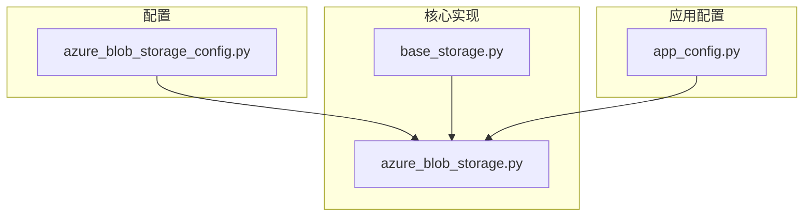
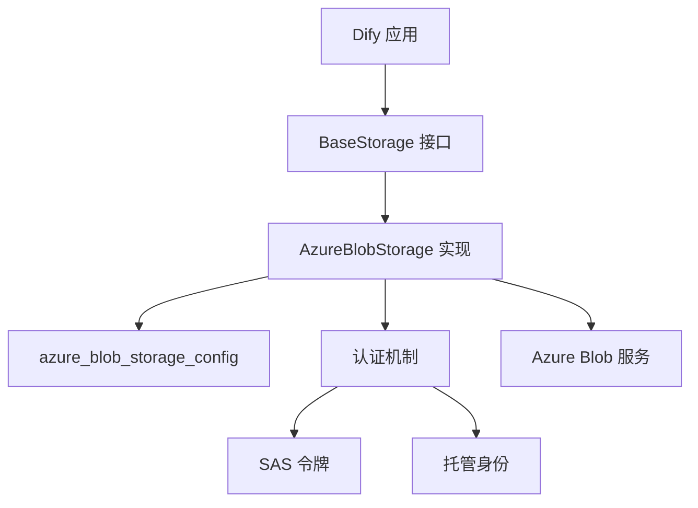
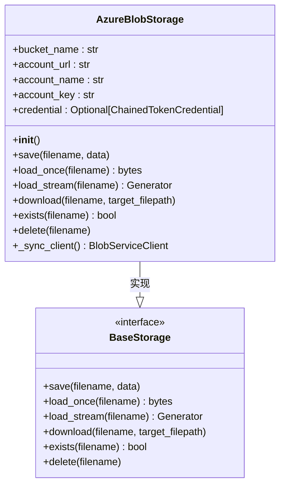
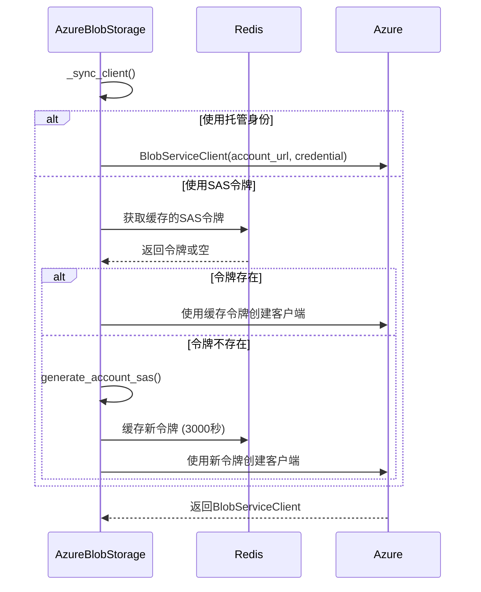
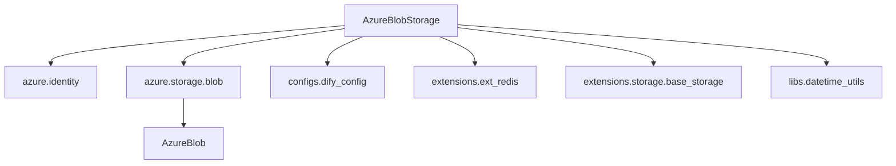

# Azure Blob 集成

<cite>
**本文档中引用的文件**  
- [azure_blob_storage.py](file://api/extensions/storage/azure_blob_storage.py)
- [azure_blob_storage_config.py](file://api/configs/middleware/storage/azure_blob_storage_config.py)
- [base_storage.py](file://api/extensions/storage/base_storage.py)
- [app_config.py](file://api/configs/app_config.py)
</cite>

## 目录
1. [简介](#简介)
2. [项目结构](#项目结构)
3. [核心组件](#核心组件)
4. [架构概述](#架构概述)
5. [详细组件分析](#详细组件分析)
6. [依赖分析](#依赖分析)
7. [性能考虑](#性能考虑)
8. [故障排除指南](#故障排除指南)
9. [结论](#结论)

## 简介
本文档提供 Dify 与 Azure Blob Storage 集成的完整指南。涵盖配置 Azure 存储账户、容器权限、共享访问签名（SAS）令牌生成、托管身份认证、存储层级配置、生命周期管理、跨区域复制、静态加密以及与 Azure CDN 的集成方案。同时提供性能优化建议和安全实践。

## 项目结构
Dify 的存储扩展模块支持多种云存储服务，包括 Azure Blob Storage。相关配置和实现文件位于特定目录中，确保模块化和可扩展性。



**Diagram sources**
- [azure_blob_storage_config.py](file://api/configs/middleware/storage/azure_blob_storage_config.py)
- [azure_blob_storage.py](file://api/extensions/storage/azure_blob_storage.py)
- [base_storage.py](file://api/extensions/storage/base_storage.py)
- [app_config.py](file://api/configs/app_config.py)

**Section sources**
- [azure_blob_storage_config.py](file://api/configs/middleware/storage/azure_blob_storage_config.py)
- [azure_blob_storage.py](file://api/extensions/storage/azure_blob_storage.py)

## 核心组件
Azure Blob 存储集成的核心是 `AzureBlobStorage` 类，它实现了 `BaseStorage` 接口，提供文件的保存、加载、下载、存在性检查和删除功能。该类通过配置文件中的参数初始化，并支持两种认证方式：账户密钥和托管身份。

**Section sources**
- [azure_blob_storage.py](file://api/extensions/storage/azure_blob_storage.py#L15-L85)
- [base_storage.py](file://api/extensions/storage/base_storage.py#L6-L39)

## 架构概述
Dify 使用分层架构来管理与 Azure Blob Storage 的集成。配置层定义环境变量，实现层处理具体的存储操作，而应用层通过统一接口调用这些操作。



**Diagram sources**
- [azure_blob_storage.py](file://api/extensions/storage/azure_blob_storage.py)
- [base_storage.py](file://api/extensions/storage/base_storage.py)
- [azure_blob_storage_config.py](file://api/configs/middleware/storage/azure_blob_storage_config.py)

## 详细组件分析

### AzureBlobStorage 类分析
`AzureBlobStorage` 类是 Azure Blob 存储功能的核心实现，封装了所有与 Azure 交互的逻辑。

#### 类图


**Diagram sources**
- [azure_blob_storage.py](file://api/extensions/storage/azure_blob_storage.py#L15-L85)
- [base_storage.py](file://api/extensions/storage/base_storage.py#L6-L39)

#### 初始化流程
```mermaid
flowchart TD
Start([开始]) --> CheckManagedIdentity{"account_key == 'managedidentity'?"}
CheckManagedIdentity --> |是| SetManagedIdentity[credential = DefaultAzureCredential()]
CheckManagedIdentity --> |否| SetCredential[credential = None]
SetManagedIdentity --> LoadConfig[从 dify_config 加载配置]
SetCredential --> LoadConfig
LoadConfig --> End([结束])
```

**Diagram sources**
- [azure_blob_storage.py](file://api/extensions/storage/azure_blob_storage.py#L15-L30)

#### 客户端同步流程


**Diagram sources**
- [azure_blob_storage.py](file://api/extensions/storage/azure_blob_storage.py#L65-L84)

**Section sources**
- [azure_blob_storage.py](file://api/extensions/storage/azure_blob_storage.py#L15-L85)

## 依赖分析
Azure Blob 存储实现依赖于多个外部库和内部模块，形成清晰的依赖关系。



**Diagram sources**
- [azure_blob_storage.py](file://api/extensions/storage/azure_blob_storage.py#L1-L14)

**Section sources**
- [azure_blob_storage.py](file://api/extensions/storage/azure_blob_storage.py)
- [azure_blob_storage_config.py](file://api/configs/middleware/storage/azure_blob_storage_config.py)

## 性能考虑
- **SAS 令牌缓存**：通过 Redis 缓存 SAS 令牌，有效期为 3000 秒，减少频繁生成令牌的开销。
- **流式下载**：`load_stream` 方法支持流式传输大文件，避免内存溢出。
- **连接复用**：`_sync_client` 方法确保客户端连接的复用，提高性能。

## 故障排除指南
- **认证失败**：检查 `AZURE_BLOB_ACCOUNT_NAME` 和 `AZURE_BLOB_ACCOUNT_KEY` 是否正确，或确保托管身份已正确配置。
- **容器不存在**：确保 `AZURE_BLOB_CONTAINER_NAME` 指定的容器已在 Azure 存储账户中创建。
- **网络问题**：验证 `AZURE_BLOB_ACCOUNT_URL` 是否可达，检查防火墙和网络策略。
- **权限不足**：确认 SAS 令牌具有读、写、删除、列出、添加和创建权限。

**Section sources**
- [azure_blob_storage.py](file://api/extensions/storage/azure_blob_storage.py)
- [azure_blob_storage_config.py](file://api/configs/middleware/storage/azure_blob_storage_config.py)

## 结论
Dify 的 Azure Blob 存储集成提供了灵活、安全且高性能的文件存储解决方案。通过合理的配置和认证机制，可以轻松实现与 Azure 云服务的无缝对接，满足各种应用场景的需求。