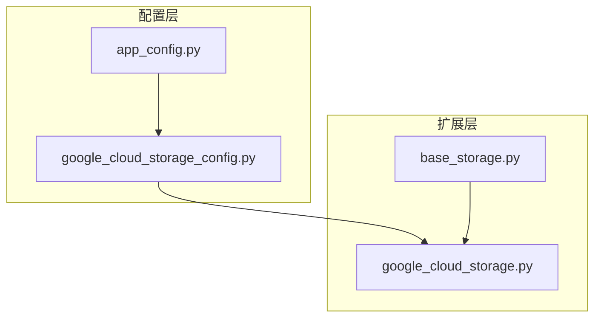
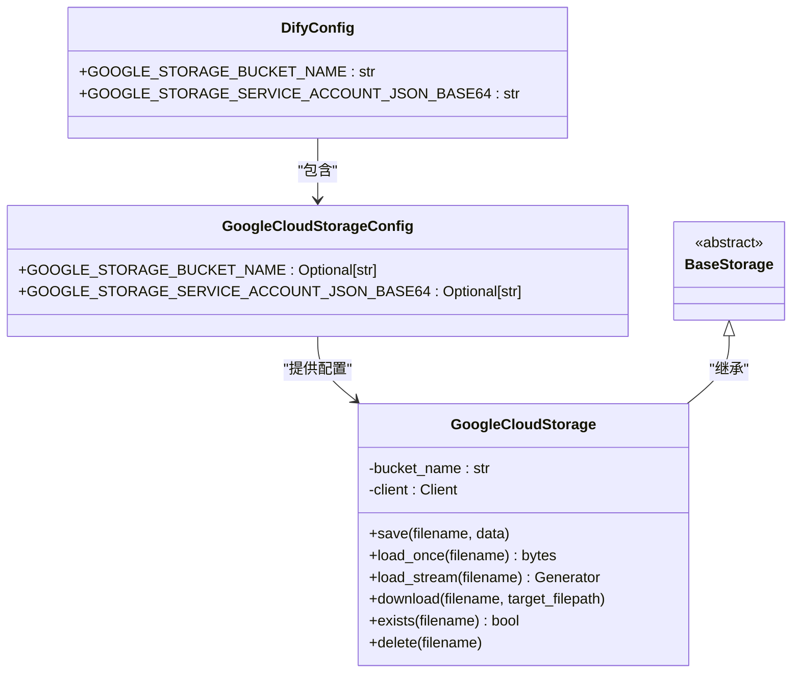
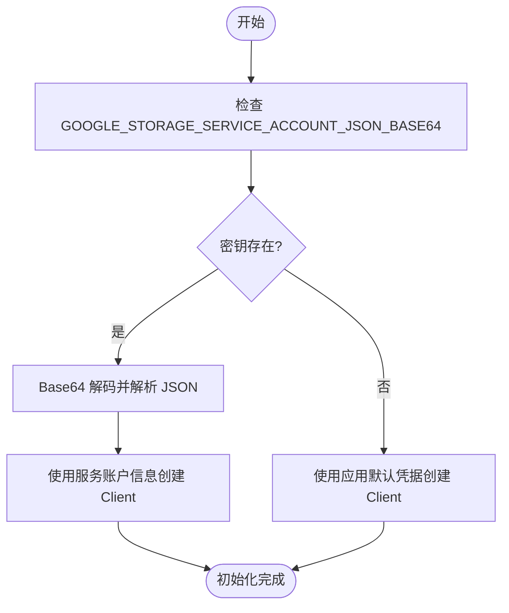
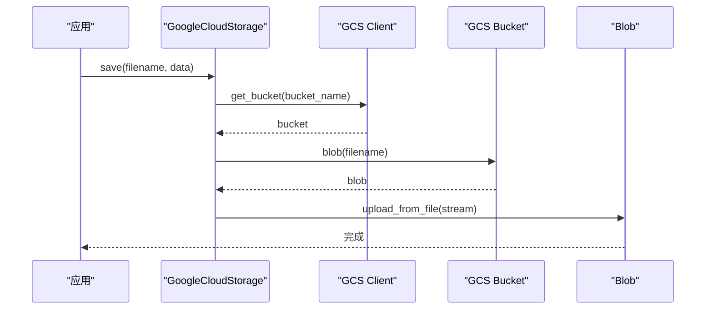
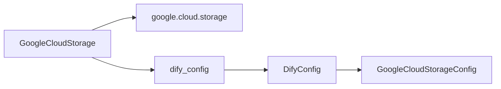

# Google Cloud Storage 集成

<cite>
**本文档中引用的文件**  
- [google_cloud_storage.py](file://api/extensions/storage/google_cloud_storage.py)
- [google_cloud_storage_config.py](file://api/configs/middleware/storage/google_cloud_storage_config.py)
- [storage_type.py](file://api/extensions/storage/storage_type.py)
- [app_config.py](file://api/configs/app_config.py)
- [__init__.py](file://api/configs/__init__.py)
</cite>

## 目录
1. [简介](#简介)
2. [项目结构](#项目结构)
3. [核心组件](#核心组件)
4. [架构概述](#架构概述)
5. [详细组件分析](#详细组件分析)
6. [依赖分析](#依赖分析)
7. [性能考虑](#性能考虑)
8. [故障排除指南](#故障排除指南)
9. [结论](#结论)

## 简介
本文档详细说明 Dify 如何与 Google Cloud Storage (GCS) 集成。涵盖服务账户密钥的创建与管理、存储桶配置、对象生命周期管理、版本控制启用，以及使用 V4 签名 URL 进行安全访问。同时包括存储类别选择（Standard、Nearline、Coldline、Archive）、跨区域复制、统一存储桶级访问控制（Uniform Bucket-level Access）配置，以及与 Cloud CDN 的集成。提供性能优化技巧和安全最佳实践，如启用默认加密、配置组织政策。

## 项目结构
Dify 的项目结构清晰地将存储相关的配置和实现分离。Google Cloud Storage 的集成主要位于 `api/extensions/storage/` 目录下，配置项则位于 `api/configs/middleware/storage/` 中。

**Diagram sources**
- [google_cloud_storage.py](file://api/extensions/storage/google_cloud_storage.py#L1-L60)
- [google_cloud_storage_config.py](file://api/configs/middleware/storage/google_cloud_storage_config.py#L1-L20)

**Section sources**
- [google_cloud_storage.py](file://api/extensions/storage/google_cloud_storage.py#L1-L60)
- [google_cloud_storage_config.py](file://api/configs/middleware/storage/google_cloud_storage_config.py#L1-L20)

## 核心组件
Dify 通过 `GoogleCloudStorage` 类实现与 Google Cloud Storage 的集成。该类继承自 `BaseStorage`，并利用 `google-cloud-storage` SDK 与 GCS 交互。核心功能包括文件的保存、加载、流式下载、存在性检查和删除。

**Section sources**
- [google_cloud_storage.py](file://api/extensions/storage/google_cloud_storage.py#L1-L60)
- [base_storage.py](file://api/extensions/storage/base_storage.py)

## 架构概述
Dify 的 GCS 集成采用分层架构，配置与实现分离。`DifyConfig` 类聚合所有配置，包括 GCS 配置。`GoogleCloudStorage` 实例在初始化时读取配置，并根据服务账户密钥是否存在决定使用服务账户认证还是应用默认凭据（ADC）。

**Diagram sources**
- [app_config.py](file://api/configs/app_config.py#L1-L113)
- [google_cloud_storage_config.py](file://api/configs/middleware/storage/google_cloud_storage_config.py#L1-L20)
- [google_cloud_storage.py](file://api/extensions/storage/google_cloud_storage.py#L1-L60)

## 详细组件分析

### GoogleCloudStorage 类分析
`GoogleCloudStorage` 是 GCS 集成的核心实现类。其初始化过程根据配置决定认证方式：若提供了 `GOOGLE_STORAGE_SERVICE_ACCOUNT_JSON_BASE64`，则使用该服务账户密钥进行认证；否则使用应用默认凭据（通常用于在 Google Cloud 环境中运行）。

#### 初始化流程

**Diagram sources**
- [google_cloud_storage.py](file://api/extensions/storage/google_cloud_storage.py#L10-L20)

#### 文件操作流程
`save` 方法将数据上传到指定的存储桶和文件名。它创建一个 Blob 对象，并从字节流中上传数据。

**Diagram sources**
- [google_cloud_storage.py](file://api/extensions/storage/google_cloud_storage.py#L22-L28)

**Section sources**
- [google_cloud_storage.py](file://api/extensions/storage/google_cloud_storage.py#L1-L60)

## 依赖分析
`GoogleCloudStorage` 类依赖于 `google-cloud-storage` SDK 和 Dify 的配置系统。它通过 `dify_config` 全局实例获取配置，体现了配置与实现的解耦。

**Diagram sources**
- [google_cloud_storage.py](file://api/extensions/storage/google_cloud_storage.py#L1-L60)
- [app_config.py](file://api/configs/app_config.py#L1-L113)

**Section sources**
- [google_cloud_storage.py](file://api/extensions/storage/google_cloud_storage.py#L1-L60)
- [app_config.py](file://api/configs/app_config.py#L1-L113)

## 性能考虑
- **流式处理**：`load_stream` 方法支持流式下载大文件，避免内存溢出。
- **分块读取**：流式下载时使用 4KB 分块，平衡网络效率和内存使用。
- **客户端管理**：`Client` 实例在 `GoogleCloudStorage` 生命周期内复用，减少连接开销。

## 故障排除指南
- **认证失败**：检查 `GOOGLE_STORAGE_SERVICE_ACCOUNT_JSON_BASE64` 是否正确编码，且服务账户具有存储桶的读写权限。
- **存储桶不存在**：确保 `GOOGLE_STORAGE_BUCKET_NAME` 指定的存储桶已创建且名称正确。
- **网络问题**：确认运行环境可以访问 `storage.googleapis.com`。

**Section sources**
- [google_cloud_storage.py](file://api/extensions/storage/google_cloud_storage.py#L1-L60)
- [errors.py](file://api/core/errors/error.py)

## 结论
Dify 通过清晰的配置和实现分离，提供了与 Google Cloud Storage 的可靠集成。开发者可以通过环境变量配置 GCS 参数，系统会自动处理认证和文件操作。该设计支持灵活部署，既可在本地开发环境使用服务账户密钥，也可在 Google Cloud 环境中利用应用默认凭据。