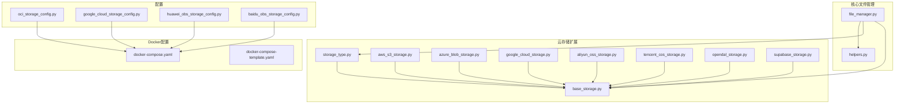
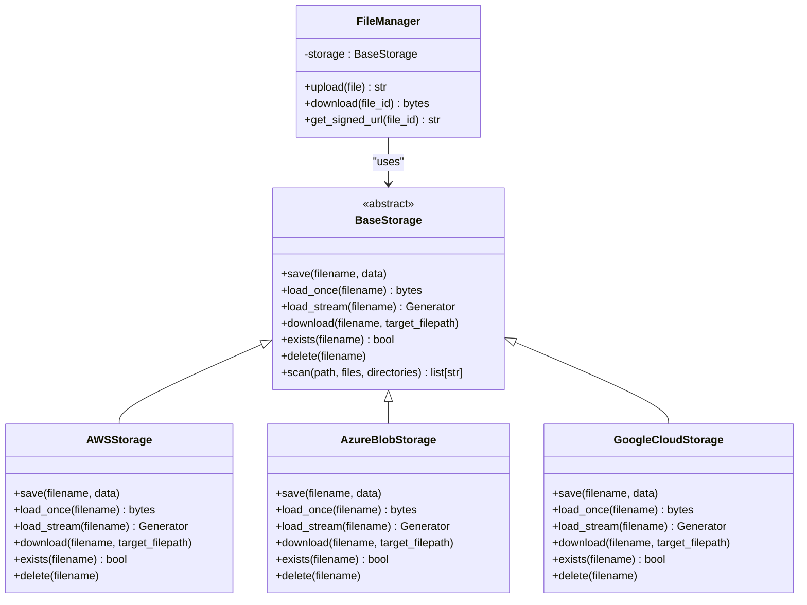
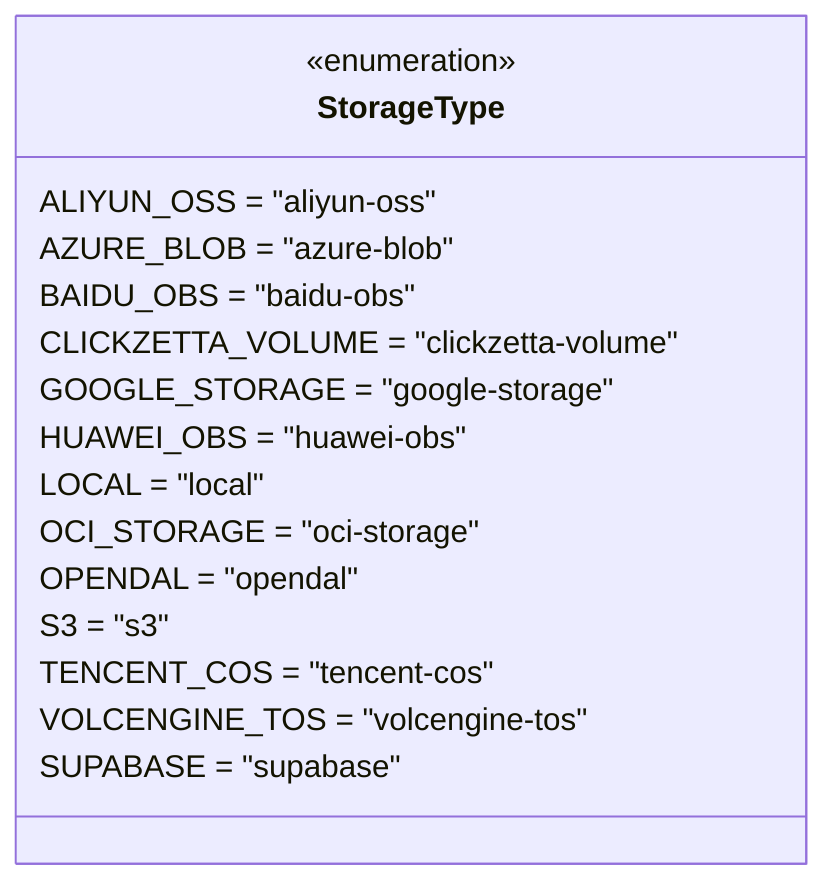
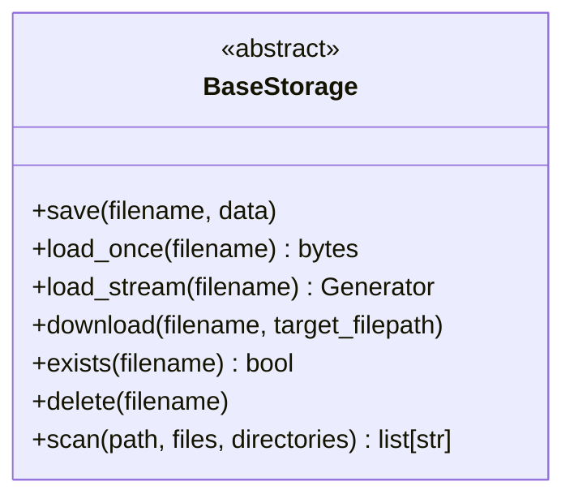
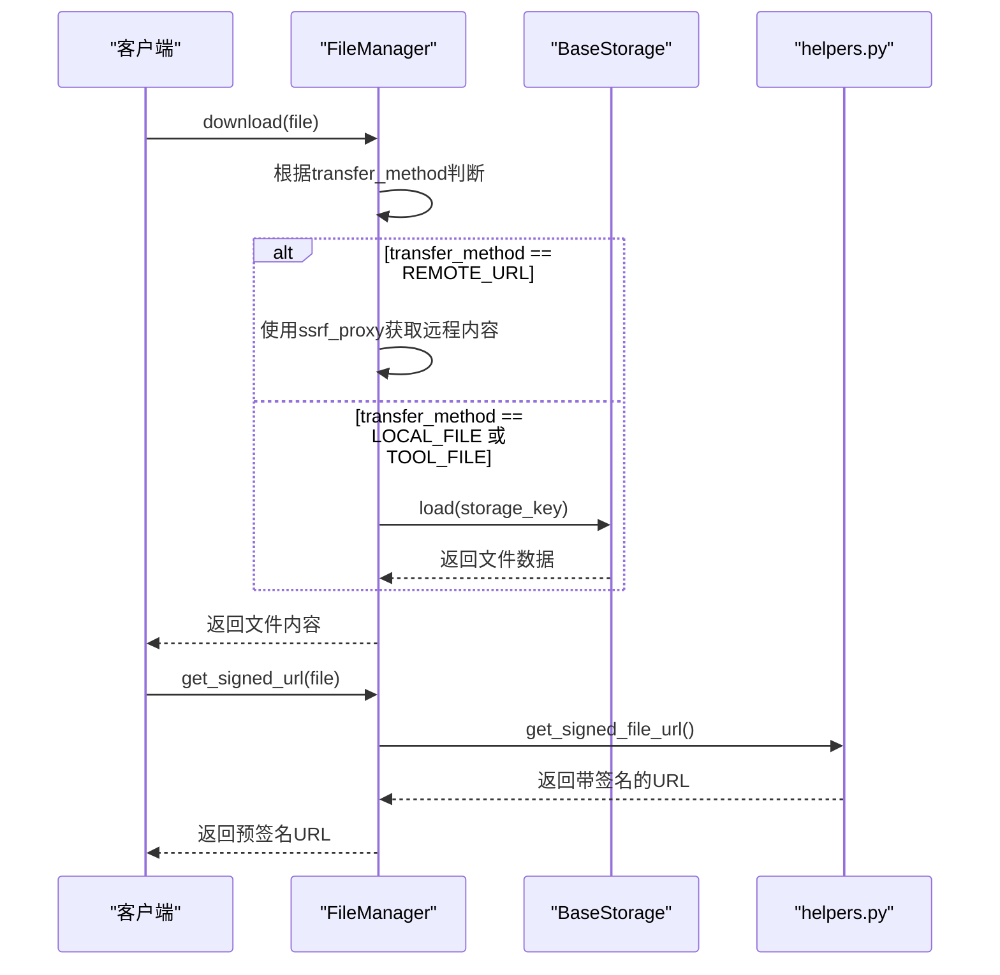
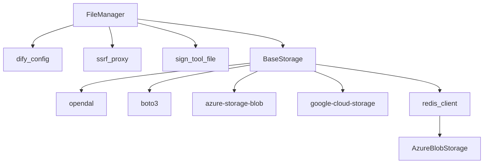

# 云存储通用配置

<cite>
**本文档引用的文件**
- [storage_type.py](file://api/extensions/storage/storage_type.py)
- [base_storage.py](file://api/extensions/storage/base_storage.py)
- [file_manager.py](file://api/core/file/file_manager.py)
- [helpers.py](file://api/core/file/helpers.py)
- [oci_storage_config.py](file://api/configs/middleware/storage/oci_storage_config.py)
- [google_cloud_storage_config.py](file://api/configs/middleware/storage/google_cloud_storage_config.py)
- [huawei_obs_storage_config.py](file://api/configs/middleware/storage/huawei_obs_storage_config.py)
- [baidu_obs_storage_config.py](file://api/configs/middleware/storage/baidu_obs_storage_config.py)
- [docker-compose.yaml](file://docker/docker-compose.yaml)
- [docker-compose-template.yaml](file://docker/docker-compose-template.yaml)
</cite>

## 目录
1. [简介](#简介)
2. [项目结构](#项目结构)
3. [核心组件](#核心组件)
4. [架构概述](#架构概述)
5. [详细组件分析](#详细组件分析)
6. [依赖分析](#依赖分析)
7. [性能考虑](#性能考虑)
8. [故障排除指南](#故障排除指南)
9. [结论](#结论)

## 简介
本文档旨在阐述Dify平台中云存储集成的统一架构和公共配置项。文档详细说明了StorageType枚举的使用、BaseStorage抽象类的设计模式，以及文件管理器（FileManager）如何通过适配器模式对接不同云存储服务。同时，文档解释了环境变量的通用命名规范、凭据管理机制、文件上传下载的公共API接口、预签名URL的统一生成逻辑，以及错误处理和重试策略。最后，文档提供了多云存储配置的切换方法和最佳实践。

## 项目结构
Dify的云存储功能主要分布在`api/extensions/storage`目录下，该目录包含了所有云存储服务的实现。每个云存储服务都有独立的实现文件，如`aws_s3_storage.py`、`azure_blob_storage.py`等。核心的抽象基类`BaseStorage`和枚举类型`StorageType`也位于此目录。配置相关的设置分散在`api/configs/middleware/storage`目录下的各个配置文件中，而环境变量则在`docker`目录的`docker-compose`系列文件中定义。

**Diagram sources**
- [storage_type.py](file://api/extensions/storage/storage_type.py)
- [base_storage.py](file://api/extensions/storage/base_storage.py)
- [oci_storage_config.py](file://api/configs/middleware/storage/oci_storage_config.py)
- [docker-compose.yaml](file://docker/docker-compose.yaml)
- [file_manager.py](file://api/core/file/file_manager.py)
- [helpers.py](file://api/core/file/helpers.py)

**Section sources**
- [storage_type.py](file://api/extensions/storage/storage_type.py)
- [base_storage.py](file://api/extensions/storage/base_storage.py)
- [docker-compose.yaml](file://docker/docker-compose.yaml)
- [file_manager.py](file://api/core/file/file_manager.py)

## 核心组件
Dify云存储系统的核心组件包括`StorageType`枚举、`BaseStorage`抽象类和`FileManager`。`StorageType`定义了所有支持的云存储类型，`BaseStorage`为所有具体的存储实现提供了统一的接口契约，而`FileManager`则作为上层应用与底层存储服务之间的桥梁，通过适配器模式实现对不同云存储的无缝集成。

**Section sources**
- [storage_type.py](file://api/extensions/storage/storage_type.py)
- [base_storage.py](file://api/extensions/storage/base_storage.py)
- [file_manager.py](file://api/core/file/file_manager.py)

## 架构概述
Dify的云存储架构采用适配器模式，实现了存储服务的可插拔性。`BaseStorage`作为抽象基类，定义了所有存储服务必须实现的方法，如`save`、`load_once`、`download`等。具体的云存储服务（如AWS S3、Azure Blob）通过继承`BaseStorage`并实现其抽象方法来提供具体功能。`FileManager`通过`StorageType`枚举来决定使用哪个具体的存储适配器，从而实现了对不同云存储服务的统一管理和调用。

**Diagram sources**
- [base_storage.py](file://api/extensions/storage/base_storage.py)
- [file_manager.py](file://api/core/file/file_manager.py)

## 详细组件分析

### StorageType 枚举分析
`StorageType`是一个字符串枚举（StrEnum），它定义了Dify支持的所有云存储类型。每个枚举成员对应一个具体的云存储服务，其值为该服务的标准化标识符。这个枚举是实现多云存储配置切换的关键，它允许系统通过简单的字符串匹配来选择和初始化正确的存储适配器。

**Diagram sources**
- [storage_type.py](file://api/extensions/storage/storage_type.py)

**Section sources**
- [storage_type.py](file://api/extensions/storage/storage_type.py)

### BaseStorage 抽象类分析
`BaseStorage`是一个抽象基类（ABC），它为所有云存储实现定义了统一的接口。该类使用`@abstractmethod`装饰器强制所有子类必须实现`save`、`load_once`、`load_stream`、`download`、`exists`和`delete`等核心方法。这种设计模式确保了无论底层使用哪种云存储服务，上层应用都能通过相同的API进行文件操作，极大地提高了代码的可维护性和可扩展性。

**Diagram sources**
- [base_storage.py](file://api/extensions/storage/base_storage.py)

**Section sources**
- [base_storage.py](file://api/extensions/storage/base_storage.py)

### FileManager 文件管理器分析
`FileManager`是Dify中处理文件操作的核心服务。它不直接与任何具体的存储服务耦合，而是通过`BaseStorage`接口与底层存储进行交互。`FileManager`提供了`download`、`to_prompt_message_content`等高级功能，并负责处理文件的传输方法（如`REMOTE_URL`、`LOCAL_FILE`）和生成预签名URL。它利用`helpers.py`中的工具函数来实现安全的URL签名和验证。

**Diagram sources**
- [file_manager.py](file://api/core/file/file_manager.py)
- [helpers.py](file://api/core/file/helpers.py)

**Section sources**
- [file_manager.py](file://api/core/file/file_manager.py)
- [helpers.py](file://api/core/file/helpers.py)

## 依赖分析
Dify的云存储系统依赖于多个外部库和内部模块。外部依赖包括`opendal`用于统一访问多种存储后端，`boto3`用于AWS S3，`azure-storage-blob`用于Azure Blob等。内部依赖则包括`dify_config`用于获取配置，`ssrf_proxy`用于安全地访问远程URL，以及`sign_tool_file`用于生成安全的文件链接。`redis_client`被用于缓存Azure Blob的SAS令牌，以提高性能。

**Diagram sources**
- [file_manager.py](file://api/core/file/file_manager.py)
- [base_storage.py](file://api/extensions/storage/base_storage.py)
- [helpers.py](file://api/core/file/helpers.py)

**Section sources**
- [file_manager.py](file://api/core/file/file_manager.py)
- [base_storage.py](file://api/extensions/storage/base_storage.py)

## 性能考虑
在性能方面，Dify的云存储设计考虑了流式处理和缓存机制。`load_stream`方法允许以流的形式读取大文件，避免了内存溢出。对于Azure Blob等服务，系统会缓存SAS令牌，减少频繁的身份验证开销。预签名URL的有效期由`FILES_ACCESS_TIMEOUT`配置项控制，平衡了安全性和性能。使用`OPENDAL`作为统一接口可以简化多云环境下的性能调优。

## 故障排除指南
常见的云存储问题包括凭据错误、网络连接问题和权限不足。应首先检查环境变量中的密钥和端点配置是否正确。对于预签名URL失效的问题，检查`SECRET_KEY`是否一致以及URL是否过期。如果遇到文件上传失败，检查`file_size_limit`等上传配置。使用Dify的日志系统可以追踪具体的错误信息，例如在`opendal_storage.py`中可以看到详细的调试日志。

**Section sources**
- [file_manager.py](file://api/core/file/file_manager.py)
- [helpers.py](file://api/core/file/helpers.py)
- [base_storage.py](file://api/extensions/storage/base_storage.py)

## 结论
Dify的云存储系统通过`StorageType`枚举、`BaseStorage`抽象类和`FileManager`的组合，构建了一个灵活、可扩展且安全的多云存储集成架构。该设计遵循了开闭原则，使得添加新的云存储服务变得简单而安全。通过统一的配置规范和预签名URL机制，系统在保证功能强大的同时，也确保了良好的安全性和用户体验。未来可以进一步优化重试策略和监控告警，以提升系统的稳定性和可观测性。