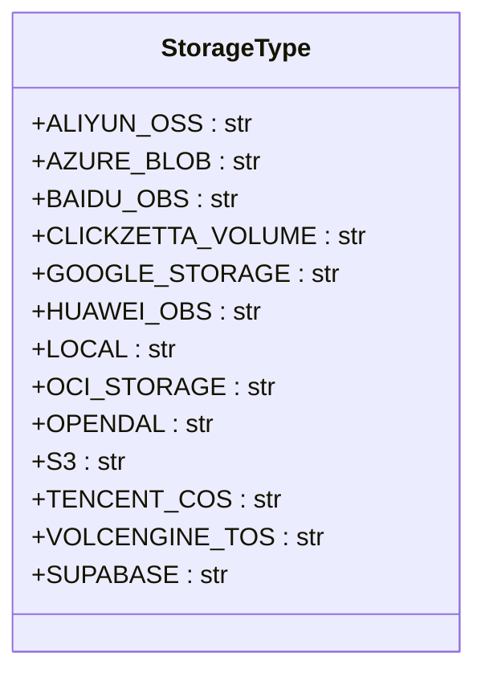
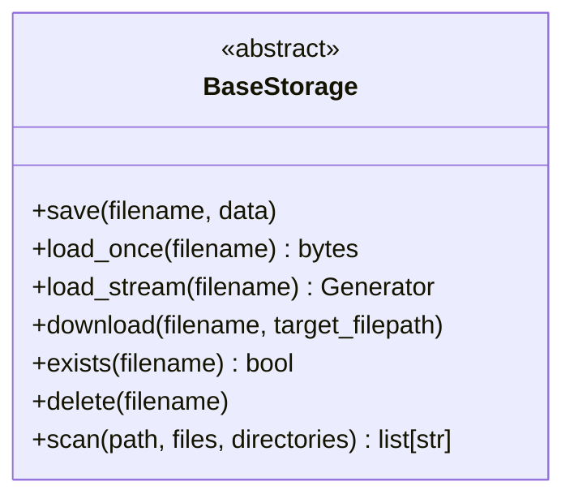

# 云存储集成

<cite>
**本文档中引用的文件**  
- [storage_type.py](file://api/extensions/storage/storage_type.py)
- [base_storage.py](file://api/extensions/storage/base_storage.py)
- [aws_s3_storage.py](file://api/extensions/storage/aws_s3_storage.py)
- [azure_blob_storage.py](file://api/extensions/storage/azure_blob_storage.py)
- [google_cloud_storage.py](file://api/extensions/storage/google_cloud_storage.py)
- [aliyun_oss_storage.py](file://api/extensions/storage/aliyun_oss_storage.py)
- [amazon_s3_storage_config.py](file://api/configs/middleware/storage/amazon_s3_storage_config.py)
- [azure_blob_storage_config.py](file://api/configs/middleware/storage/azure_blob_storage_config.py)
- [google_cloud_storage_config.py](file://api/configs/middleware/storage/google_cloud_storage_config.py)
- [aliyun_oss_storage_config.py](file://api/configs/middleware/storage/aliyun_oss_storage_config.py)
</cite>

## 目录
1. [简介](#简介)
2. [存储适配器架构](#存储适配器架构)
3. [配置方法](#配置方法)
4. [核心API调用](#核心api调用)
5. [高级功能配置](#高级功能配置)
6. [性能优化建议](#性能优化建议)
7. [安全最佳实践](#安全最佳实践)
8. [总结](#总结)

## 简介
Dify 支持与多种主流云存储服务的无缝集成，包括 AWS S3、Azure Blob、Google Cloud Storage 和阿里云 OSS。本文档详细说明了如何配置和使用这些云存储服务，涵盖存储适配器架构、环境变量设置、文件操作 API、高级功能（如分片上传、生命周期管理）以及安全最佳实践。

## 存储适配器架构

Dify 的云存储系统采用抽象工厂模式，通过统一接口支持多种存储后端。核心组件包括 `StorageType` 枚举和 `BaseStorage` 抽象类。

### 存储类型枚举
`StorageType` 枚举定义了所有支持的存储后端类型，确保配置和路由的一致性。



**Diagram sources**  
- [storage_type.py](file://api/extensions/storage/storage_type.py#L3-L17)

### 基础存储抽象类
`BaseStorage` 是所有具体存储实现的抽象基类，定义了统一的文件操作接口。



**Diagram sources**  
- [base_storage.py](file://api/extensions/storage/base_storage.py#L6-L40)

**Section sources**  
- [base_storage.py](file://api/extensions/storage/base_storage.py#L6-L40)

## 配置方法

每种云存储服务通过独立的配置模块进行管理，主要通过环境变量设置凭据和参数。

### 环境变量配置
| 云服务 | 环境变量 | 说明 |
|--------|----------|------|
| AWS S3 | `S3_BUCKET_NAME`, `S3_ACCESS_KEY`, `S3_SECRET_KEY` | S3 存储桶名称和访问密钥 |
| Azure Blob | `AZURE_BLOB_CONTAINER_NAME`, `AZURE_BLOB_ACCOUNT_NAME`, `AZURE_BLOB_ACCOUNT_KEY` | 容器名称和账户密钥 |
| Google Cloud Storage | `GOOGLE_STORAGE_BUCKET_NAME`, `GOOGLE_STORAGE_SERVICE_ACCOUNT_JSON_BASE64` | 存储桶名称和服务账户JSON（Base64编码） |
| 阿里云 OSS | `ALIYUN_OSS_BUCKET_NAME`, `ALIYUN_OSS_ACCESS_KEY`, `ALIYUN_OSS_SECRET_KEY` | Bucket 名称和访问密钥 |

### 凭据管理
- **AWS S3**: 支持 IAM 角色或 AK/SK 认证
- **Azure Blob**: 支持托管身份或 SAS Token
- **Google Cloud**: 支持服务账户 JSON 或默认应用凭据
- **阿里云 OSS**: 使用 AccessKey/SecretKey 认证

**Section sources**  
- [aws_s3_storage.py](file://api/extensions/storage/aws_s3_storage.py#L15-L30)
- [azure_blob_storage.py](file://api/extensions/storage/azure_blob_storage.py#L15-L25)
- [google_cloud_storage.py](file://api/extensions/storage/google_cloud_storage.py#L12-L20)
- [aliyun_oss_storage.py](file://api/extensions/storage/aliyun_oss_storage.py#L12-L18)

## 核心API调用

### 文件上传
```python
storage.save("example.txt", b"Hello, Dify!")
```

### 文件下载
```python
data = storage.load_once("example.txt")
```

### 流式读取
```python
for chunk in storage.load_stream("large_file.zip"):
    process(chunk)
```

### 文件存在性检查
```python
if storage.exists("example.txt"):
    print("文件存在")
```

### 文件删除
```python
storage.delete("example.txt")
```

**Section sources**  
- [base_storage.py](file://api/extensions/storage/base_storage.py#L10-L38)

## 高级功能配置

### 分片上传
- AWS S3 和 Azure Blob 支持大文件的分片上传
- Google Cloud Storage 通过 `ResumableUpload` 实现断点续传
- 阿里云 OSS 支持 `multipart_upload`

### 生命周期管理
- AWS S3: 可配置对象生命周期策略（如30天后转低频访问）
- Azure Blob: 支持自动层级转换（Hot → Cool → Archive）
- Google Cloud: 支持基于时间的存储类别转换

### 权限控制
- AWS S3: 通过 IAM Policy 和 Bucket Policy 控制访问
- Azure Blob: 使用 RBAC 和 SAS Token
- Google Cloud: 基于 IAM 的精细权限控制
- 阿里云 OSS: 支持 RAM 角色和 Bucket ACL

### 跨区域复制
- AWS S3: 支持跨区域复制（CRR）
- Azure Blob: 支持异地冗余存储（GRS）
- Google Cloud: 支持多区域存储
- 阿里云 OSS: 支持跨区域复制功能

**Section sources**  
- [aws_s3_storage.py](file://api/extensions/storage/aws_s3_storage.py)
- [azure_blob_storage.py](file://api/extensions/storage/azure_blob_storage.py)
- [google_cloud_storage.py](file://api/extensions/storage/google_cloud_storage.py)
- [aliyun_oss_storage.py](file://api/extensions/storage/aliyun_oss_storage.py)

## 性能优化建议

### CDN集成
- 将云存储与 CDN 服务（如 CloudFront、Azure CDN、阿里云CDN）结合使用
- 配置缓存策略以减少源站请求

### 缓存策略
- 使用 Redis 缓存频繁访问的元数据
- 对静态资源设置合理的浏览器缓存头
- 在应用层实现热点文件缓存

### 并行操作
- 大文件上传时使用多线程分片上传
- 批量操作时采用并发处理

**Section sources**  
- [azure_blob_storage.py](file://api/extensions/storage/azure_blob_storage.py#L75-L85)
- [aws_s3_storage.py](file://api/extensions/storage/aws_s3_storage.py#L50-L60)

## 安全最佳实践

### IAM角色配置
- 使用最小权限原则分配 IAM 角色
- 避免使用长期有效的访问密钥
- 定期轮换凭据

### 加密传输
- 强制启用 HTTPS 传输
- 使用 TLS 1.2+ 协议
- 验证服务器证书

### 静态加密
- AWS S3: 启用 SSE-S3 或 SSE-KMS
- Azure Blob: 使用服务端加密（SSE）
- Google Cloud: 启用默认加密或 CMEK
- 阿里云 OSS: 启用服务器端加密（SSE-OSS 或 SSE-KMS）

**Section sources**  
- [aws_s3_storage.py](file://api/extensions/storage/aws_s3_storage.py#L20-L25)
- [azure_blob_storage.py](file://api/extensions/storage/azure_blob_storage.py#L20-L25)
- [google_cloud_storage.py](file://api/extensions/storage/google_cloud_storage.py#L15-L20)
- [aliyun_oss_storage.py](file://api/extensions/storage/aliyun_oss_storage.py#L15-L20)

## 总结
Dify 的云存储集成架构设计灵活，支持主流云服务商，通过统一的抽象接口简化了多云环境下的文件管理。合理配置和遵循安全最佳实践可确保数据的高可用性、性能和安全性。