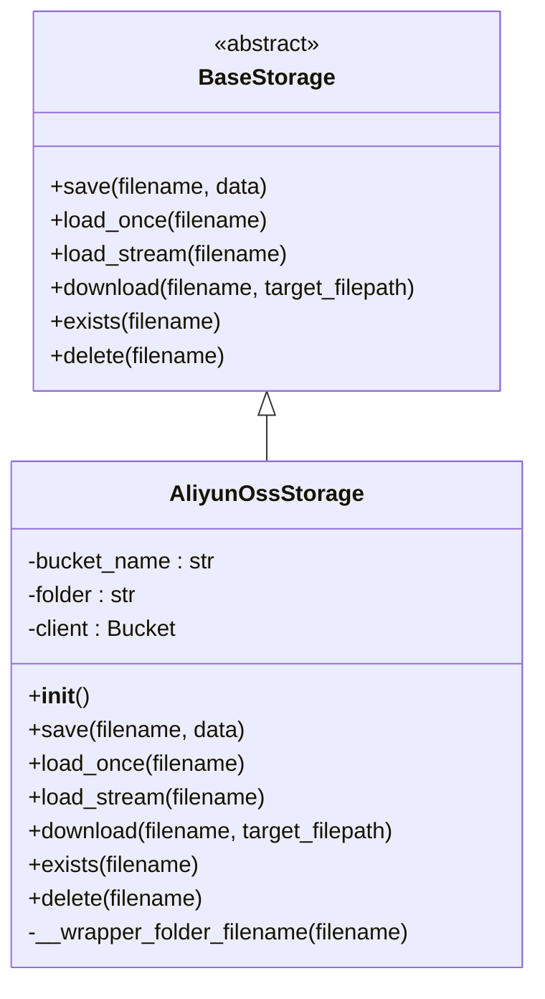

# 阿里云OSS 集成

<cite>
**本文档中引用的文件**  
- [aliyun_oss_storage_config.py](file://api/configs/middleware/storage/aliyun_oss_storage_config.py)
- [aliyun_oss_storage.py](file://api/extensions/storage/aliyun_oss_storage.py)
- [storage_type.py](file://api/extensions/storage/storage_type.py)
- [docker-compose.yaml](file://docker/docker-compose.yaml)
</cite>

## 目录
1. [简介](#简介)
2. [配置阿里云OSS存储](#配置阿里云oss存储)
3. [核心组件分析](#核心组件分析)
4. [权限与安全配置](#权限与安全配置)
5. [高级功能配置](#高级功能配置)
6. [性能优化与安全实践](#性能优化与安全实践)
7. [与CDN集成](#与cdn集成)
8. [结论](#结论)

## 简介
本文档详细说明Dify平台与阿里云对象存储服务（OSS）的集成流程。涵盖RAM角色和策略配置、存储空间（Bucket）创建、权限管理（ACL、RAM Policy）、签名URL生成机制，以及服务器端加密（SSE-OSS、SSE-KMS）设置。同时介绍分片上传、跨区域复制、生命周期规则、静态网站托管等功能的配置方法，并提供与阿里云CDN的集成方案。包含性能优化建议和安全实践，如开启日志记录、配置防盗链。

## 配置阿里云OSS存储
Dify通过配置文件和扩展模块实现对阿里云OSS的支持。用户需在环境变量中设置必要的OSS连接参数，并通过Dify的存储扩展机制启用阿里云OSS作为默认或备用存储后端。

### 环境变量配置
在 `docker-compose.yaml` 文件中，Dify定义了阿里云OSS所需的环境变量：

```yaml
ALIYUN_OSS_BUCKET_NAME: ${ALIYUN_OSS_BUCKET_NAME:-your-bucket-name}
ALIYUN_OSS_ACCESS_KEY: ${ALIYUN_OSS_ACCESS_KEY:-your-access-key}
ALIYUN_OSS_SECRET_KEY: ${ALIYUN_OSS_SECRET_KEY:-your-secret-key}
ALIYUN_OSS_ENDPOINT: ${ALIYUN_OSS_ENDPOINT:-https://oss-cn-hangzhou.aliyuncs.com}
ALIYUN_OSS_REGION: ${ALIYUN_OSS_REGION:-oss-cn-hangzhou}
ALIYUN_OSS_AUTH_VERSION: ${ALIYUN_OSS_AUTH_VERSION:-v4}
ALIYUN_OSS_PATH: ${ALIYUN_OSS_PATH:-your-path}
```

这些变量对应于 `AliyunOSSStorageConfig` 类中的字段，用于初始化OSS客户端。

**Section sources**
- [docker-compose.yaml](file://docker/docker-compose.yaml#L121-L141)
- [aliyun_oss_storage_config.py](file://api/configs/middleware/storage/aliyun_oss_storage_config.py#L1-L44)

## 核心组件分析
Dify通过模块化设计实现了对多种云存储服务的支持，其中阿里云OSS由专门的扩展模块处理。

### 存储类型枚举
系统通过 `StorageType` 枚举类统一管理所有支持的存储类型，确保类型安全和可维护性。

```python
class StorageType(StrEnum):
    ALIYUN_OSS = "aliyun-oss"
    AZURE_BLOB = "azure-blob"
    BAIDU_OBS = "baidu-obs"
    # 其他存储类型...
```

该枚举用于运行时判断当前使用的存储后端。

### OSS存储实现
`AliyunOssStorage` 类继承自 `BaseStorage`，实现了标准的文件操作接口，包括保存、加载、流式读取、下载、存在性检查和删除等。



**Diagram sources**
- [base_storage.py](file://api/extensions/storage/base_storage.py)
- [aliyun_oss_storage.py](file://api/extensions/storage/aliyun_oss_storage.py#L1-L54)

**Section sources**
- [aliyun_oss_storage.py](file://api/extensions/storage/aliyun_oss_storage.py#L1-L54)
- [storage_type.py](file://api/extensions/storage/storage_type.py#L1-L16)

## 权限与安全配置
Dify通过配置文件从环境变量加载OSS访问密钥，使用阿里云SDK进行身份验证。支持v4签名版本，确保请求的安全性和兼容性。

### 认证机制
在初始化 `AliyunOssStorage` 时，根据 `ALIYUN_OSS_AUTH_VERSION` 的值选择相应的认证方式：
- 若为 `"v4"`，使用 `oss2.AuthV4` 并传入区域信息
- 否则使用 `oss2.Auth`

客户端通过 `ALIYUN_OSS_ACCESS_KEY` 和 `ALIYUN_OSS_SECRET_KEY` 进行身份验证，并连接到指定的 `ALIYUN_OSS_ENDPOINT`。

### 服务器端加密
虽然当前代码未显式配置SSE，但可通过OSS控制台或API在Bucket级别启用SSE-OSS或SSE-KMS加密策略。Dify上传的文件将自动遵循Bucket的加密规则。

**Section sources**
- [aliyun_oss_storage.py](file://api/extensions/storage/aliyun_oss_storage.py#L10-L20)

## 高级功能配置
### 分片上传
Dify目前使用 `put_object` 方法进行普通上传。对于大文件，建议扩展 `save` 方法以支持分片上传（Multipart Upload），提升上传稳定性和效率。

### 跨区域复制
跨区域复制需在OSS控制台配置Bucket复制规则。Dify无需额外代码支持，复制由OSS服务端自动完成。

### 生命周期规则
生命周期规则应在OSS控制台配置，用于自动转换存储类型或删除过期文件。Dify存储的文件路径由 `ALIYUN_OSS_PATH` 控制，可据此设置精确的生命周期策略。

### 静态网站托管
若需使用OSS作为静态网站托管，应在OSS控制台启用该功能并配置默认首页和错误页。Dify本身不提供静态网站内容，但可将前端构建产物部署至OSS。

**Section sources**
- [aliyun_oss_storage_config.py](file://api/configs/middleware/storage/aliyun_oss_storage_config.py#L35-L44)

## 性能优化与安全实践
### 开启日志记录
建议在OSS控制台开启访问日志记录，将日志存储至另一个Bucket，便于审计和分析访问模式。

### 配置防盗链
为防止资源被盗用，应在OSS控制台配置Referer白名单或黑名单，限制访问来源。

### 连接超时设置
当前代码中设置了30秒的连接超时，可根据网络状况调整 `connect_timeout` 参数以优化性能。

**Section sources**
- [aliyun_oss_storage.py](file://api/extensions/storage/aliyun_oss_storage.py#L18-L20)

## 与CDN集成
将OSS作为CDN源站可显著提升文件访问速度。配置步骤如下：
1. 在阿里云CDN控制台添加域名，并设置源站类型为“OSS域名源”
2. 输入OSS Bucket的外网访问域名作为源站地址
3. 配置缓存策略、HTTPS证书等
4. 更新Dify中文件访问的URL模板，指向CDN加速域名

Dify生成的签名URL仍可与CDN配合使用，但需注意CDN缓存策略与签名有效期的协调。

## 结论
Dify通过清晰的模块化设计和配置驱动的方式，实现了对阿里云OSS的高效集成。开发者只需正确配置环境变量，即可利用OSS的高可用、高扩展性存储能力。结合OSS控制台的丰富功能，可构建安全、稳定、高性能的文件存储解决方案。