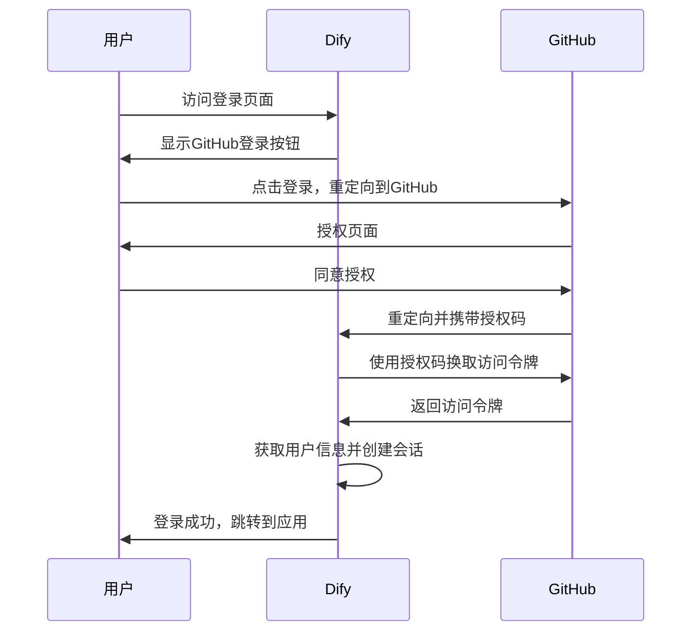
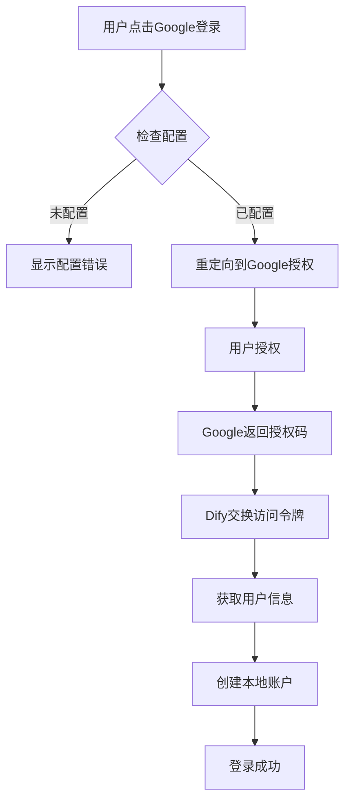
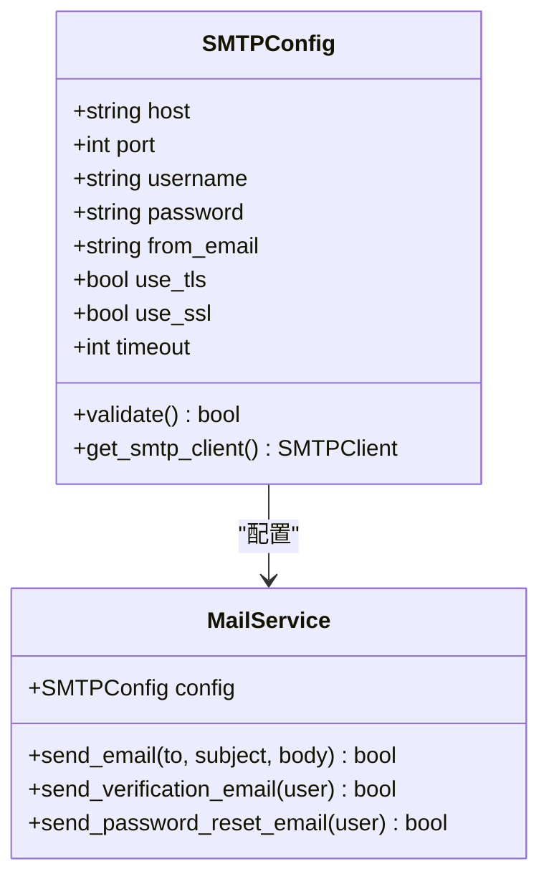
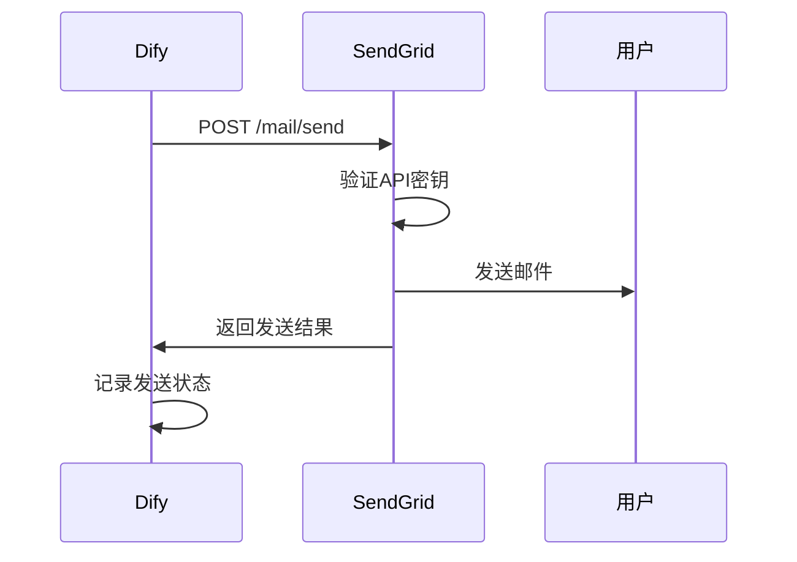
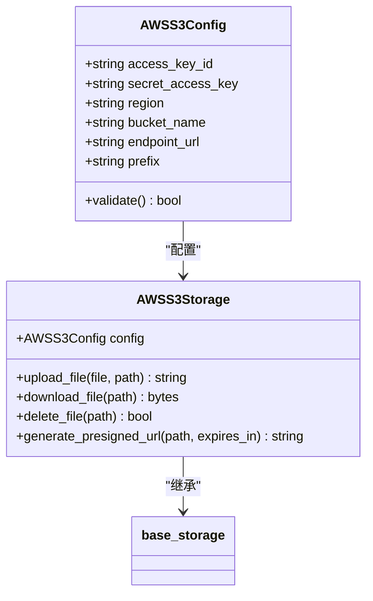
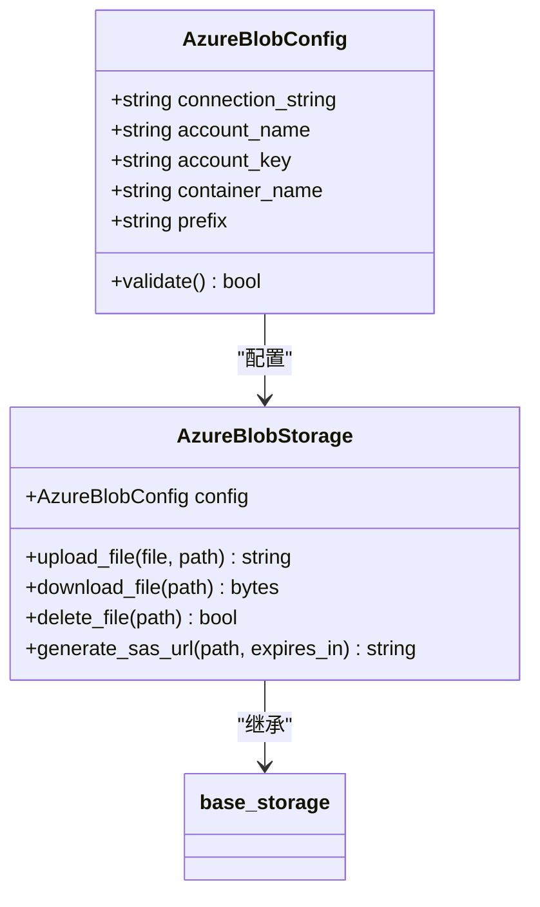
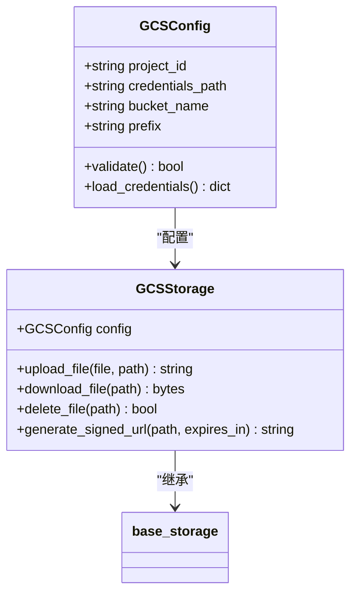
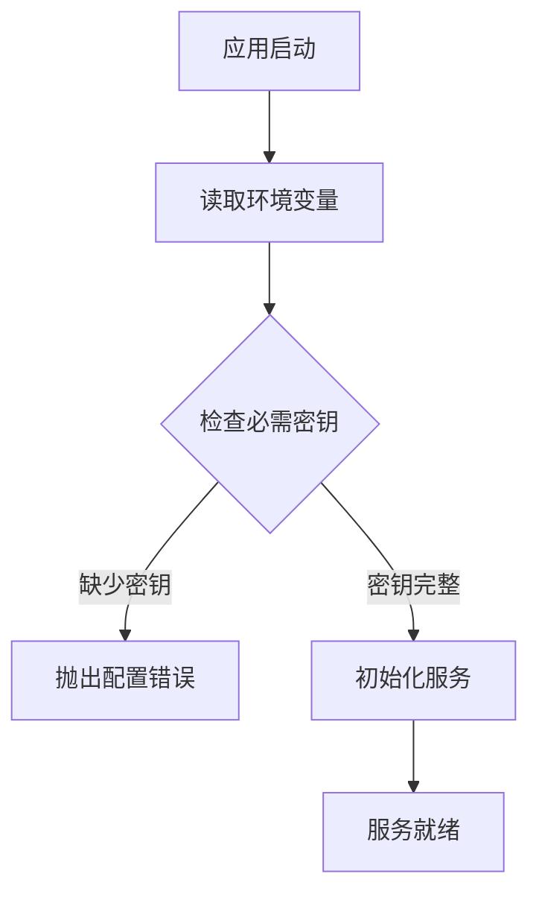

# 外部服务集成

<cite>
**本文档引用的文件**  
- [aws_s3_storage.py](file://api/extensions/storage/aws_s3_storage.py)
- [azure_blob_storage.py](file://api/extensions/storage/azure_blob_storage.py)
- [google_cloud_storage.py](file://api/extensions/storage/google_cloud_storage.py)
- [smtp.py](file://api/libs/smtp.py)
- [sendgrid.py](file://api/libs/sendgrid.py)
- [oauth.py](file://api/libs/oauth.py)
- [oauth_server.py](file://api/services/oauth_server.py)
- [app_config.py](file://api/configs/app_config.py)
- [base_storage.py](file://api/extensions/storage/base_storage.py)
- [ext_mail.py](file://api/extensions/ext_mail.py)
</cite>

## 目录
1. [简介](#简介)
2. [认证系统集成](#认证系统集成)
3. [邮件服务配置](#邮件服务配置)
4. [云存储对接](#云存储对接)
5. [API密钥管理](#api密钥管理)
6. [安全考虑](#安全考虑)
7. [故障排查指南](#故障排查指南)
8. [生产环境最佳实践](#生产环境最佳实践)

## 简介
Dify支持与多种第三方服务的深度集成，包括身份认证、邮件服务和云存储。本文档详细说明了如何配置和管理这些外部服务集成，涵盖GitHub和Google OAuth认证、SMTP与SendGrid邮件服务，以及AWS S3、Azure Blob和Google Cloud Storage云存储的对接方法。

## 认证系统集成

Dify通过OAuth 2.0协议支持第三方身份认证服务集成，允许用户使用GitHub和Google账户登录。

### GitHub OAuth集成
配置GitHub OAuth需要在GitHub开发者设置中注册应用，获取Client ID和Client Secret，并设置正确的回调URL。

**Diagram sources**
- [oauth.py](file://api/libs/oauth.py#L1-L100)
- [oauth_server.py](file://api/services/oauth_server.py#L50-L120)

### Google OAuth集成
Google OAuth集成流程与GitHub类似，需要在Google Cloud Console中创建OAuth 2.0客户端ID，配置授权范围和回调URL。

**Diagram sources**
- [oauth.py](file://api/libs/oauth.py#L101-L200)
- [app_config.py](file://api/configs/app_config.py#L75-L90)

### 权限范围定义
Dify请求的OAuth权限范围包括：
- `user:email`：获取用户邮箱地址
- `read:user`：读取基本用户信息
- `openid`：用于OpenID Connect认证

**Section sources**
- [oauth.py](file://api/libs/oauth.py#L45-L60)

## 邮件服务配置

Dify支持通过SMTP协议或SendGrid服务发送邮件，用于账户验证、密码重置和通知。

### SMTP配置
使用SMTP服务需要提供邮件服务器地址、端口、用户名、密码和发件人邮箱。

**Diagram sources**
- [smtp.py](file://api/libs/smtp.py#L1-L80)
- [ext_mail.py](file://api/extensions/ext_mail.py#L20-L45)

### SendGrid配置
SendGrid集成使用API密钥进行认证，需要配置SendGrid API密钥和发件人邮箱。

**Diagram sources**
- [sendgrid.py](file://api/libs/sendgrid.py#L1-L60)
- [ext_mail.py](file://api/extensions/ext_mail.py#L50-L75)

**Section sources**
- [smtp.py](file://api/libs/smtp.py#L1-L100)
- [sendgrid.py](file://api/libs/sendgrid.py#L1-L80)
- [ext_mail.py](file://api/extensions/ext_mail.py#L1-L100)

## 云存储对接

Dify支持多种云存储服务，用于存储用户上传的文件和应用资源。

### AWS S3集成
AWS S3集成需要配置访问密钥ID、秘密访问密钥、区域和存储桶名称。

**Diagram sources**
- [aws_s3_storage.py](file://api/extensions/storage/aws_s3_storage.py#L1-L50)
- [base_storage.py](file://api/extensions/storage/base_storage.py#L1-L30)

### Azure Blob集成
Azure Blob存储需要配置连接字符串或共享访问密钥，以及存储账户名称和容器名称。

**Diagram sources**
- [azure_blob_storage.py](file://api/extensions/storage/azure_blob_storage.py#L1-L50)
- [base_storage.py](file://api/extensions/storage/base_storage.py#L1-L30)

### Google Cloud Storage集成
Google Cloud Storage集成支持通过服务账户密钥文件或环境变量进行认证。

**Diagram sources**
- [google_cloud_storage.py](file://api/extensions/storage/google_cloud_storage.py#L1-L50)
- [base_storage.py](file://api/extensions/storage/base_storage.py#L1-L30)

**Section sources**
- [aws_s3_storage.py](file://api/extensions/storage/aws_s3_storage.py#L1-L100)
- [azure_blob_storage.py](file://api/extensions/storage/azure_blob_storage.py#L1-L100)
- [google_cloud_storage.py](file://api/extensions/storage/google_cloud_storage.py#L1-L100)

## API密钥管理

Dify通过环境变量或配置文件管理外部服务的API密钥和认证信息。

### 环境变量配置

支持的环境变量包括：
- `AWS_ACCESS_KEY_ID` 和 `AWS_SECRET_ACCESS_KEY`
- `AZURE_STORAGE_CONNECTION_STRING`
- `GOOGLE_APPLICATION_CREDENTIALS`
- `SENDGRID_API_KEY`
- `SMTP_USERNAME` 和 `SMTP_PASSWORD`

**Section sources**
- [app_config.py](file://api/configs/app_config.py#L50-L100)

## 安全考虑

### 密钥存储安全
所有API密钥和敏感信息应通过环境变量或密钥管理服务提供，不应硬编码在代码中。

### 回调URL安全
OAuth回调URL应配置为HTTPS协议，并验证重定向URI的完整性。

### 权限最小化
为每个集成服务配置最小必要权限，避免使用具有广泛权限的主账户密钥。

**Section sources**
- [oauth.py](file://api/libs/oauth.py#L200-L250)
- [app_config.py](file://api/configs/app_config.py#L100-L150)

## 故障排查指南

### 常见错误代码
| 错误代码 | 含义 | 解决方案 |
|--------|------|---------|
| AUTH_001 | OAuth配置缺失 | 检查环境变量配置 |
| MAIL_001 | 邮件发送失败 | 验证SMTP/SendGrid配置 |
| STORAGE_001 | 存储连接失败 | 检查密钥和网络连接 |
| CONFIG_001 | 配置验证失败 | 检查配置项完整性 |

### 日志分析
检查应用日志中的错误信息，重点关注认证、邮件和存储相关的错误堆栈。

**Section sources**
- [oauth.py](file://api/libs/oauth.py#L250-L300)
- [smtp.py](file://api/libs/smtp.py#L100-L150)
- [sendgrid.py](file://api/libs/sendgrid.py#L80-L120)

## 生产环境最佳实践

1. 使用密钥管理服务（如AWS Secrets Manager）存储敏感信息
2. 配置监控和告警，及时发现服务异常
3. 定期轮换API密钥和访问凭证
4. 使用专用服务账户而非个人账户进行集成
5. 配置适当的超时和重试机制
6. 启用服务端日志记录和审计