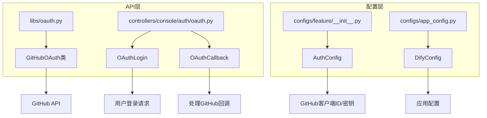
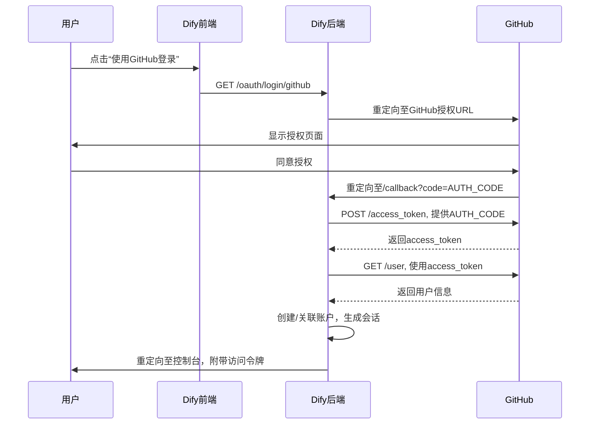
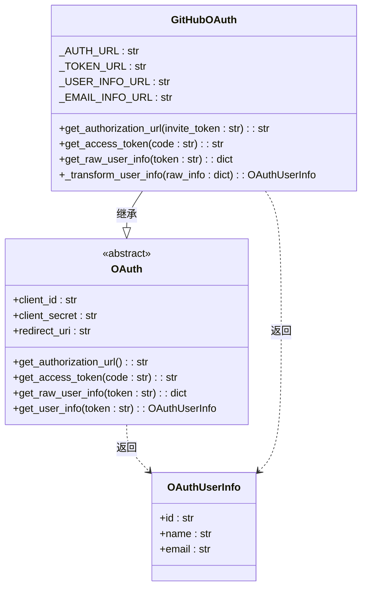
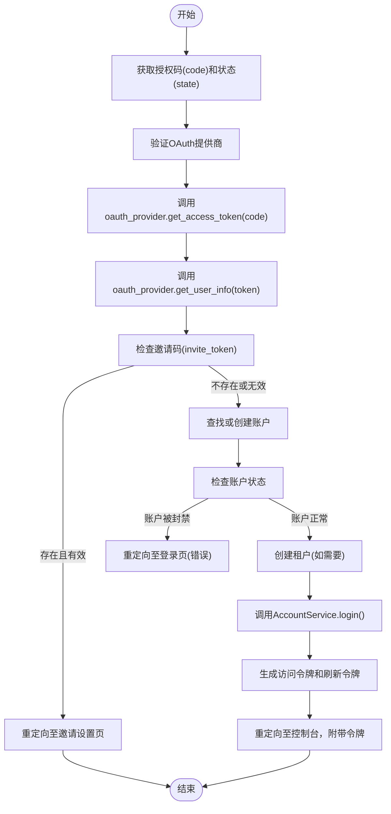

# GitHub认证集成

<cite>
**本文档中引用的文件**  
- [oauth.py](file://api/libs/oauth.py)
- [oauth.py](file://api/controllers/console/auth/oauth.py)
- [github_service.py](file://api/services/plugin/github_service.py)
- [app_config.py](file://api/configs/app_config.py)
- [__init__.py](file://api/configs/feature/__init__.py)
- [oauth_server.py](file://api/services/oauth_server.py)
</cite>

## 目录
1. [简介](#简介)
2. [项目结构](#项目结构)
3. [核心组件](#核心组件)
4. [架构概述](#架构概述)
5. [详细组件分析](#详细组件分析)
6. [依赖分析](#依赖分析)
7. [性能考虑](#性能考虑)
8. [故障排除指南](#故障排除指南)
9. [结论](#结论)

## 简介
本文档详细说明了如何在Dify中配置和使用GitHub作为OAuth提供商。涵盖了在GitHub开发者平台创建OAuth应用的完整步骤，配置客户端ID和密钥，设置正确的回调URL（如`/console/api/oauth/github/callback`）。深入解释了Dify后端处理GitHub授权响应的流程，包括用户信息提取（用户名、邮箱、头像）、账户绑定逻辑以及错误处理机制（如用户拒绝授权、令牌失效）。提供了实际代码示例展示GitHub OAuth客户端的配置参数，并说明了如何处理GitHub特有的权限范围（scopes）和API速率限制。

## 项目结构
Dify项目的结构清晰地组织了其功能模块，其中与GitHub OAuth集成相关的文件主要分布在`api`目录下的`libs`、`controllers/console/auth`和`configs`子目录中。`libs/oauth.py`定义了OAuth客户端的基类和GitHub OAuth的具体实现，`controllers/console/auth/oauth.py`处理OAuth登录和回调的控制器逻辑，而配置信息则分散在`configs`目录下的多个配置文件中。



**图示来源**  
- [oauth.py](file://api/libs/oauth.py#L1-L133)
- [oauth.py](file://api/controllers/console/auth/oauth.py#L1-L187)
- [__init__.py](file://api/configs/feature/__init__.py#L1-L1035)

**本节来源**  
- [oauth.py](file://api/libs/oauth.py)
- [oauth.py](file://api/controllers/console/auth/oauth.py)
- [__init__.py](file://api/configs/feature/__init__.py)

## 核心组件
Dify中GitHub OAuth集成的核心组件包括`GitHubOAuth`类，它封装了与GitHub OAuth API的交互逻辑，以及`OAuthCallback`控制器，它负责处理来自GitHub的授权回调。`GitHubOAuth`类实现了获取授权URL、交换访问令牌和获取用户信息的标准OAuth 2.0流程。`OAuthCallback`则利用这些功能完成用户身份验证和会话建立。

**本节来源**  
- [oauth.py](file://api/libs/oauth.py#L1-L133)
- [oauth.py](file://api/controllers/console/auth/oauth.py#L1-L187)

## 架构概述
Dify的GitHub OAuth集成遵循标准的OAuth 2.0授权码流程。用户通过点击登录按钮被重定向到GitHub的授权页面。用户授权后，GitHub将用户重定向回Dify的回调URL，并附带一个授权码。Dify的后端接收到此授权码后，会向GitHub请求访问令牌。获得访问令牌后，Dify使用该令牌调用GitHub API获取用户信息，并据此创建或关联本地账户。



**图示来源**  
- [oauth.py](file://api/libs/oauth.py#L1-L133)
- [oauth.py](file://api/controllers/console/auth/oauth.py#L1-L187)

## 详细组件分析

### GitHubOAuth类分析
`GitHubOAuth`类是Dify与GitHub OAuth服务交互的核心。它继承自通用的`OAuth`基类，并具体实现了针对GitHub的授权流程。

#### 类图


**图示来源**  
- [oauth.py](file://api/libs/oauth.py#L1-L133)

### OAuthCallback控制器分析
`OAuthCallback`控制器负责处理GitHub完成授权后发起的回调请求。它接收授权码，调用`GitHubOAuth`获取访问令牌和用户信息，并根据这些信息在Dify系统中创建或查找用户账户。

#### 流程图


**图示来源**  
- [oauth.py](file://api/controllers/console/auth/oauth.py#L1-L187)

**本节来源**  
- [oauth.py](file://api/libs/oauth.py#L1-L133)
- [oauth.py](file://api/controllers/console/auth/oauth.py#L1-L187)

## 依赖分析
GitHub OAuth功能的实现依赖于多个内部和外部组件。内部依赖包括`dify_config`用于获取客户端凭据，`AccountService`用于账户管理，以及`requests`库用于HTTP通信。外部依赖主要是GitHub的OAuth API端点。

```mermaid
graph TD
A[GitHubOAuth] --> B[dify_config.GITHUB_CLIENT_ID]
A --> C[dify_config.GITHUB_CLIENT_SECRET]
A --> D[requests库]
A --> E[https://github.com/login/oauth/authorize]
A --> F[https://github.com/login/oauth/access_token]
A --> G[https://api.github.com/user]
A --> H[https://api.github.com/user/emails]
I[OAuthCallback] --> J[get_oauth_providers()]
I --> K[AccountService]
I --> L[TenantService]
J --> M[dify_config]
K --> N[数据库]
L --> N
```

**图示来源**  
- [oauth.py](file://api/libs/oauth.py#L1-L133)
- [oauth.py](file://api/controllers/console/auth/oauth.py#L1-L187)
- [app_config.py](file://api/configs/app_config.py#L1-L113)

**本节来源**  
- [oauth.py](file://api/libs/oauth.py)
- [oauth.py](file://api/controllers/console/auth/oauth.py)
- [app_config.py](file://api/configs/app_config.py)

## 性能考虑
GitHub OAuth集成的性能主要受网络延迟和GitHub API速率限制的影响。Dify通过使用Redis缓存访问令牌和用户信息来减少对GitHub API的重复调用。此外，配置中的超时设置（如`HTTP_REQUEST_MAX_READ_TIMEOUT`）可以防止因网络问题导致的长时间阻塞。

## 故障排除指南
当GitHub OAuth集成出现问题时，应首先检查以下几点：
1.  **配置检查**：确认`GITHUB_CLIENT_ID`和`GITHUB_CLIENT_SECRET`已正确配置。
2.  **回调URL**：确保在GitHub开发者设置中注册的回调URL与Dify配置的`CONSOLE_API_URL + /console/api/oauth/authorize/github`完全匹配。
3.  **网络连接**：检查Dify服务器能否访问`github.com`和`api.github.com`。
4.  **日志审查**：查看Dify的日志文件，特别是`OAuthCallback`处理过程中的异常信息。

**本节来源**  
- [oauth.py](file://api/libs/oauth.py#L1-L133)
- [oauth.py](file://api/controllers/console/auth/oauth.py#L1-L187)

## 结论
Dify的GitHub OAuth集成提供了一种安全、便捷的第三方登录方式。通过清晰的代码结构和模块化的设计，该集成易于维护和扩展。遵循本文档的指导，管理员可以成功配置此功能，为用户提供无缝的登录体验。