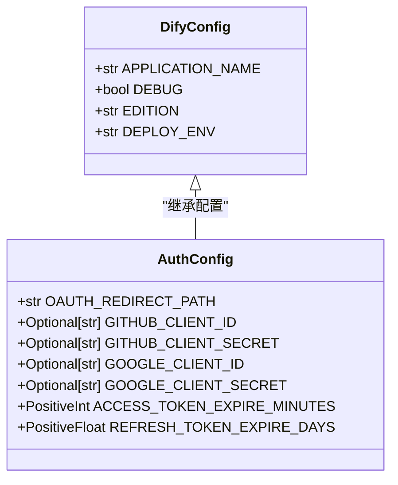
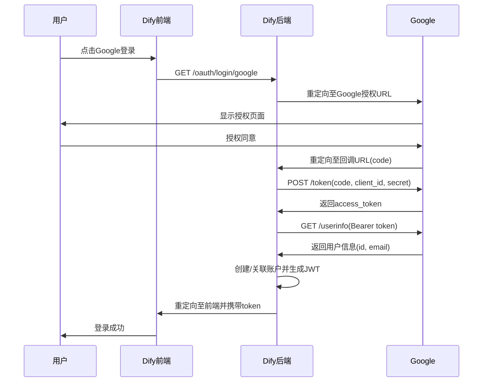

# Google认证集成

<cite>
**本文档中引用的文件**  
- [oauth.py](file://api/libs/oauth.py)
- [oauth.py](file://api/controllers/console/auth/oauth.py)
- [app_config.py](file://api/configs/app_config.py)
- [__init__.py](file://api/configs/feature/__init__.py)
</cite>

## 目录
1. [简介](#简介)
2. [Google Cloud Console配置](#google-cloud-console配置)
3. [Dify中的OAuth配置](#dify中的oauth配置)
4. [OAuth流程详解](#oauth流程详解)
5. [用户信息映射与处理](#用户信息映射与处理)
6. [Google Workspace域限制登录](#google-workspace域限制登录)
7. [刷新令牌与离线访问](#刷新令牌与离线访问)
8. [常见问题排查](#常见问题排查)

## 简介
本文档详细说明如何在Dify中集成Google作为OAuth 2.0认证提供商。涵盖从Google Cloud Console创建OAuth客户端、配置Dify环境变量，到处理用户信息映射和特殊场景（如Google Workspace域限制）的完整流程。文档还解释了Dify如何验证ID令牌、管理刷新令牌以及应对常见集成问题。

## Google Cloud Console配置

### 创建OAuth 2.0客户端
1. 登录 [Google Cloud Console](https://console.cloud.google.com/)
2. 选择或创建一个项目
3. 导航至“API和服务” > “凭据”
4. 点击“创建凭据” > “OAuth客户端ID”
5. 选择应用类型为“Web应用”

### 配置授权同意屏幕
- **用户类型**：选择“外部”以允许任何Google账户登录，或“内部”以限制为同一组织内的用户
- **应用名称**：输入Dify应用名称
- **授权域名**：添加 `dify.ai` 或您的自定义域名
- 保存并继续

### 设置重定向URI
在“已创建的客户端”部分，添加以下重定向URI：
```
https://<your-dify-console-api-url>/console/api/oauth/authorize/google
```
其中 `<your-dify-console-api-url>` 是您Dify实例的API地址，通常在 `CONSOLE_API_URL` 环境变量中定义。

**Section sources**
- [__init__.py](file://api/configs/feature/__init__.py#L460-L465)

## Dify中的OAuth配置

### 环境变量设置
在 `.env` 文件中配置以下Google OAuth相关变量：

| 环境变量 | 说明 |
|---------|------|
| `GOOGLE_CLIENT_ID` | 从Google Cloud Console获取的客户端ID |
| `GOOGLE_CLIENT_SECRET` | 从Google Cloud Console获取的客户端密钥 |
| `CONSOLE_API_URL` | Dify控制台API的基础URL，用于构建回调地址 |
| `CONSOLE_WEB_URL` | Dify前端界面的基础URL，用于登录后重定向 |

这些配置通过 `AuthConfig` 类加载，是启用Google OAuth的前提条件。



**Diagram sources**
- [__init__.py](file://api/configs/feature/__init__.py#L450-L470)
- [app_config.py](file://api/configs/app_config.py#L25-L30)

**Section sources**
- [__init__.py](file://api/configs/feature/__init__.py#L450-L470)

## OAuth流程详解

### 授权流程步骤
1. 用户点击“使用Google登录”
2. 前端跳转至 `/oauth/login/google`
3. 后端生成Google授权URL并重定向
4. 用户在Google页面授权
5. Google重定向回 `/oauth/authorize/google` 并携带 `code`
6. Dify后端使用 `code` 换取 `access_token`
7. 使用 `access_token` 获取用户信息
8. 创建或关联本地账户并登录

### 作用域（Scope）说明
Google OAuth请求的作用域为：
```
openid email
```
- `openid`：启用OpenID Connect，用于获取用户身份
- `email`：请求用户的邮箱地址

不请求 `profile` 范围，因为Dify仅需邮箱和唯一ID，符合最小权限原则。



**Diagram sources**
- [oauth.py](file://api/libs/oauth.py#L75-L85)
- [oauth.py](file://api/controllers/console/auth/oauth.py#L40-L60)

**Section sources**
- [oauth.py](file://api/libs/oauth.py#L70-L90)
- [oauth.py](file://api/controllers/console/auth/oauth.py#L40-L187)

## 用户信息映射与处理

### 用户信息结构
Dify通过 `OAuthUserInfo` 数据类统一处理第三方用户信息：

```python
@dataclass
class OAuthUserInfo:
    id: str      # Google的sub（Subject Identifier）
    name: str    # 用户名，Google OAuth中为空
    email: str   # 用户邮箱
```

### ID令牌验证
Google OAuth使用OpenID Connect，`access_token` 可用于调用 `https://www.googleapis.com/oauth2/v3/userinfo` 端点获取用户信息。该端点返回的 `sub` 字段作为用户的唯一标识符（`openid`），具有以下特性：
- 对于同一Google账户，`sub` 值是稳定且唯一的
- 不同应用间不会共享相同的 `sub` 值，保障用户隐私

### 账户关联逻辑
Dify通过以下顺序查找或创建账户：
1. 使用 `provider`（google）和 `openid`（Google的sub）在数据库中查找
2. 若未找到，则使用 `email` 查找
3. 若仍不存在，则创建新账户

账户创建后，会通过 `AccountService.link_account_integrate()` 方法将Google的 `openid` 与本地账户关联。

**Section sources**
- [oauth.py](file://api/libs/oauth.py#L115-L130)
- [oauth.py](file://api/controllers/console/auth/oauth.py#L150-L187)

## Google Workspace域限制登录

### 场景说明
当Google OAuth客户端配置为“内部”用户类型时，只有属于同一Google Workspace组织的用户才能登录。

### Dify中的处理
Dify本身不主动验证用户域，而是依赖Google的授权机制：
- 如果用户不属于该组织，Google会在授权阶段拒绝，用户无法完成登录流程
- Dify接收到的 `email` 字段将始终属于允许的域

### 自定义域验证（可选）
如需在Dify中额外验证邮箱域名，可在 `_generate_account` 函数中添加检查：

```python
def _generate_account(provider: str, user_info: OAuthUserInfo):
    allowed_domains = ["yourcompany.com"]
    if "@" in user_info.email:
        domain = user_info.email.split("@")[1]
        if domain not in allowed_domains:
            raise AccountRegisterError("Domain not allowed")
    # ... rest of the logic
```

此逻辑位于 `oauth.py` 控制器中，可根据需要扩展。

**Section sources**
- [oauth.py](file://api/controllers/console/auth/oauth.py#L150-L187)

## 刷新令牌与离线访问

### 当前实现
目前Dify的Google OAuth实现使用 `online` 访问类型，即：
- 仅获取 `access_token`，不请求 `refresh_token`
- `access_token` 过期后，用户需重新登录

### 启用离线访问
要支持离线访问和刷新令牌，需修改 `GoogleOAuth.get_authorization_url` 方法：

```python
def get_authorization_url(self, invite_token: Optional[str] = None):
    params = {
        "client_id": self.client_id,
        "response_type": "code",
        "redirect_uri": self.redirect_uri,
        "scope": "openid email",
        "access_type": "offline",      # 请求刷新令牌
        "prompt": "consent"            # 确保每次返回刷新令牌
    }
    if invite_token:
        params["state"] = invite_token
    return f"{self._AUTH_URL}?{urllib.parse.urlencode(params)}"
```

获取 `refresh_token` 后，应安全存储并与用户账户关联，以便在 `access_token` 过期时静默刷新。

**Section sources**
- [oauth.py](file://api/libs/oauth.py#L75-L85)

## 常见问题排查

### 1. 重定向URI不匹配
**错误信息**：`redirect_uri_mismatch`
**解决方案**：
- 检查Google Cloud Console中配置的重定向URI是否与 `CONSOLE_API_URL` 完全一致
- 确保没有多余的空格或使用了HTTP而非HTTPS

### 2. 客户端ID或密钥无效
**错误信息**：`invalid_client`
**解决方案**：
- 在 `.env` 文件中正确设置 `GOOGLE_CLIENT_ID` 和 `GOOGLE_CLIENT_SECRET`
- 重启Dify服务使环境变量生效

### 3. 用户信息获取失败
**错误信息**：`RequestException` 在 `get_user_info` 阶段
**解决方案**：
- 检查Google Cloud Console是否启用了“Google People API”
- 验证 `access_token` 是否有效

### 4. 账户未找到
**错误信息**：登录后重定向到 `/signin?message=Account not found.`
**解决方案**：
- 确认用户邮箱已在Dify系统中存在，或允许注册（`is_allow_register` 配置）
- 检查数据库中 `account_integrates` 表是否正确记录了Google `openid`

**Section sources**
- [oauth.py](file://api/controllers/console/auth/oauth.py#L65-L145)
- [oauth.py](file://api/libs/oauth.py#L100-L110)