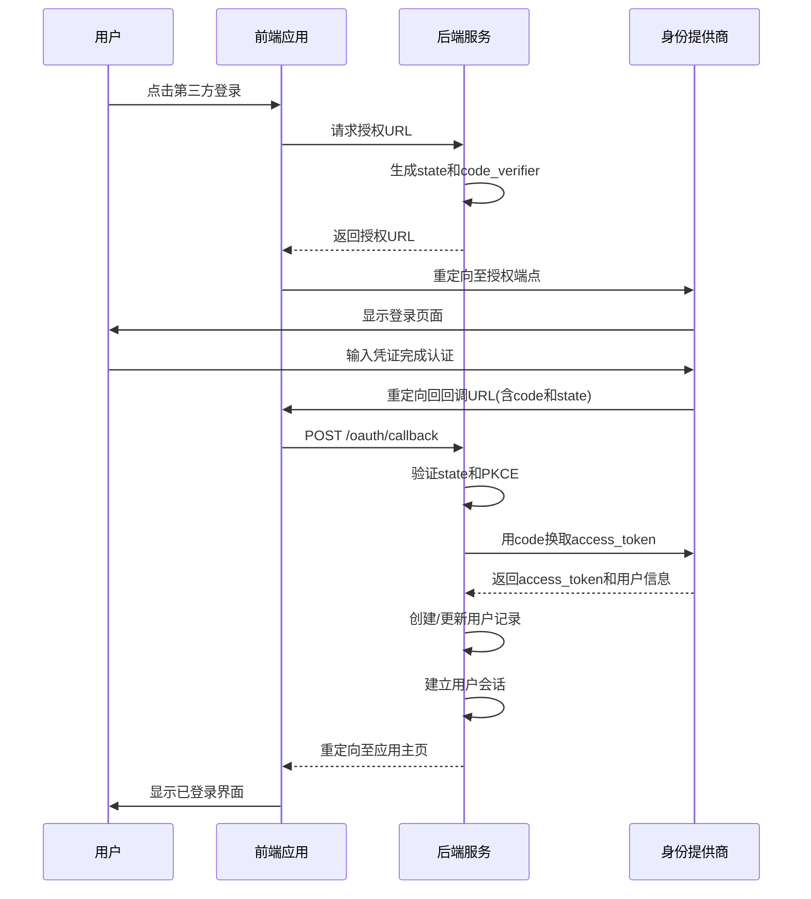
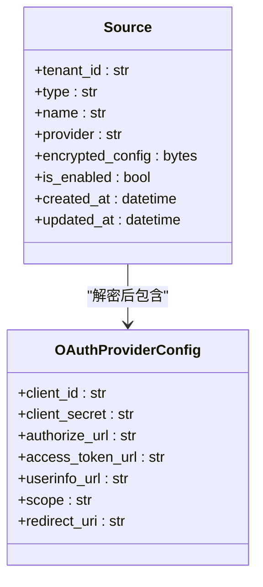
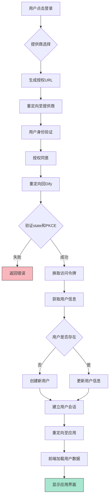

# OAuth集成概述

<cite>
**本文档引用的文件**
- [oauth.py](file://api/libs/oauth.py)
- [oauth_server.py](file://api/services/oauth_server.py)
- [Source.py](file://api/models/source.py)
- [webapp_auth_service.py](file://api/services/webapp_auth_service.py)
- [passport.py](file://api/libs/passport.py)
- [use-oauth.ts](file://web/hooks/use-oauth.ts)
- [oauth-callback](file://web/app/oauth-callback)
- [config.py](file://api/configs/app_config.py)
</cite>

## 目录

1. [简介](#简介)
2. [OAuth 2.0通用实现框架](#oauth-20通用实现框架)
3. [授权码流程详解](#授权码流程详解)
4. [OAuth配置模型设计](#oauth配置模型设计)
5. [安全最佳实践](#安全最佳实践)
6. [令牌管理与刷新机制](#令牌管理与刷新机制)
7. [用户会话集成](#用户会话集成)
8. [完整数据流图示](#完整数据流图示)
9. [总结](#总结)

## 简介

Dify平台通过OAuth 2.0协议实现第三方身份验证集成，支持多种身份提供商（如Google、GitHub、Microsoft等）的统一接入。该架构旨在提供安全、可扩展且易于配置的身份验证解决方案，同时确保用户数据的安全性和系统的可维护性。

本架构文档详细阐述了Dify中OAuth 2.0的通用实现框架，重点分析授权码模式的完整流程、配置模型设计、安全机制以及与用户会话系统的集成方式。

**Section sources**
- [oauth.py](file://api/libs/oauth.py#L1-L50)
- [oauth_server.py](file://api/services/oauth_server.py#L1-L30)

## OAuth 2.0通用实现框架

Dify的OAuth集成采用模块化设计，核心组件包括OAuth客户端管理、授权请求生成、回调处理、令牌获取与用户信息同步。系统通过统一的接口抽象不同提供商的差异，实现灵活扩展。

整体架构分为以下层次：
- **配置层**：通过`Source`模型存储各提供商的注册信息
- **服务层**：`OAuthServer`处理核心授权逻辑
- **会话层**：与用户会话系统集成，完成登录状态建立
- **前端层**：提供统一的登录入口和回调处理页面

该框架支持动态配置，允许管理员在运行时添加或修改OAuth提供商，无需重启服务。

**Section sources**
- [oauth_server.py](file://api/services/oauth_server.py#L30-L100)
- [Source.py](file://api/models/source.py#L1-L40)

## 授权码流程详解

Dify采用OAuth 2.0授权码模式（Authorization Code Flow）并结合PKCE扩展，确保移动端和单页应用的安全性。完整流程如下：

1. 用户点击第三方登录按钮
2. 系统生成授权请求，包含`state`参数和PKCE验证密钥
3. 重定向至身份提供商的授权端点
4. 用户在提供商页面完成身份验证
5. 提供商重定向回Dify的回调端点，携带授权码
6. Dify后端使用授权码和PKCE验证密钥换取访问令牌
7. 获取用户信息并建立本地会话

**Diagram sources**
- [oauth.py](file://api/libs/oauth.py#L50-L200)
- [webapp_auth_service.py](file://api/services/webapp_auth_service.py#L100-L150)
- [use-oauth.ts](file://web/hooks/use-oauth.ts#L10-L80)

**Section sources**
- [oauth.py](file://api/libs/oauth.py#L50-L250)
- [webapp_auth_service.py](file://api/services/webapp_auth_service.py#L100-L200)

## OAuth配置模型设计

### OAuthProviderModel 结构

Dify通过`Source`模型（对应数据库表`sources`）管理OAuth提供商的配置信息，其核心字段包括：

- `tenant_id`：租户标识，支持多租户隔离
- `type`：源类型（如"oauth"）
- `name`：提供商名称（如"Google"）
- `provider`：提供商标识符（如"google"）
- `encrypted_config`：加密存储的配置（包含client_id、client_secret等）
- `is_enabled`：启用状态

配置信息通过AES加密存储，确保敏感数据安全。

### 配置管理流程

1. 管理员在控制台填写提供商配置
2. 系统验证配置有效性（如回调URL格式）
3. 加密后存储至数据库
4. 运行时动态加载配置，无需重启

该设计支持热更新，配置变更立即生效。

**Diagram sources**
- [Source.py](file://api/models/source.py#L40-L80)
- [config.py](file://api/configs/app_config.py#L100-L120)

**Section sources**
- [Source.py](file://api/models/source.py#L1-L100)
- [oauth_server.py](file://api/services/oauth_server.py#L50-L80)

## 安全最佳实践

### PKCE验证

Dify实现RFC 7636标准的PKCE（Proof Key for Code Exchange）机制：
- 生成随机`code_verifier`
- 使用S256方法生成`code_challenge`
- 授权请求中包含`code_challenge`
- 令牌请求时提供`code_verifier`进行验证

有效防止授权码拦截攻击。

### CSRF保护

采用双重提交Cookie模式：
- 生成随机`state`参数并存储在安全Cookie中
- 授权请求携带`state`
- 回调时验证`state`参数与Cookie值匹配
- 验证通过后立即清除`state` Cookie

### 重定向URI白名单

严格验证重定向URI：
- 预先配置允许的回调域名
- 运行时检查回调URL的主机名是否在白名单内
- 拒绝不在白名单中的重定向请求

### 其他安全措施

- 敏感配置加密存储
- 令牌请求使用HTTPS
- 短期有效的授权码
- 会话固定攻击防护

**Section sources**
- [oauth.py](file://api/libs/oauth.py#L100-L300)
- [passport.py](file://api/libs/passport.py#L50-L100)

## 令牌管理与刷新机制

Dify采用短期访问令牌+刷新令牌的组合策略：

- **访问令牌**：短期有效（通常1小时），用于API调用
- **刷新令牌**：长期有效，用于获取新的访问令牌

刷新流程：
1. 客户端检测访问令牌即将过期
2. 发送刷新请求至`/oauth/refresh`端点
3. 服务端验证刷新令牌有效性
4. 返回新的访问令牌（可选新刷新令牌）
5. 客户端更新本地令牌

系统支持刷新令牌轮换，每次使用后生成新令牌，旧令牌失效，增强安全性。

**Section sources**
- [oauth_server.py](file://api/services/oauth_server.py#L200-L300)
- [webapp_auth_service.py](file://api/services/webapp_auth_service.py#L150-L200)

## 用户会话集成

OAuth成功认证后，系统执行以下会话集成步骤：

1. 根据提供商返回的用户标识查找或创建本地用户
2. 生成安全的会话令牌（JWT）
3. 设置HttpOnly、Secure、SameSite属性的会话Cookie
4. 记录登录事件和设备信息
5. 触发登录成功事件（用于审计和分析）

会话令牌包含用户ID、租户ID、过期时间等声明，支持无状态验证。

**Section sources**
- [webapp_auth_service.py](file://api/services/webapp_auth_service.py#L50-L150)
- [passport.py](file://api/libs/passport.py#L20-L80)

## 完整数据流图示

**Diagram sources**
- [oauth.py](file://api/libs/oauth.py#L1-L300)
- [oauth_server.py](file://api/services/oauth_server.py#L1-L300)
- [webapp_auth_service.py](file://api/services/webapp_auth_service.py#L1-L200)

## 总结

Dify的OAuth集成架构提供了安全、灵活且可扩展的第三方身份验证解决方案。通过标准化的实现框架、严格的安全部署和清晰的配置模型，系统能够有效支持多种身份提供商的接入，同时保障用户数据的安全性和系统的稳定性。

关键优势包括：
- 模块化设计，易于扩展新提供商
- 完整的安全防护机制（PKCE、CSRF、白名单等）
- 动态配置，支持热更新
- 与用户会话系统的无缝集成
- 支持多租户隔离

该架构为Dify平台的用户身份管理提供了坚实的基础，支持企业级应用的安全需求。