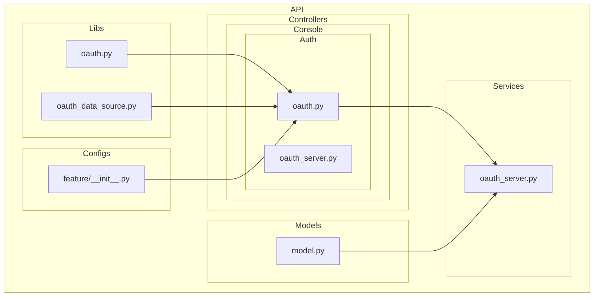
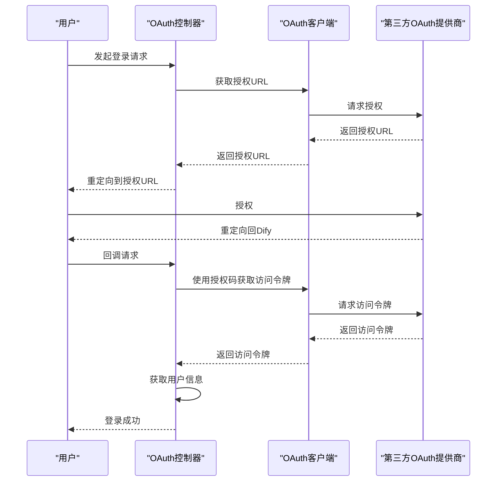
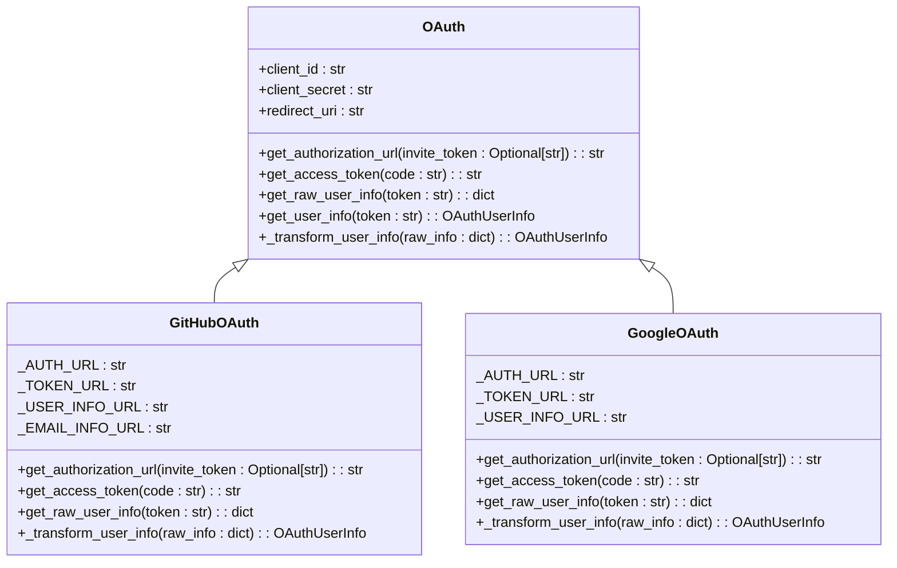
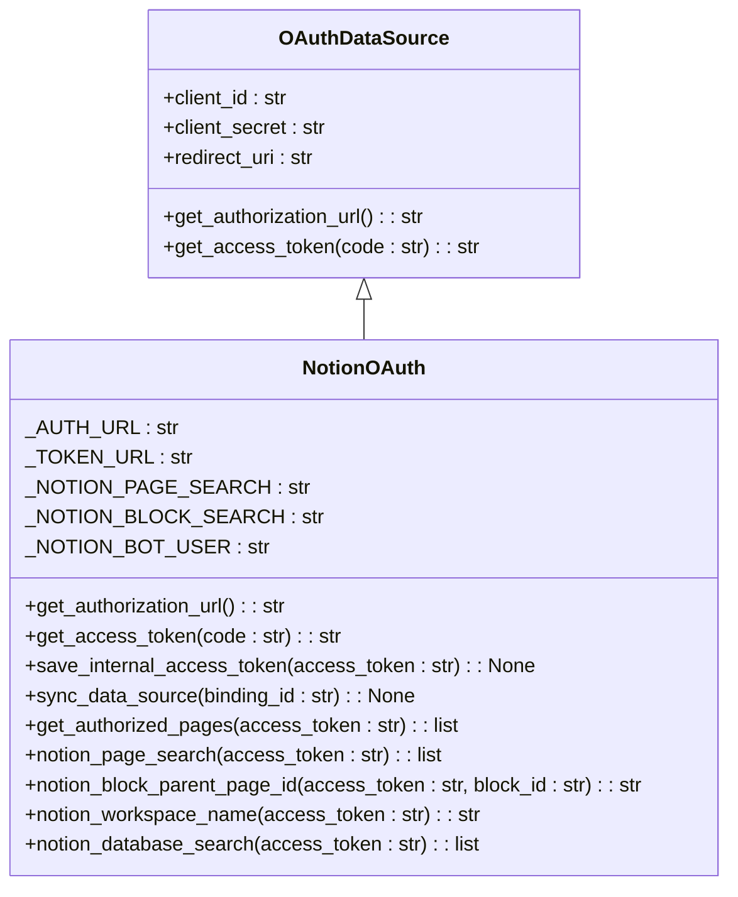
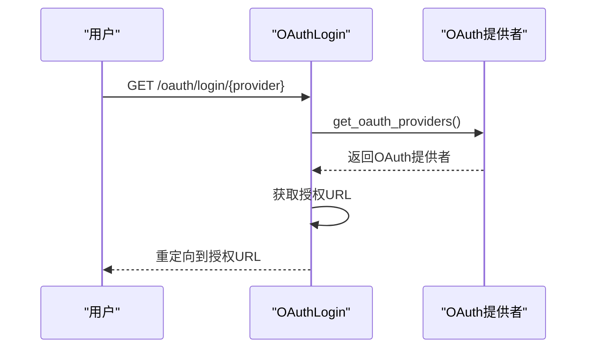
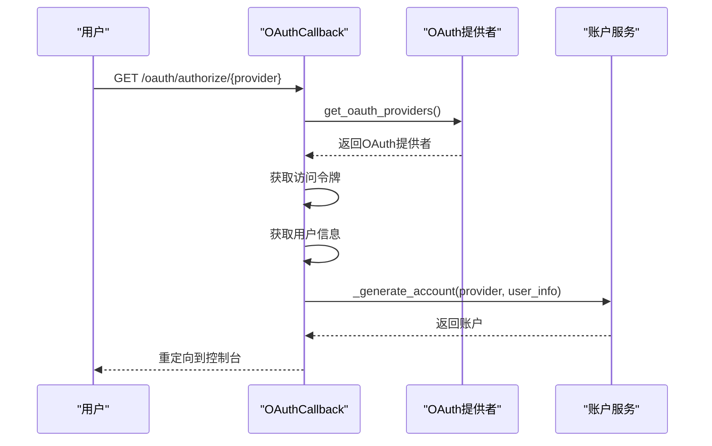
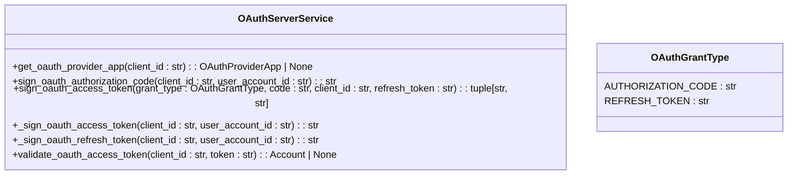
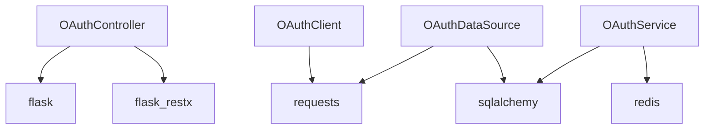

# 自定义OAuth提供商集成

<cite>
**本文档中引用的文件**  
- [oauth.py](file://api/libs/oauth.py)
- [oauth_data_source.py](file://api/libs/oauth_data_source.py)
- [oauth.py](file://api/controllers/console/auth/oauth.py)
- [oauth_server.py](file://api/controllers/console/auth/oauth_server.py)
- [auth_config.py](file://api/configs/feature/__init__.py)
- [model.py](file://api/models/model.py)
- [oauth_service.py](file://api/services/oauth_server.py)
</cite>

## 目录
1. [简介](#简介)
2. [项目结构](#项目结构)
3. [核心组件](#核心组件)
4. [架构概述](#架构概述)
5. [详细组件分析](#详细组件分析)
6. [依赖分析](#依赖分析)
7. [性能考虑](#性能考虑)
8. [故障排除指南](#故障排除指南)
9. [结论](#结论)
10. [附录](#附录)（如有必要）

## 简介
本文档旨在为开发者提供将Dify与任意支持OAuth 2.0的第三方服务集成的技术指南。文档详细说明了扩展OAuth支持的开发步骤，包括实现自定义OAuth客户端类、配置授权端点、令牌端点和用户信息端点，以及处理不同提供商的响应格式差异。通过代码模板展示如何注册新的OAuth提供商，处理非标准的OAuth实现（如微信、钉钉），并确保符合安全规范。此外，文档还包含调试技巧，例如使用Postman测试OAuth流程，以及如何处理常见的兼容性问题（如签名算法差异、响应格式不一致）。

## 项目结构
Dify的项目结构清晰地划分了不同功能模块，便于开发者理解和维护。OAuth相关的代码主要分布在`api/libs`、`api/controllers/console/auth`和`api/services`目录下。`api/libs`包含OAuth客户端和数据源的基类及具体实现；`api/controllers/console/auth`负责OAuth登录和回调的控制器逻辑；`api/services`则提供了OAuth服务器服务的具体实现。



**图表来源**  
- [oauth.py](file://api/libs/oauth.py#L1-L133)
- [oauth_data_source.py](file://api/libs/oauth_data_source.py#L1-L305)
- [oauth.py](file://api/controllers/console/auth/oauth.py#L1-L187)
- [oauth_server.py](file://api/controllers/console/auth/oauth_server.py#L1-L202)
- [auth_config.py](file://api/configs/feature/__init__.py#L1-L1035)
- [model.py](file://api/models/model.py#L1-L799)

**章节来源**  
- [oauth.py](file://api/libs/oauth.py#L1-L133)
- [oauth_data_source.py](file://api/libs/oauth_data_source.py#L1-L305)
- [oauth.py](file://api/controllers/console/auth/oauth.py#L1-L187)
- [oauth_server.py](file://api/controllers/console/auth/oauth_server.py#L1-L202)
- [auth_config.py](file://api/configs/feature/__init__.py#L1-L1035)
- [model.py](file://api/models/model.py#L1-L799)

## 核心组件
Dify的OAuth集成核心组件包括OAuth客户端基类、具体提供商实现、控制器和服务器服务。这些组件协同工作，实现了从用户登录到令牌验证的完整流程。

**章节来源**  
- [oauth.py](file://api/libs/oauth.py#L1-L133)
- [oauth_data_source.py](file://api/libs/oauth_data_source.py#L1-L305)
- [oauth.py](file://api/controllers/console/auth/oauth.py#L1-L187)
- [oauth_server.py](file://api/controllers/console/auth/oauth_server.py#L1-L202)

## 架构概述
Dify的OAuth架构分为客户端、控制器和服务层。客户端负责与第三方OAuth提供商通信，获取授权URL、访问令牌和用户信息。控制器处理用户的登录请求和回调，调用客户端完成OAuth流程。服务层则负责验证访问令牌，确保安全性。



**图表来源**  
- [oauth.py](file://api/libs/oauth.py#L1-L133)
- [oauth.py](file://api/controllers/console/auth/oauth.py#L1-L187)

## 详细组件分析
### OAuth客户端分析
Dify的OAuth客户端通过继承`OAuth`基类实现，支持多种第三方提供商。每个提供商需要实现`get_authorization_url`、`get_access_token`和`get_raw_user_info`方法。

#### GitHubOAuth实现


**图表来源**  
- [oauth.py](file://api/libs/oauth.py#L1-L133)

#### NotionOAuth实现


**图表来源**  
- [oauth_data_source.py](file://api/libs/oauth_data_source.py#L1-L305)

### 控制器分析
控制器负责处理用户的登录请求和回调，调用OAuth客户端完成OAuth流程。

#### OAuthLogin控制器


**图表来源**  
- [oauth.py](file://api/controllers/console/auth/oauth.py#L1-L187)

#### OAuthCallback控制器


**图表来源**  
- [oauth.py](file://api/controllers/console/auth/oauth.py#L1-L187)

### 服务层分析
服务层负责验证访问令牌，确保安全性。

#### OAuthServerService服务


**图表来源**  
- [oauth_service.py](file://api/services/oauth_server.py#L1-L94)

**章节来源**  
- [oauth.py](file://api/libs/oauth.py#L1-L133)
- [oauth_data_source.py](file://api/libs/oauth_data_source.py#L1-L305)
- [oauth.py](file://api/controllers/console/auth/oauth.py#L1-L187)
- [oauth_server.py](file://api/controllers/console/auth/oauth_server.py#L1-L202)
- [oauth_service.py](file://api/services/oauth_server.py#L1-L94)

## 依赖分析
Dify的OAuth集成依赖于多个外部库和内部模块。主要依赖包括`requests`用于HTTP请求，`flask`和`flask_restx`用于Web服务，`sqlalchemy`用于数据库操作。



**图表来源**  
- [oauth.py](file://api/libs/oauth.py#L1-L133)
- [oauth_data_source.py](file://api/libs/oauth_data_source.py#L1-L305)
- [oauth.py](file://api/controllers/console/auth/oauth.py#L1-L187)
- [oauth_server.py](file://api/controllers/console/auth/oauth_server.py#L1-L202)
- [oauth_service.py](file://api/services/oauth_server.py#L1-L94)

**章节来源**  
- [oauth.py](file://api/libs/oauth.py#L1-L133)
- [oauth_data_source.py](file://api/libs/oauth_data_source.py#L1-L305)
- [oauth.py](file://api/controllers/console/auth/oauth.py#L1-L187)
- [oauth_server.py](file://api/controllers/console/auth/oauth_server.py#L1-L202)
- [oauth_service.py](file://api/services/oauth_server.py#L1-L94)

## 性能考虑
在实现自定义OAuth提供商时，需要注意性能优化。例如，使用Redis缓存访问令牌和授权码，减少数据库查询次数。同时，合理设置超时时间，避免长时间等待。

## 故障排除指南
### 常见问题
1. **授权URL生成失败**：检查`client_id`和`redirect_uri`是否正确。
2. **访问令牌获取失败**：检查`client_secret`是否正确，以及授权码是否过期。
3. **用户信息获取失败**：检查访问令牌是否有效，以及用户信息端点是否正确。

### 调试技巧
1. **使用Postman测试OAuth流程**：通过Postman模拟OAuth流程，验证各步骤是否正常。
2. **查看日志**：检查Dify的日志，查找错误信息。
3. **使用调试工具**：使用浏览器的开发者工具，查看网络请求和响应。

**章节来源**  
- [oauth.py](file://api/libs/oauth.py#L1-L133)
- [oauth_data_source.py](file://api/libs/oauth_data_source.py#L1-L305)
- [oauth.py](file://api/controllers/console/auth/oauth.py#L1-L187)
- [oauth_server.py](file://api/controllers/console/auth/oauth_server.py#L1-L202)
- [oauth_service.py](file://api/services/oauth_server.py#L1-L94)

## 结论
通过本文档，开发者可以了解如何将Dify与任意支持OAuth 2.0的第三方服务集成。文档详细说明了扩展OAuth支持的开发步骤，包括实现自定义OAuth客户端类、配置授权端点、令牌端点和用户信息端点，以及处理不同提供商的响应格式差异。通过代码模板展示如何注册新的OAuth提供商，处理非标准的OAuth实现（如微信、钉钉），并确保符合安全规范。此外，文档还包含调试技巧，例如使用Postman测试OAuth流程，以及如何处理常见的兼容性问题（如签名算法差异、响应格式不一致）。

## 附录
### 配置示例
```python
# 配置GitHub OAuth
GITHUB_CLIENT_ID = "your_client_id"
GITHUB_CLIENT_SECRET = "your_client_secret"
CONSOLE_API_URL = "https://your-console-api-url"
```

### 代码模板
```python
class CustomOAuth(OAuth):
    _AUTH_URL = "https://custom.com/oauth/authorize"
    _TOKEN_URL = "https://custom.com/oauth/token"
    _USER_INFO_URL = "https://custom.com/api/user"

    def get_authorization_url(self, invite_token: Optional[str] = None):
        params = {
            "client_id": self.client_id,
            "redirect_uri": self.redirect_uri,
            "scope": "user:email",
        }
        if invite_token:
            params["state"] = invite_token
        return f"{self._AUTH_URL}?{urllib.parse.urlencode(params)}"

    def get_access_token(self, code: str):
        data = {
            "client_id": self.client_id,
            "client_secret": self.client_secret,
            "code": code,
            "redirect_uri": self.redirect_uri,
        }
        headers = {"Accept": "application/json"}
        response = requests.post(self._TOKEN_URL, data=data, headers=headers)
        response_json = response.json()
        access_token = response_json.get("access_token")
        if not access_token:
            raise ValueError(f"Error in Custom OAuth: {response_json}")
        return access_token

    def get_raw_user_info(self, token: str):
        headers = {"Authorization": f"Bearer {token}"}
        response = requests.get(self._USER_INFO_URL, headers=headers)
        response.raise_for_status()
        return response.json()

    def _transform_user_info(self, raw_info: dict) -> OAuthUserInfo:
        return OAuthUserInfo(id=str(raw_info["id"]), name=raw_info["name"], email=raw_info["email"])
```