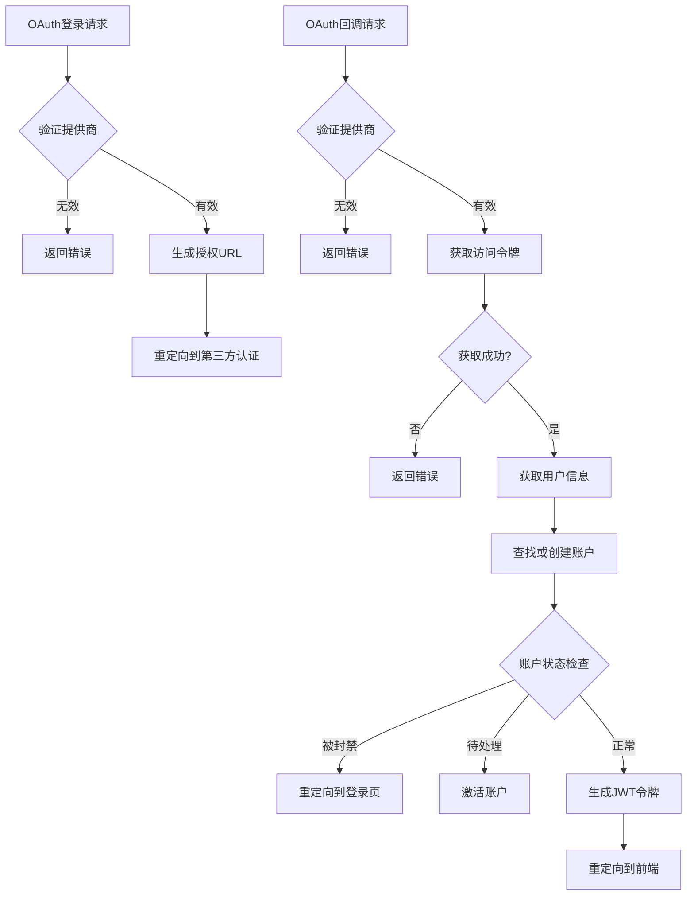

# 认证系统集成

<cite>
**本文档中引用的文件**  
- [oauth.py](file://api/libs/oauth.py)
- [oauth.py](file://api/controllers/console/auth/oauth.py)
- [account.py](file://api/models/account.py)
- [account_service.py](file://api/services/account_service.py)
</cite>

## 目录
1. [简介](#简介)
2. [OAuth 2.0 集成实现](#oauth-20-集成实现)
3. [Dify 控制台配置步骤](#dify-控制台配置步骤)
4. [API 端点说明](#api-端点说明)
5. [安全最佳实践](#安全最佳实践)
6. [常见问题排查](#常见问题排查)
7. [扩展新的 OAuth 提供商](#扩展新的-oauth-提供商)
8. [用户模型集成](#用户模型集成)

## 简介
Dify 支持通过第三方 OAuth 提供商（如 GitHub、Google）进行用户认证。该系统基于 OAuth 2.0 授权码模式实现，允许用户使用其现有的社交账户登录 Dify 平台。本指南详细说明了 OAuth 集成的技术实现、配置步骤、安全机制和故障排除方法。

## OAuth 2.0 集成实现
Dify 的 OAuth 2.0 实现遵循标准的授权码流程，包括授权、回调、令牌获取和用户信息映射等阶段。

**Diagram sources**
- [oauth.py](file://api/controllers/console/auth/oauth.py#L35-L68)
- [oauth.py](file://api/libs/oauth.py#L78-L111)

**Section sources**
- [oauth.py](file://api/controllers/console/auth/oauth.py#L35-L187)
- [oauth.py](file://api/libs/oauth.py#L0-L133)

## Dify 控制台配置步骤
在 Dify 控制台中配置 OAuth 应用需要以下步骤：

1. **获取客户端凭证**：在 GitHub 或 Google 开发者平台创建应用，获取 `client_id` 和 `client_secret`。
2. **配置环境变量**：在 Dify 的配置文件中设置相应的环境变量：
   - GitHub: `GITHUB_CLIENT_ID`, `GITHUB_CLIENT_SECRET`
   - Google: `GOOGLE_CLIENT_ID`, `GOOGLE_CLIENT_SECRET`
3. **设置回调URL**：确保回调URL与 Dify 配置一致：
   - GitHub: `{CONSOLE_API_URL}/console/api/oauth/authorize/github`
   - Google: `{CONSOLE_API_URL}/console/api/oauth/authorize/google`

**Section sources**
- [oauth.py](file://api/controllers/console/auth/oauth.py#L35-L68)

## API 端点说明
Dify 提供了两个主要的 OAuth API 端点来处理认证流程。

### OAuth 登录端点
- **路径**: `/console/api/oauth/login/<provider>`
- **方法**: GET
- **参数**:
  - `provider`: OAuth 提供商名称 (github, google)
  - `invite_token`: 邀请令牌 (可选)

该端点生成授权URL并重定向用户到第三方认证页面。

### OAuth 回调端点
- **路径**: `/console/api/oauth/authorize/<provider>`
- **方法**: GET
- **参数**:
  - `code`: 授权码
  - `state`: 状态参数 (包含邀请令牌)

该端点处理授权码，获取访问令牌和用户信息，并完成用户登录流程。

**Diagram sources**
- [oauth.py](file://api/controllers/console/auth/oauth.py#L68-L187)

**Section sources**
- [oauth.py](file://api/controllers/console/auth/oauth.py#L68-L187)

## 安全最佳实践
Dify 在 OAuth 集成中实施了多项安全措施以保护用户数据和系统安全。

### CSRF 保护
通过 `state` 参数实现 CSRF 保护。在发起授权请求时，可以传递 `invite_token` 作为 `state` 参数的值。当用户完成授权后，该值会通过回调返回，系统会验证其有效性。

### 重定向 URI 验证
系统严格验证重定向 URI，确保它们与配置的回调 URL 完全匹配，防止开放重定向攻击。

### 账户状态检查
在完成 OAuth 流程后，系统会检查账户状态：
- **BANNED (被封禁)**: 拒绝登录
- **PENDING (待处理)**: 自动激活账户
- **CLOSED (已关闭)**: 允许登录 (存在安全风险)

### 令牌管理
使用 JWT 作为访问令牌，并提供刷新令牌机制。访问令牌有过期时间，刷新令牌存储在 Redis 中并有相应的过期策略。

**Section sources**
- [oauth.py](file://api/controllers/console/auth/oauth.py#L120-L187)
- [account_service.py](file://api/services/account_service.py#L0-L799)

## 常见问题排查
本节介绍 OAuth 集成中常见的问题及其解决方案。

### 令牌失效
**症状**: 用户频繁需要重新登录  
**原因**: 访问令牌过期，刷新令牌无效  
**解决方案**: 
- 检查 `ACCESS_TOKEN_EXPIRE_MINUTES` 和 `REFRESH_TOKEN_EXPIRE_DAYS` 配置
- 确保 Redis 服务正常运行以存储刷新令牌

### 权限不足
**症状**: 用户无法访问某些功能  
**原因**: OAuth 提供商返回的用户信息不完整  
**解决方案**:
- GitHub: 确保请求 `user:email` 范围
- Google: 确保请求 `openid email` 范围
- 检查用户邮箱是否公开

### 无效提供商
**症状**: 返回 "Invalid provider" 错误  
**原因**: 配置文件中缺少相应的客户端凭证  
**解决方案**:
- 检查环境变量是否正确设置
- 确认 `GITHUB_CLIENT_ID` 和 `GOOGLE_CLIENT_ID` 不为空

### 邀请令牌不匹配
**症状**: 使用邀请链接登录时提示 "Invalid invitation token"  
**原因**: OAuth 登录的邮箱与邀请邮箱不匹配  
**解决方案**:
- 确保用户使用邀请邮件中的邮箱进行 OAuth 登录
- 检查邀请令牌的有效性

**Section sources**
- [oauth.py](file://api/controllers/console/auth/oauth.py#L120-L187)

## 扩展新的 OAuth 提供商
可以通过继承 `OAuth` 基类来扩展支持新的 OAuth 提供商。

**Diagram sources**
- [oauth.py](file://api/libs/oauth.py#L0-L133)

**Section sources**
- [oauth.py](file://api/libs/oauth.py#L0-L133)

要添加新的提供商，需要实现以下方法：
1. `get_authorization_url()`: 生成授权URL
2. `get_access_token(code)`: 通过授权码获取访问令牌
3. `get_raw_user_info(token)`: 获取原始用户信息
4. `_transform_user_info(raw_info)`: 将原始信息转换为标准格式

## 用户模型集成
Dify 的 OAuth 系统与用户模型紧密集成，处理账户的创建、查找和关联。

### 账户查找逻辑
系统按照以下顺序查找用户：
1. 通过 `provider` 和 `open_id` 在 `AccountIntegrate` 表中查找
2. 如果未找到，通过邮箱在 `Account` 表中查找

### 账户创建流程
当找不到匹配的账户时，系统会创建新账户：
1. 检查系统是否允许注册
2. 使用 OAuth 提供的用户信息创建账户
3. 将 OAuth 账户与 Dify 账户关联

### 账户状态管理
系统会根据账户状态采取不同操作：
- **PENDING**: 激活账户并设置初始化时间
- **BANNED**: 拒绝登录
- **CLOSED**: 允许登录 (需修复安全问题)

**Diagram sources**
- [account.py](file://api/models/account.py#L0-L339)

**Section sources**
- [account.py](file://api/models/account.py#L0-L339)
- [oauth.py](file://api/controllers/console/auth/oauth.py#L150-L187)
- [account_service.py](file://api/services/account_service.py#L0-L799)