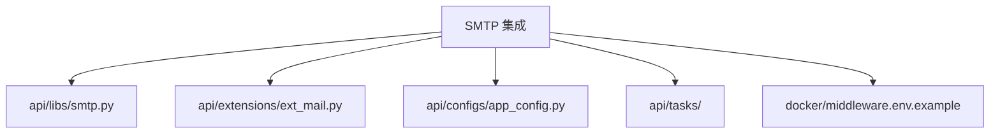
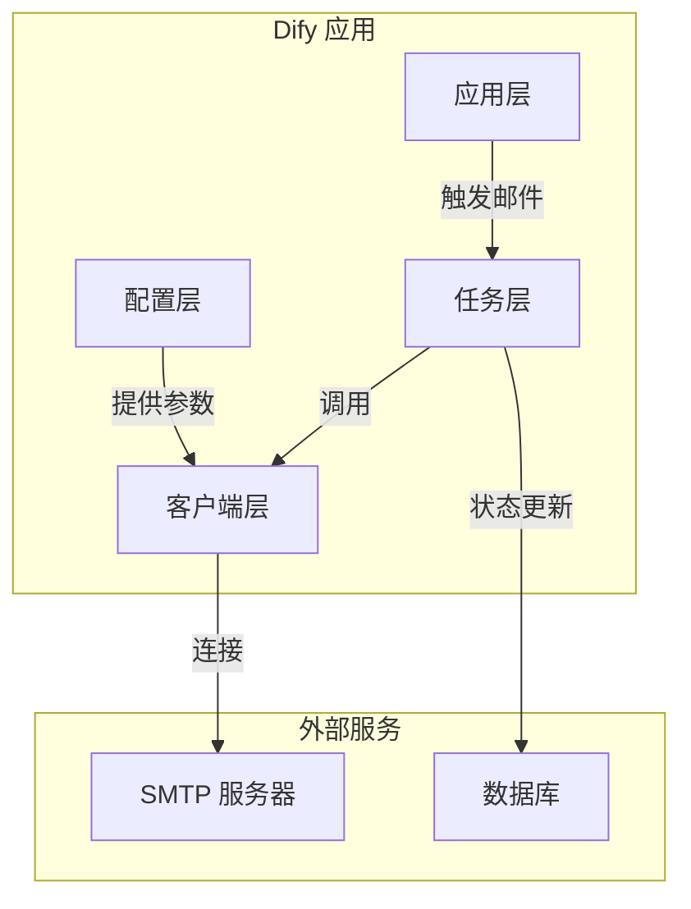
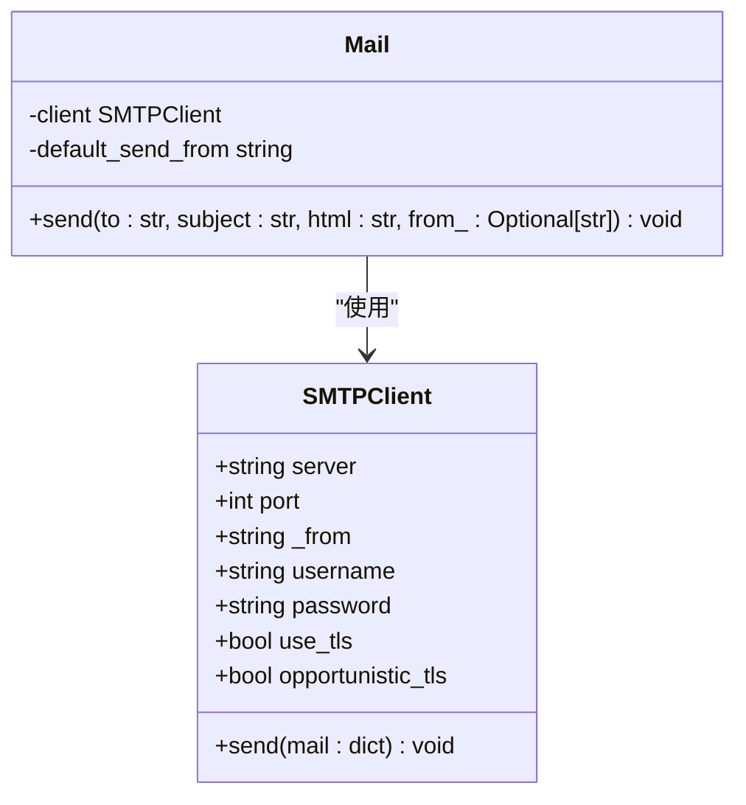
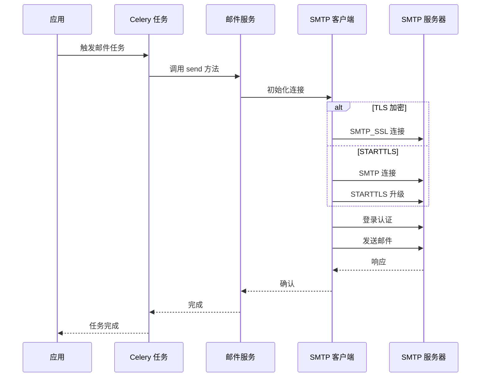
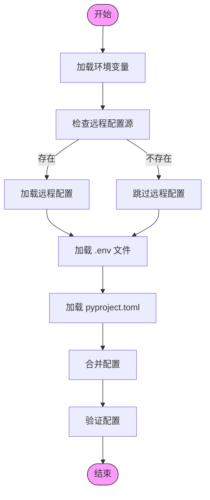
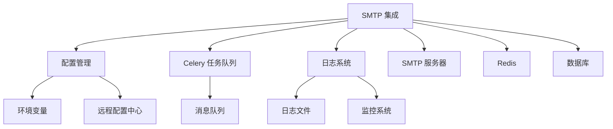

# SMTP 集成

<cite>
**本文档中引用的文件**  
- [smtp.py](file://api/libs/smtp.py)
- [ext_mail.py](file://api/extensions/ext_mail.py)
- [app_config.py](file://api/configs/app_config.py)
- [middleware.env.example](file://docker/middleware.env.example)
- [mail.py](file://api/controllers/inner_api/mail.py)
- [mail_account_deletion_task.py](file://api/tasks/mail_account_deletion_task.py)
- [mail_change_mail_task.py](file://api/tasks/mail_change_mail_task.py)
- [mail_email_code_login.py](file://api/tasks/mail_email_code_login.py)
- [mail_inner_task.py](file://api/tasks/mail_inner_task.py)
- [mail_invite_member_task.py](file://api/tasks/mail_invite_member_task.py)
- [mail_owner_transfer_task.py](file://api/tasks/mail_owner_transfer_task.py)
- [mail_reset_password_task.py](file://api/tasks/mail_reset_password_task.py)
</cite>

## 目录
1. [简介](#简介)
2. [项目结构](#项目结构)
3. [核心组件](#核心组件)
4. [架构概述](#架构概述)
5. [详细组件分析](#详细组件分析)
6. [依赖分析](#依赖分析)
7. [性能考虑](#性能考虑)
8. [故障排除指南](#故障排除指南)
9. [结论](#结论)

## 简介
本文档提供在 Dify 中配置和使用自定义 SMTP 服务器发送邮件的完整指南。涵盖 SMTP 连接参数、TLS/SSL 加密配置、连接池管理以及通过 Celery 实现的异步邮件发送机制。文档详细说明如何在 `.env` 环境文件中配置 SMTP 服务，包括 `EMAIL_USE_TLS`、`EMAIL_PORT` 等关键参数的含义和取值范围。提供与主流邮件服务商（如 Gmail、Outlook、阿里云邮件推送）的集成示例，说明身份验证机制和常见连接错误的排查方法。包含性能优化建议，如连接超时设置、批量邮件发送的最佳实践，以及如何监控 SMTP 邮件队列状态。

## 项目结构
Dify 项目的结构清晰地组织了与邮件发送相关的组件。核心邮件功能分布在 `api/libs`、`api/extensions` 和 `api/tasks` 目录中。`api/libs/smtp.py` 包含 SMTP 客户端实现，`api/extensions/ext_mail.py` 负责邮件服务的初始化和管理，而 `api/tasks` 目录下的多个任务文件处理异步邮件发送逻辑。

**图示来源**  
- [smtp.py](file://api/libs/smtp.py)
- [ext_mail.py](file://api/extensions/ext_mail.py)
- [app_config.py](file://api/configs/app_config.py)
- [middleware.env.example](file://docker/middleware.env.example)

**节来源**  
- [smtp.py](file://api/libs/smtp.py)
- [ext_mail.py](file://api/extensions/ext_mail.py)
- [app_config.py](file://api/configs/app_config.py)
- [middleware.env.example](file://docker/middleware.env.example)

## 核心组件
Dify 的 SMTP 集成核心组件包括 `SMTPClient` 类、邮件扩展初始化逻辑和配置管理。`SMTPClient` 类封装了 SMTP 协议的连接、认证和邮件发送功能。邮件扩展通过 `ext_mail.py` 文件中的 `Mail` 类进行初始化和管理。配置管理通过 `app_config.py` 中的 `DifyConfig` 类实现，支持从环境变量和配置文件中读取设置。

**节来源**  
- [smtp.py](file://api/libs/smtp.py#L1-L60)
- [ext_mail.py](file://api/extensions/ext_mail.py#L43-L107)
- [app_config.py](file://api/configs/app_config.py#L1-L114)

## 架构概述
Dify 的 SMTP 邮件发送架构采用分层设计，将配置管理、客户端实现和任务调度分离。配置层从环境变量读取 SMTP 参数，客户端层实现具体的 SMTP 协议通信，任务层通过 Celery 实现异步邮件发送。这种设计提高了系统的可维护性和可扩展性。

**图示来源**  
- [smtp.py](file://api/libs/smtp.py)
- [ext_mail.py](file://api/extensions/ext_mail.py)
- [app_config.py](file://api/configs/app_config.py)

## 详细组件分析

### SMTP 客户端分析
`SMTPClient` 类是 Dify 邮件发送功能的核心实现。它支持 TLS 和 STARTTLS 加密模式，能够处理各种 SMTP 服务器的身份验证需求。客户端实现了连接超时设置和异常处理机制，确保邮件发送的可靠性。

#### 类图

**图示来源**  
- [smtp.py](file://api/libs/smtp.py#L1-L60)
- [ext_mail.py](file://api/extensions/ext_mail.py#L43-L107)

#### 邮件发送流程

**图示来源**  
- [smtp.py](file://api/libs/smtp.py#L1-L60)
- [ext_mail.py](file://api/extensions/ext_mail.py#L43-L107)
- [mail_account_deletion_task.py](file://api/tasks/mail_account_deletion_task.py)
- [mail_reset_password_task.py](file://api/tasks/mail_reset_password_task.py)

### 配置管理分析
Dify 的配置管理系统通过 `DifyConfig` 类实现，支持从多种来源读取配置，包括环境变量、远程配置中心和 TOML 文件。邮件相关配置通过环境变量进行管理，确保了配置的灵活性和安全性。

#### 配置加载流程

**图示来源**  
- [app_config.py](file://api/configs/app_config.py#L1-L114)
- [middleware.env.example](file://docker/middleware.env.example#L1-L161)

**节来源**  
- [app_config.py](file://api/configs/app_config.py#L1-L114)
- [middleware.env.example](file://docker/middleware.env.example#L1-L161)

## 依赖分析
Dify 的 SMTP 集成依赖于多个内部和外部组件。内部依赖包括配置管理系统、Celery 任务队列和日志系统。外部依赖包括 SMTP 服务器、Redis 消息队列和数据库服务。这些依赖关系确保了邮件发送功能的完整性和可靠性。

**图示来源**  
- [app_config.py](file://api/configs/app_config.py)
- [ext_mail.py](file://api/extensions/ext_mail.py)
- [smtp.py](file://api/libs/smtp.py)

**节来源**  
- [app_config.py](file://api/configs/app_config.py)
- [ext_mail.py](file://api/extensions/ext_mail.py)
- [smtp.py](file://api/libs/smtp.py)

## 性能考虑
在配置 SMTP 集成时，需要考虑多个性能因素。连接超时设置应根据网络状况进行调整，通常建议设置为 10 秒。对于批量邮件发送，应使用 Celery 任务队列进行异步处理，避免阻塞主应用。连接池管理可以通过配置 SMTP 服务器的连接限制来优化。监控邮件队列状态可以帮助及时发现和解决性能瓶颈。

**节来源**  
- [smtp.py](file://api/libs/smtp.py#L1-L60)
- [ext_mail.py](file://api/extensions/ext_mail.py#L43-L107)

## 故障排除指南
常见的 SMTP 连接问题包括认证失败、连接超时和 TLS 协议不匹配。认证失败通常是由于用户名或密码错误，或 SMTP 服务器要求特定的身份验证机制。连接超时可能是由于网络问题或防火墙设置。TLS 协议不匹配可以通过正确配置 `SMTP_USE_TLS` 和 `SMTP_OPPORTUNISTIC_TLS` 参数来解决。查看应用日志可以获取详细的错误信息，帮助快速定位问题。

**节来源**  
- [smtp.py](file://api/libs/smtp.py#L1-L60)
- [ext_mail.py](file://api/extensions/ext_mail.py#L43-L107)

## 结论
Dify 的 SMTP 集成提供了灵活可靠的邮件发送功能。通过合理的配置和优化，可以满足各种邮件发送需求。文档中提供的配置示例和故障排除指南可以帮助用户快速上手并解决常见问题。未来可以考虑增加更多邮件服务商的集成和支持更高级的邮件功能。