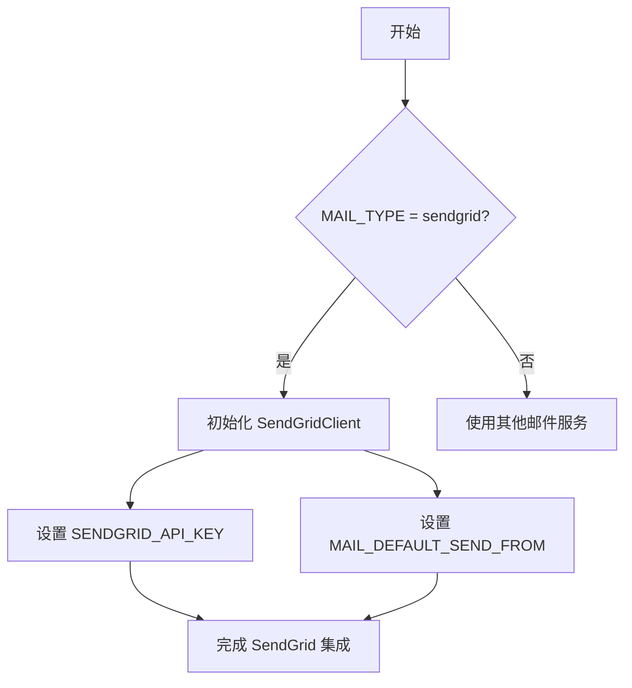
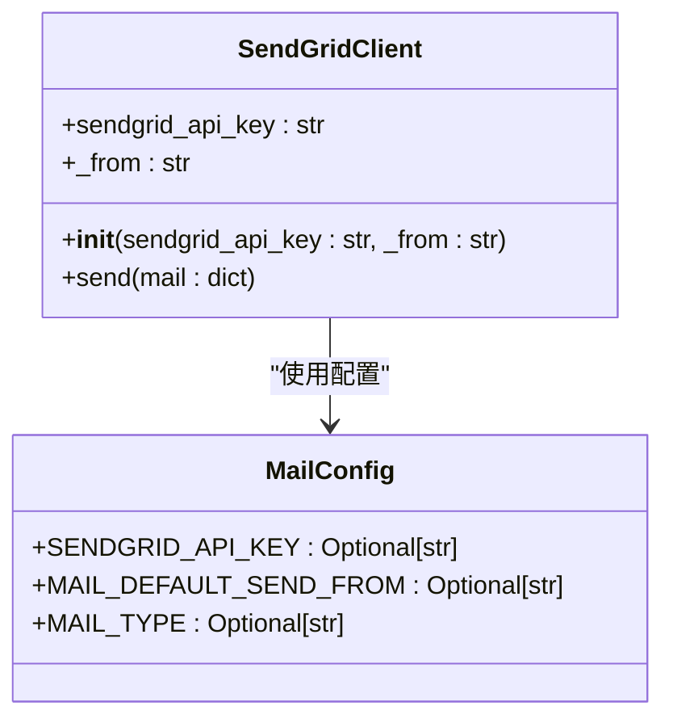
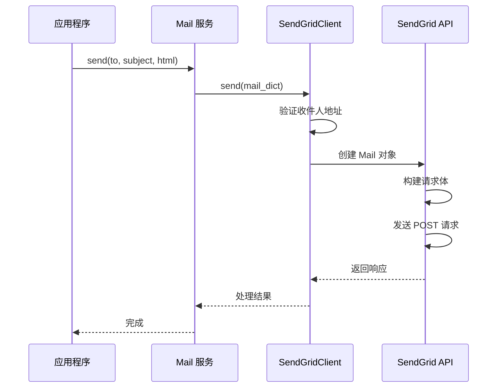
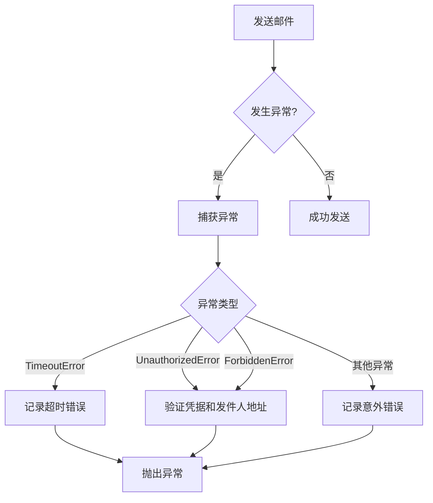
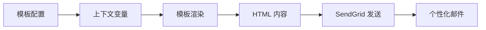

# SendGrid 集成

<cite>
**本文档中引用的文件**  
- [sendgrid.py](file://api/libs/sendgrid.py)
- [ext_mail.py](file://api/extensions/ext_mail.py)
- [__init__.py](file://api/configs/feature/__init__.py)
- [docker-compose.yaml](file://docker/docker-compose.yaml)
</cite>

## 目录
1. [简介](#简介)
2. [SendGrid 配置与集成](#sendgrid-配置与集成)
3. [SendGrid API 密钥管理](#sendgrid-api-密钥管理)
4. [邮件发送功能实现](#邮件发送功能实现)
5. [错误处理机制](#错误处理机制)
6. [生产环境最佳实践](#生产环境最佳实践)
7. [高级功能集成](#高级功能集成)

## 简介
Dify 支持通过 SendGrid API 发送交易邮件，提供可靠的邮件通知服务。本指南详细说明如何配置和使用 SendGrid 集成，包括 API 密钥设置、邮件发送流程、错误处理以及生产环境中的最佳实践。

**Section sources**
- [ext_mail.py](file://api/extensions/ext_mail.py#L1-L108)

## SendGrid 配置与集成
Dify 通过配置 `MAIL_TYPE` 为 `sendgrid` 来启用 SendGrid 邮件服务。系统会根据配置初始化相应的邮件客户端。

**Diagram sources**
- [ext_mail.py](file://api/extensions/ext_mail.py#L43-L68)
- [__init__.py](file://api/configs/feature/__init__.py#L687-L736)

**Section sources**
- [ext_mail.py](file://api/extensions/ext_mail.py#L43-L68)
- [__init__.py](file://api/configs/feature/__init__.py#L687-L736)

## SendGrid API 密钥管理
SendGrid API 密钥通过环境变量进行配置和管理。

### 环境变量配置
SENDGRID_API_KEY 环境变量用于存储 SendGrid 服务的 API 密钥。

**Diagram sources**
- [sendgrid.py](file://api/libs/sendgrid.py#L9-L46)
- [__init__.py](file://api/configs/feature/__init__.py#L715-L736)

**Section sources**
- [sendgrid.py](file://api/libs/sendgrid.py#L9-L46)
- [__init__.py](file://api/configs/feature/__init__.py#L715-L736)

## 邮件发送功能实现
SendGrid 邮件客户端实现了完整的邮件发送功能，包括内容构建和 API 调用。

### 邮件发送流程

**Diagram sources**
- [sendgrid.py](file://api/libs/sendgrid.py#L9-L46)
- [ext_mail.py](file://api/extensions/ext_mail.py#L90-L108)

**Section sources**
- [sendgrid.py](file://api/libs/sendgrid.py#L9-L46)
- [ext_mail.py](file://api/extensions/ext_mail.py#L90-L108)

## 错误处理机制
系统实现了全面的错误处理机制，确保邮件发送过程中的异常能够被正确捕获和处理。

### 异常类型与处理

**Diagram sources**
- [sendgrid.py](file://api/libs/sendgrid.py#L34-L46)

**Section sources**
- [sendgrid.py](file://api/libs/sendgrid.py#L34-L46)

## 生产环境最佳实践
为确保 SendGrid 集成在生产环境中的稳定性和安全性，建议遵循以下最佳实践。

### API 密钥轮换
定期轮换 SENDGRID_API_KEY 以增强安全性。可以通过环境变量更新密钥，系统会在重启后使用新的密钥。

### IP 地址白名单
在 SendGrid 控制台中配置发送服务器的 IP 地址白名单，防止未授权的访问。

### 发送速率限制
Dify 配置了每分钟每个 IP 地址的邮件发送限制：
- 环境变量：EMAIL_SEND_IP_LIMIT_PER_MINUTE
- 默认值：50 封/分钟

### Webhook 集成
通过配置 SendGrid Webhook，可以接收邮件状态更新，如打开率、点击率等事件。

**Section sources**
- [__init__.py](file://api/configs/feature/__init__.py#L715-L736)
- [docker-compose.yaml](file://docker/docker-compose.yaml#L342-L367)

## 高级功能集成
Dify 的 SendGrid 集成支持多种高级功能，提升邮件营销效果。

### 邮件活动跟踪
通过 SendGrid 的事件 webhook，可以跟踪邮件的发送状态、打开情况和链接点击行为。

### 打开率统计
利用 SendGrid 的打开跟踪功能，统计用户打开邮件的比例，评估邮件内容的有效性。

### 点击率分析
分析邮件中链接的点击情况，了解用户对不同内容的兴趣程度。

### 模板系统集成
Dify 使用内置的模板系统与 SendGrid 集成，支持个性化邮件内容渲染：
- 支持多语言模板
- 变量替换功能
- 品牌化邮件设计

**Diagram sources**
- [email_i18n.py](file://api/libs/email_i18n.py#L262-L293)

**Section sources**
- [email_i18n.py](file://api/libs/email_i18n.py#L262-L293)