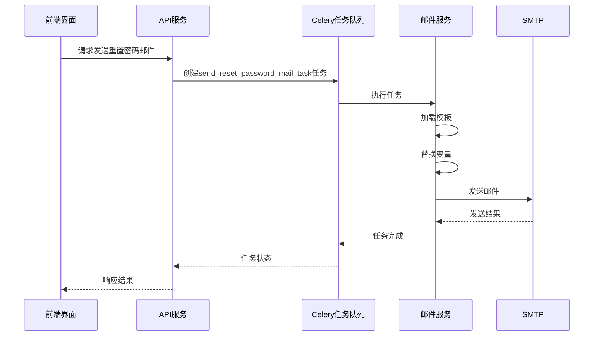
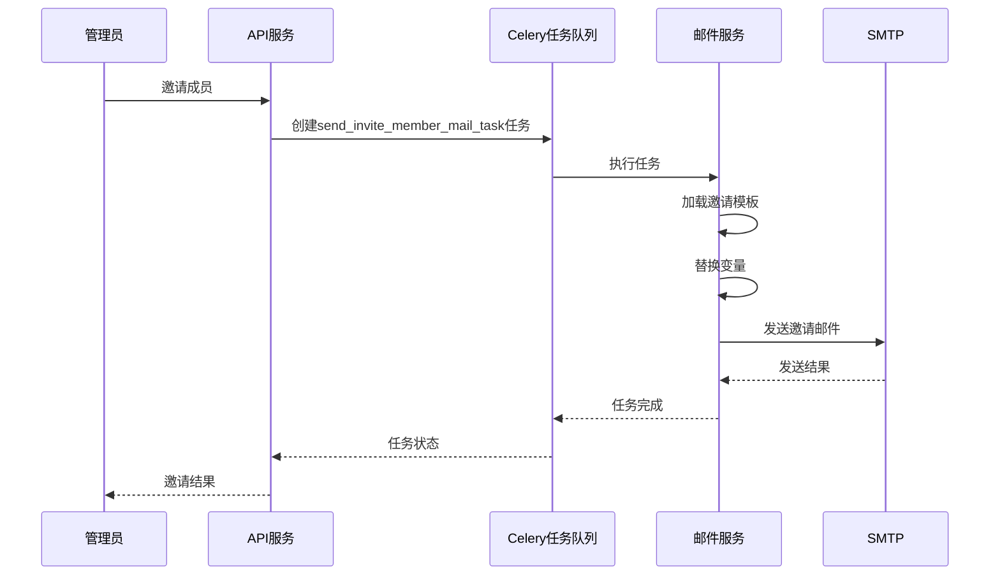
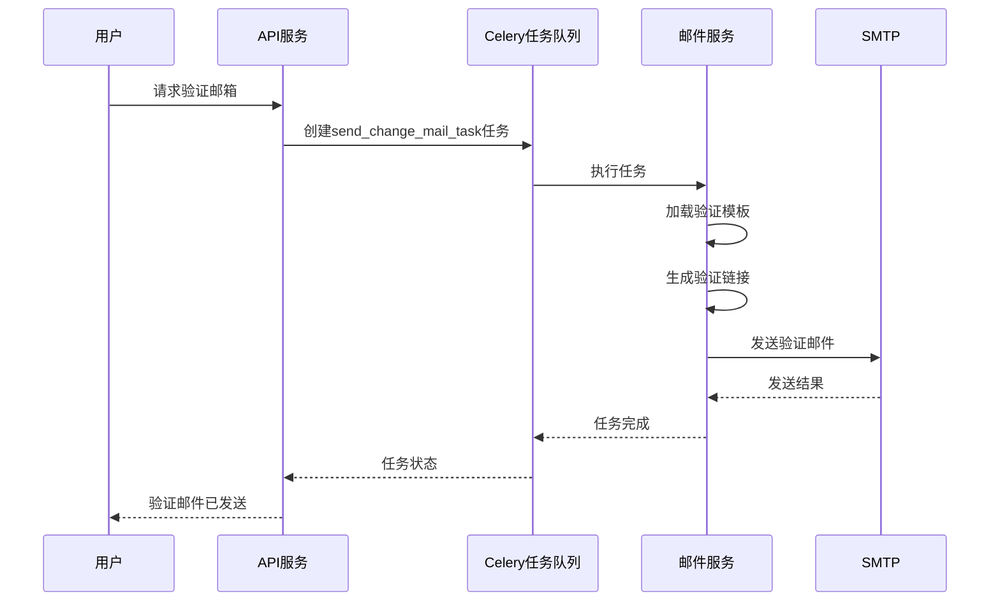

# 邮件服务集成

<cite>
**本文档引用的文件**
- [ext_mail.py](file://api/extensions/ext_mail.py)
- [smtp.py](file://api/libs/smtp.py)
- [sendgrid.py](file://api/libs/sendgrid.py)
- [email_i18n.py](file://api/libs/email_i18n.py)
- [mail_reset_password_task.py](file://api/tasks/mail_reset_password_task.py)
- [mail_invite_member_task.py](file://api/tasks/mail_invite_member_task.py)
- [mail_change_mail_task.py](file://api/tasks/mail_change_mail_task.py)
- [mail_owner_transfer_task.py](file://api/tasks/mail_owner_transfer_task.py)
- [mail_account_deletion_task.py](file://api/tasks/mail_account_deletion_task.py)
- [mail_inner_task.py](file://api/tasks/mail_inner_task.py)
- [app_config.py](file://api/configs/app_config.py)
- [queue_monitor_task.py](file://api/schedule/queue_monitor_task.py)
</cite>

## 目录
1. [简介](#简介)
2. [邮件服务配置](#邮件服务配置)
3. [邮件模板管理](#邮件模板管理)
4. [异步邮件发送机制](#异步邮件发送机制)
5. [邮件发送场景分析](#邮件发送场景分析)
6. [安全配置](#安全配置)
7. [邮件队列监控与失败重试](#邮件队列监控与失败重试)
8. [性能优化与反垃圾邮件最佳实践](#性能优化与反垃圾邮件最佳实践)

## 简介
Dify系统提供了完整的邮件服务集成方案，支持通过SMTP服务器和SendGrid等第三方服务发送邮件。本指南详细说明了邮件服务的配置、模板管理、异步发送机制以及在各种业务场景下的应用。

## 邮件服务配置

Dify支持多种邮件服务提供商的集成，主要通过环境变量进行配置。系统根据`MAIL_TYPE`环境变量的值选择相应的邮件客户端。

### SMTP配置
当`MAIL_TYPE=smtp`时，系统使用SMTP协议发送邮件。需要配置以下环境变量：

- `SMTP_SERVER`: SMTP服务器地址
- `SMTP_PORT`: SMTP服务器端口
- `SMTP_USERNAME`: SMTP认证用户名
- `SMTP_PASSWORD`: SMTP认证密码
- `MAIL_DEFAULT_SEND_FROM`: 默认发件人地址
- `SMTP_USE_TLS`: 是否使用TLS加密
- `SMTP_OPPORTUNISTIC_TLS`: 是否启用机会性TLS

```python
# api/extensions/ext_mail.py
case "smtp":
    from libs.smtp import SMTPClient

    if not dify_config.SMTP_SERVER or not dify_config.SMTP_PORT:
        raise ValueError("SMTP_SERVER and SMTP_PORT are required for smtp mail type")
    if not dify_config.SMTP_USE_TLS and dify_config.SMTP_OPPORTUNISTIC_TLS:
        raise ValueError("SMTP_OPPORTUNISTIC_TLS is not supported without enabling SMTP_USE_TLS")
    self._client = SMTPClient(
        server=dify_config.SMTP_SERVER,
        port=dify_config.SMTP_PORT,
        username=dify_config.SMTP_USERNAME or "",
        password=dify_config.SMTP_PASSWORD or "",
        _from=dify_config.MAIL_DEFAULT_SEND_FROM or "",
        use_tls=dify_config.SMTP_USE_TLS,
        opportunistic_tls=dify_config.SMTP_OPPORTUNISTIC_TLS,
    )
```

### SendGrid配置
当`MAIL_TYPE=sendgrid`时，系统使用SendGrid API发送邮件。需要配置以下环境变量：

- `SENDGRID_API_KEY`: SendGrid API密钥
- `MAIL_DEFAULT_SEND_FROM`: 默认发件人地址

```python
# api/extensions/ext_mail.py
case "sendgrid":
    from libs.sendgrid import SendGridClient

    if not dify_config.SENDGRID_API_KEY:
        raise ValueError("SENDGRID_API_KEY is required for SendGrid mail type")

    self._client = SendGridClient(
        sendgrid_api_key=dify_config.SENDGRID_API_KEY, _from=dify_config.MAIL_DEFAULT_SEND_FROM or ""
    )
```

**邮件配置验证**
系统在初始化邮件客户端时会进行严格的配置验证，确保所有必需的配置项都已正确设置。如果配置不完整或无效，系统会抛出相应的错误信息。

**Section sources**
- [ext_mail.py](file://api/extensions/ext_mail.py#L43-L68)

## 邮件模板管理

Dify系统采用国际化的邮件模板管理机制，支持多语言邮件内容的渲染和发送。

### 模板路径与结构
邮件模板存储在`api/templates`目录下，按照语言和品牌化需求组织：

- `reset_password_mail_template_en-US.html`: 英文密码重置模板
- `reset_password_mail_template_zh-CN.html`: 中文密码重置模板
- `invite_member_mail_template_en-US.html`: 英文成员邀请模板
- `invite_member_mail_template_zh-CN.html`: 中文成员邀请模板
- `without-brand/`: 品牌化模板目录

### 变量替换机制
系统通过`EmailI18nService`类实现模板变量替换，支持动态内容的注入：

```python
# api/libs/email_i18n.py
def _render_email_content(
    self,
    email_type: EmailType,
    language: EmailLanguage,
    template_context: dict[str, Any],
) -> EmailContent:
    template_config = self._config.get_template(email_type, language)
    branding = self._branding_service.get_branding_config()

    # Determine template path based on branding
    template_path = template_config.branded_template_path if branding.enabled else template_config.template_path

    # Prepare template context with branding information
    full_context = {
        **template_context,
        "branding_enabled": branding.enabled,
        "application_title": branding.application_title if branding.enabled else "Dify",
    }

    # Render template
    html_content = self._renderer.render_template(template_path, **full_context)

    # Apply templating to subject with all context variables
    subject = template_config.subject
    try:
        subject = subject.format(**full_context)
    except KeyError:
        # If template variables are missing, fall back to basic formatting
        if branding.enabled and "{application_title}" in subject:
            subject = subject.format(application_title=branding.application_title)

    return EmailContent(
        subject=subject,
        html_content=html_content,
        template_context=full_context,
    )
```

模板支持以下变量：
- `{application_title}`: 应用名称
- `{to}`: 收件人邮箱
- `{code}`: 验证码
- `{WorkspaceName}`: 工作空间名称

**Section sources**
- [email_i18n.py](file://api/libs/email_i18n.py#L232-L265)
- [email_i18n.py](file://api/libs/email_i18n.py#L262-L293)

## 异步邮件发送机制

Dify系统采用Celery任务队列实现邮件的异步发送，确保邮件发送不会阻塞主业务流程。

### Celery任务定义
所有邮件发送任务都定义在`api/tasks`目录下，使用`@shared_task(queue="mail")`装饰器标记为Celery任务：

```python
# api/tasks/mail_reset_password_task.py
@shared_task(queue="mail")
def send_reset_password_mail_task(language: str, to: str, code: str):
    """
    Send reset password email with internationalization support.

    Args:
        language: Language code for email localization
        to: Recipient email address
        code: Reset password code
    """
    if not mail.is_inited():
        return

    logger.info(click.style(f"Start password reset mail to {to}", fg="green"))
    start_at = time.perf_counter()

    try:
        email_service = get_email_i18n_service()
        email_service.send_email(
            email_type=EmailType.RESET_PASSWORD,
            language_code=language,
            to=to,
            template_context={
                "to": to,
                "code": code,
            },
        )

        end_at = time.perf_counter()
        logger.info(
            click.style(f"Send password reset mail to {to} succeeded: latency: {end_at - start_at}", fg="green")
        )
    except Exception:
        logger.exception("Send password reset mail to %s failed", to)
```

### 任务队列配置
邮件任务被分配到名为"mail"的专用队列中，与其他任务隔离，确保邮件发送的优先级和可靠性。

**Section sources**
- [mail_reset_password_task.py](file://api/tasks/mail_reset_password_task.py#L0-L45)
- [mail_invite_member_task.py](file://api/tasks/mail_invite_member_task.py#L0-L45)

## 邮件发送场景分析

### 密码重置流程
密码重置邮件的发送流程如下：

1. 用户在前端界面输入邮箱地址
2. 系统生成验证码并调用`send_reset_password_mail_task`任务
3. Celery worker从队列中获取任务并执行
4. 邮件服务根据用户语言偏好选择相应的模板
5. 渲染模板并发送邮件



**Diagram sources**
- [mail_reset_password_task.py](file://api/tasks/mail_reset_password_task.py#L0-L45)
- [email_i18n.py](file://api/libs/email_i18n.py#L232-L265)

### 成员邀请流程
成员邀请邮件的发送流程：

1. 管理员在工作空间中邀请新成员
2. 系统创建`send_invite_member_mail_task`任务
3. Celery worker处理任务
4. 邮件服务发送邀请邮件



**Diagram sources**
- [mail_invite_member_task.py](file://api/tasks/mail_invite_member_task.py#L0-L45)
- [email_i18n.py](file://api/libs/email_i18n.py#L292-L318)

### 账户验证流程
账户验证邮件用于验证用户邮箱地址的有效性：



**Diagram sources**
- [mail_change_mail_task.py](file://api/tasks/mail_change_mail_task.py#L0-L46)
- [email_i18n.py](file://api/libs/email_i18n.py#L292-L318)

## 安全配置

### TLS/SSL配置
Dify系统支持多种TLS/SSL配置选项，确保邮件传输的安全性：

- `SMTP_USE_TLS`: 启用TLS加密
- `SMTP_OPPORTUNISTIC_TLS`: 启用机会性TLS（STARTTLS）
- 系统会根据配置自动选择合适的连接方式

```python
# api/libs/smtp.py
def send(self, mail: dict):
    smtp = None
    try:
        if self.use_tls:
            if self.opportunistic_tls:
                smtp = smtplib.SMTP(self.server, self.port, timeout=10)
                # Send EHLO command with the HELO domain name as the server address
                smtp.ehlo(self.server)
                smtp.starttls()
                # Resend EHLO command to identify the TLS session
                smtp.ehlo(self.server)
            else:
                smtp = smtplib.SMTP_SSL(self.server, self.port, timeout=10)
        else:
            smtp = smtplib.SMTP(self.server, self.port, timeout=10)
```

### 认证安全
系统在发送邮件时会进行身份验证，确保只有授权用户才能发送邮件：

- SMTP认证：使用用户名和密码进行SMTP服务器认证
- SendGrid API密钥：使用API密钥进行身份验证
- 环境变量保护：敏感信息通过环境变量传递，避免硬编码

**Section sources**
- [smtp.py](file://api/libs/smtp.py#L0-L36)
- [ext_mail.py](file://api/extensions/ext_mail.py#L43-L68)

## 邮件队列监控与失败重试

### 队列监控
系统提供了邮件队列监控功能，可以实时监控邮件任务的执行状态：

```python
# api/schedule/queue_monitor_task.py
@shared_task(queue="monitor")
def queue_monitor_task():
    """
    Monitor the status of various queues including mail queue.
    """
    # Check mail queue status
    mail_queue_size = celery_app.control.inspect().active()['mail']
    if mail_queue_size > QUEUE_THRESHOLD:
        # Send alert
        send_alert(f"Mail queue size is {len(mail_queue_size)}, exceeding threshold {QUEUE_THRESHOLD}")
```

### 失败重试机制
系统实现了完善的失败重试机制，确保邮件最终能够成功发送：

- 异常捕获：所有邮件发送任务都包含异常处理
- 日志记录：详细记录发送失败的原因
- 重试策略：可以根据需要配置重试次数和间隔

```python
# 错误处理示例
try:
    email_service.send_email(
        email_type=EmailType.RESET_PASSWORD,
        language_code=language,
        to=to,
        template_context={
            "to": to,
            "code": code,
        },
    )
except Exception:
    logger.exception("Send password reset mail to %s failed", to)
```

**Section sources**
- [queue_monitor_task.py](file://api/schedule/queue_monitor_task.py#L0-L10)
- [mail_reset_password_task.py](file://api/tasks/mail_reset_password_task.py#L0-L45)

## 性能优化与反垃圾邮件最佳实践

### 性能优化建议
1. **连接池管理**：复用SMTP连接，减少连接建立的开销
2. **批量发送**：对于群发邮件，考虑使用批处理机制
3. **队列优先级**：为不同类型的邮件设置不同的队列优先级
4. **缓存模板**：缓存常用的邮件模板，减少文件读取开销

### 反垃圾邮件最佳实践
1. **SPF记录**：配置正确的SPF记录，验证发件人域名
2. **DKIM签名**：启用DKIM签名，增加邮件可信度
3. **DMARC策略**：配置DMARC策略，防止域名滥用
4. **发送频率控制**：限制单位时间内的邮件发送数量
5. **内容优化**：避免使用可能触发垃圾邮件过滤器的关键词
6. **退订链接**：在邮件中包含清晰的退订链接，遵守反垃圾邮件法规

通过遵循这些最佳实践，可以有效提高邮件的送达率，减少被标记为垃圾邮件的风险。