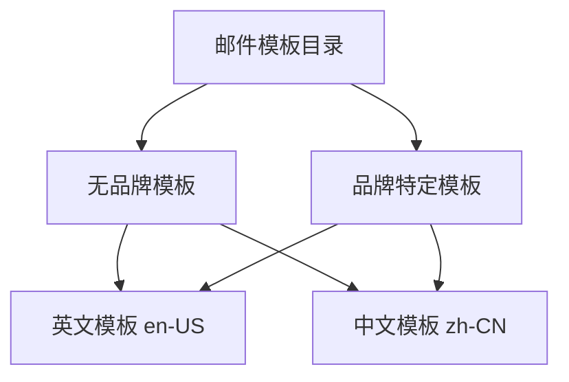
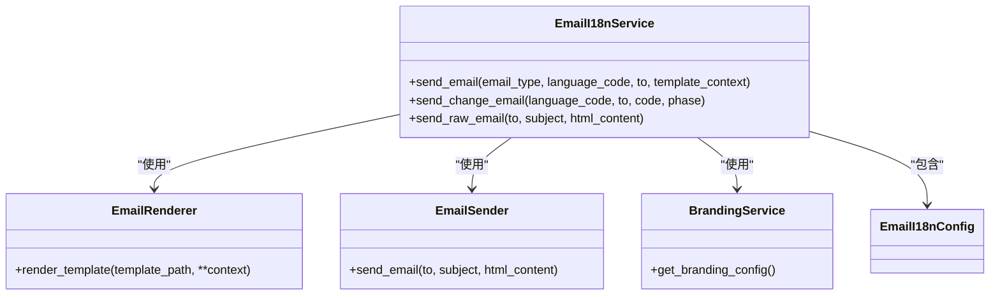
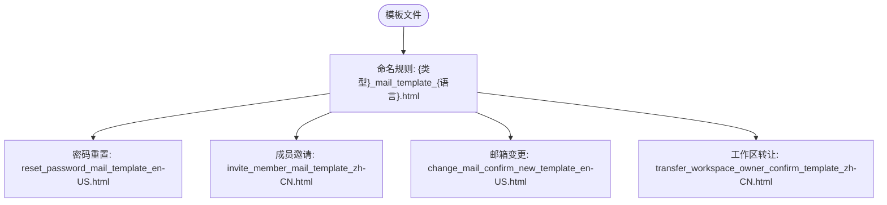
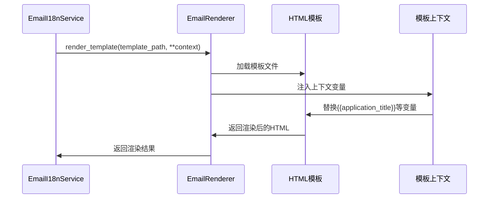
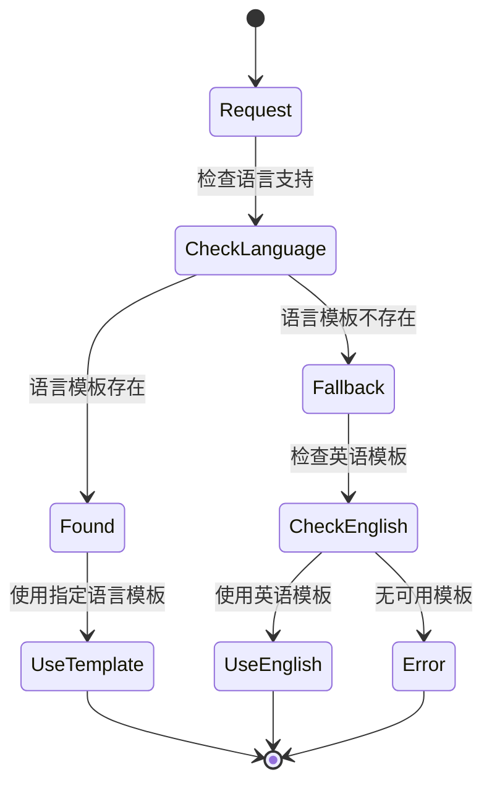
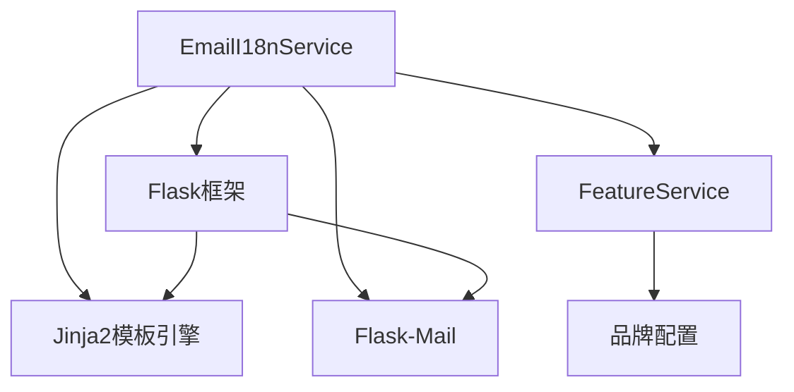

# 邮件模板管理

<cite>
**本文档引用文件**  
- [email_i18n.py](file://api/libs/email_i18n.py)
- [mail_inner_task.py](file://api/tasks/mail_inner_task.py)
- [reset_password_mail_template_en-US.html](file://api/templates/without-brand/reset_password_mail_template_en-US.html)
- [invite_member_mail_template_zh-CN.html](file://api/templates/without-brand/invite_member_mail_template_zh-CN.html)
</cite>

## 目录
1. [项目结构](#项目结构)
2. [核心组件](#核心组件)
3. [架构概述](#架构概述)
4. [详细组件分析](#详细组件分析)
5. [依赖分析](#依赖分析)
6. [性能考虑](#性能考虑)
7. [故障排除指南](#故障排除指南)
8. [结论](#结论)

## 项目结构

Dify的邮件模板系统采用结构化和国际化的组织方式，主要位于`api/templates`目录下。该系统支持多语言和品牌定制，通过Jinja2模板引擎实现动态内容渲染。

**Diagram sources**  
- [email_i18n.py](file://api/libs/email_i18n.py#L262-L293)
- [reset_password_mail_template_en-US.html](file://api/templates/without-brand/reset_password_mail_template_en-US.html)

**Section sources**
- [email_i18n.py](file://api/libs/email_i18n.py#L1-L474)
- [api/templates](file://api/templates)

## 核心组件

邮件模板管理系统的核心组件包括模板配置、渲染引擎、品牌服务和邮件发送器。系统通过`EmailI18nService`类协调这些组件，实现国际化的邮件发送功能。模板文件存储在`api/templates`目录中，支持动态变量注入和条件渲染。

**Section sources**
- [email_i18n.py](file://api/libs/email_i18n.py#L111-L156)
- [mail_inner_task.py](file://api/tasks/mail_inner_task.py#L0-L31)

## 架构概述

邮件模板系统采用分层架构设计，将模板管理、国际化处理、品牌定制和邮件发送功能分离。系统通过配置驱动的方式管理不同类型的邮件模板，支持灵活的扩展和定制。

**Diagram sources**  
- [email_i18n.py](file://api/libs/email_i18n.py#L111-L156)

## 详细组件分析

### 模板组织结构分析

邮件模板按照功能和语言进行组织，每个邮件类型都有对应的HTML模板文件。文件命名遵循统一的规范：`{邮件类型}_mail_template_{语言代码}.html`。

**Diagram sources**  
- [email_i18n.py](file://api/libs/email_i18n.py#L19-L35)
- [api/templates](file://api/templates)

### 变量替换机制分析

系统通过Jinja2模板引擎实现动态变量替换，支持在邮件模板中使用`{{variable}}`语法注入动态内容。模板上下文包含品牌信息、用户数据和操作链接等。

**Diagram sources**  
- [email_i18n.py](file://api/libs/email_i18n.py#L232-L265)
- [reset_password_mail_template_en-US.html](file://api/templates/without-brand/reset_password_mail_template_en-US.html)

### 多语言支持分析

系统通过`EmailLanguage`枚举和语言代码映射实现多语言支持。当特定语言的模板不存在时，系统会自动回退到英语模板。

**Diagram sources**  
- [email_i18n.py](file://api/libs/email_i18n.py#L77-L114)

## 依赖分析

邮件模板系统依赖于多个核心组件和服务，包括Flask框架、Jinja2模板引擎和邮件发送服务。

**Diagram sources**  
- [email_i18n.py](file://api/libs/email_i18n.py#L111-L156)
- [mail_inner_task.py](file://api/tasks/mail_inner_task.py#L0-L31)

## 性能考虑

邮件模板系统在设计时考虑了性能优化，通过单例模式缓存服务实例，避免重复创建和初始化开销。模板渲染使用Flask的内置渲染功能，确保高效执行。

## 故障排除指南

当邮件模板系统出现问题时，可以检查以下方面：
- 确认模板文件路径是否正确
- 验证模板变量是否在上下文中提供
- 检查品牌配置是否正确加载
- 确认邮件发送服务是否已初始化

**Section sources**
- [email_i18n.py](file://api/libs/email_i18n.py#L262-L293)
- [mail_inner_task.py](file://api/tasks/mail_inner_task.py#L0-L31)

## 结论

Dify的邮件模板管理系统提供了一套完整的解决方案，支持多语言、品牌定制和动态内容渲染。通过清晰的架构设计和模块化实现，系统具有良好的可维护性和扩展性，能够满足不同场景下的邮件通知需求。