# 扩展与集成

<cite>
**本文档中引用的文件**  
- [extension.py](file://api/core/extension/extension.py)
- [extensible.py](file://api/core/extension/extensible.py)
- [plugin_tool.py](file://api/core/tools/plugin_tool.py)
- [custom_tool.py](file://api/core/tools/custom_tool.py)
- [tool_manager.py](file://api/core/tools/tool_manager.py)
- [ext_mail.py](file://api/extensions/ext_mail.py)
- [aws_s3_storage.py](file://api/extensions/storage/aws_s3_storage.py)
- [azure_blob_storage.py](file://api/extensions/storage/azure_blob_storage.py)
- [smtp.py](file://api/libs/smtp.py)
- [sendgrid.py](file://api/libs/sendgrid.py)
- [oauth.py](file://api/libs/oauth.py)
- [client.py](file://sdks/python-client/dify_client/client.py)
- [index.js](file://sdks/nodejs-client/index.js)
- [dify-client.php](file://sdks/php-client/dify-client.php)
</cite>

## 目录
1. [简介](#简介)
2. [插件系统架构](#插件系统架构)
3. [自定义工具开发](#自定义工具开发)
4. [SDK使用指南](#sdk使用指南)
5. [外部服务集成](#外部服务集成)
6. [API集成最佳实践](#api集成最佳实践)
7. [结论](#结论)

## 简介
Dify平台提供了一套完整的扩展与集成机制，支持开发者通过插件系统、自定义工具和外部服务集成来增强平台功能。本文档详细介绍了Dify的插件开发流程、SDK使用方法以及与外部系统的集成方案。

## 插件系统架构

Dify的插件系统基于模块化设计，允许开发者创建可复用的功能组件。核心架构包括插件注册、加载和执行机制。

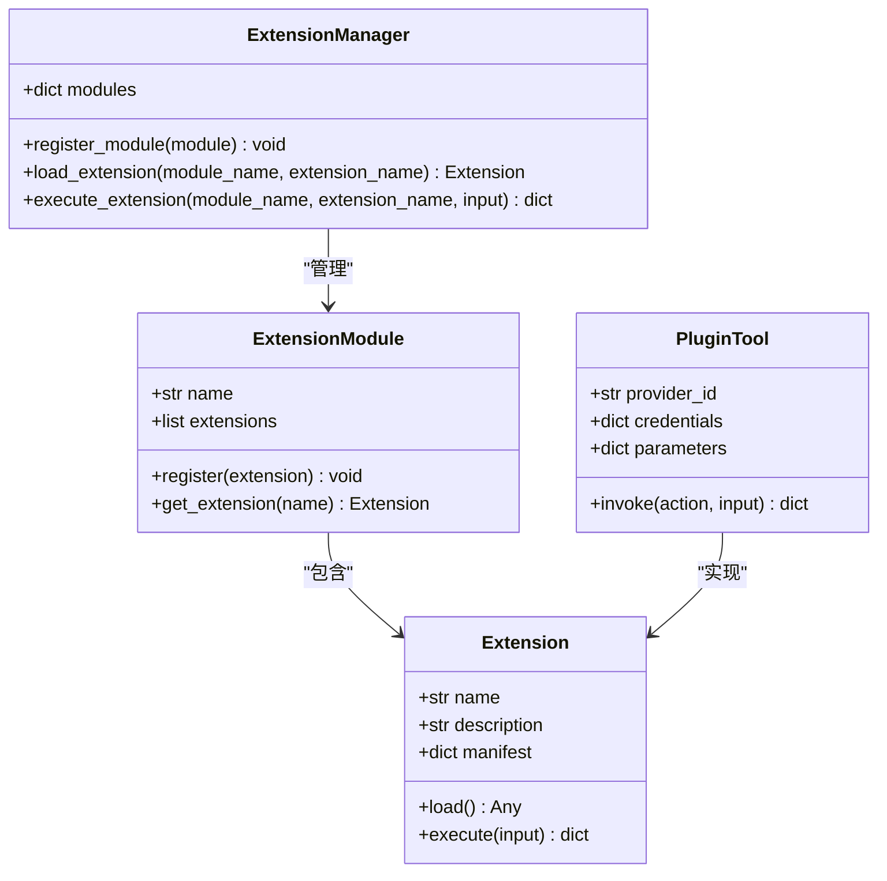

**Diagram sources**
- [extension.py](file://api/core/extension/extension.py)
- [plugin_tool.py](file://api/core/tools/plugin_tool.py)

**Section sources**
- [extension.py](file://api/core/extension/extension.py)
- [extensible.py](file://api/core/extension/extensible.py)

## 自定义工具开发

### 工具开发流程
Dify平台支持两种类型的自定义工具开发：基于代码的扩展和可视化工作流工具。开发者可以通过API定义工具接口，并在平台中注册使用。

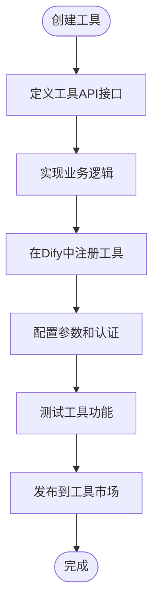

**Diagram sources**
- [custom_tool.py](file://api/core/tools/custom_tool.py)
- [tool_manager.py](file://api/core/tools/tool_manager.py)

**Section sources**
- [custom_tool.py](file://api/core/tools/custom_tool.py)
- [tool_manager.py](file://api/core/tools/tool_manager.py)

### 工具注册机制
工具注册通过平台提供的管理接口完成，需要提供工具的元数据、参数定义和执行逻辑。注册后的工具可以在工作流中被调用。

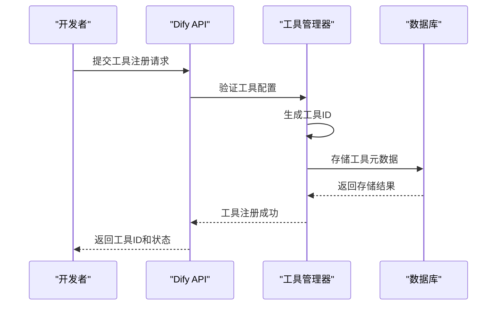

**Diagram sources**
- [tool_manager.py](file://api/core/tools/tool_manager.py)
- [models/tools.py](file://api/models/tools.py)

## SDK使用指南

### Python客户端
Python SDK提供了简洁的API接口，用于与Dify平台进行交互。支持应用管理、工作流执行和工具调用等功能。

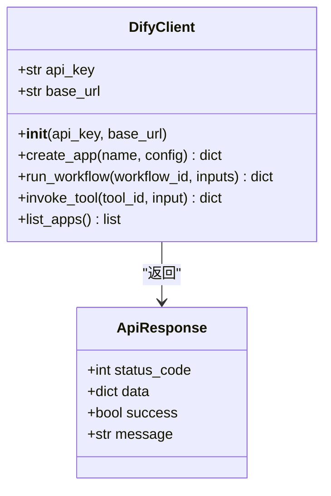

**Diagram sources**
- [client.py](file://sdks/python-client/dify_client/client.py)

**Section sources**
- [client.py](file://sdks/python-client/dify_client/client.py)

### Node.js客户端
Node.js SDK采用异步编程模型，提供Promise-based API，便于在JavaScript应用中集成Dify功能。

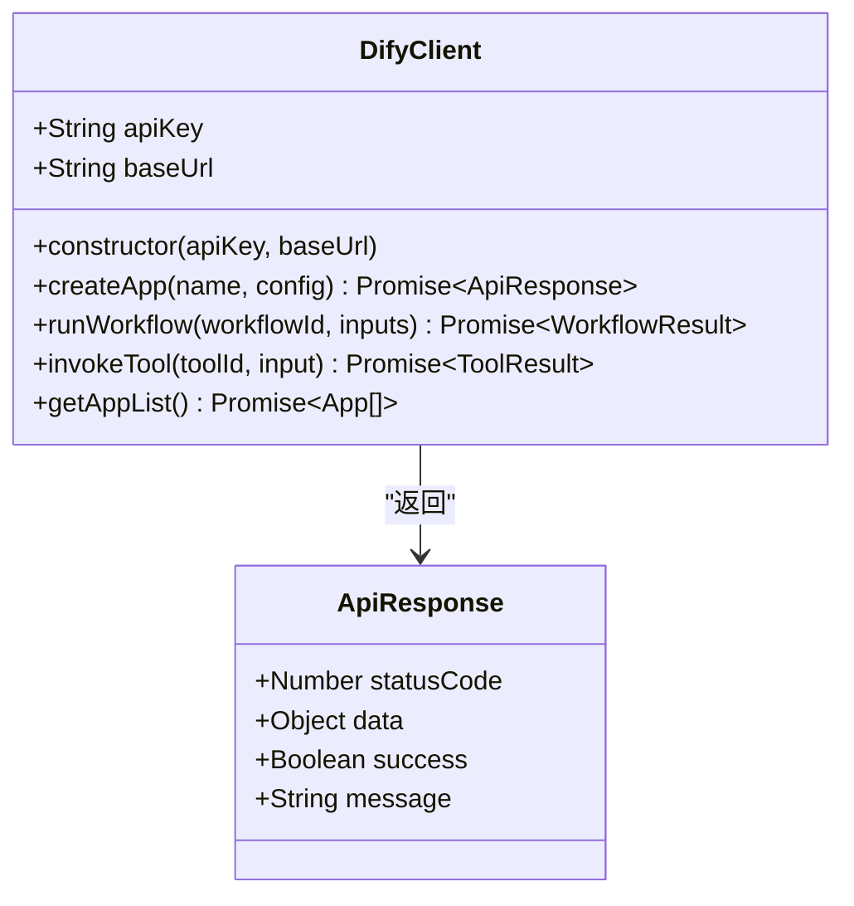

**Diagram sources**
- [index.js](file://sdks/nodejs-client/index.js)

**Section sources**
- [index.js](file://sdks/nodejs-client/index.js)

### PHP客户端
PHP SDK遵循PSR标准，提供面向对象的接口，支持Composer包管理，便于在PHP项目中集成。

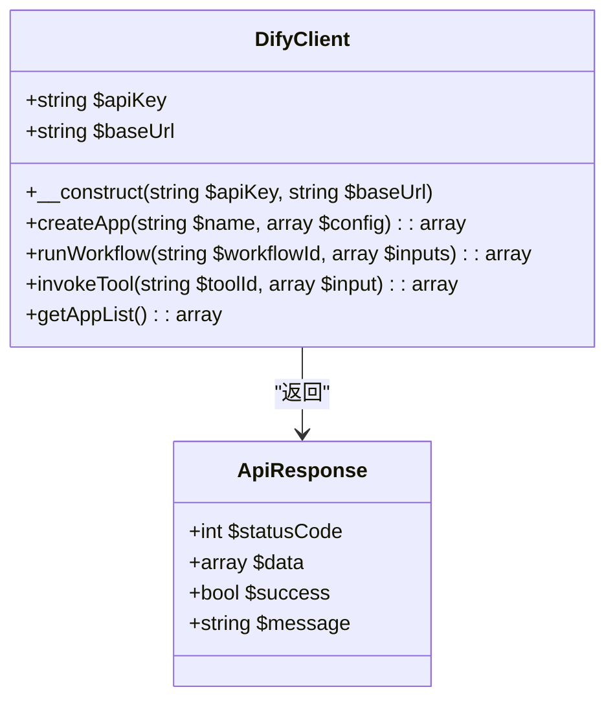

**Diagram sources**
- [dify-client.php](file://sdks/php-client/dify-client.php)

**Section sources**
- [dify-client.php](file://sdks/php-client/dify-client.php)

## 外部服务集成

### 认证系统集成
Dify支持OAuth 2.0协议，可与GitHub、Google等第三方认证服务集成，实现单点登录和用户身份验证。

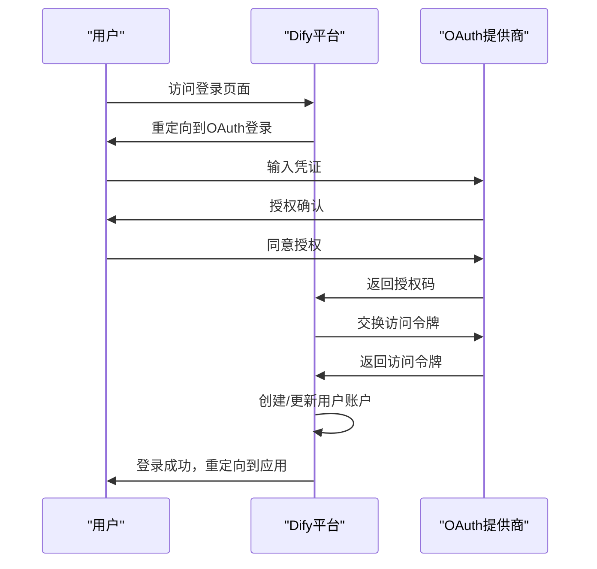

**Diagram sources**
- [oauth.py](file://api/libs/oauth.py)
- [auth/oauth.py](file://api/controllers/console/auth/oauth.py)

**Section sources**
- [oauth.py](file://api/libs/oauth.py)
- [auth/oauth.py](file://api/controllers/console/auth/oauth.py)

### 邮件服务集成
平台支持SMTP和SendGrid两种邮件服务，可用于发送通知、密码重置等系统邮件。

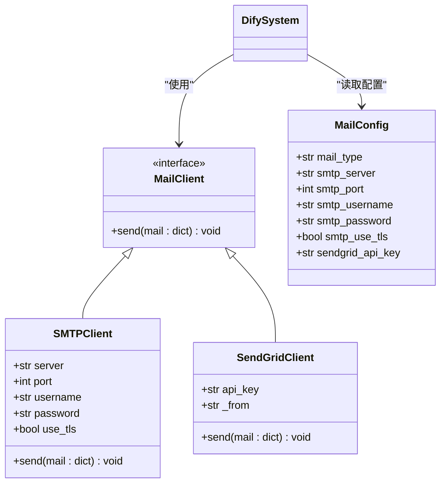

**Diagram sources**
- [ext_mail.py](file://api/extensions/ext_mail.py)
- [smtp.py](file://api/libs/smtp.py)
- [sendgrid.py](file://api/libs/sendgrid.py)

**Section sources**
- [ext_mail.py](file://api/extensions/ext_mail.py)
- [smtp.py](file://api/libs/smtp.py)
- [sendgrid.py](file://api/libs/sendgrid.py)

### 存储系统集成
Dify支持多种云存储服务，包括AWS S3、Azure Blob等，用于持久化存储文件和数据。

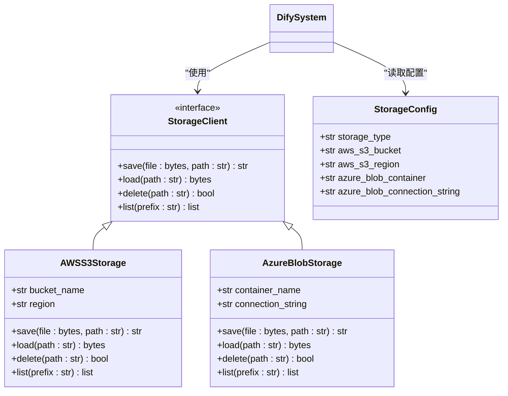

**Diagram sources**
- [aws_s3_storage.py](file://api/extensions/storage/aws_s3_storage.py)
- [azure_blob_storage.py](file://api/extensions/storage/azure_blob_storage.py)
- [storage_type.py](file://api/extensions/storage/storage_type.py)

**Section sources**
- [aws_s3_storage.py](file://api/extensions/storage/aws_s3_storage.py)
- [azure_blob_storage.py](file://api/extensions/storage/azure_blob_storage.py)

## API集成最佳实践

### 安全性
API集成应遵循最小权限原则，使用API密钥进行身份验证，并实施速率限制以防止滥用。

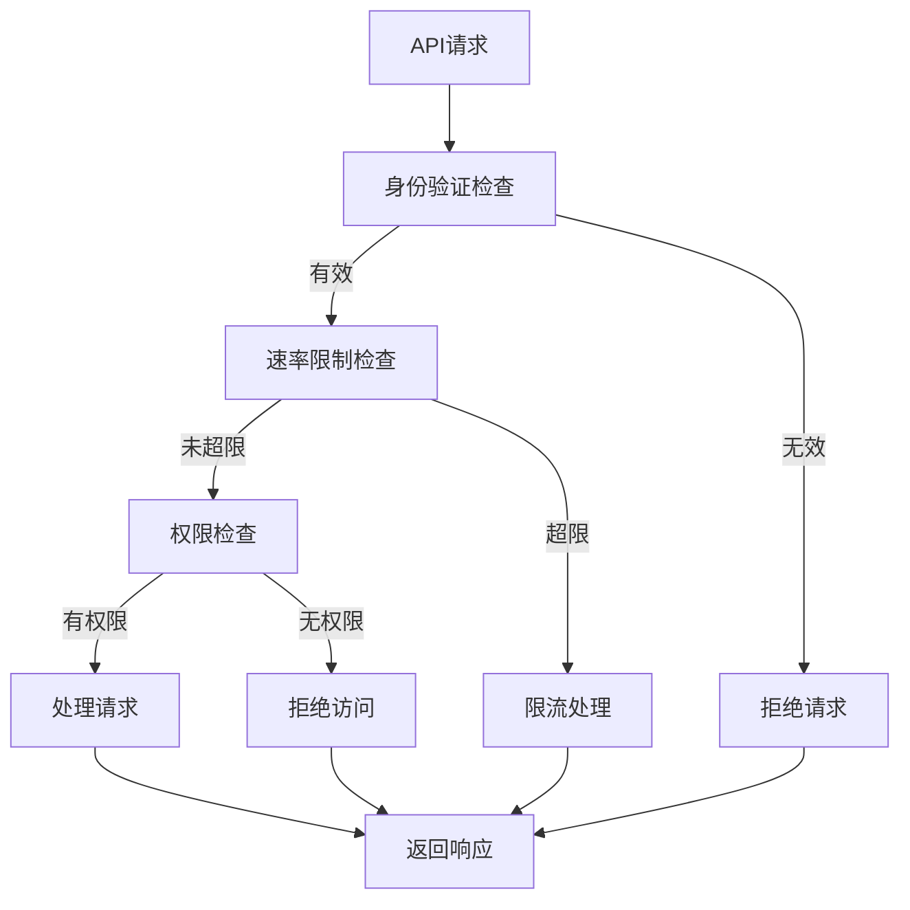

**Section sources**
- [controllers/console/apikey.py](file://api/controllers/console/apikey.py)
- [configs/middleware/cache.py](file://api/configs/middleware/cache.py)

### 错误处理
建立统一的错误处理机制，返回标准化的错误响应，便于客户端进行错误处理和用户提示。

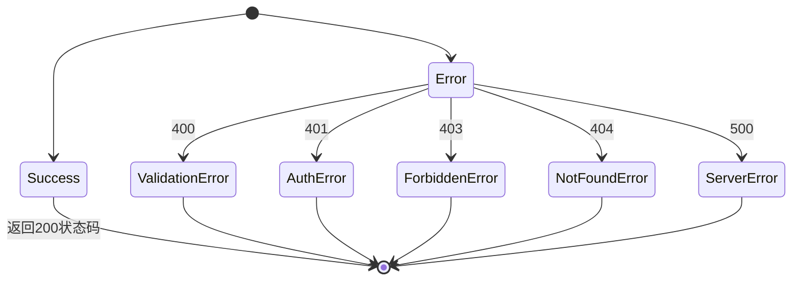

**Section sources**
- [controllers/common/errors.py](file://api/controllers/common/errors.py)
- [core/errors/error.py](file://api/core/errors/error.py)

### 性能优化
采用缓存、异步处理和批量操作等技术优化API性能，提高系统响应速度和吞吐量。

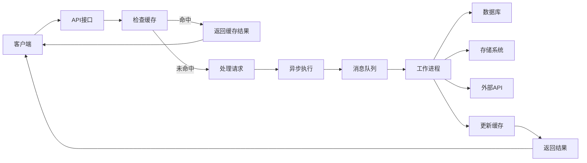

**Section sources**
- [tasks/](file://api/tasks/)
- [extensions/ext_redis.py](file://api/extensions/ext_redis.py)

## 结论
Dify平台提供了全面的扩展与集成能力，通过插件系统、SDK和外部服务集成，开发者可以灵活地扩展平台功能，满足各种业务需求。遵循最佳实践，可以确保集成的安全性、可靠性和高性能。