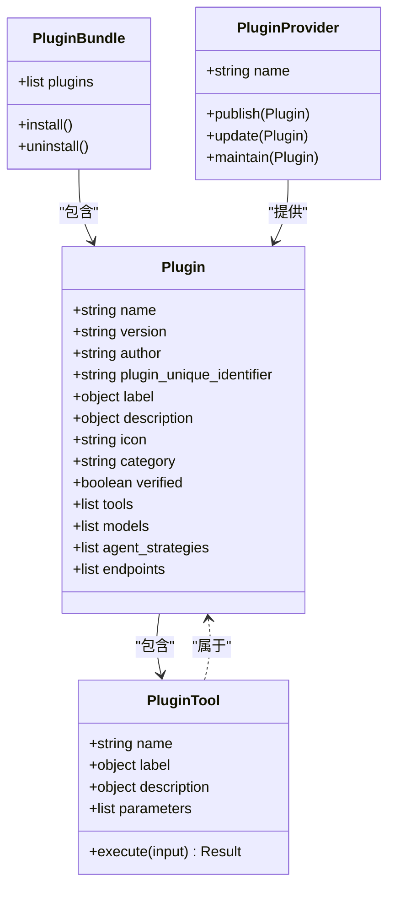

# 插件基础概念

<cite>
**本文档引用文件**  
- [plugin_asset_manager.py](file://api/core/tools/plugin_asset_manager.py)
- [plugin_entities.py](file://api/core/agent/plugin_entities.py)
- [plugin_tool.py](file://api/core/tools/plugin_tool.py)
- [plugin_declaration.py](file://api/core/tools/plugin_declaration.py)
- [manifest.yaml](file://plugins/sample/manifest.yaml)
- [plugin_manager.py](file://api/core/tools/plugin_manager.py)
- [plugin_service.py](file://api/services/plugin_service.py)
- [use-plugins.ts](file://web/service/use-plugins.ts)
- [types.ts](file://web/app/components/plugins/types.ts)
- [plugin-version-feature.ts](file://web/utils/plugin-version-feature.ts)
</cite>

## 目录
1. [引言](#引言)
2. [核心组成要素](#核心组成要素)
3. [元数据结构](#元数据结构)
4. [插件生命周期](#插件生命周期)
5. [manifest.yaml详解](#manifestyaml详解)
6. [关系与职责划分](#关系与职责划分)
7. [总结](#总结)

## 引言
Dify插件系统为平台提供了强大的扩展能力，允许开发者通过插件集成外部服务、工具和功能。本文档旨在全面解析Dify插件系统的基础概念，深入阐述插件的核心组成要素及其相互关系，详细说明插件的元数据定义、生命周期管理以及通过manifest.yaml文件声明能力的机制。

**Section sources**
- [plugin_service.py](file://api/services/plugin_service.py#L1-L20)
- [plugin_manager.py](file://api/core/tools/plugin_manager.py#L1-L15)

## 核心组成要素

### 插件（Plugin）
插件是Dify系统中可安装和管理的独立功能单元，代表一个具体的扩展能力。每个插件都有唯一的标识符（plugin_unique_identifier），包含元数据（如名称、描述、版本、作者）和功能声明。插件可以提供工具（Tool）、模型（Model）、代理策略（Agent Strategy）或端点（Endpoint）等能力。

### 插件包（Plugin Bundle）
插件包是包含一个或多个插件的分发单元，通常以压缩文件形式存在。插件包便于批量安装和管理相关插件。在工作流（Workflow）中引用未安装的插件时，系统会自动创建插件包依赖，提示用户安装所需插件。

### 插件提供者（Plugin Provider）
插件提供者是插件的发布者或维护者，通常对应一个组织或个人开发者。在元数据中通过`author`字段标识，如`dify`或`openai`。插件提供者负责插件的开发、版本更新和维护。

### 插件工具（Plugin Tool）
插件工具是插件提供的具体功能接口，允许工作流或应用调用插件的能力。每个插件可以声明一个或多个工具，每个工具都有独立的名称、描述和参数定义。工具通过标准化的接口与Dify系统集成。

**Section sources**
- [plugin_entities.py](file://api/core/agent/plugin_entities.py#L15-L45)
- [plugin_tool.py](file://api/core/tools/plugin_tool.py#L10-L35)
- [types.ts](file://web/app/components/plugins/types.ts#L20-L60)

## 元数据结构

插件的元数据定义了插件的基本信息和能力声明，主要字段包括：

| 字段 | 类型 | 说明 |
|------|------|------|
| name | string | 插件名称，唯一标识 |
| version | string | 插件版本号，遵循语义化版本规范 |
| author | string | 插件提供者名称 |
| label | object | 多语言显示名称 |
| description | object | 多语言描述信息 |
| icon | string | 图标文件路径或URL |
| category | string | 插件类别（tool, model等） |
| verified | boolean | 是否为官方验证插件 |
| plugin_unique_identifier | string | 插件全局唯一标识 |

**Section sources**
- [plugin_declaration.py](file://api/core/tools/plugin_declaration.py#L25-L80)
- [types.ts](file://web/app/components/plugins/types.ts#L5-L25)

## 插件生命周期

### 安装（Install）
用户通过市场或本地文件安装插件。系统验证插件包完整性，解析manifest.yaml，创建插件实例并存储元数据。

### 激活（Activate）
安装后插件处于激活状态，其声明的能力（如工具）可供工作流使用。系统加载插件代码并建立运行时环境。

### 配置（Configure）
部分插件需要配置认证信息或参数。用户通过界面设置API密钥、OAuth凭证等，配置信息安全存储。

### 使用（Use）
在工作流中调用插件工具，系统处理请求、执行插件逻辑并返回结果。插件作为工作流节点参与执行。

### 卸载（Uninstall）
移除插件及其所有配置。系统清理相关数据，工作流中引用该插件的节点将失效。

**Section sources**
- [plugin_manager.py](file://api/core/tools/plugin_manager.py#L50-L120)
- [plugin_service.py](file://api/services/plugin_service.py#L30-L75)

## manifest.yaml详解

`manifest.yaml`是插件的核心定义文件，采用YAML格式声明插件的所有信息和能力。

```yaml
name: "example-plugin"
version: "0.1.0"
author: "dify"
label:
  en-US: "Example Plugin"
  zh-CN: "示例插件"
description:
  en-US: "An example plugin for demonstration"
  zh-CN: "用于演示的示例插件"
icon: "icon.png"
category: "tool"
tool:
  - name: "example_tool"
    label:
      en-US: "Example Tool"
      zh-CN: "示例工具"
    description:
      en-US: "An example tool"
      zh-CN: "示例工具"
    parameters:
      - name: "input"
        type: "string"
        required: true
```

该文件定义了插件的元数据和工具接口，系统通过解析此文件了解插件的能力和使用方式。

**Diagram sources**
- [manifest.yaml](file://plugins/sample/manifest.yaml#L1-L25)

**Section sources**
- [plugin_asset_manager.py](file://api/core/tools/plugin_asset_manager.py#L15-L40)
- [plugin_declaration.py](file://api/core/tools/plugin_declaration.py#L10-L50)

## 关系与职责划分



**Diagram sources**
- [plugin_entities.py](file://api/core/agent/plugin_entities.py#L10-L50)
- [plugin_tool.py](file://api/core/tools/plugin_tool.py#L5-L25)

**Section sources**
- [plugin_entities.py](file://api/core/agent/plugin_entities.py#L1-L60)
- [plugin_tool.py](file://api/core/tools/plugin_tool.py#L1-L40)

## 总结
Dify插件系统通过清晰的分层设计和标准化的接口定义，实现了功能的灵活扩展。理解插件、插件包、插件提供者和插件工具之间的关系，掌握元数据结构和生命周期管理，是开发和使用Dify插件的基础。manifest.yaml文件作为插件的"身份证"，完整描述了插件的能力和使用方式，是插件系统的核心。

**Section sources**
- [plugin_service.py](file://api/services/plugin_service.py#L1-L100)
- [plugin_manager.py](file://api/core/tools/plugin_manager.py#L1-L100)