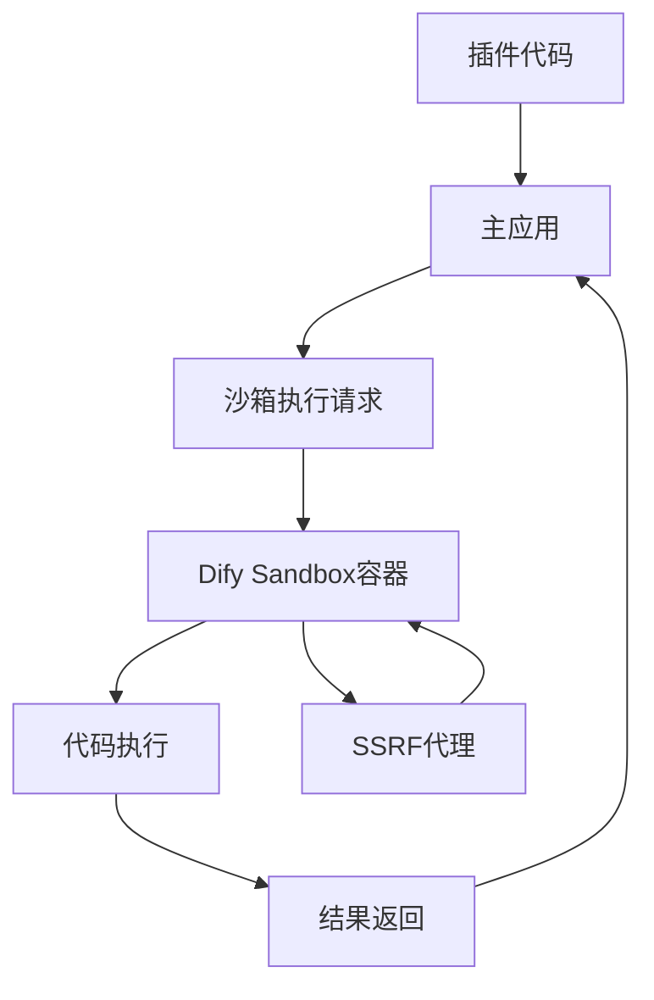
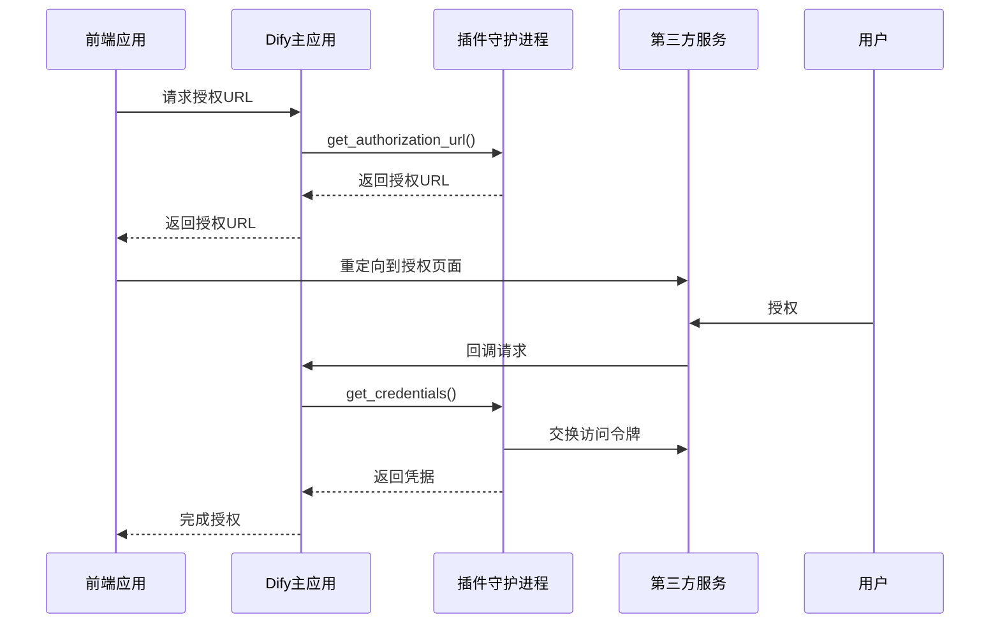
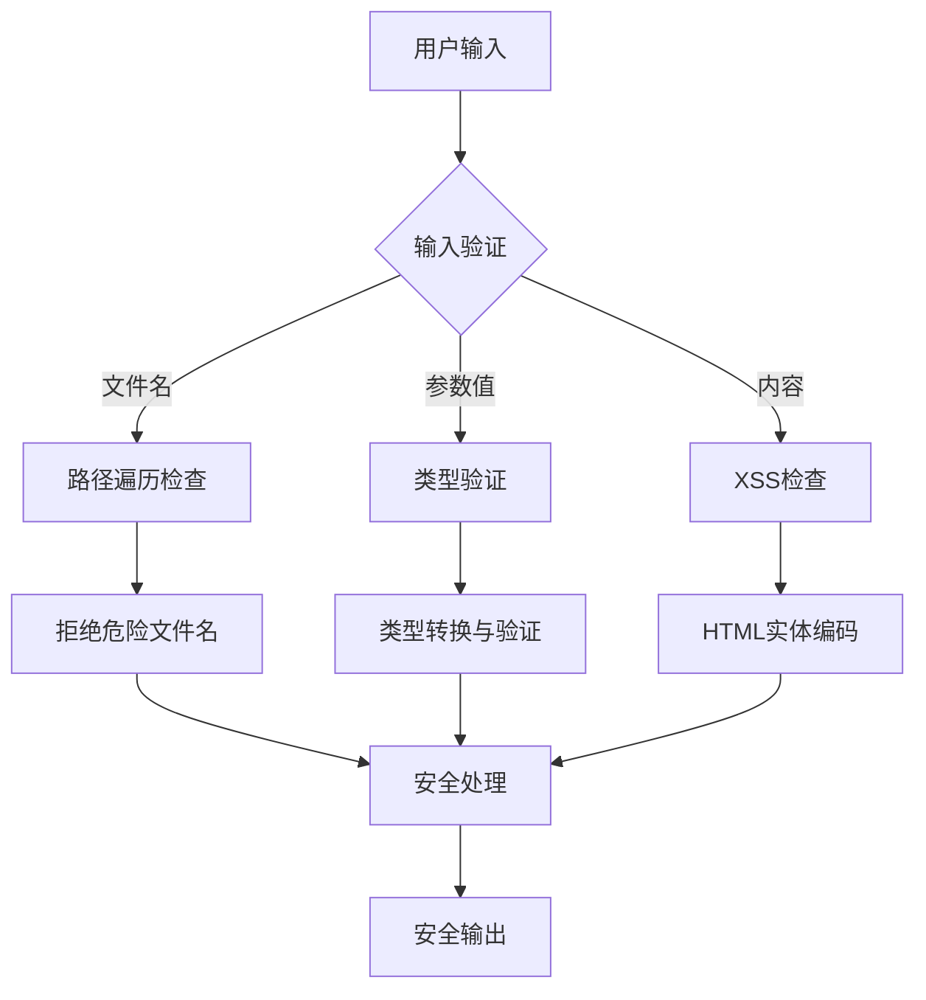

# 插件安全机制

<cite>
**本文档引用文件**  
- [code_executor.py](file://api/core/helper/code_executor/code_executor.py)
- [oauth.py](file://api/core/plugin/impl/oauth.py)
- [parameters.py](file://api/core/plugin/entities/parameters.py)
- [test_files_security.py](file://api/tests/unit_tests/controllers/console/test_files_security.py)
- [docker-compose.yaml](file://docker/docker-compose.yaml)
- [conftest.py](file://api/tests/test_containers_integration_tests/conftest.py)
</cite>

## 目录
1. [引言](#引言)
2. [代码沙箱执行环境](#代码沙箱执行环境)
3. [OAuth 2.0 集成流程](#oauth-20-集成流程)
4. [插件间通信安全策略](#插件间通信安全策略)
5. [输入输出数据验证与过滤](#输入输出数据验证与过滤)
6. [开发者安全准则与检查清单](#开发者安全准则与检查清单)

## 引言
Dify平台为保障插件系统的安全性，构建了多层次的安全防护体系。本文档全面阐述平台在插件安全方面的技术措施，涵盖代码执行隔离、身份认证、数据验证等关键领域，为开发者提供安全开发指导。

## 代码沙箱执行环境

Dify平台通过独立的沙箱环境执行插件代码，确保用户代码在隔离的安全环境中运行。沙箱由独立的Docker容器`langgenius/dify-sandbox:latest`提供，通过HTTP接口与主应用通信。

### 可导入模块限制
沙箱环境对可导入的模块进行了严格限制，仅允许执行预定义的安全代码。代码执行通过`CodeExecutor`类实现，支持Python3、Jinja2和JavaScript三种语言。其中Python3是唯一支持依赖管理的语言。

### 网络访问控制
尽管代码执行请求中设置了`enable_network: True`，但沙箱容器通过Docker网络策略进行隔离，实际网络访问受到严格控制。所有外部请求必须通过平台的SSRF代理服务，防止服务器端请求伪造攻击。

### 资源消耗限制
沙箱环境通过以下机制限制资源消耗：
- 执行超时：通过`PLUGIN_MAX_EXECUTION_TIMEOUT`环境变量设置，默认600秒
- 内存限制：由Docker容器配置强制执行
- 初始化超时：通过`PYTHON_ENV_INIT_TIMEOUT`设置Python环境初始化超时，默认120秒
- 代码包大小限制：通过`MAX_PLUGIN_PACKAGE_SIZE`限制插件包大小，默认50MB

**Diagram sources**
- [code_executor.py](file://api/core/helper/code_executor/code_executor.py#L43-L83)
- [docker-compose.yaml](file://docker/docker-compose.yaml#L752-L778)
- [conftest.py](file://api/tests/test_containers_integration_tests/conftest.py#L154-L176)

**Section sources**
- [code_executor.py](file://api/core/helper/code_executor/code_executor.py#L43-L83)
- [docker-compose.yaml](file://docker/docker-compose.yaml#L752-L778)

## OAuth 2.0 集成流程

Dify平台实现了标准化的OAuth 2.0集成流程，确保第三方服务访问令牌的安全获取和存储。

### 授权URL获取
当插件需要OAuth授权时，前端通过`get_authorization_url`接口获取授权URL。该请求包含租户ID、用户ID、插件ID、提供者名称和重定向URI等信息。

### 凭据获取与存储
用户完成授权后，回调请求通过`get_credentials`接口处理。平台将原始HTTP请求转换为字节数据并发送到插件守护进程，确保请求完整性。获取的访问令牌由插件守护进程安全存储，主应用仅持有引用。

### 凭据刷新
当访问令牌过期时，通过`refresh_credentials`接口自动刷新。刷新过程同样通过插件守护进程完成，确保刷新令牌的安全性。

**Diagram sources**
- [oauth.py](file://api/core/plugin/impl/oauth.py#L36-L106)
- [add-oauth-button.tsx](file://web/app/components/plugins/plugin-auth/authorize/add-oauth-button.tsx#L221-L258)

**Section sources**
- [oauth.py](file://api/core/plugin/impl/oauth.py#L36-L106)
- [tool_providers.py](file://api/controllers/console/workspace/tool_providers.py#L701-L738)

## 插件间通信安全策略

Dify平台通过严格的依赖管理和上下文隔离机制，防止插件间的数据泄露。

### 依赖隔离
每个插件在独立的执行环境中运行，通过`plugin_daemon`容器管理生命周期。插件间的依赖关系通过显式声明的方式管理，避免隐式数据共享。

### 上下文安全
插件执行上下文通过`context_id`进行隔离，该ID通过HttpOnly、SameSite=Lax的Cookie传输，防止跨站脚本攻击。每个上下文与特定的用户和租户绑定，确保数据隔离。

### 通信验证
插件间的所有通信都通过插件守护进程进行中转和验证。请求头中包含`X-Plugin-ID`标识，确保请求来源的合法性。

**Section sources**
- [plugin_daemon](file://docker/docker-compose.yaml#L169-L196)
- [oauth.py](file://api/core/plugin/impl/oauth.py#L36-L106)

## 输入输出数据验证与过滤

Dify平台实施严格的输入输出数据验证机制，防止各类注入攻击。

### 文件名安全验证
系统对文件名进行多重安全检查：
- 路径遍历检测：禁止包含`..`的文件名
- 空字节注入检测：禁止包含`\x00`的文件名
- 特殊字符过滤：对`/`, `\`, `:`, `*`, `?`, `"`, `<`, `>`, `|`等危险字符进行检测

### 数据类型验证
通过`cast_parameter_value`函数对参数值进行类型安全转换：
- 字符串类型：确保值为字符串
- 布尔类型：支持多种格式的布尔值解析
- 数字类型：支持整数和浮点数解析
- 数组/对象类型：支持JSON字符串解析

### XSS防护
前端组件通过安全的React渲染机制防止跨站脚本攻击，避免使用`dangerouslySetInnerHTML`，确保用户输入的内容不会作为可执行脚本渲染。

**Diagram sources**
- [test_files_security.py](file://api/tests/unit_tests/controllers/console/test_files_security.py#L68-L100)
- [parameters.py](file://api/core/plugin/entities/parameters.py#L75-L113)

**Section sources**
- [test_files_security.py](file://api/tests/unit_tests/controllers/console/test_files_security.py#L68-L100)
- [xss-prevention.test.tsx](file://web/__tests__/xss-prevention.test.tsx#L0-L35)

## 开发者安全准则与检查清单

### 安全开发准则
1. **最小权限原则**：插件应仅请求必要的权限和访问范围
2. **输入验证**：所有用户输入必须进行严格验证和过滤
3. **错误处理**：避免在错误消息中泄露敏感信息
4. **依赖管理**：仅使用可信的第三方库，并保持更新
5. **日志安全**：避免在日志中记录敏感数据

### 安全检查清单
- [ ] 插件代码是否在沙箱环境中测试过？
- [ ] 是否验证了所有用户输入的类型和格式？
- [ ] 是否处理了文件上传的安全风险？
- [ ] OAuth凭据是否通过平台机制安全存储？
- [ ] 是否避免了敏感信息的明文存储？
- [ ] 是否实现了适当的错误处理和日志记录？
- [ ] 是否测试了插件在资源限制下的行为？

**Section sources**
- [code_executor.py](file://api/core/helper/code_executor/code_executor.py#L43-L83)
- [oauth.py](file://api/core/plugin/impl/oauth.py#L36-L106)
- [parameters.py](file://api/core/plugin/entities/parameters.py#L75-L113)