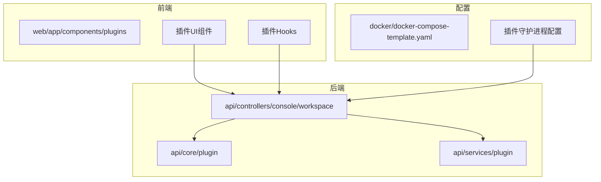
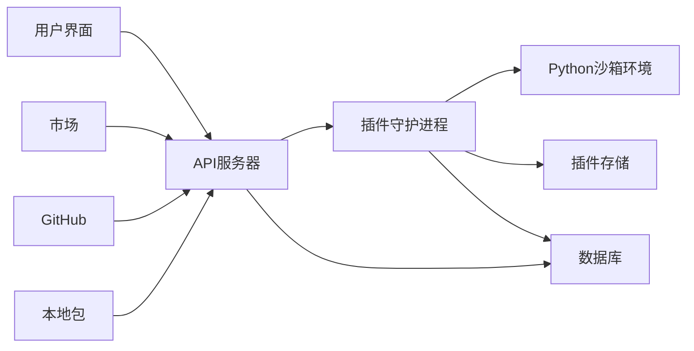
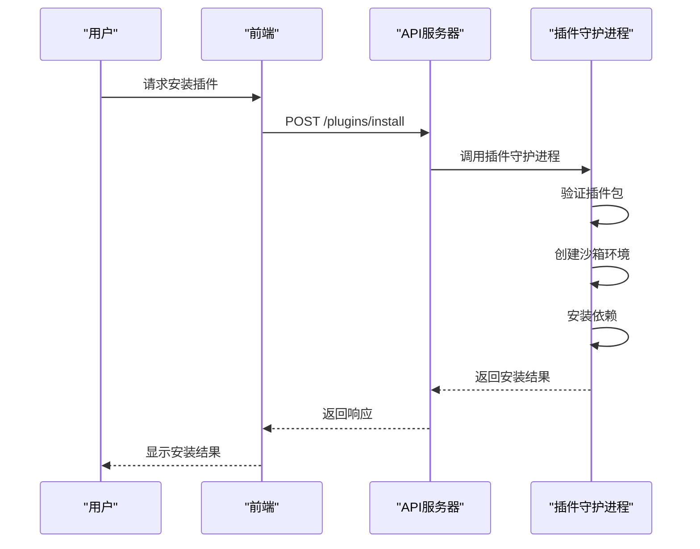
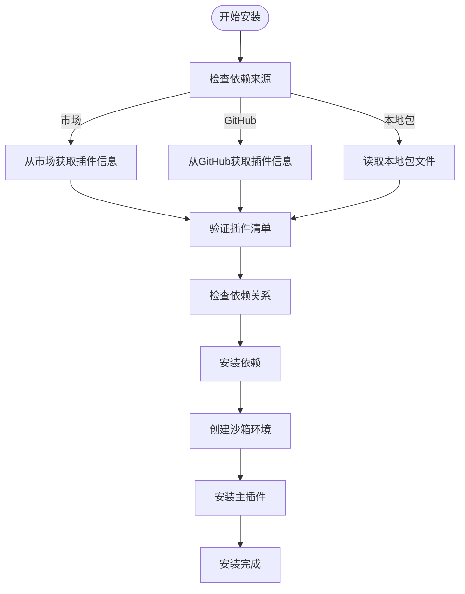
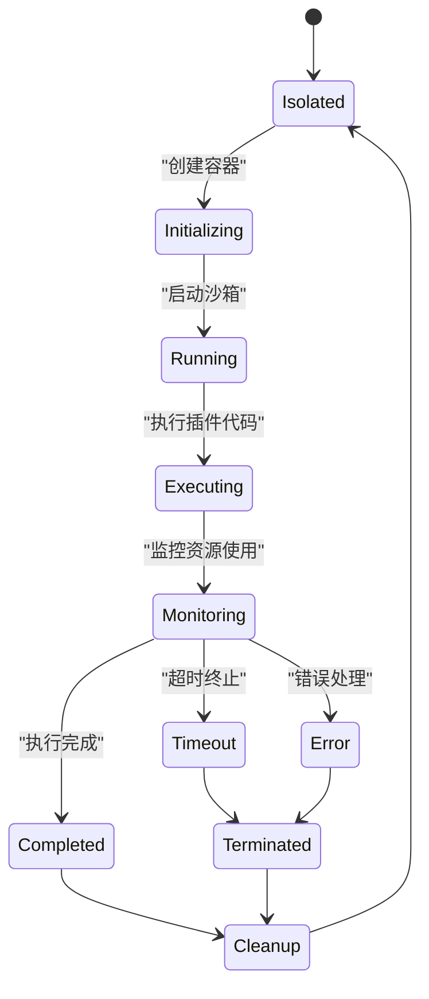
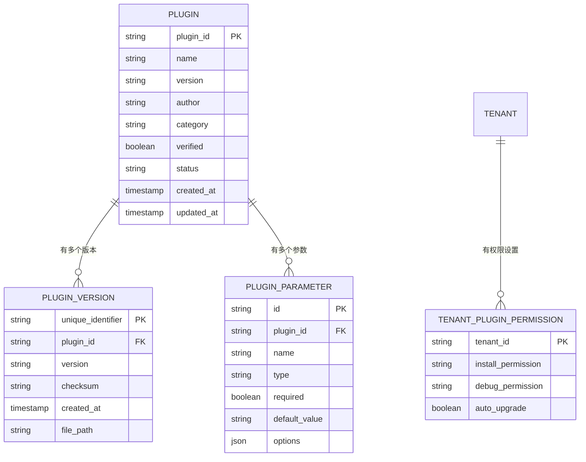

# 插件开发

<cite>
**本文档中引用的文件**   
- [plugin.py](file://api/controllers/console/workspace/plugin.py)
- [bundle.py](file://api/core/plugin/entities/bundle.py)
- [parameters.py](file://api/core/plugin/entities/parameters.py)
- [plugin_auth.py](file://web/app/components/plugins/plugin-auth/index.tsx)
- [install_plugin_limit.tsx](file://web/app/components/plugins/install-plugin/hooks/use-install-plugin-limit.tsx)
- [plugin_version_feature.ts](file://web/utils/plugin-version-feature.spec.ts)
- [docker-compose-template.yaml](file://docker/docker-compose-template.yaml)
</cite>

## 目录
1. [简介](#简介)
2. [项目结构](#项目结构)
3. [核心组件](#核心组件)
4. [架构概述](#架构概述)
5. [详细组件分析](#详细组件分析)
6. [依赖分析](#依赖分析)
7. [性能考虑](#性能考虑)
8. [故障排除指南](#故障排除指南)
9. [结论](#结论)

## 简介
Dify插件系统为开发者提供了扩展平台功能的强大机制。该系统支持自定义插件的创建、管理和集成，允许通过安全沙箱环境执行第三方代码。文档将深入探讨插件架构设计、生命周期管理、依赖注入机制和安全控制策略。

## 项目结构
Dify插件系统的实现分布在多个关键目录中，主要包括API后端服务、前端组件和配置文件。系统采用分层架构，前后端分离设计，确保插件功能的可维护性和可扩展性。



**Diagram sources**
- [plugin.py](file://api/controllers/console/workspace/plugin.py)
- [docker-compose-template.yaml](file://docker/docker-compose-template.yaml)

**Section sources**
- [plugin.py](file://api/controllers/console/workspace/plugin.py)
- [docker-compose-template.yaml](file://docker/docker-compose-template.yaml)

## 核心组件
Dify插件系统的核心组件包括插件管理API、插件实体定义、参数处理机制和权限控制系统。这些组件共同协作，实现插件的全生命周期管理。

**Section sources**
- [bundle.py](file://api/core/plugin/entities/bundle.py)
- [parameters.py](file://api/core/plugin/entities/parameters.py)

## 架构概述
Dify插件系统采用微服务架构，通过独立的插件守护进程（plugin_daemon）处理插件的安装、执行和管理。系统实现了安全沙箱环境，确保插件代码在隔离环境中运行。



**Diagram sources**
- [docker-compose-template.yaml](file://docker/docker-compose-template.yaml)
- [plugin.py](file://api/controllers/console/workspace/plugin.py)

## 详细组件分析

### 插件架构设计分析
Dify插件系统的设计重点在于安全性、灵活性和可扩展性。系统通过定义清晰的插件元数据结构和接口规范，确保插件的一致性和互操作性。

```mermaid
classDiagram
class PluginDeclaration {
+string plugin_unique_identifier
+string version
+string author
+string icon
+string name
+string category
+map~string, string~ label
+map~string, string~ description
+boolean verified
+PluginEndpointDeclaration endpoint
+PluginToolDeclaration tool
+PluginDeclarationMeta meta
}
class PluginManifestInMarket {
+string plugin_unique_identifier
+string name
+string org
+string icon
+map~string, string~ label
+string category
+string version
+string latest_version
+map~string, string~ brief
+string introduction
+boolean verified
+int install_count
+Verification verification
}
class PluginBundleDependency {
+enum Type {Github, Marketplace, Package}
+Github github
+Marketplace marketplace
+Package package
+Type type
+object value
}
PluginDeclaration --> PluginBundleDependency : "包含"
PluginManifestInMarket --> PluginDeclaration : "扩展"
```

**Diagram sources**
- [bundle.py](file://api/core/plugin/entities/bundle.py)
- [parameters.py](file://api/core/plugin/entities/parameters.py)

### 插件生命周期管理
插件生命周期包括安装、启用、禁用、更新和卸载等阶段。系统通过REST API提供完整的生命周期管理功能。



**Diagram sources**
- [plugin.py](file://api/controllers/console/workspace/plugin.py)
- [docker-compose-template.yaml](file://docker/docker-compose-template.yaml)

### 依赖注入机制
Dify插件系统实现了灵活的依赖注入机制，支持从不同来源（市场、GitHub、本地包）安装插件及其依赖。



**Diagram sources**
- [bundle.py](file://api/core/plugin/entities/bundle.py)
- [plugin.py](file://api/controllers/console/workspace/plugin.py)

### 安全沙箱环境
插件在独立的Python沙箱环境中运行，确保系统安全。沙箱环境限制了插件的系统访问权限，并监控其资源使用。



**Diagram sources**
- [docker-compose-template.yaml](file://docker/docker-compose-template.yaml)
- [parameters.py](file://api/core/plugin/entities/parameters.py)

## 依赖分析
Dify插件系统依赖于多个核心组件和服务，包括插件守护进程、数据库、存储系统和外部API。



**Diagram sources**
- [plugin.py](file://api/controllers/console/workspace/plugin.py)
- [parameters.py](file://api/core/plugin/entities/parameters.py)

## 性能考虑
插件系统的性能主要受沙箱环境启动时间、依赖安装速度和资源限制的影响。系统通过缓存机制和并行处理优化性能。

## 故障排除指南
常见问题包括插件安装失败、依赖解析错误和权限不足。系统提供了详细的错误日志和调试工具帮助诊断问题。

**Section sources**
- [plugin.py](file://api/controllers/console/workspace/plugin.py)
- [errors.py](file://api/services/errors/plugin.py)

## 结论
Dify插件系统提供了一套完整的插件开发和管理解决方案，通过安全的沙箱环境、灵活的依赖管理和精细的权限控制，确保了系统的稳定性和安全性。