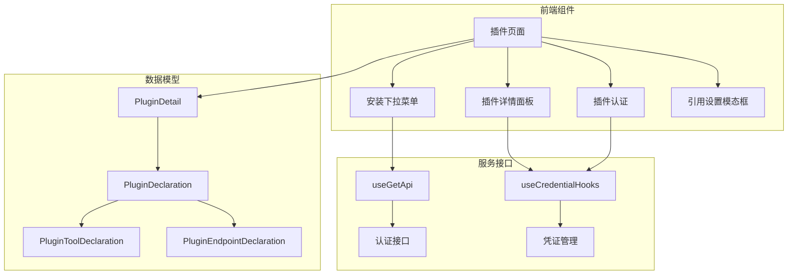
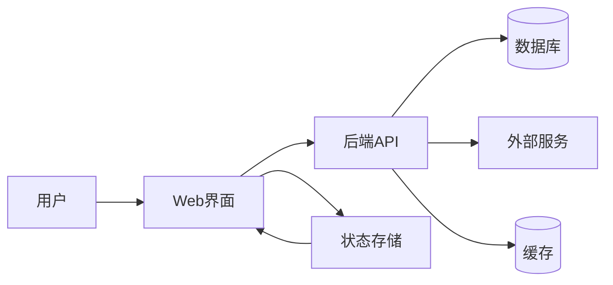
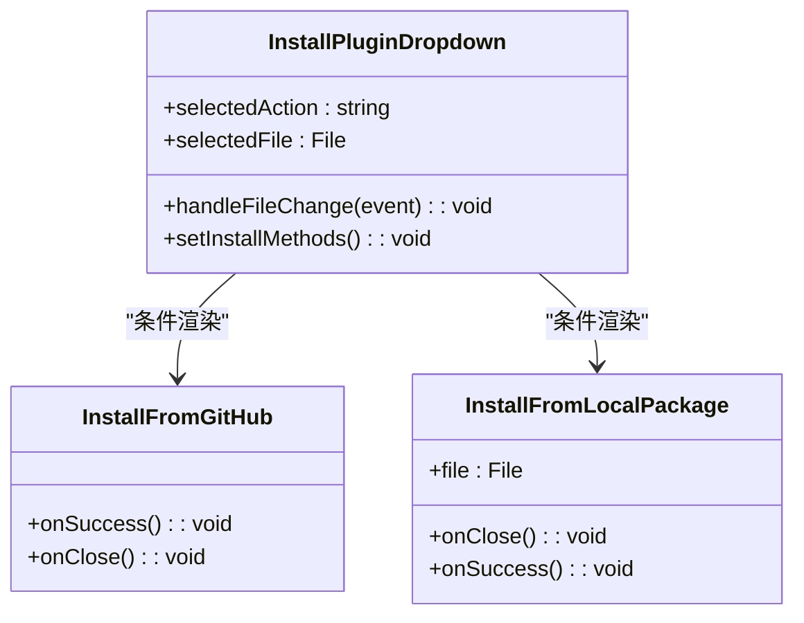
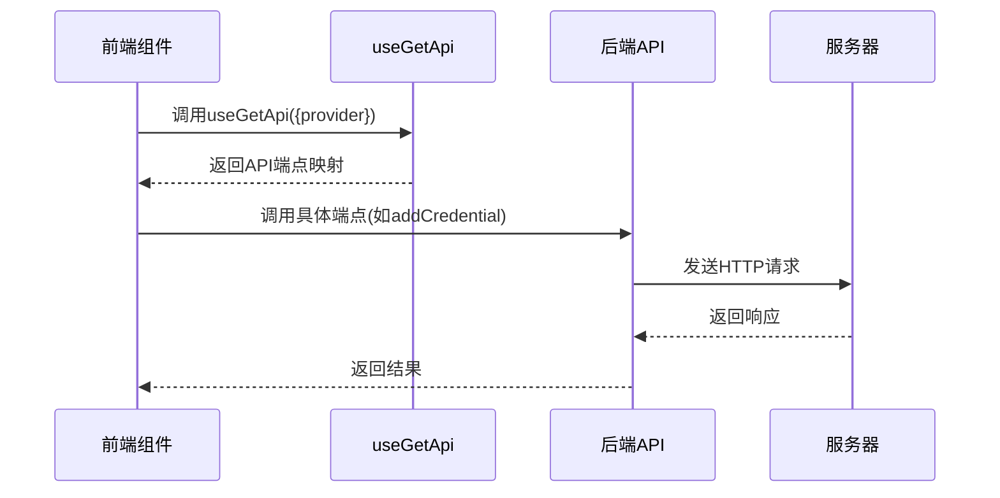
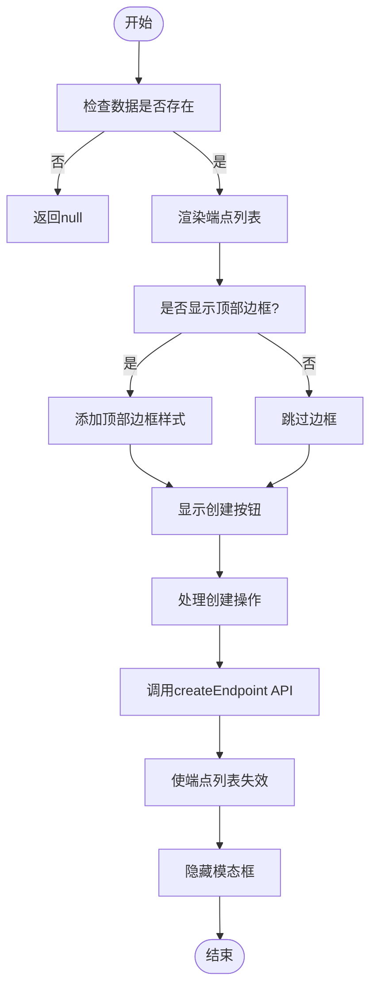
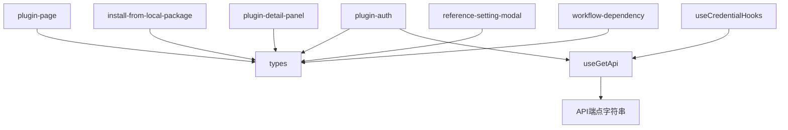

# 插件开发指南

<cite>
**本文档中引用的文件**
- [plugin-page/install-plugin-dropdown.tsx](file://web/app/components/plugins/plugin-page/install-plugin-dropdown.tsx)
- [types.ts](file://web/app/components/plugins/types.ts)
- [install-from-local-package/ready-to-install.tsx](file://web/app/components/plugins/install-plugin/install-from-local-package/ready-to-install.tsx)
- [plugin-detail-panel/endpoint-list.tsx](file://web/app/components/plugins/plugin-detail-panel/endpoint-list.tsx)
- [plugin-auth/hooks/use-get-api.ts](file://web/app/components/plugins/plugin-auth/hooks/use-get-api.ts)
- [plugin-auth/hooks/use-credential.ts](file://web/app/components/plugins/plugin-auth/hooks/use-credential.ts)
- [reference-setting-modal/auto-update-setting/tool-item.tsx](file://web/app/components/plugins/reference-setting-modal/auto-update-setting/tool-item.tsx)
- [workflow/plugin-dependency/index.tsx](file://web/app/components/workflow/plugin-dependency/index.tsx)
- [utils/plugin-version-feature.spec.ts](file://web/utils/plugin-version-feature.spec.ts)
</cite>

## 目录
1. [简介](#简介)
2. [项目结构](#项目结构)
3. [核心组件](#核心组件)
4. [架构概述](#架构概述)
5. [详细组件分析](#详细组件分析)
6. [依赖分析](#依赖分析)
7. [性能考虑](#性能考虑)
8. [故障排除指南](#故障排除指南)
9. [结论](#结论)
10. [附录](#附录)（如有必要）

## 简介
本指南旨在为开发者提供从零开始创建Dify插件的完整分步教程。涵盖开发环境搭建、项目结构创建、核心逻辑编写、工具接口实现、输入参数处理、外部API调用及结构化结果返回等关键环节。通过具体示例展示如何使用Python开发天气查询或数据库查询插件，并介绍异步任务处理、错误捕获和日志记录的最佳实践。

## 项目结构
Dify插件开发主要涉及前端组件与后端服务的协同工作。插件功能通过Web界面进行管理，包括安装、配置和调用。核心逻辑位于`web/app/components/plugins`目录下，包含插件安装、认证、配置和依赖管理等功能模块。

**Diagram sources**
- [plugin-page/install-plugin-dropdown.tsx](file://web/app/components/plugins/plugin-page/install-plugin-dropdown.tsx)
- [types.ts](file://web/app/components/plugins/types.ts)
- [plugin-auth/hooks/use-get-api.ts](file://web/app/components/plugins/plugin-auth/hooks/use-get-api.ts)
- [plugin-auth/hooks/use-credential.ts](file://web/app/components/plugins/plugin-auth/hooks/use-credential.ts)

**Section sources**
- [plugin-page/install-plugin-dropdown.tsx](file://web/app/components/plugins/plugin-page/install-plugin-dropdown.tsx)
- [types.ts](file://web/app/components/plugins/types.ts)

## 核心组件
Dify插件系统的核心组件包括插件声明模型、安装机制、认证系统和端点管理。`PluginDeclaration`定义了插件的基本信息、工具能力、凭证架构和端点配置。安装流程支持从市场、GitHub或本地包三种来源进行插件部署。

**Section sources**
- [types.ts](file://web/app/components/plugins/types.ts)
- [install-from-local-package/ready-to-install.tsx](file://web/app/components/plugins/install-plugin/install-from-local-package/ready-to-install.tsx)

## 架构概述
Dify插件架构采用前后端分离设计，前端负责用户交互和状态管理，后端提供RESTful API接口处理业务逻辑。插件通过标准化的声明文件定义其功能和配置要求，系统根据这些元数据动态生成配置界面并管理插件生命周期。

**Diagram sources**
- [plugin-page/install-plugin-dropdown.tsx](file://web/app/components/plugins/plugin-page/install-plugin-dropdown.tsx)
- [plugin-auth/hooks/use-get-api.ts](file://web/app/components/plugins/plugin-auth/hooks/use-get-api.ts)

## 详细组件分析

### 插件安装机制分析
插件安装功能允许用户从不同来源安装插件，包括市场、GitHub仓库或本地ZIP包。系统通过`InstallPluginDropdown`组件提供选择界面，并根据用户选择触发相应的安装流程。

#### 对于UI组件：

**Diagram sources**
- [plugin-page/install-plugin-dropdown.tsx](file://web/app/components/plugins/plugin-page/install-plugin-dropdown.tsx)
- [install-from-local-package/ready-to-install.tsx](file://web/app/components/plugins/install-plugin/install-from-local-package/ready-to-install.tsx)

**Section sources**
- [plugin-page/install-plugin-dropdown.tsx](file://web/app/components/plugins/plugin-page/install-plugin-dropdown.tsx)
- [install-from-local-package/ready-to-install.tsx](file://web/app/components/plugins/install-plugin/install-from-local-package/ready-to-install.tsx)

### 插件认证系统分析
插件认证系统提供统一的API接口用于管理插件凭证，包括获取凭证信息、设置默认凭证、添加/更新/删除凭证以及OAuth相关操作。该系统通过`useGetApi`钩子函数生成对应的服务端点。

#### 对于API/服务组件：

**Diagram sources**
- [plugin-auth/hooks/use-get-api.ts](file://web/app/components/plugins/plugin-auth/hooks/use-get-api.ts)
- [plugin-auth/hooks/use-credential.ts](file://web/app/components/plugins/plugin-auth/hooks/use-credential.ts)

**Section sources**
- [plugin-auth/hooks/use-get-api.ts](file://web/app/components/plugins/plugin-auth/hooks/use-get-api.ts)
- [plugin-auth/hooks/use-credential.ts](file://web/app/components/plugins/plugin-auth/hooks/use-credential.ts)

### 插件端点管理分析
插件端点管理功能允许用户配置和管理插件提供的API端点。系统显示已配置的端点列表，并提供创建新端点的界面。每个端点可以有不同的认证设置和访问控制。

#### 对于复杂逻辑组件：

**Diagram sources**
- [plugin-detail-panel/endpoint-list.tsx](file://web/app/components/plugins/plugin-detail-panel/endpoint-list.tsx)
- [types.ts](file://web/app/components/plugins/types.ts)

**Section sources**
- [plugin-detail-panel/endpoint-list.tsx](file://web/app/components/plugins/plugin-detail-panel/endpoint-list.tsx)
- [types.ts](file://web/app/components/plugins/types.ts)

## 依赖分析
Dify插件系统存在明确的依赖关系链，前端组件依赖于数据模型定义和服务接口。插件安装、认证和管理功能相互关联，共同构成完整的插件生态系统。版本兼容性通过`isSupportMCP`函数进行检查，确保插件与当前系统版本匹配。

**Diagram sources**
- [types.ts](file://web/app/components/plugins/types.ts)
- [plugin-auth/hooks/use-get-api.ts](file://web/app/components/plugins/plugin-auth/hooks/use-get-api.ts)
- [utils/plugin-version-feature.spec.ts](file://web/utils/plugin-version-feature.spec.ts)

**Section sources**
- [types.ts](file://web/app/components/plugins/types.ts)
- [plugin-auth/hooks/use-get-api.ts](file://web/app/components/plugins/plugin-auth/hooks/use-get-api.ts)
- [utils/plugin-version-feature.spec.ts](file://web/utils/plugin-version-feature.spec.ts)

## 性能考虑
插件系统在设计时考虑了性能优化，通过缓存机制减少重复请求，使用异步加载提高响应速度。状态管理采用高效的更新策略，避免不必要的重新渲染。API调用经过批量处理和错误重试机制保障稳定性。

## 故障排除指南
当插件安装或配置出现问题时，应首先检查网络连接和权限设置。验证插件包的完整性和格式正确性。对于认证问题，确认凭证类型和值的准确性。查看浏览器控制台和服务器日志获取详细错误信息。

**Section sources**
- [plugin-page/install-plugin-dropdown.tsx](file://web/app/components/plugins/plugin-page/install-plugin-dropdown.tsx)
- [plugin-auth/hooks/use-credential.ts](file://web/app/components/plugins/plugin-auth/hooks/use-credential.ts)

## 结论
Dify插件开发框架提供了强大而灵活的扩展能力，通过标准化的接口和清晰的架构设计，使开发者能够快速构建功能丰富的插件。遵循本文档的指导原则，可以有效提升开发效率和插件质量。

## 附录
本文档基于Dify最新代码库分析生成，涵盖了插件开发的核心概念和实现细节。建议开发者结合实际代码和官方文档进行深入学习和实践。