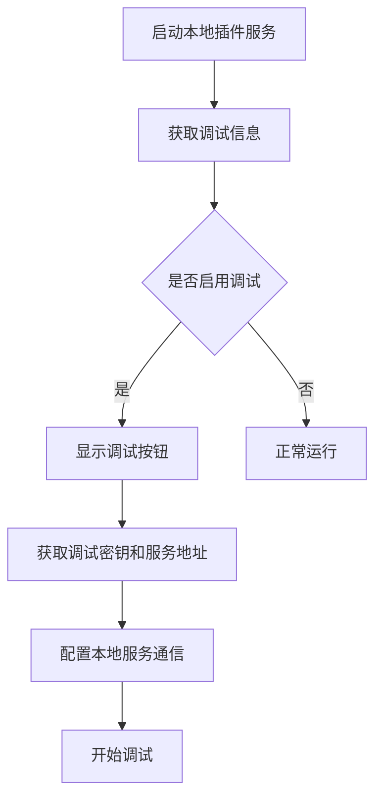
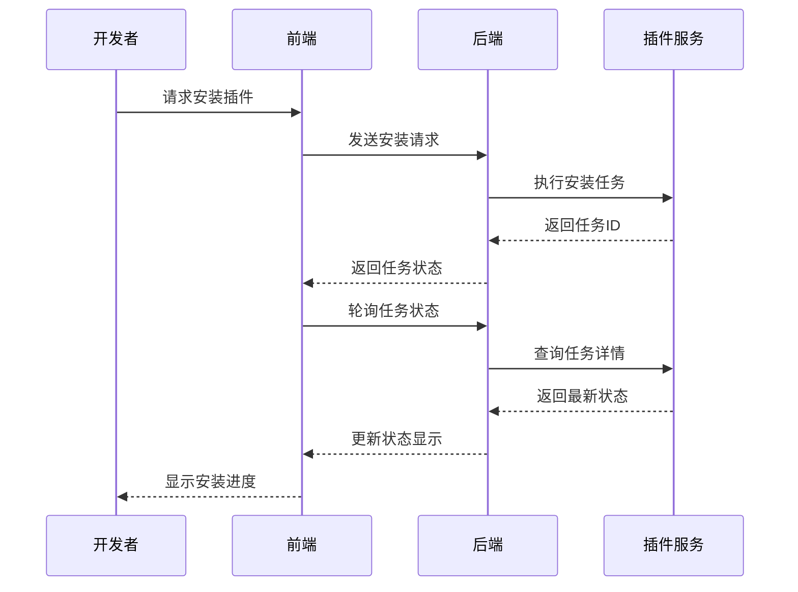
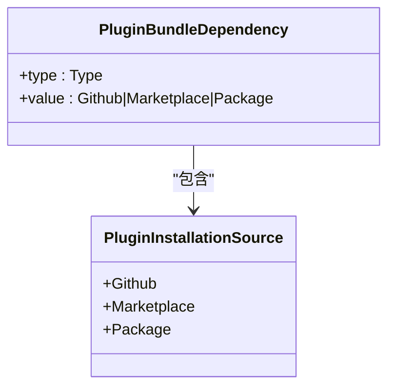
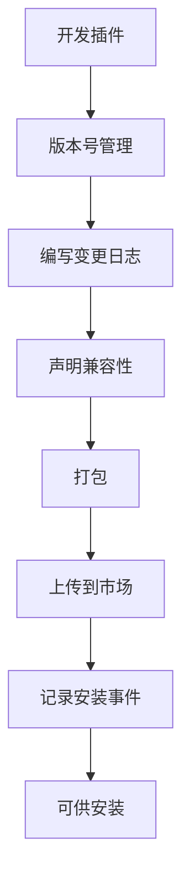
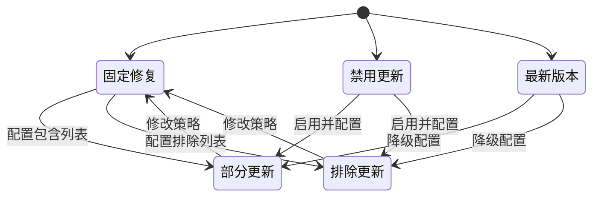
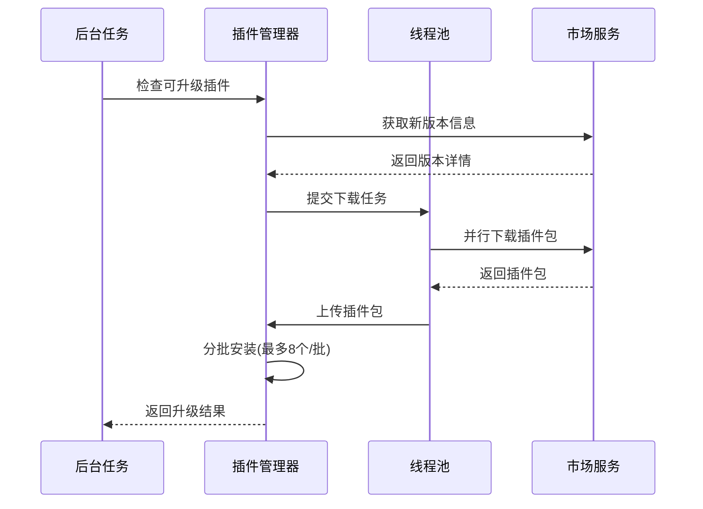
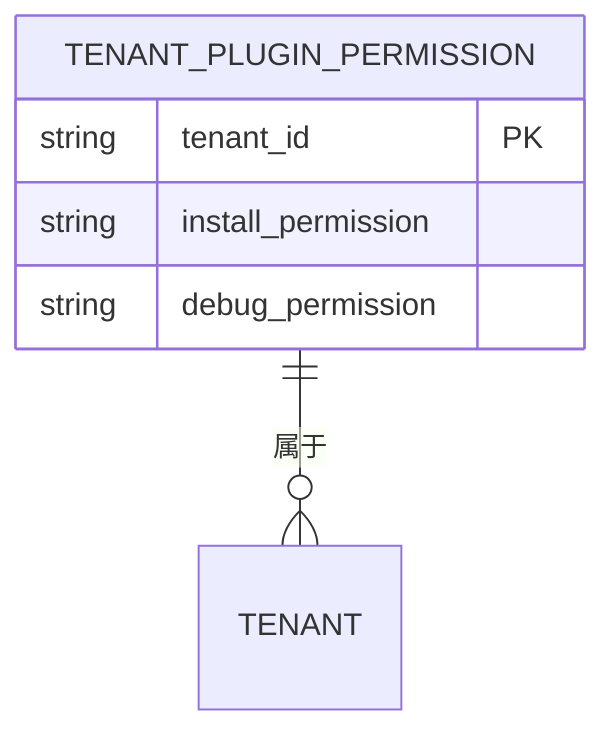
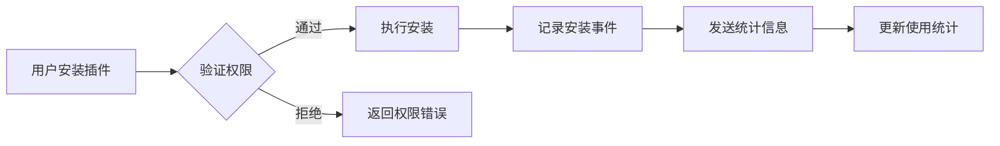
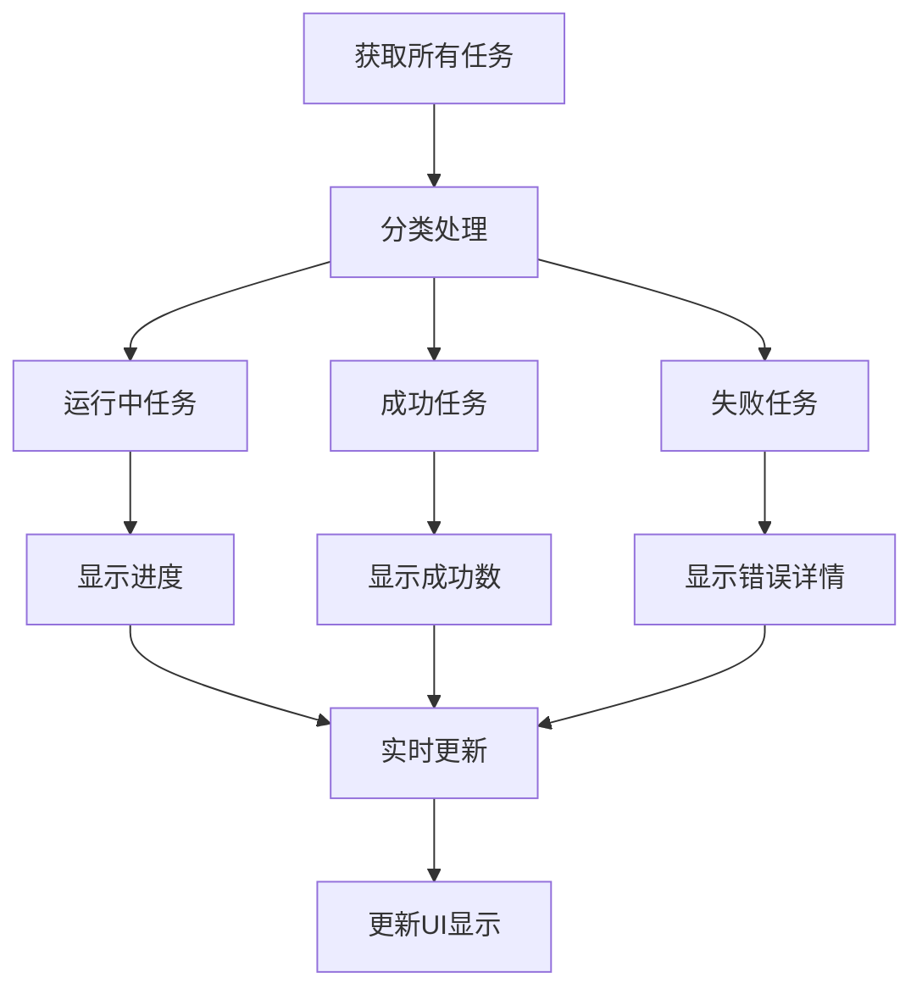
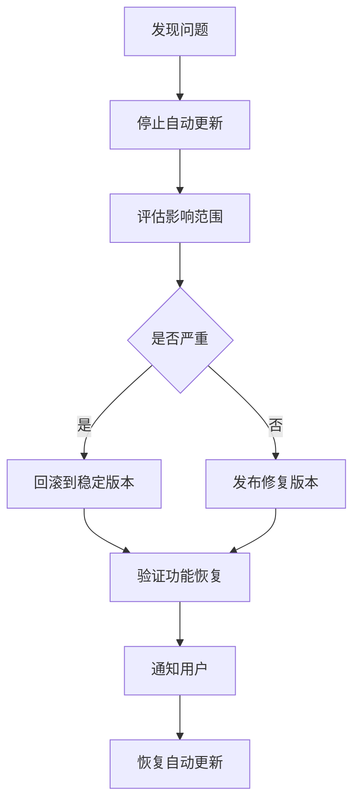

# 插件调试与部署

<cite>
**本文档引用文件**  
- [plugin.py](file://api/controllers/console/workspace/plugin.py)
- [plugin_service.py](file://api/services/plugin/plugin_service.py)
- [plugin_migration.py](file://api/services/plugin/plugin_migration.py)
- [plugin_permission_service.py](file://api/services/plugin/plugin_permission_service.py)
- [bundle.py](file://api/core/plugin/entities/bundle.py)
- [marketplace.py](file://api/core/helper/marketplace.py)
- [install-plugin-button.tsx](file://web/app/components/workflow/nodes/_base/components/install-plugin-button.tsx)
- [debug-info.tsx](file://web/app/components/plugins/plugin-page/debug-info.tsx)
- [plugin-tasks/hooks.ts](file://web/app/components/plugins/plugin-page/plugin-tasks/hooks.ts)
- [update-plugin/from-market-place.tsx](file://web/app/components/plugins/update-plugin/from-market-place.tsx)
- [auto-update-setting/types.ts](file://web/app/components/plugins/reference-setting-modal/auto-update-setting/types.ts)
- [plugins.ts](file://web/service/plugins.ts)
</cite>

## 目录
1. [简介](#简介)
2. [本地调试与测试](#本地调试与测试)
3. [插件打包与发布流程](#插件打包与发布流程)
4. [自动升级机制](#自动升级机制)
5. [权限管理与使用统计](#权限管理与使用统计)
6. [性能监控与使用统计](#性能监控与使用统计)
7. [生产环境部署最佳实践](#生产环境部署最佳实践)
8. [故障排查指南](#故障排查指南)

## 简介
本文档旨在为Dify平台的插件开发者提供完整的调试、部署和运维工作流指导。涵盖从本地开发测试到生产环境发布的全流程，包括插件的安装、升级、权限控制、自动更新机制以及故障排查方法。通过本指南，开发者可以高效地构建、测试和维护插件，确保其在不同环境下的稳定运行。

## 本地调试与测试

### 调试环境配置
Dify提供完整的本地调试支持，开发者可通过插件调试面板获取关键调试信息，包括调试密钥和本地服务地址。调试密钥用于身份验证，服务地址用于本地服务通信。

**Diagram sources**  
- [debug-info.tsx](file://web/app/components/plugins/plugin-page/debug-info.tsx)

**Section sources**  
- [debug-info.tsx](file://web/app/components/plugins/plugin-page/debug-info.tsx)

### 日志与调试工具
系统提供详细的安装任务日志跟踪，开发者可通过任务状态接口实时监控插件安装、升级过程。每个任务包含详细的执行状态、错误信息和进度反馈。

**Diagram sources**  
- [plugin.py](file://api/controllers/console/workspace/plugin.py)
- [plugin-tasks/hooks.ts](file://web/app/components/plugins/plugin-page/plugin-tasks/hooks.ts)

**Section sources**  
- [plugin.py](file://api/controllers/console/workspace/plugin.py#L310-L349)
- [plugin-tasks/hooks.ts](file://web/app/components/plugins/plugin-page/plugin-tasks/hooks.ts)

## 插件打包与发布流程

### 打包规范
插件包需遵循标准的Python包格式，包含必要的元数据文件和代码结构。系统支持从GitHub、市场和本地包等多种来源安装插件。

**Diagram sources**  
- [bundle.py](file://api/core/plugin/entities/bundle.py)

**Section sources**  
- [bundle.py](file://api/core/plugin/entities/bundle.py)

### 发布流程
插件发布需经过版本管理、变更日志记录和兼容性声明三个关键步骤。系统通过唯一标识符和版本号精确管理插件实例。

**Diagram sources**  
- [marketplace.py](file://api/core/helper/marketplace.py)
- [plugin_service.py](file://api/services/plugin/plugin_service.py)

**Section sources**  
- [marketplace.py](file://api/core/helper/marketplace.py#L34-L53)
- [plugin_service.py](file://api/services/plugin/plugin_service.py#L268-L304)

## 自动升级机制

### 升级策略配置
系统支持多种自动升级策略，包括仅修复更新、禁用自动更新和始终更新到最新版本。用户可根据需求配置不同的升级模式。

**Diagram sources**  
- [types.ts](file://web/app/components/plugins/reference-setting-modal/auto-update-setting/types.ts)

**Section sources**  
- [types.ts](file://web/app/components/plugins/reference-setting-modal/auto-update-setting/types.ts)

### 安全迁移流程
插件升级采用分批安全迁移机制，系统会先下载新版本插件包，验证签名后分批安装，确保升级过程的稳定性和可回滚性。

**Diagram sources**  
- [plugin_migration.py](file://api/services/plugin/plugin_migration.py)
- [plugin_service.py](file://api/services/plugin/plugin_service.py)

**Section sources**  
- [plugin_migration.py](file://api/services/plugin/plugin_migration.py#L408-L475)
- [plugin_service.py](file://api/services/plugin/plugin_service.py#L268-L304)

## 权限管理与使用统计

### 权限控制机制
系统提供细粒度的插件权限管理，支持安装权限和调试权限的独立控制。只有管理员或所有者可以修改权限设置。

**Diagram sources**  
- [plugin_permission_service.py](file://api/services/plugin/plugin_permission_service.py)

**Section sources**  
- [plugin_permission_service.py](file://api/services/plugin/plugin_permission_service.py)
- [plugin.py](file://api/controllers/console/workspace/plugin.py#L445-L483)

### 使用统计功能
系统会记录插件的安装事件和使用情况，为开发者提供使用统计分析。每次成功安装都会向市场服务发送统计事件。

**Section sources**  
- [marketplace.py](file://api/core/helper/marketplace.py#L34-L53)

## 性能监控与使用统计

### 监控指标
系统提供插件安装任务的完整监控，包括成功、失败和运行中的任务统计。前端通过轮询机制实时更新任务状态。

**Section sources**  
- [plugin-tasks/hooks.ts](file://web/app/components/plugins/plugin-page/plugin-tasks/hooks.ts#L41-L99)

## 生产环境部署最佳实践

### 灰度发布策略
建议采用分阶段发布策略，先在小范围用户中测试新版本插件，确认稳定后再全面推广。可通过排除模式临时阻止特定插件自动更新。

### 回滚策略
当新版本出现问题时，系统支持快速回滚到先前版本。建议在升级前备份当前配置，并记录变更日志以便追溯。

## 故障排查指南

### 常见问题处理
1. **插件安装失败**：检查网络连接，确认插件包完整性，查看详细错误日志
2. **升级卡住**：检查任务状态，可能需要手动清除失败任务
3. **权限不足**：确认当前用户具有管理员或所有者权限
4. **调试信息不可用**：确保插件已正确安装并启用调试模式

### 日志分析
通过分析安装任务日志和系统错误日志，可以快速定位问题根源。重点关注HTTP状态码、错误消息和堆栈跟踪信息。

**Section sources**  
- [plugin.py](file://api/controllers/console/workspace/plugin.py)
- [plugin-tasks/hooks.ts](file://web/app/components/plugins/plugin-page/plugin-tasks/hooks.ts)