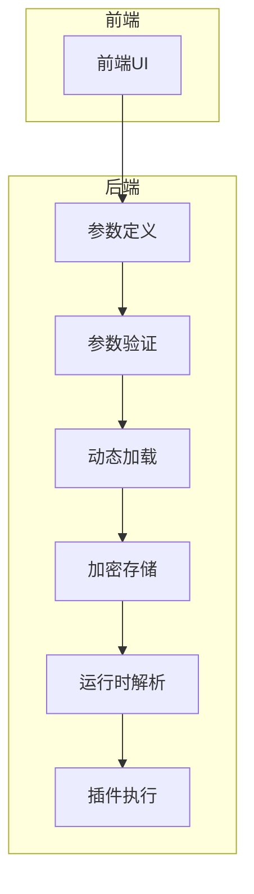
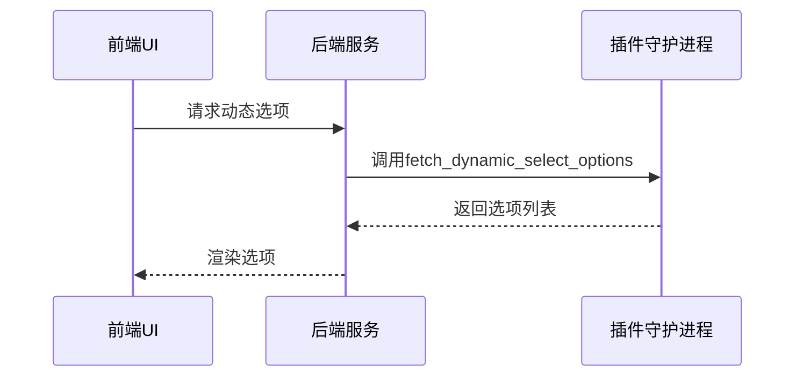
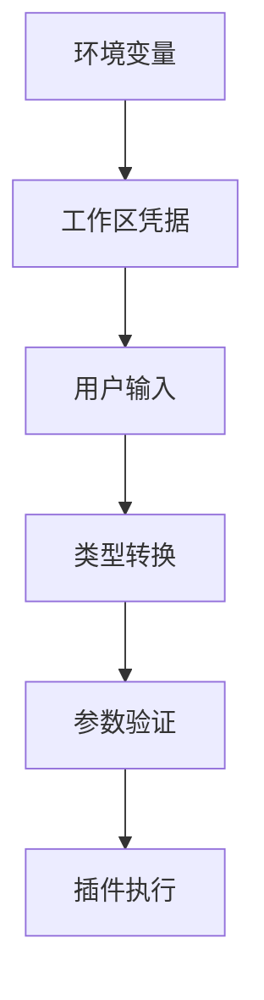

# 插件配置管理

<cite>
**本文档中引用的文件**  
- [parameters.py](file://api/core/plugin/entities/parameters.py)
- [plugin_parameter_service.py](file://api/services/plugin/plugin_parameter_service.py)
- [dynamic_select.py](file://api/core/plugin/impl/dynamic_select.py)
- [plugin.py](file://api/controllers/console/workspace/plugin.py)
- [parameter-item.tsx](file://web/app/components/header/account-setting/model-provider-page/model-parameter-modal/parameter-item.tsx)
- [encrypter.py](file://api/core/helper/encrypter.py)
- [plugin_entities.py](file://api/core/agent/plugin_entities.py)
</cite>

## 目录
1. [引言](#引言)
2. [插件参数系统架构](#插件参数系统架构)
3. [静态参数与动态选择参数](#静态参数与动态选择参数)
4. [参数动态加载机制](#参数动态加载机制)
5. [配置参数处理流程](#配置参数处理流程)
6. [加密存储机制](#加密存储机制)
7. [参数验证与默认值设置](#参数验证与默认值设置)
8. [敏感信息保护最佳实践](#敏感信息保护最佳实践)
9. [结论](#结论)

## 引言
Dify平台支持通过插件扩展其功能，插件配置管理是确保插件安全、灵活和可维护的关键组成部分。本文档深入探讨插件参数系统的实现机制，涵盖参数定义、动态加载、加密存储及最佳实践，帮助开发者和管理员全面理解并有效管理插件配置。

## 插件参数系统架构

Dify的插件参数系统采用分层设计，结合前后端协同工作，确保参数的灵活性和安全性。系统主要由以下组件构成：



**Diagram sources**
- [parameters.py](file://api/core/plugin/entities/parameters.py)
- [parameter-item.tsx](file://web/app/components/header/account-setting/model-provider-page/model-parameter-modal/parameter-item.tsx)

**Section sources**
- [parameters.py](file://api/core/plugin/entities/parameters.py)
- [parameter-item.tsx](file://web/app/components/header/account-setting/model-provider-page/model-parameter-modal/parameter-item.tsx)

## 静态参数与动态选择参数

### 静态参数
静态参数在插件定义时固定，包括字符串、数字、布尔值等基本类型。这些参数通过`PluginParameter`实体类进行定义，支持默认值、范围限制和占位符。

```python
class PluginParameter(BaseModel):
    name: str
    type: PluginParameterType
    required: bool = False
    default: Optional[Union[float, int, str]] = None
    min: Optional[Union[float, int]] = None
    max: Optional[Union[float, int]] = None
    placeholder: Optional[I18nObject] = None
```

### 动态选择参数
动态选择参数（dynamic select）允许用户在运行时从外部服务获取选项列表。这类参数通过`PluginParameterOption`定义，并通过`PluginParameterService.get_dynamic_select_options`方法动态加载。

```python
class PluginParameterOption(BaseModel):
    value: str
    label: I18nObject
```

**Section sources**
- [parameters.py](file://api/core/plugin/entities/parameters.py)

## 参数动态加载机制

动态参数加载通过`PluginParameterService`实现，具体流程如下：

1. 前端请求动态选项
2. 后端调用`get_dynamic_select_options`方法
3. 通过`DynamicSelectClient`与插件守护进程通信
4. 返回选项列表



**Diagram sources**
- [plugin_parameter_service.py](file://api/services/plugin/plugin_parameter_service.py)
- [dynamic_select.py](file://api/core/plugin/impl/dynamic_select.py)

**Section sources**
- [plugin_parameter_service.py](file://api/services/plugin/plugin_parameter_service.py)
- [dynamic_select.py](file://api/core/plugin/impl/dynamic_select.py)

## 配置参数处理流程

插件配置参数的处理涉及环境变量、工作区凭据和用户输入。处理流程如下：

1. **环境变量**：系统级配置，优先级最低
2. **工作区凭据**：租户级配置，覆盖环境变量
3. **用户输入**：实例级配置，优先级最高

参数值通过`cast_parameter_value`函数进行类型转换和验证。



**Diagram sources**
- [parameters.py](file://api/core/plugin/entities/parameters.py)

**Section sources**
- [parameters.py](file://api/core/plugin/entities/parameters.py)

## 加密存储机制

### 敏感信息加密
敏感信息（如API密钥、OAuth凭据）使用`ToolProviderEncrypter`进行加密存储。加密过程如下：

1. 生成租户特定的加密密钥
2. 使用AES-256-GCM算法加密数据
3. 存储加密后的密文和认证标签

### OAuth凭据处理
OAuth凭据通过以下步骤加密与解密：

```python
def encrypt_credentials(credentials: dict, tenant_id: str) -> dict:
    encrypter = create_tool_provider_encrypter(tenant_id)
    return {k: encrypter.encrypt(v) for k, v in credentials.items()}

def decrypt_credentials(encrypted_credentials: dict, tenant_id: str) -> dict:
    encrypter = create_tool_provider_encrypter(tenant_id)
    return {k: encrypter.decrypt(v) for k, v in encrypted_credentials.items()}
```

**Section sources**
- [plugin_parameter_service.py](file://api/services/plugin/plugin_parameter_service.py)
- [encrypter.py](file://api/core/helper/encrypter.py)

## 参数验证与默认值设置

### 参数验证
参数验证在前后端同时进行：

- **前端验证**：即时反馈，提升用户体验
- **后端验证**：确保数据完整性

验证规则包括：
- 类型匹配
- 范围检查（min/max）
- 必填项检查

### 默认值设置
默认值设置遵循以下优先级：
1. 用户显式设置的值
2. 插件定义的默认值
3. 系统默认值（如0、空字符串）

```python
def getDefaultValue():
    if parameterRule.type in ['int', 'float']:
        return parameterRule.default if parameterRule.default is not None else (parameterRule.min or 0)
    elif parameterRule.type in ['string', 'text']:
        return parameterRule.default or ''
    elif parameterRule.type == 'boolean':
        return parameterRule.default if parameterRule.default is not None else False
    elif parameterRule.type == 'tag':
        return parameterRule.default or []
```

**Section sources**
- [parameter-item.tsx](file://web/app/components/header/account-setting/model-provider-page/model-parameter-modal/parameter-item.tsx)

## 敏感信息保护最佳实践

1. **最小权限原则**：仅请求必要的权限
2. **定期轮换密钥**：定期更新API密钥和OAuth令牌
3. **加密传输**：始终使用HTTPS传输敏感数据
4. **日志脱敏**：避免在日志中记录敏感信息
5. **访问控制**：限制对敏感配置的访问权限

## 结论
Dify的插件配置管理系统通过分层架构、动态加载和加密存储，实现了灵活性与安全性的平衡。开发者应遵循最佳实践，合理定义参数，确保插件的安全性和可维护性。