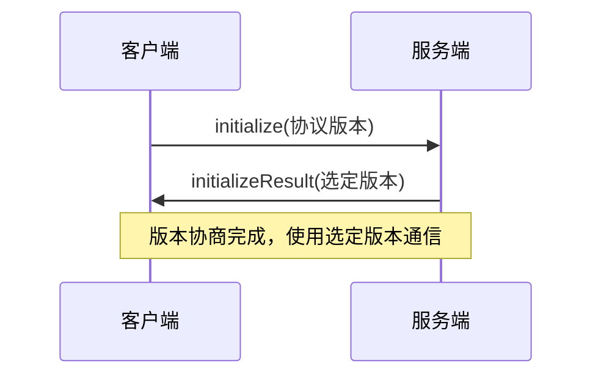
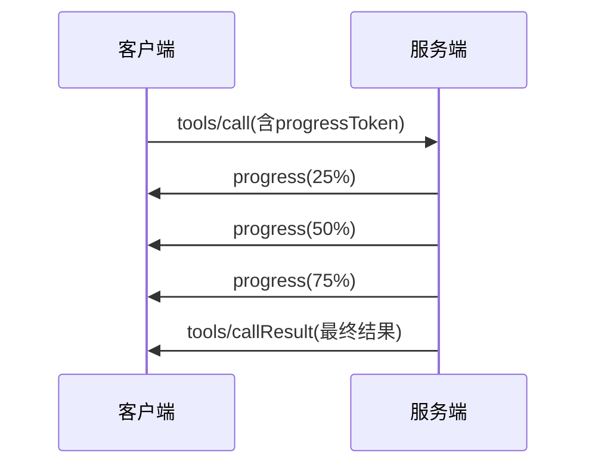
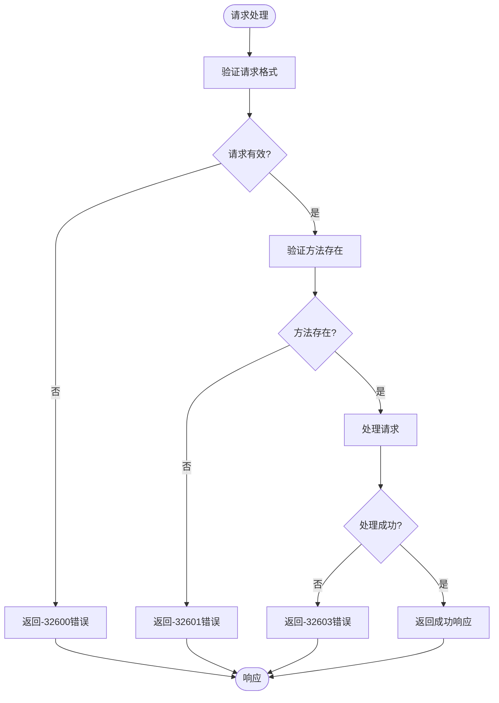
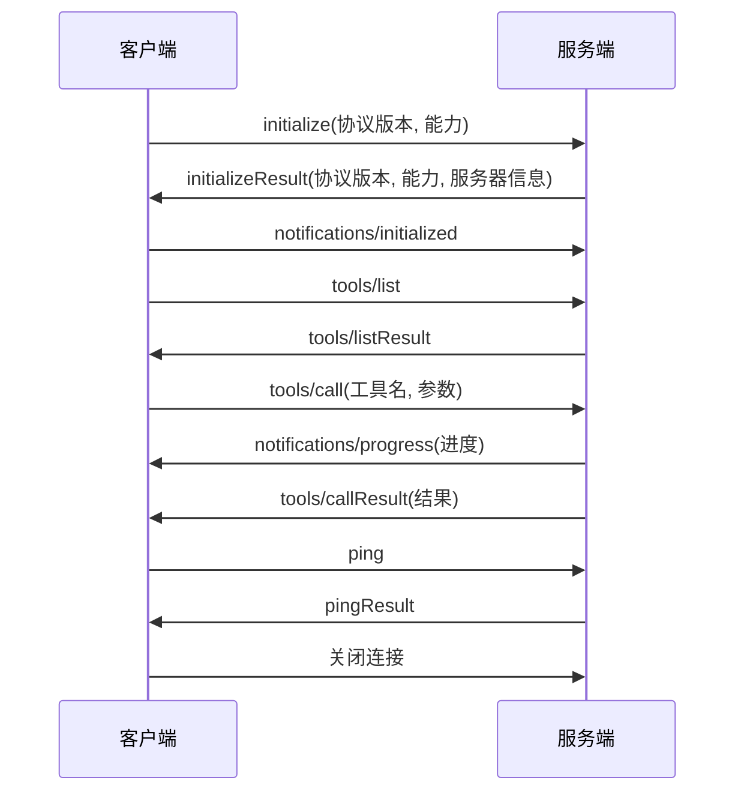
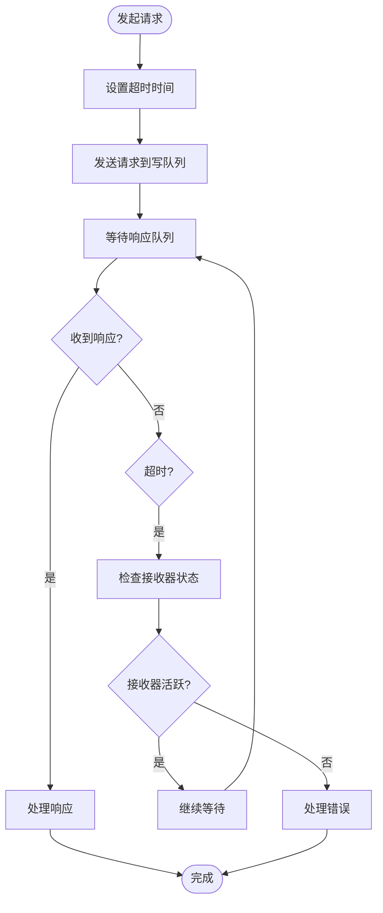

# MCP协议规范

<cite>
**本文档引用的文件**   
- [mcp.py](file://api/controllers/mcp/mcp.py)
- [types.py](file://api/core/mcp/types.py)
- [streamable_http.py](file://api/core/mcp/server/streamable_http.py)
- [error.py](file://api/core/mcp/error.py)
- [entities.py](file://api/core/mcp/entities.py)
- [client_session.py](file://api/core/mcp/session/client_session.py)
- [base_session.py](file://api/core/mcp/session/base_session.py)
- [sse_client.py](file://api/core/mcp/client/sse_client.py)
</cite>

## 目录
1. [引言](#引言)
2. [协议概述](#协议概述)
3. [消息格式与数据结构](#消息格式与数据结构)
4. [通信模式](#通信模式)
5. [版本控制机制](#版本控制机制)
6. [请求/响应JSON Schema定义](#请求响应json-schema定义)
7. [流式传输支持](#流式传输支持)
8. [错误码体系](#错误码体系)
9. [心跳机制](#心跳机制)
10. [协议交互序列图](#协议交互序列图)
11. [长连接处理与超时重试](#长连接处理与超时重试)
12. [连接恢复最佳实践](#连接恢复最佳实践)
13. [协议扩展机制](#协议扩展机制)
14. [向后兼容性策略](#向后兼容性策略)

## 引言
MCP（Model Context Protocol）协议是Dify平台用于模型上下文交互的核心通信协议。该协议基于JSON-RPC 2.0标准，为客户端与服务端之间的模型调用、资源访问和工具执行提供了标准化的通信框架。本规范详细说明了MCP协议的技术细节，包括消息格式、数据结构、通信模式和版本控制机制，旨在为开发者提供完整的协议参考。

**Section sources**
- [mcp.py](file://api/controllers/mcp/mcp.py#L1-L244)
- [types.py](file://api/core/mcp/types.py#L1-L799)

## 协议概述
MCP协议是一种基于JSON-RPC 2.0的双向通信协议，用于在客户端和服务端之间交换模型上下文信息。协议支持请求-响应模式和通知模式，允许客户端调用服务端提供的工具、访问资源和获取提示信息。协议的核心特性包括版本协商、能力发现、流式传输和错误处理。

MCP协议通过HTTP端点`/mcp`进行通信，使用JSON格式的消息体。协议设计考虑了可扩展性和向后兼容性，允许在未来版本中添加新功能而不破坏现有实现。

**Section sources**
- [mcp.py](file://api/controllers/mcp/mcp.py#L1-L244)
- [types.py](file://api/core/mcp/types.py#L1-L799)

## 消息格式与数据结构
MCP协议的消息格式基于JSON-RPC 2.0标准，包含请求、通知、响应和错误四种消息类型。所有消息都必须包含`jsonrpc`字段，其值为"2.0"。

### 请求消息
请求消息用于客户端向服务端发起调用，包含以下字段：
- `jsonrpc`: 协议版本，固定为"2.0"
- `method`: 调用的方法名称
- `params`: 方法参数，为JSON对象
- `id`: 请求标识符，用于匹配响应

### 通知消息
通知消息是单向消息，不需要响应，包含以下字段：
- `jsonrpc`: 协议版本，固定为"2.0"
- `method`: 通知的方法名称
- `params`: 通知参数，为JSON对象

### 响应消息
响应消息用于服务端对请求的回复，包含以下字段：
- `jsonrpc`: 协议版本，固定为"2.0"
- `id`: 对应请求的标识符
- `result`: 调用结果，为JSON对象

### 错误消息
错误消息用于表示请求处理过程中发生的错误，包含以下字段：
- `jsonrpc`: 协议版本，固定为"2.0"
- `id`: 对应请求的标识符
- `error`: 错误信息对象，包含`code`、`message`和`data`字段

**Section sources**
- [types.py](file://api/core/mcp/types.py#L1-L799)
- [mcp.py](file://api/controllers/mcp/mcp.py#L1-L244)

## 通信模式
MCP协议支持多种通信模式，包括请求-响应、通知和流式传输。

### 请求-响应模式
这是MCP协议的主要通信模式，客户端发送请求，服务端处理后返回响应。每个请求都有唯一的`id`，用于匹配相应的响应。这种模式适用于需要明确结果的调用，如工具调用和资源读取。

### 通知模式
通知模式用于单向消息传递，不需要响应。客户端可以发送初始化完成通知，服务端可以发送进度更新或资源变更通知。这种模式适用于状态更新和事件通知。

### 流式传输模式
对于长时间运行的操作，MCP协议支持流式传输。服务端可以通过进度通知（`notifications/progress`）向客户端报告处理进度。客户端也可以通过流式响应接收分块的数据。

**Section sources**
- [types.py](file://api/core/mcp/types.py#L1-L799)
- [base_session.py](file://api/core/mcp/session/base_session.py#L1-L410)

## 版本控制机制
MCP协议采用语义化版本控制机制，确保向后兼容性。协议版本号遵循`YYYY-MM-DD`格式，表示协议规范的发布日期。

### 版本协商
在初始化阶段，客户端和服务端通过`initialize`请求进行版本协商：
1. 客户端在`initialize`请求中声明其支持的最新协议版本
2. 服务端在`initialize`响应中返回其选择的协议版本
3. 双方使用协商确定的版本进行后续通信

Dify平台当前支持的协议版本包括"2024-11-05"和"2025-03-26"。服务端会验证客户端请求的协议版本，如果版本不兼容，则返回错误。



**Diagram sources**
- [types.py](file://api/core/mcp/types.py#L1-L799)
- [streamable_http.py](file://api/core/mcp/server/streamable_http.py#L1-L262)

**Section sources**
- [types.py](file://api/core/mcp/types.py#L1-L799)
- [streamable_http.py](file://api/core/mcp/server/streamable_http.py#L1-L262)

## 请求/响应JSON Schema定义
MCP协议的请求和响应消息遵循严格的JSON Schema定义，确保数据的一致性和可验证性。

### 初始化请求
```json
{
  "jsonrpc": "2.0",
  "method": "initialize",
  "id": 1,
  "params": {
    "protocolVersion": "2025-03-26",
    "capabilities": {
      "sampling": {},
      "roots": {
        "listChanged": true
      }
    },
    "clientInfo": {
      "name": "Dify",
      "version": "1.0.0"
    }
  }
}
```

### 工具调用请求
```json
{
  "jsonrpc": "2.0",
  "method": "tools/call",
  "id": 2,
  "params": {
    "name": "app_name",
    "arguments": {
      "query": "用户问题",
      "inputs": {
        "参数1": "值1"
      }
    }
  }
}
```

### 资源列表响应
```json
{
  "jsonrpc": "2.0",
  "id": 3,
  "result": {
    "resources": [
      {
        "uri": "file://document.txt",
        "name": "文档",
        "description": "示例文档",
        "mimeType": "text/plain"
      }
    ]
  }
}
```

**Section sources**
- [types.py](file://api/core/mcp/types.py#L1-L799)
- [mcp.py](file://api/controllers/mcp/mcp.py#L1-L244)

## 流式传输支持
MCP协议通过进度通知机制支持流式传输，适用于长时间运行的操作或大数据量传输。

### 进度通知
服务端可以通过`notifications/progress`通知向客户端报告处理进度：
- `progressToken`: 与请求关联的进度令牌
- `progress`: 当前进度值（0.0到1.0之间）
- `total`: 总进度值（可选）

客户端在发起请求时可以通过`_meta.progressToken`参数请求进度通知。服务端收到此参数后，会在处理过程中定期发送进度通知。

### 流式响应处理
对于流式响应，客户端需要处理分块的数据。Dify平台的实现中，流式响应通过特殊的生成器模式处理，将连续的数据流分解为独立的消息块。



**Diagram sources**
- [types.py](file://api/core/mcp/types.py#L1-L799)
- [streamable_http.py](file://api/core/mcp/server/streamable_http.py#L1-L262)

**Section sources**
- [types.py](file://api/core/mcp/types.py#L1-L799)
- [streamable_http.py](file://api/core/mcp/server/streamable_http.py#L1-L262)

## 错误码体系
MCP协议定义了标准化的错误码体系，用于表示不同类型的错误。错误码遵循JSON-RPC 2.0标准，并扩展了特定于MCP的错误码。

### 标准错误码
- `-32700`: 解析错误 - 无效的JSON
- `-32600`: 无效请求 - 请求格式不正确
- `-32601`: 方法未找到 - 请求的方法不存在
- `-32602`: 参数无效 - 请求参数不正确
- `-32603`: 内部错误 - 服务端处理请求时发生错误

### MCP特定错误
MCP协议还定义了特定于协议的错误情况，如协议版本不兼容、认证失败等。错误响应包含`code`、`message`和可选的`data`字段，其中`data`可以包含额外的错误信息。



**Diagram sources**
- [types.py](file://api/core/mcp/types.py#L1-L799)
- [error.py](file://api/core/mcp/error.py#L1-L10)

**Section sources**
- [types.py](file://api/core/mcp/types.py#L1-L799)
- [error.py](file://api/core/mcp/error.py#L1-L10)

## 心跳机制
MCP协议通过`ping`方法实现心跳机制，用于检测连接的活跃状态。

### 心跳请求
任何一方都可以发送`ping`请求来检查对方的存活状态：
```json
{
  "jsonrpc": "2.0",
  "method": "ping",
  "id": 1
}
```

### 心跳响应
接收方必须回复一个空结果的响应：
```json
{
  "jsonrpc": "2.0",
  "id": 1,
  "result": {}
}
```

心跳机制对于维持长连接的稳定性至关重要，可以及时发现和处理网络中断或服务异常。客户端和服务端可以根据需要定期发送心跳请求，以确保连接的活跃性。

**Section sources**
- [types.py](file://api/core/mcp/types.py#L1-L799)
- [streamable_http.py](file://api/core/mcp/server/streamable_http.py#L1-L262)

## 协议交互序列图
以下序列图展示了MCP协议的完整通信流程，从连接建立到工具调用的全过程。



**Diagram sources**
- [mcp.py](file://api/controllers/mcp/mcp.py#L1-L244)
- [types.py](file://api/core/mcp/types.py#L1-L799)
- [streamable_http.py](file://api/core/mcp/server/streamable_http.py#L1-L262)

**Section sources**
- [mcp.py](file://api/controllers/mcp/mcp.py#L1-L244)
- [types.py](file://api/core/mcp/types.py#L1-L799)
- [streamable_http.py](file://api/core/mcp/server/streamable_http.py#L1-L262)

## 长连接处理与超时重试
MCP协议设计考虑了长连接的处理和超时重试机制，确保在不稳定网络环境下的可靠性。

### 长连接管理
MCP会话通过`ClientSession`类管理，该类实现了完整的会话生命周期管理：
- 会话创建时初始化读写队列
- 使用线程池处理消息的接收和发送
- 提供超时机制防止连接挂起
- 实现异常处理和资源清理

### 超时配置
MCP协议支持多种超时配置：
- 会话读取超时：控制消息接收的等待时间
- 请求读取超时：控制单个请求的响应等待时间
- 默认响应读取超时：控制响应队列的获取等待时间

当发生超时时，系统会检查接收器状态并适当处理，避免资源泄漏。



**Diagram sources**
- [base_session.py](file://api/core/mcp/session/base_session.py#L1-L410)
- [client_session.py](file://api/core/mcp/session/client_session.py#L1-L364)

**Section sources**
- [base_session.py](file://api/core/mcp/session/base_session.py#L1-L410)
- [client_session.py](file://api/core/mcp/session/client_session.py#L1-L364)

## 连接恢复最佳实践
为了确保MCP连接的可靠性和容错性，建议采用以下连接恢复最佳实践。

### 异常处理
实现完整的异常处理机制，捕获和处理各种可能的异常：
- 网络连接异常
- 认证异常
- 协议解析异常
- 超时异常

### 重试策略
实施智能重试策略，包括：
- 指数退避重试：每次重试间隔逐渐增加
- 最大重试次数限制：防止无限重试
- 熔断机制：在连续失败后暂时停止重试

### 状态同步
在连接恢复后，确保客户端和服务端的状态同步：
- 重新发送未确认的请求
- 重新订阅之前注册的资源
- 恢复之前的会话上下文

### 心跳检测
定期发送心跳请求，及时发现连接问题并启动恢复流程。

**Section sources**
- [error.py](file://api/core/mcp/error.py#L1-L10)
- [base_session.py](file://api/core/mcp/session/base_session.py#L1-L410)

## 协议扩展机制
MCP协议设计了灵活的扩展机制，允许在不破坏向后兼容性的前提下添加新功能。

### 能力发现
通过能力（Capabilities）机制实现功能发现：
- 客户端在初始化时声明其支持的能力
- 服务端在初始化响应中声明其提供的能力
- 双方根据能力协商支持的功能

### 实验性功能
支持实验性功能通过`experimental`字段实现：
- 在客户端和服务端能力中包含实验性功能
- 使用命名空间避免冲突
- 明确标识为实验性，可能随时变更

### 可选字段
协议中的许多字段是可选的，允许逐步引入新功能：
- 使用`extra='allow'`配置允许额外字段
- 新版本可以添加字段而不影响旧版本
- 旧版本忽略不认识的字段

**Section sources**
- [types.py](file://api/core/mcp/types.py#L1-L799)
- [entities.py](file://api/core/mcp/entities.py#L1-L19)

## 向后兼容性策略
MCP协议采用严格的向后兼容性策略，确保新版本不会破坏现有实现。

### 版本兼容性
维护支持的协议版本列表，确保：
- 服务端支持多个版本
- 客户端可以协商使用兼容版本
- 旧版本客户端可以继续使用服务

### 字段兼容性
遵循以下字段兼容性原则：
- 不删除现有字段
- 不改变现有字段的含义
- 可选字段可以安全忽略
- 新字段添加为可选

### 错误处理
对于不兼容的请求，返回明确的错误信息：
- 使用标准错误码
- 提供详细的错误描述
- 建议解决方案

通过这些策略，MCP协议能够在不断演进的同时，保持对现有系统的兼容性。

**Section sources**
- [types.py](file://api/core/mcp/types.py#L1-L799)
- [entities.py](file://api/core/mcp/entities.py#L1-L19)
- [streamable_http.py](file://api/core/mcp/server/streamable_http.py#L1-L262)