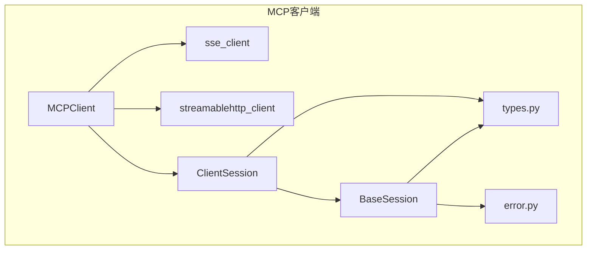
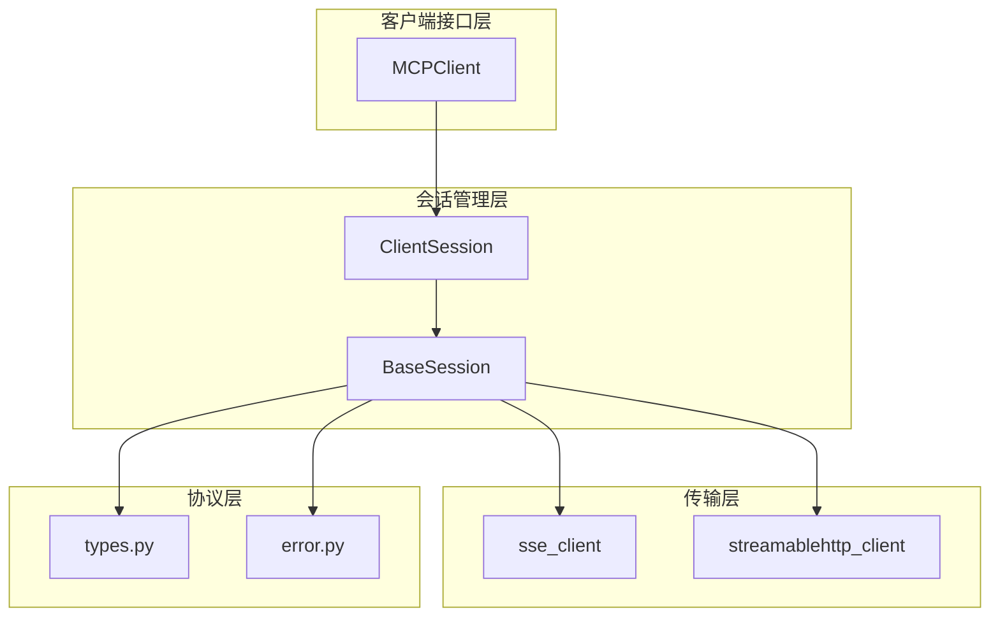
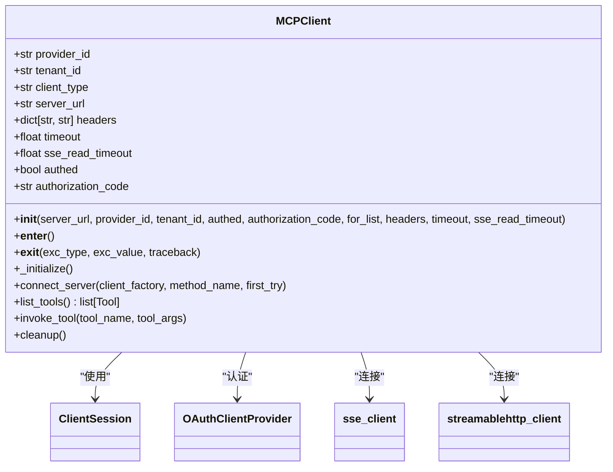
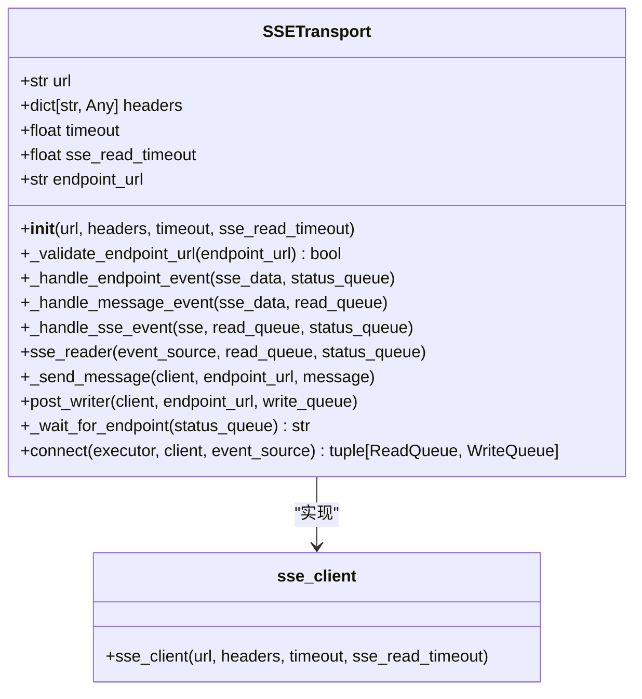
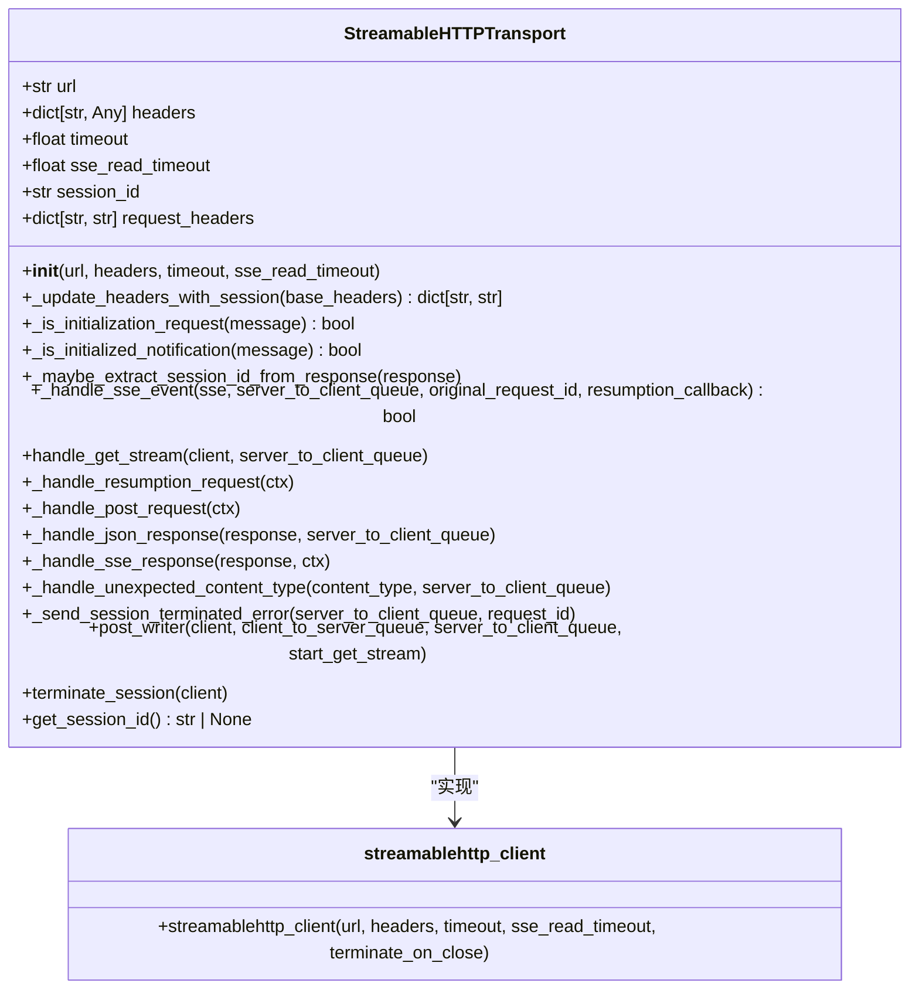
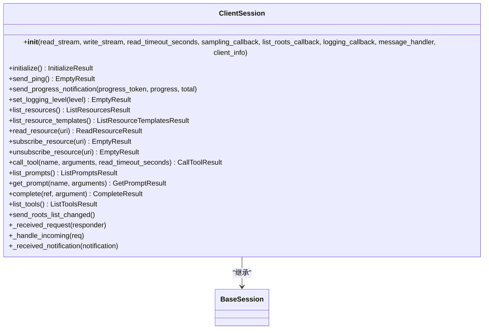
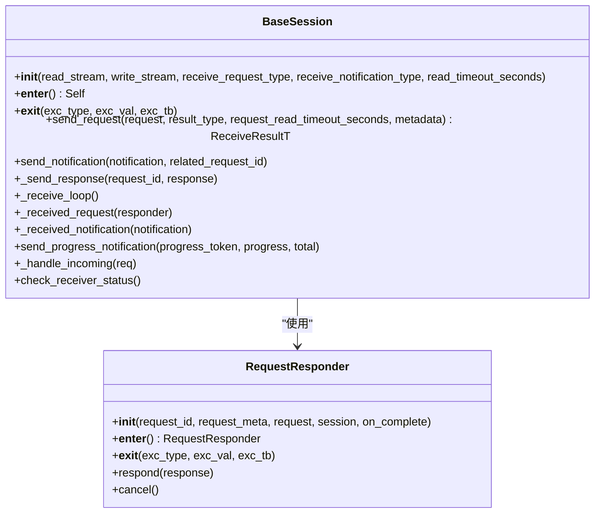
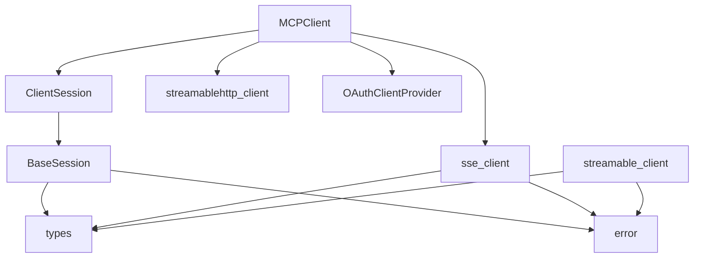

# MCP客户端实现

<cite>
**本文档引用的文件**  
- [mcp_client.py](file://api/core/mcp/mcp_client.py)
- [sse_client.py](file://api/core/mcp/client/sse_client.py)
- [streamable_client.py](file://api/core/mcp/client/streamable_client.py)
- [client_session.py](file://api/core/mcp/session/client_session.py)
- [base_session.py](file://api/core/mcp/session/base_session.py)
- [types.py](file://api/core/mcp/types.py)
- [error.py](file://api/core/mcp/error.py)
</cite>

## 目录
1. [简介](#简介)
2. [项目结构](#项目结构)
3. [核心组件](#核心组件)
4. [架构概述](#架构概述)
5. [详细组件分析](#详细组件分析)
6. [依赖分析](#依赖分析)
7. [性能考虑](#性能考虑)
8. [故障排除指南](#故障排除指南)
9. [结论](#结论)

## 简介
本文档深入讲解Dify中MCP客户端的构建方式和技术要点。详细描述SSE（Server-Sent Events）和可流式客户端的实现原理，包括连接管理、消息序列化、异步处理和错误恢复机制。提供代码示例展示如何初始化客户端、发送工具调用请求和处理流式响应。文档包含性能优化技巧、内存管理策略和与不同MCP服务端兼容性的处理方案。

## 项目结构
Dify的MCP客户端实现位于`api/core/mcp`目录下，采用模块化设计，分离了传输层、会话管理和协议处理。主要组件包括：
- `client/`: 包含SSE和StreamableHTTP两种传输实现
- `session/`: 管理会话状态和消息处理
- `types.py`: 定义MCP协议的数据模型
- `mcp_client.py`: 客户端主类，封装了所有功能

**图表来源**  
- [mcp_client.py](file://api/core/mcp/mcp_client.py#L1-L160)
- [sse_client.py](file://api/core/mcp/client/sse_client.py#L1-L357)
- [streamable_client.py](file://api/core/mcp/client/streamable_client.py#L1-L478)

**章节来源**  
- [mcp_client.py](file://api/core/mcp/mcp_client.py#L1-L160)

## 核心组件
MCP客户端的核心组件包括MCPClient主类、两种传输客户端（SSE和StreamableHTTP）、会话管理类和协议类型定义。这些组件协同工作，实现了与MCP服务端的可靠通信。

**章节来源**  
- [mcp_client.py](file://api/core/mcp/mcp_client.py#L1-L160)
- [types.py](file://api/core/mcp/types.py#L1-L799)

## 架构概述
MCP客户端采用分层架构，从上到下分为客户端接口层、会话管理层、传输层和协议层。这种设计实现了关注点分离，提高了代码的可维护性和可扩展性。

**图表来源**  
- [mcp_client.py](file://api/core/mcp/mcp_client.py#L1-L160)
- [client_session.py](file://api/core/mcp/session/client_session.py#L1-L364)
- [base_session.py](file://api/core/mcp/session/base_session.py#L1-L410)

## 详细组件分析

### MCPClient分析
MCPClient是客户端的主入口类，负责初始化连接、管理会话和提供高层API。它支持两种连接方式：SSE和StreamableHTTP，并能根据服务端支持情况自动降级。

**图表来源**  
- [mcp_client.py](file://api/core/mcp/mcp_client.py#L1-L160)

**章节来源**  
- [mcp_client.py](file://api/core/mcp/mcp_client.py#L1-L160)

### 传输层分析
传输层实现了两种通信协议：SSE（Server-Sent Events）和StreamableHTTP。SSE适用于简单的单向消息推送，而StreamableHTTP支持双向流式通信。

#### SSE客户端实现
SSE客户端使用队列和线程池实现异步消息处理，确保非阻塞通信。

**图表来源**  
- [sse_client.py](file://api/core/mcp/client/sse_client.py#L1-L357)

**章节来源**  
- [sse_client.py](file://api/core/mcp/client/sse_client.py#L1-L357)

#### StreamableHTTP客户端实现
StreamableHTTP客户端支持更复杂的双向通信模式，包括请求-响应和服务器推送。

**图表来源**  
- [streamable_client.py](file://api/core/mcp/client/streamable_client.py#L1-L478)

**章节来源**  
- [streamable_client.py](file://api/core/mcp/client/streamable_client.py#L1-L478)

### 会话管理层分析
会话管理层负责管理MCP会话的生命周期，处理消息序列化和反序列化，以及维护请求-响应的关联。

#### ClientSession分析
ClientSession封装了常见的MCP操作，提供高层API供客户端使用。

**图表来源**  
- [client_session.py](file://api/core/mcp/session/client_session.py#L1-L364)

**章节来源**  
- [client_session.py](file://api/core/mcp/session/client_session.py#L1-L364)

#### BaseSession分析
BaseSession是会话管理的基类，实现了消息处理循环和请求-响应关联。

**图表来源**  
- [base_session.py](file://api/core/mcp/session/base_session.py#L1-L410)

**章节来源**  
- [base_session.py](file://api/core/mcp/session/base_session.py#L1-L410)

## 依赖分析
MCP客户端的依赖关系清晰，各组件之间的耦合度低，便于维护和扩展。

**图表来源**  
- [mcp_client.py](file://api/core/mcp/mcp_client.py#L1-L160)
- [client_session.py](file://api/core/mcp/session/client_session.py#L1-L364)
- [base_session.py](file://api/core/mcp/session/base_session.py#L1-L410)

**章节来源**  
- [mcp_client.py](file://api/core/mcp/mcp_client.py#L1-L160)
- [client_session.py](file://api/core/mcp/session/client_session.py#L1-L364)
- [base_session.py](file://api/core/mcp/session/base_session.py#L1-L410)

## 性能考虑
MCP客户端在设计时考虑了多种性能优化策略：

1. **连接复用**：通过会话管理实现连接复用，减少连接建立开销
2. **异步处理**：使用线程池和队列实现异步消息处理，避免阻塞
3. **内存管理**：使用上下文管理器确保资源及时释放
4. **错误恢复**：支持自动重连和认证刷新
5. **超时控制**：提供灵活的超时配置，避免长时间等待

这些优化策略确保了客户端在高并发场景下的稳定性和响应性。

## 故障排除指南
### 常见问题及解决方案

1. **连接失败**
   - 检查服务端URL是否正确
   - 验证认证信息是否有效
   - 确认网络连接正常

2. **认证失败**
   - 检查token是否过期
   - 验证授权码是否正确
   - 确认权限配置

3. **消息丢失**
   - 检查队列是否溢出
   - 验证消息序列化是否正确
   - 确认网络稳定性

4. **性能问题**
   - 调整超时设置
   - 优化线程池大小
   - 监控资源使用情况

**章节来源**  
- [mcp_client.py](file://api/core/mcp/mcp_client.py#L1-L160)
- [error.py](file://api/core/mcp/error.py#L1-L10)

## 结论
Dify的MCP客户端实现了一个功能完整、性能优良的MCP协议客户端。通过模块化设计和清晰的分层架构，实现了高内聚低耦合的代码结构。客户端支持SSE和StreamableHTTP两种传输方式，能够适应不同的服务端实现。会话管理层提供了丰富的API，简化了MCP协议的使用。整体设计考虑了性能、可靠性和可维护性，为构建基于MCP的应用提供了坚实的基础。