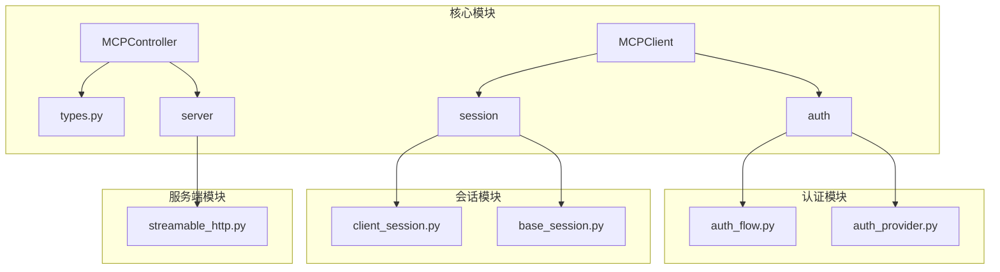
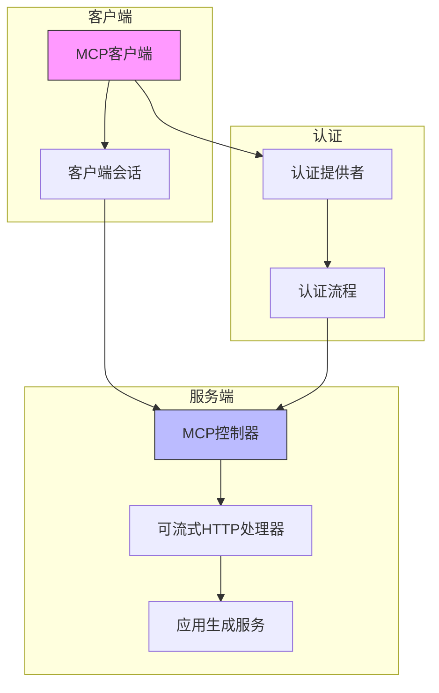
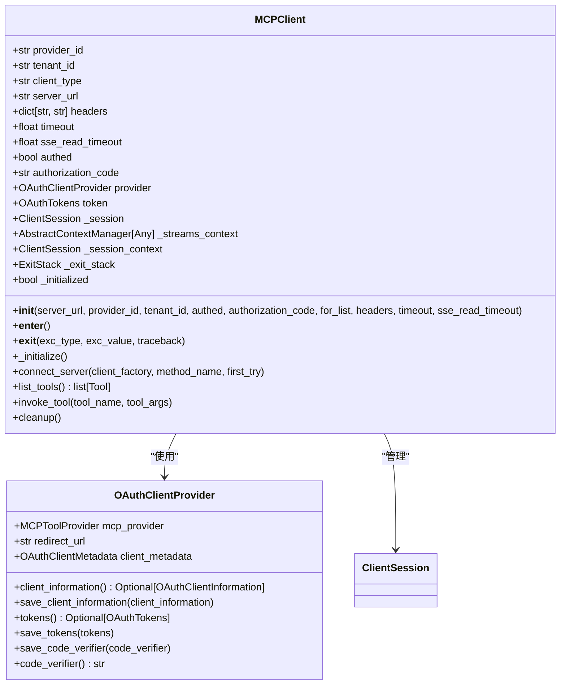
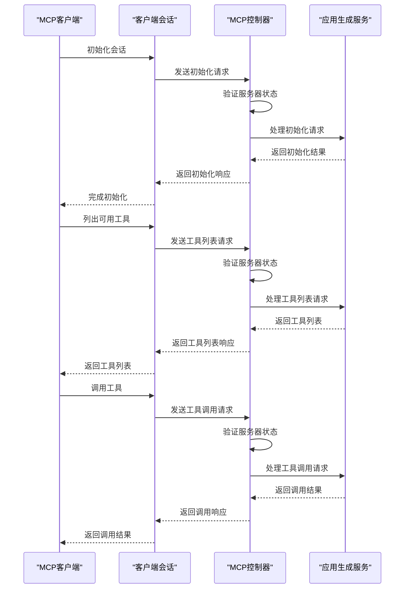
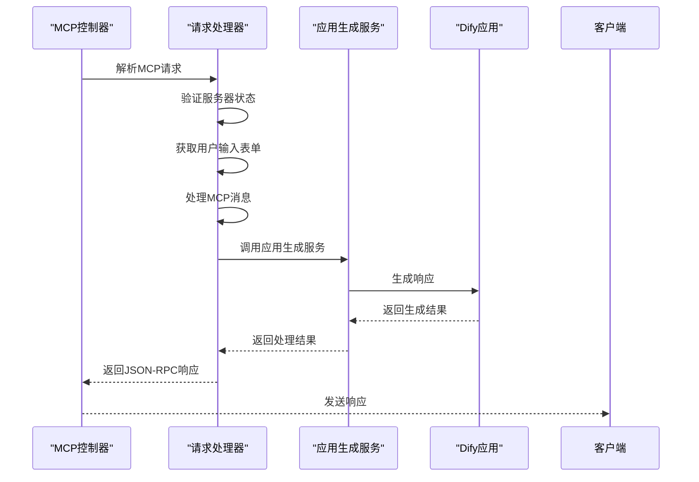
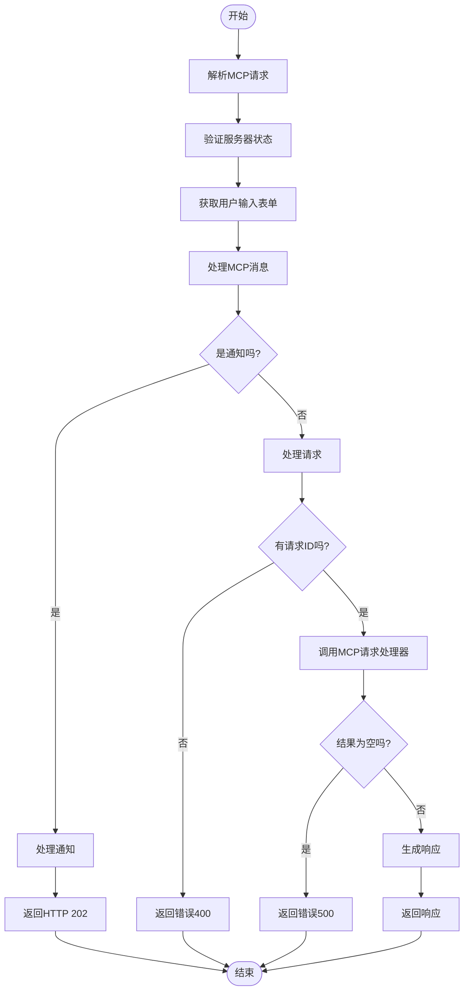
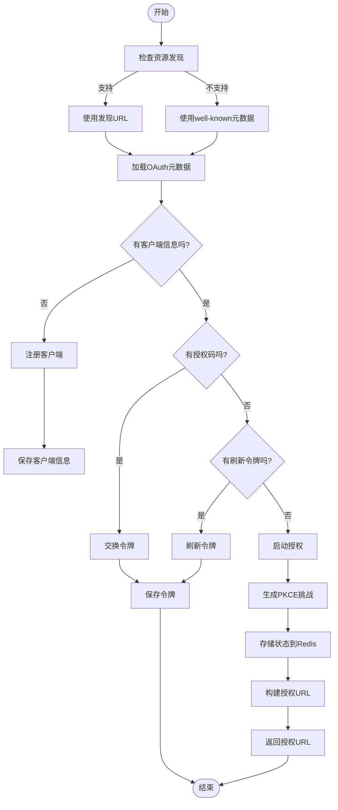
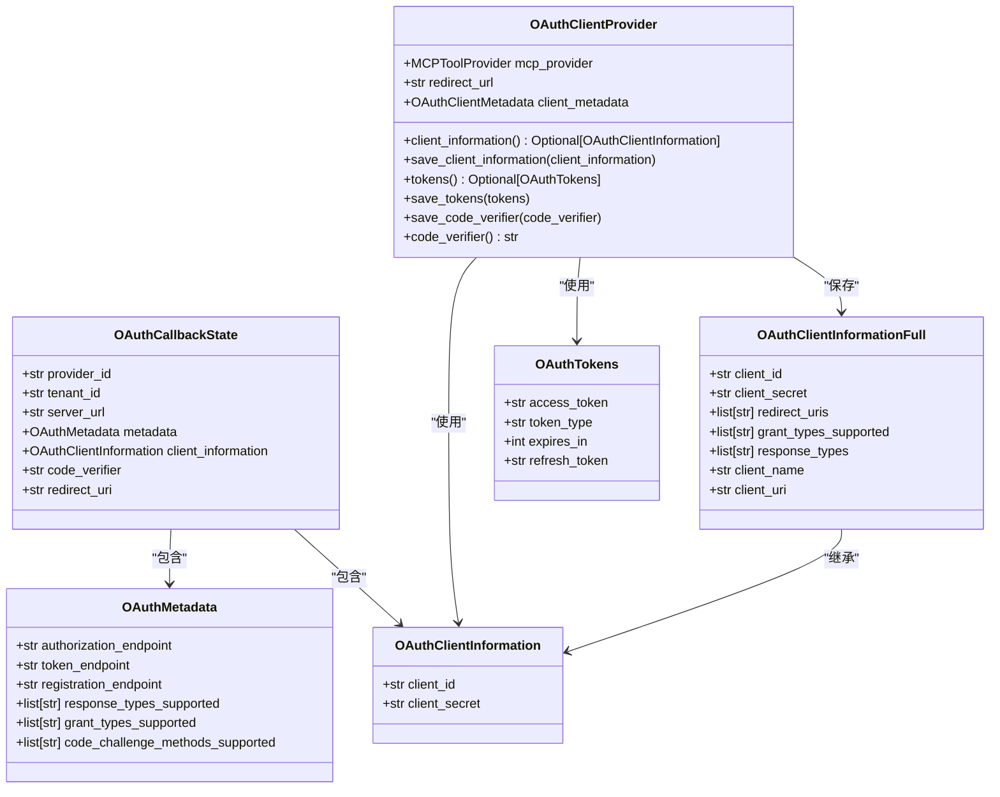
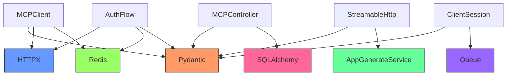

# MCP工具集成

<cite>
**本文档引用的文件**  
- [mcp_client.py](file://api/core/mcp/mcp_client.py)
- [mcp.py](file://api/controllers/mcp/mcp.py)
- [types.py](file://api/core/mcp/types.py)
- [streamable_http.py](file://api/core/mcp/server/streamable_http.py)
- [auth_flow.py](file://api/core/mcp/auth/auth_flow.py)
- [auth_provider.py](file://api/core/mcp/auth/auth_provider.py)
- [client_session.py](file://api/core/mcp/session/client_session.py)
- [base_session.py](file://api/core/mcp/session/base_session.py)
</cite>

## 目录
1. [简介](#简介)
2. [项目结构](#项目结构)
3. [核心组件](#核心组件)
4. [架构概述](#架构概述)
5. [详细组件分析](#详细组件分析)
6. [依赖分析](#依赖分析)
7. [性能考虑](#性能考虑)
8. [故障排除指南](#故障排除指南)
9. [结论](#结论)

## 简介
本文档详细介绍了Dify平台与MCP（Model Context Protocol）工具的集成方法。重点说明了如何通过MCP协议连接外部工具服务，包括认证流程、请求处理、响应解析和错误处理机制。文档提供了MCP客户端实现、服务端配置和双向通信模式的代码示例，并涵盖了MCP工具注册、权限控制、性能监控和安全验证的最佳实践，以及如何实现流式响应和异步调用的支持。

## 项目结构
Dify平台的MCP工具集成主要分布在`api/core/mcp`和`api/controllers/mcp`目录下。核心功能包括客户端实现、服务端处理、认证机制、会话管理和类型定义。

**图示来源**  
- [mcp_client.py](file://api/core/mcp/mcp_client.py)
- [mcp.py](file://api/controllers/mcp/mcp.py)
- [types.py](file://api/core/mcp/types.py)
- [streamable_http.py](file://api/core/mcp/server/streamable_http.py)
- [auth_flow.py](file://api/core/mcp/auth/auth_flow.py)
- [auth_provider.py](file://api/core/mcp/auth/auth_provider.py)
- [client_session.py](file://api/core/mcp/session/client_session.py)
- [base_session.py](file://api/core/mcp/session/base_session.py)

**本节来源**  
- [mcp_client.py](file://api/core/mcp/mcp_client.py)
- [mcp.py](file://api/controllers/mcp/mcp.py)

## 核心组件
MCP工具集成的核心组件包括MCP客户端、服务端处理器、认证提供者和会话管理器。这些组件共同实现了MCP协议的完整功能，包括工具调用、资源读取、进度通知和错误处理。

**本节来源**  
- [mcp_client.py](file://api/core/mcp/mcp_client.py#L1-L160)
- [types.py](file://api/core/mcp/types.py#L1-L799)
- [streamable_http.py](file://api/core/mcp/server/streamable_http.py#L1-L262)

## 架构概述
MCP工具集成采用客户端-服务端架构，通过JSON-RPC协议进行通信。客户端负责发起请求和处理响应，服务端负责处理请求并返回结果。认证机制基于OAuth 2.0，会话管理使用Redis存储状态信息。

**图示来源**  
- [mcp_client.py](file://api/core/mcp/mcp_client.py)
- [mcp.py](file://api/controllers/mcp/mcp.py)
- [streamable_http.py](file://api/core/mcp/server/streamable_http.py)
- [auth_provider.py](file://api/core/mcp/auth/auth_provider.py)
- [auth_flow.py](file://api/core/mcp/auth/auth_flow.py)

## 详细组件分析

### MCP客户端分析
MCP客户端是Dify平台与外部工具服务通信的主要组件。它负责建立连接、发送请求、接收响应和管理会话。

#### 客户端类图

**图示来源**  
- [mcp_client.py](file://api/core/mcp/mcp_client.py#L1-L160)
- [auth_provider.py](file://api/core/mcp/auth/auth_provider.py#L1-L79)

#### 客户端序列图

**图示来源**  
- [mcp_client.py](file://api/core/mcp/mcp_client.py#L1-L160)
- [mcp.py](file://api/controllers/mcp/mcp.py#L1-L244)
- [streamable_http.py](file://api/core/mcp/server/streamable_http.py#L1-L262)

**本节来源**  
- [mcp_client.py](file://api/core/mcp/mcp_client.py#L1-L160)
- [client_session.py](file://api/core/mcp/session/client_session.py#L1-L364)
- [base_session.py](file://api/core/mcp/session/base_session.py#L1-L410)

### MCP服务端分析
MCP服务端负责处理来自客户端的请求，包括初始化、工具调用、资源读取等操作。它与Dify平台的核心服务集成，实现业务逻辑处理。

#### 服务端序列图

**图示来源**  
- [mcp.py](file://api/controllers/mcp/mcp.py#L1-L244)
- [streamable_http.py](file://api/core/mcp/server/streamable_http.py#L1-L262)

#### 请求处理流程图

**图示来源**  
- [mcp.py](file://api/controllers/mcp/mcp.py#L1-L244)

**本节来源**  
- [mcp.py](file://api/controllers/mcp/mcp.py#L1-L244)
- [streamable_http.py](file://api/core/mcp/server/streamable_http.py#L1-L262)

### 认证机制分析
MCP工具集成使用OAuth 2.0协议进行认证，支持动态客户端注册和令牌刷新。认证流程确保了客户端与服务端之间的安全通信。

#### 认证流程图

**图示来源**  
- [auth_flow.py](file://api/core/mcp/auth/auth_flow.py#L1-L370)
- [auth_provider.py](file://api/core/mcp/auth/auth_provider.py#L1-L79)

#### 认证类图

**图示来源**  
- [auth_provider.py](file://api/core/mcp/auth/auth_provider.py#L1-L79)
- [auth_flow.py](file://api/core/mcp/auth/auth_flow.py#L1-L370)

**本节来源**  
- [auth_flow.py](file://api/core/mcp/auth/auth_flow.py#L1-L370)
- [auth_provider.py](file://api/core/mcp/auth/auth_provider.py#L1-L79)

## 依赖分析
MCP工具集成的依赖关系清晰，各组件职责分明。核心依赖包括Pydantic用于数据验证，HTTPX用于HTTP请求，Redis用于状态存储。

**图示来源**  
- [mcp_client.py](file://api/core/mcp/mcp_client.py)
- [mcp.py](file://api/controllers/mcp/mcp.py)
- [streamable_http.py](file://api/core/mcp/server/streamable_http.py)
- [auth_flow.py](file://api/core/mcp/auth/auth_flow.py)
- [client_session.py](file://api/core/mcp/session/client_session.py)

**本节来源**  
- [mcp_client.py](file://api/core/mcp/mcp_client.py)
- [mcp.py](file://api/controllers/mcp/mcp.py)
- [streamable_http.py](file://api/core/mcp/server/streamable_http.py)
- [auth_flow.py](file://api/core/mcp/auth/auth_flow.py)
- [client_session.py](file://api/core/mcp/session/client_session.py)

## 性能考虑
MCP工具集成在设计时考虑了性能优化，包括连接复用、异步处理和缓存机制。客户端使用ExitStack管理上下文，确保资源正确释放。服务端使用线程池处理并发请求，提高响应速度。

**本节来源**  
- [mcp_client.py](file://api/core/mcp/mcp_client.py)
- [base_session.py](file://api/core/mcp/session/base_session.py)

## 故障排除指南
当MCP工具集成出现问题时，可以按照以下步骤进行排查：

1. 检查服务器状态是否为ACTIVE
2. 验证OAuth令牌是否有效
3. 检查请求参数是否符合JSON-RPC规范
4. 查看日志中的错误信息
5. 确认网络连接是否正常

**本节来源**  
- [mcp.py](file://api/controllers/mcp/mcp.py)
- [mcp_client.py](file://api/core/mcp/mcp_client.py)
- [error.py](file://api/core/mcp/error.py)

## 结论
Dify平台的MCP工具集成提供了一套完整的解决方案，用于连接和管理外部工具服务。通过标准化的协议和清晰的架构设计，实现了安全、可靠和高效的通信。文档详细介绍了各个组件的功能和交互方式，为开发者提供了全面的参考。