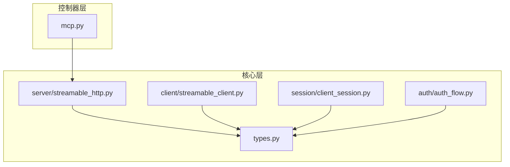
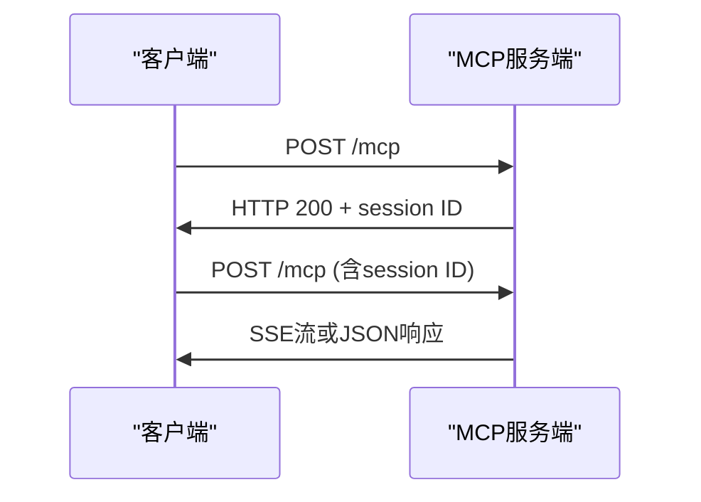
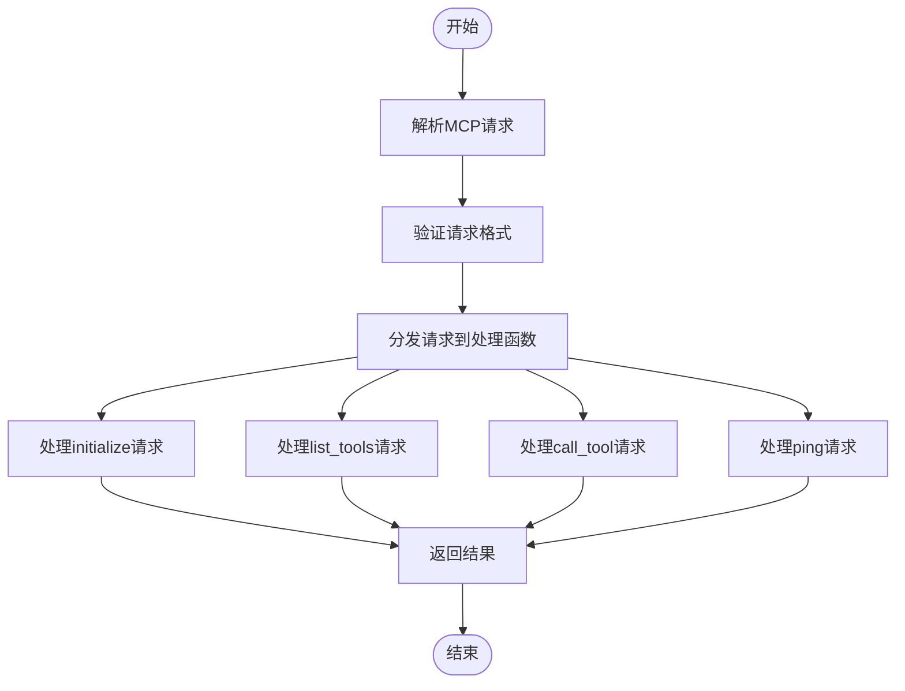
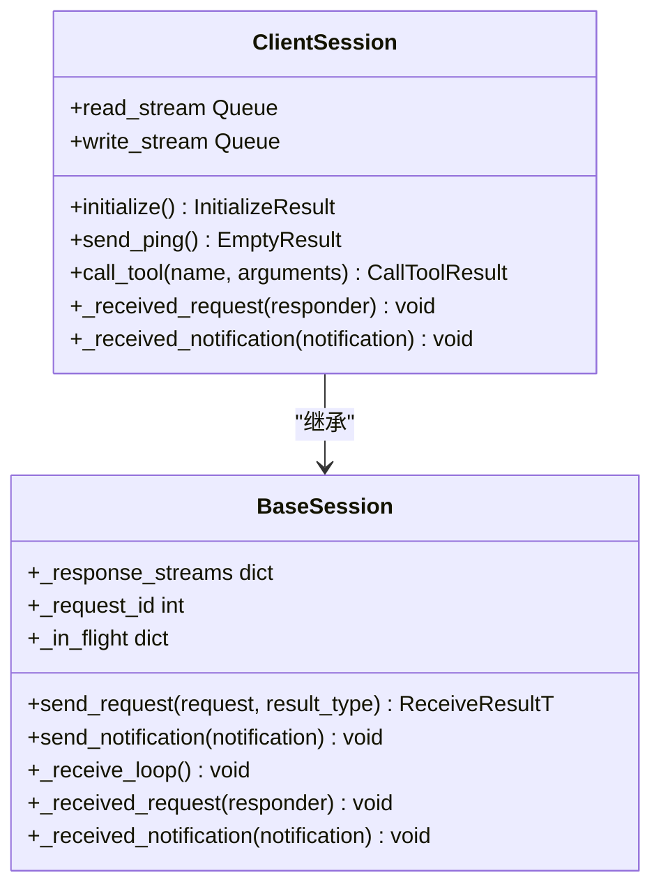
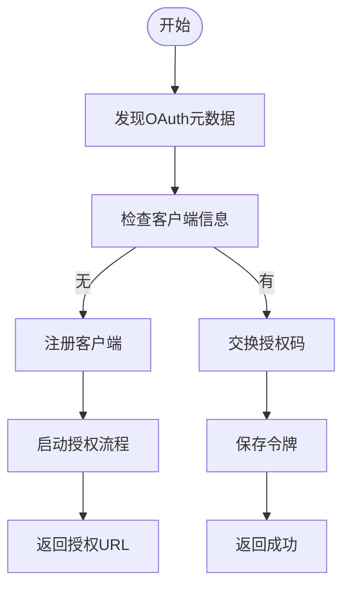
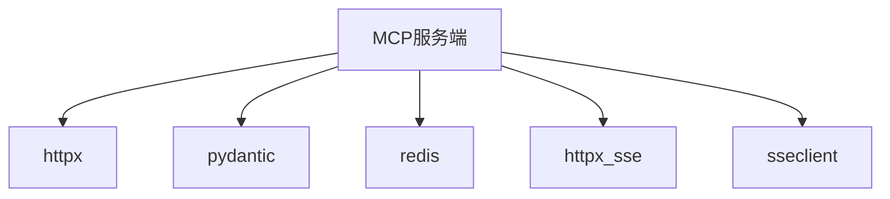

# MCP服务端配置

<cite>
**本文档引用的文件**
- [mcp.py](file://api/controllers/mcp/mcp.py)
- [streamable_http.py](file://api/core/mcp/server/streamable_http.py)
- [types.py](file://api/core/mcp/types.py)
- [auth_flow.py](file://api/core/mcp/auth/auth_flow.py)
- [client_session.py](file://api/core/mcp/session/client_session.py)
- [base_session.py](file://api/core/mcp/session/base_session.py)
- [streamable_client.py](file://api/core/mcp/client/streamable_client.py)
- [sse_client.py](file://api/core/mcp/client/sse_client.py)
</cite>

## 目录
1. [简介](#简介)
2. [项目结构](#项目结构)
3. [核心组件](#核心组件)
4. [架构概述](#架构概述)
5. [详细组件分析](#详细组件分析)
6. [依赖分析](#依赖分析)
7. [性能考虑](#性能考虑)
8. [故障排除指南](#故障排除指南)
9. [结论](#结论)

## 简介
本文档系统阐述了在Dify平台中配置MCP（Model Context Protocol）服务端的方法和最佳实践。详细说明了HTTP流式接口的实现、路由配置、认证集成和请求处理流程。文档涵盖如何定义工具端点、处理并发请求、管理会话状态和集成身份验证机制。提供了配置示例，展示如何设置超时策略、速率限制和日志记录，以及如何与现有API网关和中间件协同工作。

## 项目结构
MCP服务端的实现主要分布在`api/controllers/mcp`和`api/core/mcp`两个目录中。`api/controllers/mcp`目录包含MCP请求的路由和控制器逻辑，而`api/core/mcp`目录则包含了MCP协议的核心实现，包括服务器端、客户端、会话管理、认证流程和类型定义。

**图示来源**
- [mcp.py](file://api/controllers/mcp/mcp.py)
- [streamable_http.py](file://api/core/mcp/server/streamable_http.py)
- [streamable_client.py](file://api/core/mcp/client/streamable_client.py)
- [client_session.py](file://api/core/mcp/session/client_session.py)
- [auth_flow.py](file://api/core/mcp/auth/auth_flow.py)
- [types.py](file://api/core/mcp/types.py)

**章节来源**
- [mcp.py](file://api/controllers/mcp/mcp.py)
- [streamable_http.py](file://api/core/mcp/server/streamable_http.py)

## 核心组件
MCP服务端的核心组件包括请求处理、会话管理、认证流程和类型定义。`mcp.py`文件中的`MCPAppApi`类负责处理HTTP请求，验证服务器状态，并将请求分发给相应的处理函数。`streamable_http.py`文件中的`handle_mcp_request`函数是MCP请求的主处理函数，它根据请求类型调用相应的处理函数。`types.py`文件定义了MCP协议的所有类型，包括请求、响应、通知和错误。`auth_flow.py`文件实现了OAuth 2.0认证流程，包括客户端注册、授权码交换和令牌刷新。

**章节来源**
- [mcp.py](file://api/controllers/mcp/mcp.py#L1-L244)
- [streamable_http.py](file://api/core/mcp/server/streamable_http.py#L1-L262)
- [types.py](file://api/core/mcp/types.py#L1-L799)
- [auth_flow.py](file://api/core/mcp/auth/auth_flow.py#L1-L370)

## 架构概述
MCP服务端的架构基于JSON-RPC 2.0协议，通过HTTP POST请求进行通信。客户端首先发送一个`initialize`请求来初始化连接，服务器返回其支持的协议版本和功能。随后，客户端可以发送`tools/list`请求来获取可用的工具列表，或发送`tools/call`请求来调用特定工具。服务器通过SSE（Server-Sent Events）或JSON响应返回结果。会话管理通过`mcp-session-id`头部实现，确保客户端和服务器之间的会话状态一致。

**图示来源**
- [mcp.py](file://api/controllers/mcp/mcp.py#L1-L244)
- [streamable_http.py](file://api/core/mcp/server/streamable_http.py#L1-L262)

## 详细组件分析

### MCP请求处理
MCP请求处理的核心是`handle_mcp_request`函数，它根据请求类型分发到不同的处理函数。`initialize`请求返回服务器的协议版本和功能，`list_tools`请求返回可用的工具列表，`call_tool`请求调用指定的工具并返回结果，`ping`请求用于检查连接状态。

**图示来源**
- [streamable_http.py](file://api/core/mcp/server/streamable_http.py#L1-L262)

**章节来源**
- [streamable_http.py](file://api/core/mcp/server/streamable_http.py#L1-L262)

### 会话管理
会话管理通过`client_session.py`和`base_session.py`实现。`ClientSession`类封装了与服务器的通信，包括发送请求、接收响应和处理通知。`BaseSession`类提供了会话管理的基类，包括请求/响应匹配、通知处理和进度报告。

**图示来源**
- [client_session.py](file://api/core/mcp/session/client_session.py#L1-L364)
- [base_session.py](file://api/core/mcp/session/base_session.py#L1-L410)

**章节来源**
- [client_session.py](file://api/core/mcp/session/client_session.py#L1-L364)
- [base_session.py](file://api/core/mcp/session/base_session.py#L1-L410)

### 认证流程
认证流程通过`auth_flow.py`实现，支持OAuth 2.0动态客户端注册和授权码交换。`auth`函数是认证流程的入口，它根据服务器元数据决定是否需要注册客户端，然后启动授权流程或交换授权码。

**图示来源**
- [auth_flow.py](file://api/core/mcp/auth/auth_flow.py#L1-L370)

**章节来源**
- [auth_flow.py](file://api/core/mcp/auth/auth_flow.py#L1-L370)

## 依赖分析
MCP服务端依赖于多个外部库，包括`httpx`用于HTTP请求，`pydantic`用于数据验证，`redis`用于状态存储。`streamable_client.py`使用`httpx_sse`库处理SSE流，`sse_client.py`使用`sseclient`库处理SSE事件。这些依赖通过`pyproject.toml`文件管理。

**图示来源**
- [streamable_client.py](file://api/core/mcp/client/streamable_client.py#L1-L478)
- [sse_client.py](file://api/core/mcp/client/sse_client.py#L1-L357)

**章节来源**
- [streamable_client.py](file://api/core/mcp/client/streamable_client.py#L1-L478)
- [sse_client.py](file://api/core/mcp/client/sse_client.py#L1-L357)

## 性能考虑
MCP服务端的性能考虑包括超时策略、速率限制和日志记录。`streamable_client.py`中的`StreamableHTTPTransport`类支持配置HTTP超时和SSE读取超时。`AppGenerateService`类实现了速率限制，防止滥用。日志记录通过Python的`logging`模块实现，记录关键操作和错误。

## 故障排除指南
常见的MCP服务端问题包括连接超时、认证失败和会话过期。连接超时通常是由于网络问题或服务器负载过高，可以通过增加超时时间解决。认证失败可能是由于客户端信息错误或令牌过期，需要重新注册或刷新令牌。会话过期是由于长时间未活动，客户端需要重新初始化连接。

**章节来源**
- [streamable_client.py](file://api/core/mcp/client/streamable_client.py#L1-L478)
- [auth_flow.py](file://api/core/mcp/auth/auth_flow.py#L1-L370)
- [base_session.py](file://api/core/mcp/session/base_session.py#L1-L410)

## 结论
MCP服务端在Dify平台中提供了一个强大的接口，用于与外部系统集成。通过HTTP流式接口、灵活的路由配置和安全的认证机制，MCP服务端能够高效地处理并发请求，管理会话状态，并与现有API网关和中间件协同工作。通过合理配置超时策略、速率限制和日志记录，可以确保MCP服务端的稳定性和安全性。