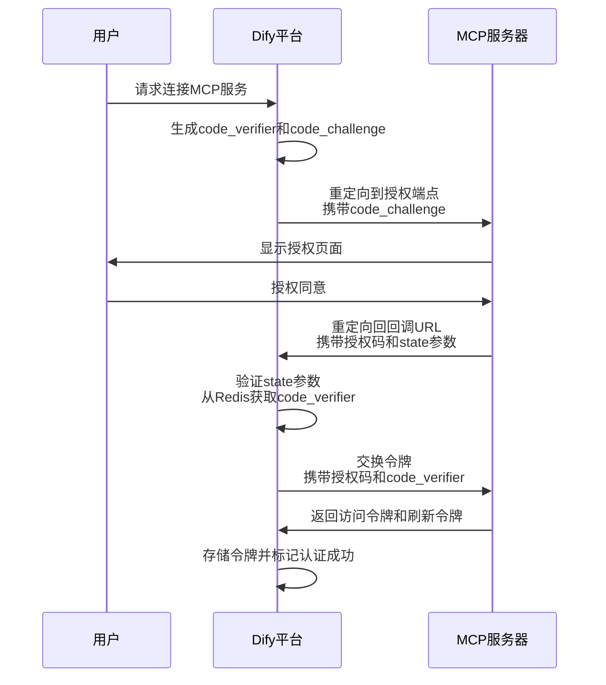
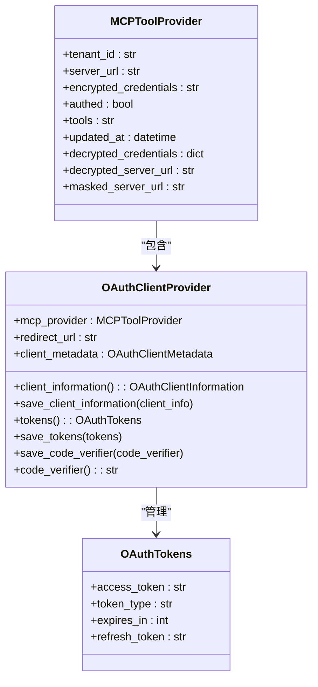
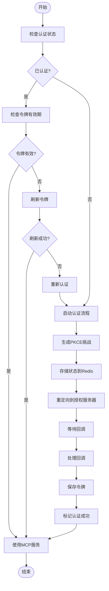
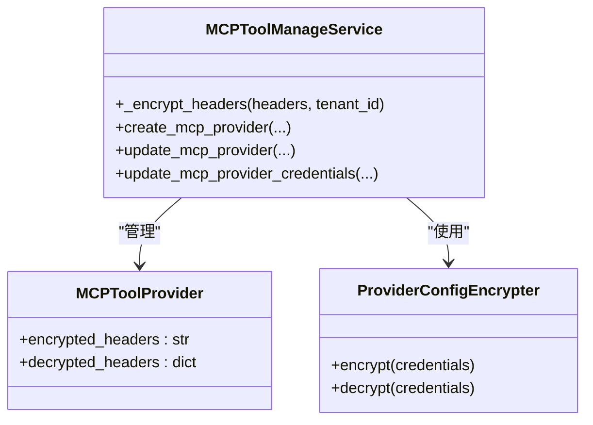

# 安全机制

<cite>
**本文档引用的文件**
- [auth_provider.py](file://api/core/mcp/auth/auth_provider.py)
- [auth_flow.py](file://api/core/mcp/auth/auth_flow.py)
- [tool_providers.py](file://api/controllers/console/workspace/tool_providers.py)
- [mcp_tools_manage_service.py](file://api/services/tools/mcp_tools_manage_service.py)
</cite>

## 目录
1. [引言](#引言)
2. [OAuth2.0认证流程](#oauth20认证流程)
3. [令牌管理](#令牌管理)
4. [权限验证机制](#权限验证机制)
5. [安全审计与日志](#安全审计与日志)
6. [安全头配置](#安全头配置)
7. [防重放攻击机制](#防重放攻击机制)
8. [请求来源验证](#请求来源验证)
9. [最小权限原则实施](#最小权限原则实施)
10. [HTTPS强制与CORS策略](#https强制与cors策略)
11. [输入验证与敏感信息保护](#输入验证与敏感信息保护)
12. [常见安全威胁应对](#常见安全威胁应对)

## 引言
Dify平台的MCP（Model Control Protocol）集成提供了一套全面的安全防护机制，确保第三方服务集成过程中的数据安全和系统完整性。本文档详细介绍了MCP集成的安全架构，包括OAuth2.0认证、令牌管理、权限验证和安全审计等核心安全措施。通过PKCE（Proof Key for Code Exchange）增强的OAuth2.0流程、Redis状态存储、安全头配置和最小权限原则，Dify平台为MCP集成提供了企业级的安全保障。

## OAuth2.0认证流程
Dify平台的MCP集成采用增强的OAuth2.0授权码流程，结合PKCE机制防止授权码拦截攻击。认证流程始于客户端生成随机的code_verifier和对应的code_challenge，确保授权过程的安全性。



**Diagram sources**
- [auth_flow.py](file://api/core/mcp/auth/auth_flow.py#L0-L43)
- [auth_provider.py](file://api/core/mcp/auth/auth_provider.py#L0-L38)

**Section sources**
- [auth_flow.py](file://api/core/mcp/auth/auth_flow.py#L0-L43)
- [auth_provider.py](file://api/core/mcp/auth/auth_provider.py#L0-L38)

## 令牌管理
Dify平台实施严格的令牌管理策略，确保访问令牌的安全存储和使用。令牌通过加密方式存储在数据库中，并采用刷新令牌机制维持长期访问权限。

### 令牌存储与加密
MCP服务的认证凭据（包括访问令牌、刷新令牌等）通过加密方式存储在`MCPToolProvider`模型的`encrypted_credentials`字段中。平台使用租户特定的加密密钥对敏感信息进行加密，确保数据的机密性。



**Diagram sources**
- [mcp_tools_manage_service.py](file://api/services/tools/mcp_tools_manage_service.py#L0-L329)
- [auth_provider.py](file://api/core/mcp/auth/auth_provider.py#L0-L79)

**Section sources**
- [mcp_tools_manage_service.py](file://api/services/tools/mcp_tools_manage_service.py#L0-L329)
- [auth_provider.py](file://api/core/mcp/auth/auth_provider.py#L0-L79)

## 权限验证机制
Dify平台的MCP集成实施多层次的权限验证机制，确保只有经过授权的用户和应用才能访问MCP服务。

### 认证状态验证
在访问MCP服务之前，系统会验证用户的认证状态。如果用户尚未认证或认证已过期，系统会引导用户完成OAuth2.0认证流程。



**Diagram sources**
- [auth_flow.py](file://api/core/mcp/auth/auth_flow.py#L335-L369)
- [tool_providers.py](file://api/controllers/console/workspace/tool_providers.py#L943-L974)

**Section sources**
- [auth_flow.py](file://api/core/mcp/auth/auth_flow.py#L335-L369)
- [tool_providers.py](file://api/controllers/console/workspace/tool_providers.py#L943-L974)

## 安全审计与日志
Dify平台记录所有与MCP集成相关的安全事件，包括认证尝试、令牌刷新和API调用，以便进行安全审计和故障排查。

### 安全事件记录
每次MCP服务的认证操作都会记录详细的安全日志，包括操作时间、用户信息、操作结果等。这些日志可用于检测异常行为和安全威胁。

**Section sources**
- [mcp_tools_manage_service.py](file://api/services/tools/mcp_tools_manage_service.py#L255-L285)
- [tool_providers.py](file://api/controllers/console/workspace/tool_providers.py#L913-L945)

## 安全头配置
Dify平台支持为MCP请求配置自定义HTTP头，以满足不同服务的安全要求。

### 自定义头管理
用户可以为MCP服务配置自定义HTTP头，这些头信息会被加密存储并用于与MCP服务器的通信。



**Diagram sources**
- [mcp_tools_manage_service.py](file://api/services/tools/mcp_tools_manage_service.py#L69-L108)
- [mcp_tools_manage_service.py](file://api/services/tools/mcp_tools_manage_service.py#L255-L285)

**Section sources**
- [mcp_tools_manage_service.py](file://api/services/tools/mcp_tools_manage_service.py#L69-L108)
- [mcp_tools_manage_service.py](file://api/services/tools/mcp_tools_manage_service.py#L255-L285)

## 防重放攻击机制
Dify平台采用多种机制防止重放攻击，确保认证过程的安全性。

### Redis状态存储
平台使用Redis存储OAuth2.0认证过程中的状态信息，每个状态都有5分钟的过期时间，防止状态参数被重复使用。

```python
OAUTH_STATE_EXPIRY_SECONDS = 5 * 60  # 5分钟过期
OAUTH_STATE_REDIS_KEY_PREFIX = "oauth_state:"
```

当接收到回调请求时，系统会从Redis中检索并删除状态数据，确保每个状态只能使用一次。

**Section sources**
- [auth_flow.py](file://api/core/mcp/auth/auth_flow.py#L0-L43)

## 请求来源验证
Dify平台通过多种方式验证请求来源，防止跨站请求伪造（CSRF）攻击。

### 回调URL验证
平台使用预定义的回调URL模式，确保OAuth2.0回调请求来自可信来源。

```python
@property
def redirect_url(self) -> str:
    """The URL to redirect the user agent to after authorization."""
    return dify_config.CONSOLE_API_URL + "/console/api/mcp/oauth/callback"
```

**Section sources**
- [auth_provider.py](file://api/core/mcp/auth/auth_provider.py#L0-L38)

## 最小权限原则实施
Dify平台在MCP集成中实施最小权限原则，确保每个组件只拥有完成其功能所需的最小权限。

### 权限分离
- **MCPToolManageService**: 负责MCP工具的创建、更新和删除
- **OAuthClientProvider**: 负责OAuth2.0客户端信息的管理
- **MCPClient**: 负责与MCP服务器的通信

每个服务都有明确的职责边界，避免权限过度集中。

**Section sources**
- [mcp_tools_manage_service.py](file://api/services/tools/mcp_tools_manage_service.py#L0-L329)
- [auth_provider.py](file://api/core/mcp/auth/auth_provider.py#L0-L79)

## HTTPS强制与CORS策略
Dify平台强制使用HTTPS进行所有通信，并实施严格的CORS策略。

### URL验证
在创建MCP服务时，系统会验证服务器URL的有效性，确保使用安全的HTTPS协议。

```python
def is_valid_url(url: str) -> bool:
    if not url:
        return False

    try:
        parsed = urlparse(url)
        return all([parsed.scheme, parsed.netloc]) and parsed.scheme in ["http", "https"]
    except Exception:
        return False
```

**Section sources**
- [tool_providers.py](file://api/controllers/console/workspace/tool_providers.py#L0-L799)

## 输入验证与敏感信息保护
Dify平台实施严格的输入验证和敏感信息保护措施。

### 敏感信息加密
所有敏感信息（如服务器URL、认证凭据、自定义头）都经过加密存储，防止数据泄露。

```python
encrypted_server_url = encrypter.encrypt_token(tenant_id, server_url)
```

**Section sources**
- [mcp_tools_manage_service.py](file://api/services/tools/mcp_tools_manage_service.py#L69-L108)

## 常见安全威胁应对
Dify平台针对常见的安全威胁提供了相应的防护措施。

### 威胁应对策略
| 安全威胁 | 应对措施 |
|---------|---------|
| 授权码拦截 | PKCE机制 |
| 重放攻击 | Redis状态存储，5分钟过期 |
| CSRF攻击 | 预定义回调URL，SameSite Cookie |
| 数据泄露 | 敏感信息加密存储 |
| 令牌泄露 | 短期访问令牌，定期刷新 |
| 无效URL | 严格的URL验证 |

**Section sources**
- [auth_flow.py](file://api/core/mcp/auth/auth_flow.py#L0-L370)
- [tool_providers.py](file://api/controllers/console/workspace/tool_providers.py#L800-L1090)
- [mcp_tools_manage_service.py](file://api/services/tools/mcp_tools_manage_service.py#L0-L329)