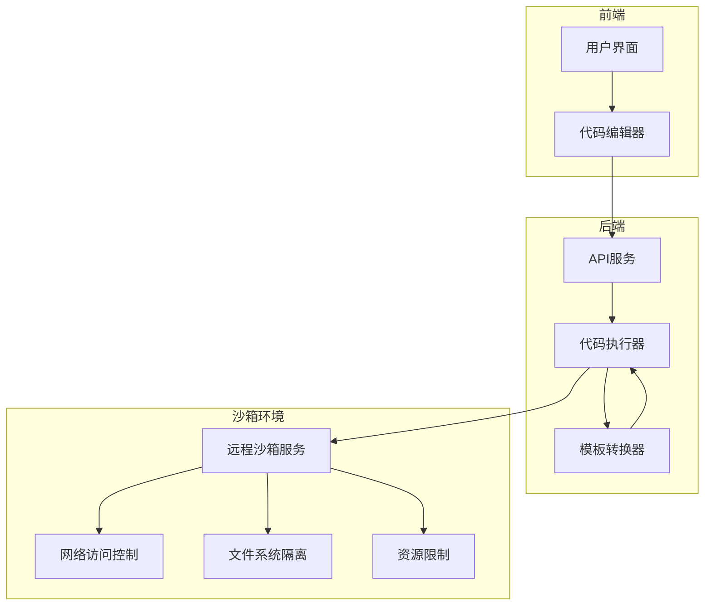
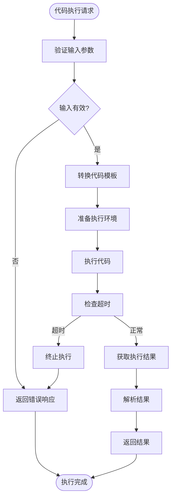
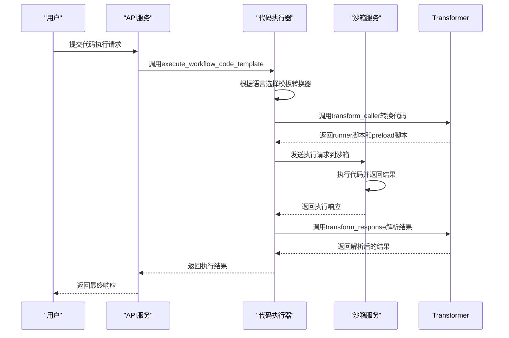
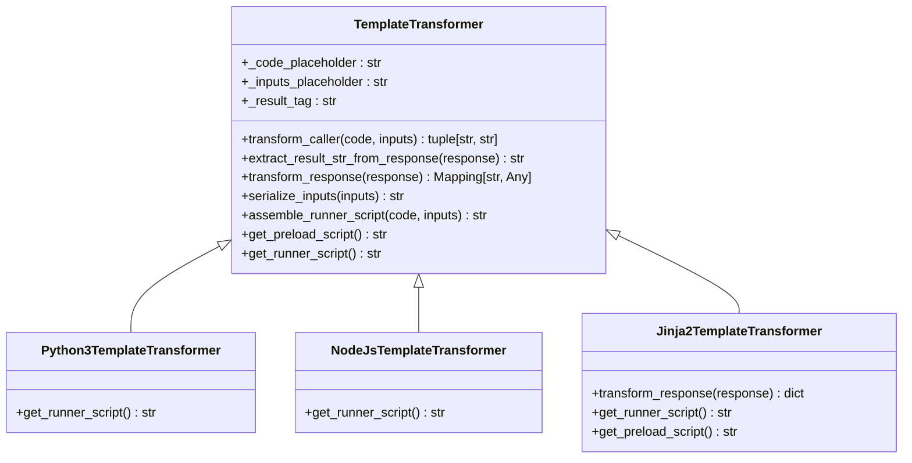
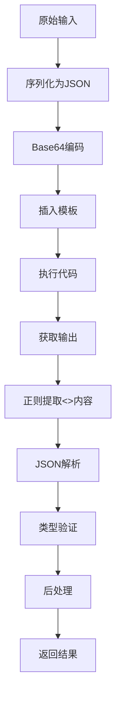
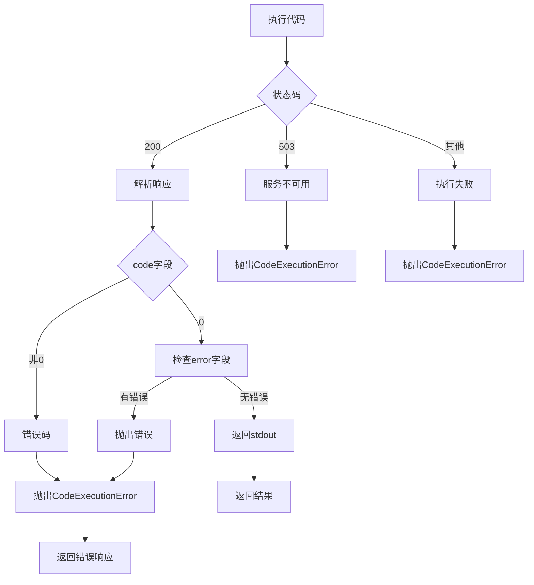

# 代码安全与沙箱机制

<cite>
**本文档引用文件**  
- [code_executor.py](file://api/core/helper/code_executor/code_executor.py)
- [python3_transformer.py](file://api/core/helper/code_executor/python3/python3_transformer.py)
- [javascript_transformer.py](file://api/core/helper/code_executor/javascript/javascript_transformer.py)
- [jinja2_transformer.py](file://api/core/helper/code_executor/jinja2/jinja2_transformer.py)
- [template_transformer.py](file://api/core/helper/code_executor/template_transformer.py)
- [python3_code_provider.py](file://api/core/helper/code_executor/python3/python3_code_provider.py)
- [javascript_code_provider.py](file://api/core/helper/code_executor/javascript/javascript_code_provider.py)
- [jinja2_formatter.py](file://api/core/helper/code_executor/jinja2/jinja2_formatter.py)
</cite>

## 目录
1. [引言](#引言)
2. [代码执行沙箱架构](#代码执行沙箱架构)
3. [安全防护机制](#安全防护机制)
4. [代码执行流程分析](#代码执行流程分析)
5. [语言支持与模板转换](#语言支持与模板转换)
6. [输入输出安全处理](#输入输出安全处理)
7. [异常处理与错误响应](#异常处理与错误响应)
8. [安全策略配置](#安全策略配置)
9. [安全审计与日志记录](#安全审计与日志记录)
10. [应急响应流程](#应急响应流程)

## 引言
Dify平台通过代码扩展工具为用户提供灵活的自定义能力，同时构建了完善的代码安全与沙箱执行机制。该机制确保用户编写的代码在隔离环境中安全执行，有效防止恶意代码、无限循环、内存溢出等安全风险。本文档深入解析Dify代码沙箱的实现原理和安全防护体系。

## 代码执行沙箱架构

**图示来源**  
- [code_executor.py](file://api/core/helper/code_executor/code_executor.py#L1-L142)
- [template_transformer.py](file://api/core/helper/code_executor/template_transformer.py#L1-L114)

**本节来源**  
- [code_executor.py](file://api/core/helper/code_executor/code_executor.py#L1-L142)

## 安全防护机制

Dify代码沙箱机制通过多层防护确保执行安全：

1. **资源限制**：通过配置超时参数限制代码执行时间，防止无限循环
2. **网络访问控制**：可配置是否启用网络访问权限
3. **文件系统隔离**：代码在容器化环境中执行，与主系统隔离
4. **进程监控**：远程沙箱服务监控执行过程，及时终止异常进程
5. **输入验证**：对输入参数进行严格验证和序列化处理

**图示来源**  
- [code_executor.py](file://api/core/helper/code_executor/code_executor.py#L50-L142)
- [template_transformer.py](file://api/core/helper/code_executor/template_transformer.py#L30-L114)

**本节来源**  
- [code_executor.py](file://api/core/helper/code_executor/code_executor.py#L50-L142)

## 代码执行流程分析

**图示来源**  
- [code_executor.py](file://api/core/helper/code_executor/code_executor.py#L100-L142)
- [template_transformer.py](file://api/core/helper/code_executor/template_transformer.py#L30-L114)

**本节来源**  
- [code_executor.py](file://api/core/helper/code_executor/code_executor.py#L100-L142)

## 语言支持与模板转换

Dify支持多种编程语言的代码执行，通过模板转换器实现安全执行：

**图示来源**  
- [template_transformer.py](file://api/core/helper/code_executor/template_transformer.py#L1-L114)
- [python3_transformer.py](file://api/core/helper/code_executor/python3/python3_transformer.py#L1-L27)
- [javascript_transformer.py](file://api/core/helper/code_executor/javascript/javascript_transformer.py#L1-L26)
- [jinja2_transformer.py](file://api/core/helper/code_executor/jinja2/jinja2_transformer.py#L1-L57)

**本节来源**  
- [template_transformer.py](file://api/core/helper/code_executor/template_transformer.py#L1-L114)

## 输入输出安全处理

Dify对代码执行的输入输出进行严格的安全处理：

1. **输入序列化**：使用`dumps_with_segments`函数序列化输入参数
2. **Base64编码**：对序列化后的输入进行Base64编码
3. **结果标记**：使用`<<RESULT>>`标记包裹执行结果
4. **正则提取**：通过正则表达式提取标记内的结果
5. **JSON解析**：将提取的字符串解析为JSON对象
6. **类型验证**：验证结果为字典类型且键为字符串

**图示来源**  
- [template_transformer.py](file://api/core/helper/code_executor/template_transformer.py#L80-L114)
- [jinja2_transformer.py](file://api/core/helper/code_executor/jinja2/jinja2_transformer.py#L10-L57)

**本节来源**  
- [template_transformer.py](file://api/core/helper/code_executor/template_transformer.py#L80-L114)

## 异常处理与错误响应

**图示来源**  
- [code_executor.py](file://api/core/helper/code_executor/code_executor.py#L70-L100)
- [CodeExecutionResponse](file://api/core/helper/code_executor/code_executor.py#L15-L25)

**本节来源**  
- [code_executor.py](file://api/core/helper/code_executor/code_executor.py#L70-L100)

## 安全策略配置

Dify通过配置文件管理代码执行的安全策略：

- **CODE_EXECUTION_ENDPOINT**：沙箱服务端点
- **CODE_EXECUTION_API_KEY**：API密钥认证
- **连接超时**：CODE_EXECUTION_CONNECT_TIMEOUT
- **读取超时**：CODE_EXECUTION_READ_TIMEOUT
- **写入超时**：CODE_EXECUTION_WRITE_TIMEOUT
- **网络访问**：enable_network参数控制

这些配置确保代码执行在受控环境中进行，可根据实际需求调整安全级别。

**本节来源**  
- [code_executor.py](file://api/core/helper/code_executor/code_executor.py#L10-L20)

## 安全审计与日志记录

Dify平台实施全面的安全审计机制：

1. **日志记录**：使用标准logging模块记录执行过程
2. **错误追踪**：捕获并记录所有异常信息
3. **执行审计**：记录代码执行的输入、输出和状态
4. **安全监控**：监控异常执行模式和潜在攻击

通过这些机制，平台能够及时发现和响应安全事件，确保系统的整体安全性。

**本节来源**  
- [code_executor.py](file://api/core/helper/code_executor/code_executor.py#L1-L142)

## 应急响应流程

当发生安全事件时，Dify平台的应急响应流程如下：

1. **检测**：通过日志和监控系统检测异常
2. **隔离**：立即终止可疑的代码执行进程
3. **分析**：分析日志和执行上下文确定影响范围
4. **报告**：生成安全事件报告并通知相关人员
5. **修复**：根据分析结果实施修复措施
6. **验证**：验证修复措施的有效性
7. **改进**：更新安全策略防止类似事件再次发生

该流程确保平台能够快速有效地应对各种安全威胁。

**本节来源**  
- [code_executor.py](file://api/core/helper/code_executor/code_executor.py#L1-L142)
- [template_transformer.py](file://api/core/helper/code_executor/template_transformer.py#L1-L114)