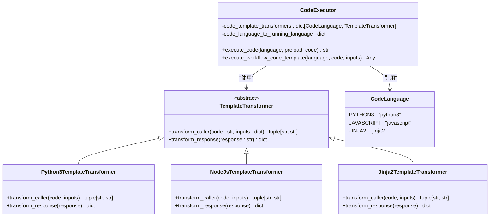
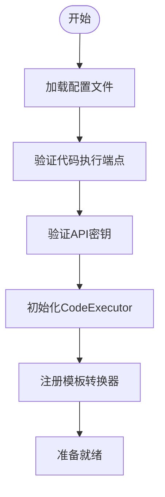
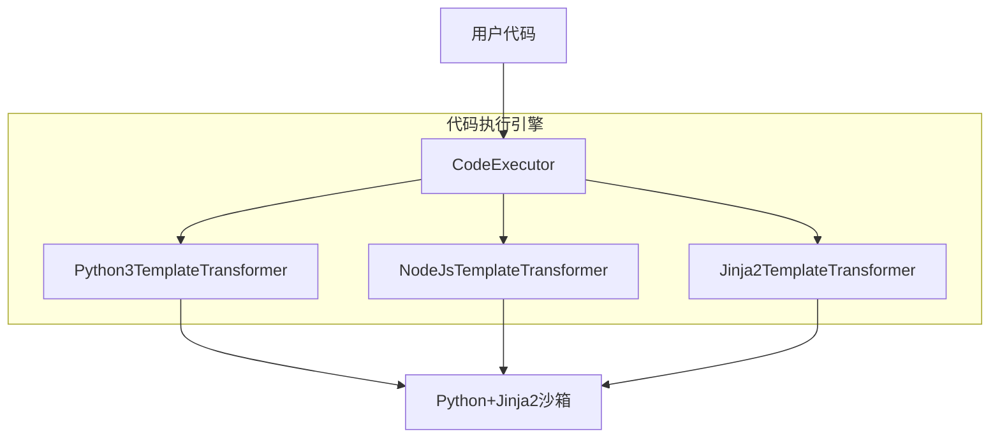
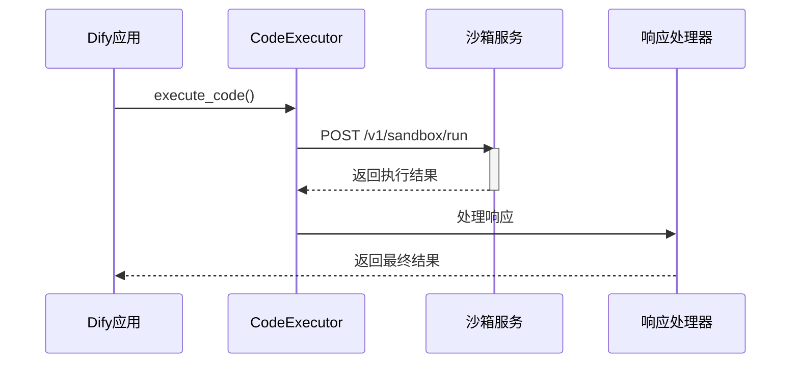
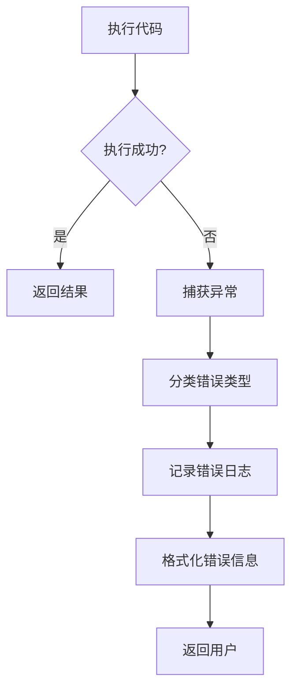
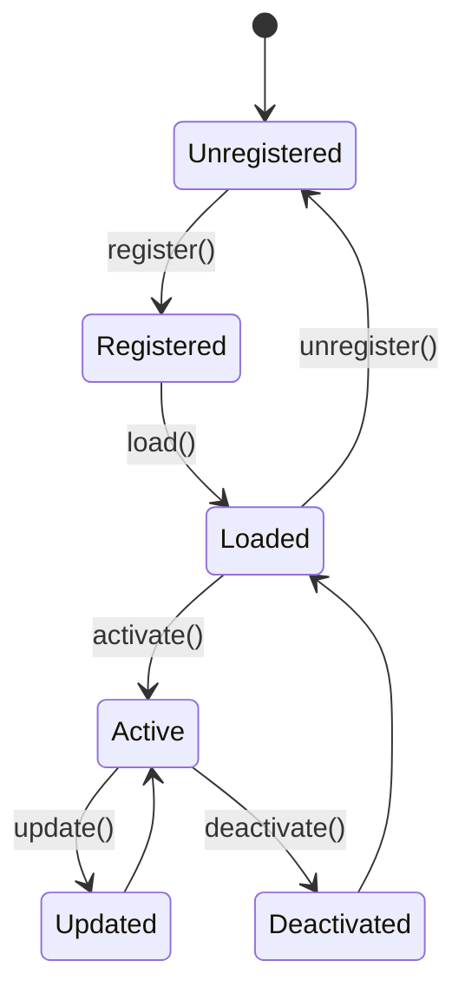

# 代码扩展工具

<cite>
**本文档中引用的文件**  
- [code_executor.py](file://api/core/helper/code_executor/code_executor.py#L1-L142)
- [ext_code_based_extension.py](file://api/extensions/ext_code_based_extension.py#L1-L9)
- [code_based_extension_service.py](file://api/services/code_based_extension_service.py#L1-L16)
- [extension.py](file://api/controllers/console/extension.py#L1-L36)
</cite>

## 目录
1. [简介](#简介)
2. [代码扩展机制概述](#代码扩展机制概述)
3. [环境配置与依赖管理](#环境配置与依赖管理)
4. [支持的代码执行语言](#支持的代码执行语言)
5. [代码安全沙箱与资源限制](#代码安全沙箱与资源限制)
6. [错误处理与调试技巧](#错误处理与调试技巧)
7. [工具热更新与版本管理](#工具热更新与版本管理)
8. [最佳实践](#最佳实践)

## 简介
Dify 提供了强大的代码扩展能力，允许开发者通过编写自定义代码来扩展系统功能。本文档详细介绍了如何使用代码方式扩展 Dify 工具的能力，涵盖环境配置、代码结构、依赖管理、部署流程以及不同类型代码扩展工具的实现方法。重点介绍 Python、JavaScript 和 Jinja2 代码执行工具的实现，并提供安全沙箱、资源限制、错误处理和调试的最佳实践。

## 代码扩展机制概述

Dify 的代码扩展机制基于模块化设计，通过 `Extension` 类实现功能扩展。核心组件包括代码执行器（CodeExecutor）、模板转换器（TemplateTransformer）和扩展服务（CodeBasedExtensionService），支持在工作流中动态执行用户提供的代码片段。

该机制允许开发者通过定义模块扩展来添加新的工具能力，系统会自动加载并注册这些扩展，供工作流节点调用。扩展可以是非内置的自定义功能，也可以是集成第三方 API 的接口。

**Diagram sources**
- [code_executor.py](file://api/core/helper/code_executor/code_executor.py#L1-L142)

**Section sources**
- [code_executor.py](file://api/core/helper/code_executor/code_executor.py#L1-L142)

## 环境配置与依赖管理

要启用代码扩展功能，需要正确配置运行环境和依赖项。系统通过 `dify_config` 模块加载配置参数，包括代码执行端点地址、API 密钥和超时设置。

依赖管理方面，系统支持 Python3 的依赖安装，通过沙箱环境中的包管理器自动处理第三方库的安装。对于 JavaScript 和 Jinja2，由于其轻量级特性，通常不需要额外依赖。

配置参数包括：
- `CODE_EXECUTION_ENDPOINT`: 代码执行服务的 URL
- `CODE_EXECUTION_API_KEY`: 访问沙箱服务的 API 密钥
- 超时设置：连接、读取、写入超时时间

**Diagram sources**
- [code_executor.py](file://api/core/helper/code_executor/code_executor.py#L1-L142)

**Section sources**
- [code_executor.py](file://api/core/helper/code_executor/code_executor.py#L1-L142)

## 支持的代码执行语言

Dify 支持三种主要的代码执行语言：Python3、JavaScript 和 Jinja2。每种语言都有对应的模板转换器负责将用户代码包装成可执行格式，并处理输入输出转换。

### Python3 执行
Python3 是最常用的扩展语言，支持完整的函数定义和复杂逻辑处理。系统使用 `Python3TemplateTransformer` 将用户代码转换为标准函数调用格式。

### JavaScript 执行
JavaScript 支持通过 Node.js 运行时执行，适用于前端逻辑移植和轻量级脚本处理。`NodeJsTemplateTransformer` 负责处理 JavaScript 代码的包装和执行。

### Jinja2 模板
Jinja2 主要用于模板渲染场景，将动态数据填充到预定义模板中。`Jinja2TemplateTransformer` 实现了模板引擎的集成。

**Diagram sources**
- [code_executor.py](file://api/core/helper/code_executor/code_executor.py#L1-L142)

**Section sources**
- [code_executor.py](file://api/core/helper/code_executor/code_executor.py#L1-L142)

## 代码安全沙箱与资源限制

为确保系统安全，所有代码执行都在隔离的沙箱环境中进行。沙箱服务通过容器化技术实现进程隔离，防止恶意代码对主机系统造成影响。

安全机制包括：
- 网络访问控制：可选择性启用网络访问
- 资源限制：CPU、内存、执行时间限制
- 权限隔离：无 root 权限，有限文件系统访问
- 输入验证：对用户输入进行严格校验

系统通过 HTTP 请求与沙箱服务通信，发送执行指令并接收结果。如果沙箱服务不可用或返回错误，系统会抛出相应的异常。

**Diagram sources**
- [code_executor.py](file://api/core/helper/code_executor/code_executor.py#L1-L142)

**Section sources**
- [code_executor.py](file://api/core/helper/code_executor/code_executor.py#L1-L142)

## 错误处理与调试技巧

系统提供了完善的错误处理机制，能够捕获并报告代码执行过程中的各种异常情况。常见的错误类型包括语法错误、运行时异常、超时错误和沙箱服务不可用等。

调试建议：
- 使用单元测试验证代码逻辑
- 在开发环境中启用详细日志
- 利用模拟器进行离线测试
- 逐步增加复杂度，避免一次性编写复杂逻辑

错误处理流程：
1. 捕获异常并分类
2. 提供详细的错误信息
3. 记录日志用于后续分析
4. 向用户返回友好的错误提示

**Diagram sources**
- [code_executor.py](file://api/core/helper/code_executor/code_executor.py#L1-L142)

**Section sources**
- [code_executor.py](file://api/core/helper/code_executor/code_executor.py#L1-L142)

## 工具热更新与版本管理

Dify 支持代码扩展工具的热更新功能，无需重启服务即可应用新的代码变更。系统通过动态加载机制实现模块的实时更新。

版本管理建议：
- 使用语义化版本控制
- 维护变更日志
- 提供向后兼容性
- 实现灰度发布机制

扩展注册流程：
1. 定义扩展模块
2. 实现扩展接口
3. 注册到扩展管理器
4. 系统自动发现并加载

**Diagram sources**
- [ext_code_based_extension.py](file://api/extensions/ext_code_based_extension.py#L1-L9)
- [code_based_extension_service.py](file://api/services/code_based_extension_service.py#L1-L16)

**Section sources**
- [ext_code_based_extension.py](file://api/extensions/ext_code_based_extension.py#L1-L9)
- [code_based_extension_service.py](file://api/services/code_based_extension_service.py#L1-L16)

## 最佳实践

### 安全性最佳实践
- 避免执行不受信任的代码
- 限制网络访问权限
- 定期更新沙箱环境
- 实施输入验证和过滤

### 性能优化
- 减少外部依赖
- 优化算法复杂度
- 合理设置超时时间
- 使用缓存机制

### 可维护性
- 编写清晰的文档
- 实现单元测试
- 遵循编码规范
- 模块化设计

### 部署建议
- 在生产环境使用独立的沙箱服务
- 配置监控和告警
- 定期备份配置
- 实施访问控制

**Section sources**
- [code_executor.py](file://api/core/helper/code_executor/code_executor.py#L1-L142)
- [ext_code_based_extension.py](file://api/extensions/ext_code_based_extension.py#L1-L9)