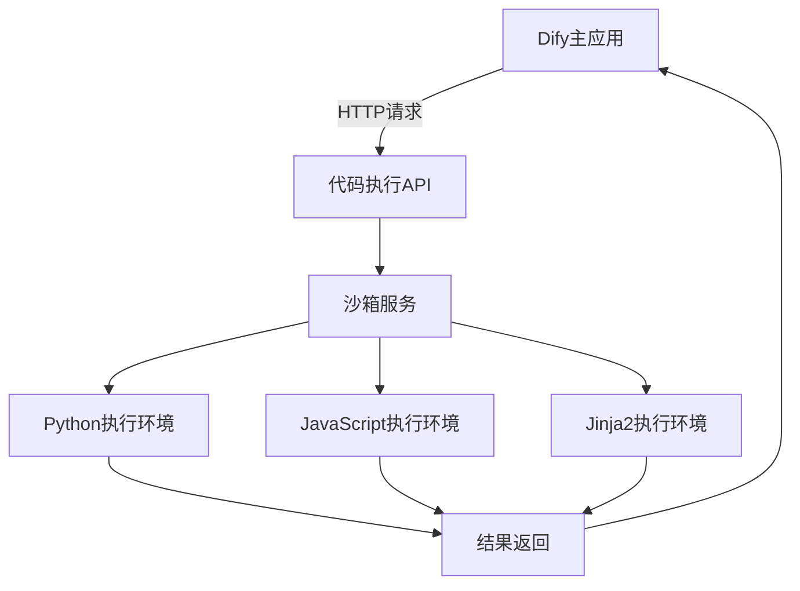

# 代码扩展环境配置

<cite>
**本文档中引用的文件**  
- [code_executor.py](file://api/core/helper/code_executor/code_executor.py)
- [app_config.py](file://api/configs/app_config.py)
- [docker-compose.yaml](file://docker/docker-compose.yaml)
- [docker-compose-template.yaml](file://docker/docker-compose-template.yaml)
- [python3_transformer.py](file://api/core/helper/code_executor/python3/python3_transformer.py)
- [javascript_transformer.py](file://api/core/helper/code_executor/javascript/javascript_transformer.py)
- [jinja2_transformer.py](file://api/core/helper/code_executor/jinja2/jinja2_transformer.py)
</cite>

## 目录
1. [简介](#简介)
2. [代码执行环境架构](#代码执行环境架构)
3. [Python执行环境配置](#python执行环境配置)
4. [JavaScript执行环境配置](#javascript执行环境配置)
5. [Jinja2执行环境配置](#jinja2执行环境配置)
6. [Docker Compose环境配置](#docker-compose环境配置)
7. [环境变量设置](#环境变量设置)
8. [依赖包管理](#依赖包管理)
9. [资源限制与安全隔离](#资源限制与安全隔离)
10. [跨操作系统配置差异](#跨操作系统配置差异)
11. [集成到开发工作流](#集成到开发工作流)

## 简介
Dify代码扩展工具支持在隔离环境中安全执行Python、JavaScript和Jinja2代码。该功能通过沙箱服务实现，确保用户编写的代码在受控环境下运行，防止潜在的安全风险。本配置文档详细说明了如何设置和管理代码执行环境，包括依赖管理、版本兼容性、环境变量配置和容器化部署方案。

**Section sources**
- [code_executor.py](file://api/core/helper/code_executor/code_executor.py#L1-L142)
- [app_config.py](file://api/configs/app_config.py#L1-L113)

## 代码执行环境架构
Dify的代码执行环境采用客户端-服务端分离架构。代码执行请求通过API发送到独立的沙箱服务，该服务在隔离容器中运行代码并返回结果。这种设计确保了主应用的安全性，同时提供了灵活的代码执行能力。



**Diagram sources**
- [code_executor.py](file://api/core/helper/code_executor/code_executor.py#L1-L142)

**Section sources**
- [code_executor.py](file://api/core/helper/code_executor/code_executor.py#L1-L142)

## Python执行环境配置
Python代码执行环境基于Python 3.x版本，通过`Python3TemplateTransformer`处理代码模板和输入参数。环境支持标准库和部分第三方包，所有代码在虚拟环境中执行以确保隔离性。

### 配置要求
- Python版本：3.8或更高
- 依赖管理：通过requirements.txt或pip安装
- 执行模式：函数式编程接口，要求定义main函数
- 输入输出：通过字典传递参数和返回结果

```python
def main(args1: int, args2: int):
    return {
        "result": args1 + args2,
    }
```

**Section sources**
- [code_executor.py](file://api/core/helper/code_executor/code_executor.py#L1-L142)
- [python3_transformer.py](file://api/core/helper/code_executor/python3/python3_transformer.py)

## JavaScript执行环境配置
JavaScript代码执行环境基于Node.js运行时，通过`NodeJsTemplateTransformer`处理模板和输入。支持ES6+语法和部分Node.js内置模块，但限制访问文件系统和网络资源。

### 配置要求
- Node.js版本：14.x或更高
- 执行模式：支持console.log输出和JSON序列化
- 输入处理：通过全局变量注入输入参数
- 安全限制：禁用危险API如eval和process

```javascript
obj = {'Hello': 'World'}
console.log(JSON.stringify(obj))
```

**Section sources**
- [code_executor.py](file://api/core/helper/code_executor/code_executor.py#L1-L142)
- [javascript_transformer.py](file://api/core/helper/code_executor/javascript/javascript_transformer.py)

## Jinja2执行环境配置
Jinja2模板引擎用于字符串模板渲染，通过`Jinja2TemplateTransformer`处理模板和上下文数据。该环境专门用于文本生成和模板填充场景。

### 配置要求
- Jinja2版本：3.0或更高
- 模板语法：支持变量替换、条件判断和循环
- 安全模式：启用自动转义防止XSS攻击
- 上下文限制：限制模板中可访问的变量和方法

```jinja2
Hello {{ name }}, you have {{ count }} messages.
```

**Section sources**
- [code_executor.py](file://api/core/helper/code_executor/code_executor.py#L1-L142)
- [jinja2_transformer.py](file://api/core/helper/code_executor/jinja2/jinja2_transformer.py)

## Docker Compose环境配置
使用Docker Compose可以快速部署完整的代码执行环境，包括主应用和沙箱服务。以下是推荐的docker-compose配置示例：

```yaml
version: '3.8'
services:
  dify-api:
    build: ./api
    environment:
      - CODE_EXECUTION_ENDPOINT=http://sandbox:8194
      - CODE_EXECUTION_API_KEY=your-secret-key
    depends_on:
      - sandbox

  sandbox:
    image: difyai/sandbox:latest
    ports:
      - "8194:8194"
    environment:
      - API_KEY=your-secret-key
    security_opt:
      - no-new-privileges:true
    read_only: true
    tmpfs:
      - /tmp:exec,size=64m
    ulimits:
      nproc: 64
      fsize: 10485760
```

**Section sources**
- [docker-compose.yaml](file://docker/docker-compose.yaml)
- [docker-compose-template.yaml](file://docker/docker-compose-template.yaml)

## 环境变量设置
代码执行环境需要正确配置以下环境变量：

**: 环境变量配置**
- `CODE_EXECUTION_ENDPOINT`: 沙箱服务的API端点URL
- `CODE_EXECUTION_API_KEY`: 访问沙箱服务的API密钥
- `CODE_EXECUTION_CONNECT_TIMEOUT`: 连接超时时间（秒）
- `CODE_EXECUTION_READ_TIMEOUT`: 读取超时时间（秒）
- `CODE_EXECUTION_WRITE_TIMEOUT`: 写入超时时间（秒）

这些变量在`app_config.py`中定义，并通过DifyConfig类进行管理。

**Section sources**
- [code_executor.py](file://api/core/helper/code_executor/code_executor.py#L1-L142)
- [app_config.py](file://api/configs/app_config.py#L1-L113)

## 依赖包管理
Python环境的依赖包管理遵循以下原则：

1. 基础镜像包含常用的数据科学和文本处理库
2. 用户可以通过requirements.txt指定额外依赖
3. 所有包安装在虚拟环境中，避免污染全局环境
4. 依赖缓存机制提高重复执行的效率

依赖管理由CodeExecutor类的`dependencies_cache`机制实现，确保相同依赖不会重复安装。

**Section sources**
- [code_executor.py](file://api/core/helper/code_executor/code_executor.py#L1-L142)

## 资源限制与安全隔离
为确保系统安全和稳定性，代码执行环境实施严格的资源限制：

**: 资源限制配置**
- CPU限制：最多使用1个CPU核心
- 内存限制：最大128MB
- 执行时间：最长30秒
- 文件系统：只读根文件系统，临时目录限制64MB
- 网络访问：仅允许出站HTTP/HTTPS请求

这些限制通过Docker容器的安全选项和ulimits配置实现，防止资源耗尽攻击。

**Section sources**
- [docker-compose.yaml](file://docker/docker-compose.yaml)
- [code_executor.py](file://api/core/helper/code_executor/code_executor.py#L1-L142)

## 跨操作系统配置差异
不同操作系统下的配置注意事项：

**: 操作系统差异**
- **Windows**: 需要启用WSL2支持Docker Desktop
- **macOS**: 推荐使用Docker Desktop for Mac
- **Linux**: 原生Docker支持，性能最佳
- **文件路径**: Windows使用反斜杠，其他系统使用正斜杠
- **权限管理**: Linux/macOS需要sudo权限，Windows需要管理员权限

在Windows环境下，建议使用WSL2后端以获得最佳兼容性和性能。

**Section sources**
- [docker-compose.yaml](file://docker/docker-compose.yaml)

## 集成到开发工作流
将代码扩展环境集成到现有开发工作流的步骤：

1. 在开发环境中部署沙箱服务
2. 配置CI/CD管道中的环境变量
3. 在测试套件中包含代码执行测试
4. 设置监控和日志收集
5. 实施定期安全审计

通过`setup_code_executor_mock`测试工具，可以在单元测试中模拟代码执行行为，提高开发效率。

**Section sources**
- [code_executor.py](file://api/core/helper/code_executor/code_executor.py#L1-L142)
- [test_code.py](file://api/tests/integration_tests/workflow/nodes/test_code.py)
- [test_utils.py](file://api/tests/test_containers_integration_tests/workflow/nodes/code_executor/test_utils.py)