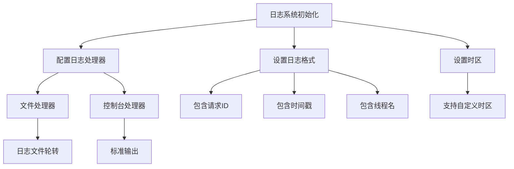
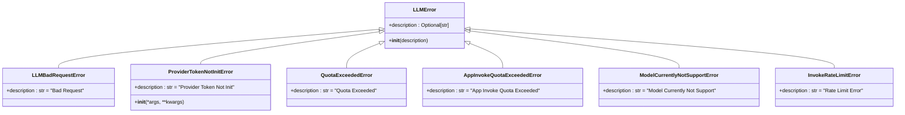
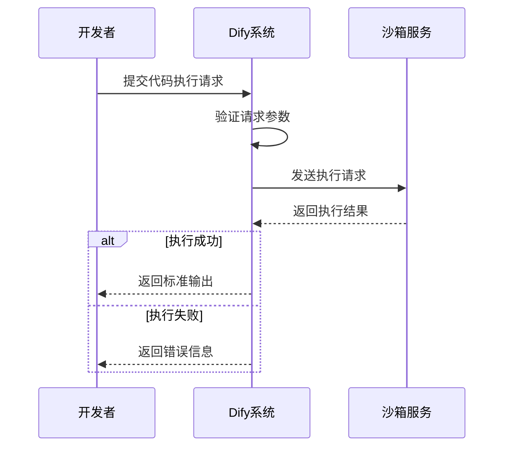
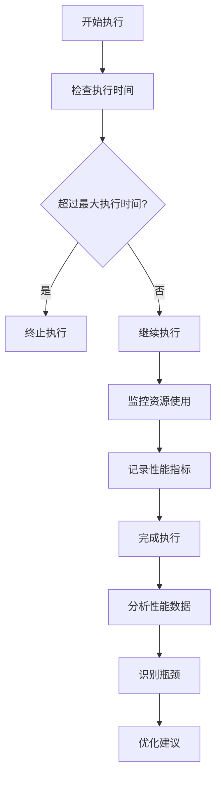
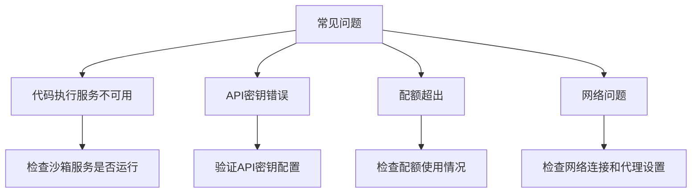
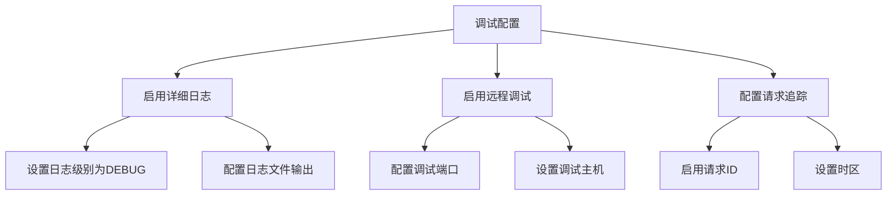
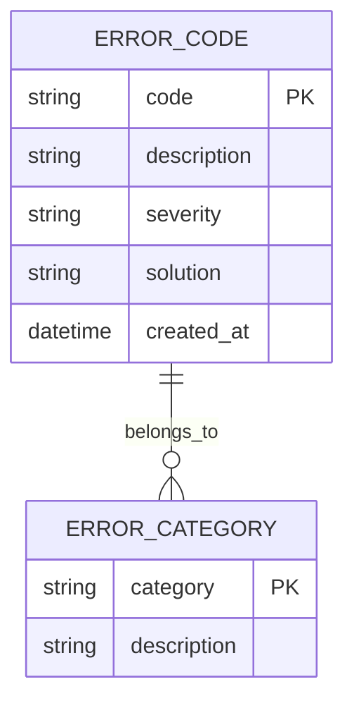
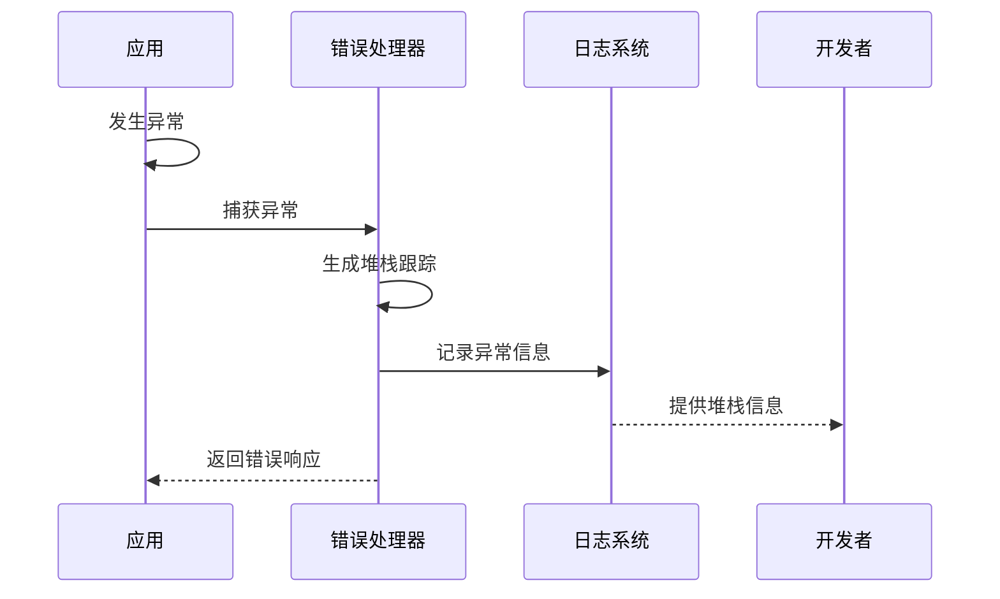

# 调试与错误处理

<cite>
**本文档引用的文件**
- [ext_logging.py](file://api/extensions/ext_logging.py)
- [code_executor.py](file://api/core/helper/code_executor/code_executor.py)
- [error.py](file://api/core/errors/error.py)
- [__init__.py](file://api/configs/feature/__init__.py)
- [status.tsx](file://web/app/components/workflow/run/status.tsx)
- [debug-info.tsx](file://web/app/components/plugins/plugin-page/debug-info.tsx)
</cite>

## 目录
1. [简介](#简介)
2. [日志系统配置](#日志系统配置)
3. [错误类型与处理机制](#错误类型与处理机制)
4. [调试工具与方法](#调试工具与方法)
5. [性能分析与瓶颈识别](#性能分析与瓶颈识别)
6. [常见问题与解决方案](#常见问题与解决方案)
7. [调试配置指南](#调试配置指南)
8. [错误码说明](#错误码说明)
9. [异常堆栈分析](#异常堆栈分析)
10. [结论](#结论)

## 简介
本文档系统介绍了Dify代码扩展工具的调试方法和错误处理机制。详细说明了如何使用日志系统、断点调试和性能分析工具来诊断代码扩展问题。文档解释了常见的错误类型及其解决方案，包括语法错误、运行时异常和依赖缺失。提供了调试配置指南，展示如何在开发环境中启用详细日志和远程调试功能。

## 日志系统配置

Dify的日志系统通过`ext_logging.py`文件进行配置，支持多种日志输出方式和格式化选项。系统使用Python标准库的logging模块，并结合Flask框架进行请求级别的日志追踪。

**Diagram sources**
- [ext_logging.py](file://api/extensions/ext_logging.py#L0-L93)

**Section sources**
- [ext_logging.py](file://api/extensions/ext_logging.py#L0-L93)

## 错误类型与处理机制

Dify系统定义了多种错误类型，涵盖了从LLM调用到代码执行的各个方面。错误处理机制采用分层设计，确保不同类型的错误能够被正确识别和处理。

**Diagram sources**
- [error.py](file://api/core/errors/error.py#L0-L57)

**Section sources**
- [error.py](file://api/core/errors/error.py#L0-L57)

## 调试工具与方法

Dify提供了多种调试工具和方法，帮助开发者诊断和解决代码扩展问题。这些工具包括代码执行沙箱、请求ID追踪和详细的错误信息报告。

**Diagram sources**
- [code_executor.py](file://api/core/helper/code_executor/code_executor.py#L0-L142)

**Section sources**
- [code_executor.py](file://api/core/helper/code_executor/code_executor.py#L0-L142)

## 性能分析与瓶颈识别

Dify系统通过多种机制进行性能分析和瓶颈识别，包括执行时间限制、资源使用监控和性能指标收集。这些机制帮助开发者识别和优化性能瓶颈。

**Diagram sources**
- [__init__.py](file://api/configs/feature/__init__.py#L0-L799)

**Section sources**
- [__init__.py](file://api/configs/feature/__init__.py#L0-L799)

## 常见问题与解决方案

在使用Dify代码扩展工具时，开发者可能会遇到各种常见问题。本节列出了一些常见问题及其解决方案。

**Diagram sources**
- [code_executor.py](file://api/core/helper/code_executor/code_executor.py#L80-L112)
- [error.py](file://api/core/errors/error.py#L0-L57)

**Section sources**
- [code_executor.py](file://api/core/helper/code_executor/code_executor.py#L80-L112)
- [error.py](file://api/core/errors/error.py#L0-L57)

## 调试配置指南

本节提供详细的调试配置指南，帮助开发者在开发环境中启用详细的日志记录和远程调试功能。

**Diagram sources**
- [ext_logging.py](file://api/extensions/ext_logging.py#L0-L93)
- [__init__.py](file://api/configs/feature/__init__.py#L0-L799)

**Section sources**
- [ext_logging.py](file://api/extensions/ext_logging.py#L0-L93)
- [__init__.py](file://api/configs/feature/__init__.py#L0-L799)

## 错误码说明

Dify系统使用标准化的错误码来标识不同类型的错误。这些错误码帮助开发者快速识别和定位问题。

**Diagram sources**
- [error.py](file://api/core/errors/error.py#L0-L57)

**Section sources**
- [error.py](file://api/core/errors/error.py#L0-L57)

## 异常堆栈分析

Dify系统提供了详细的异常堆栈信息，帮助开发者分析和解决运行时异常。异常堆栈包含了从错误发生点到调用栈顶层的完整信息。

**Diagram sources**
- [status.tsx](file://web/app/components/workflow/run/status.tsx#L108-L152)
- [error.py](file://api/core/errors/error.py#L0-L57)

**Section sources**
- [status.tsx](file://web/app/components/workflow/run/status.tsx#L108-L152)
- [error.py](file://api/core/errors/error.py#L0-L57)

## 结论
Dify代码扩展工具提供了全面的调试和错误处理机制，帮助开发者高效地开发和维护代码扩展。通过合理配置日志系统、使用调试工具和理解错误处理机制，开发者可以快速诊断和解决各种问题。建议在开发环境中启用详细的日志记录，并熟悉各种错误类型和解决方案，以提高开发效率和代码质量。