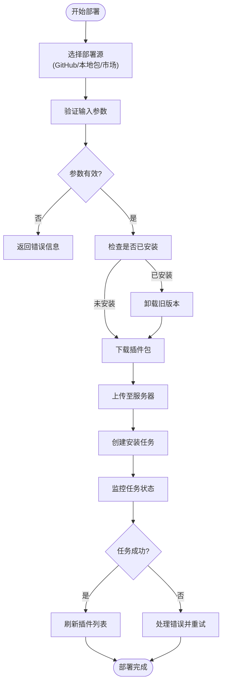
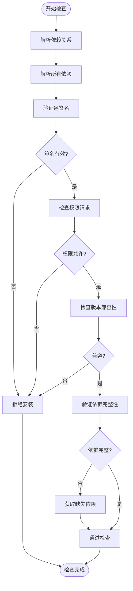
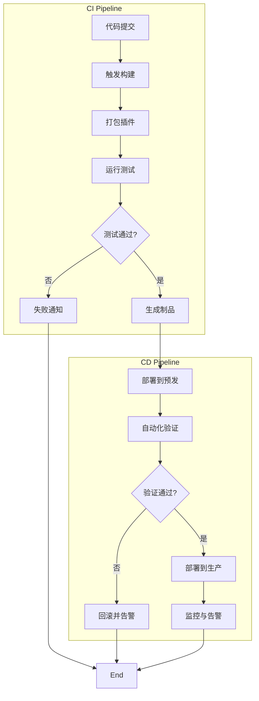
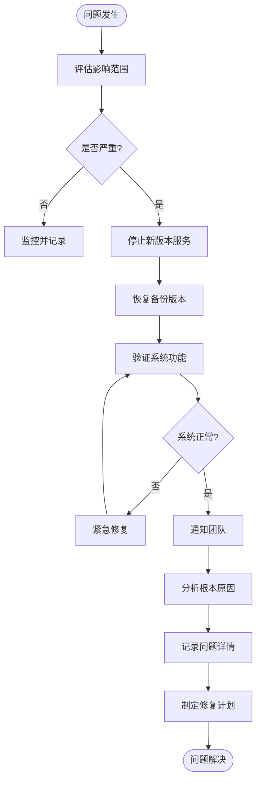

# 部署与版本管理

<cite>
**本文档引用文件**  
- [extension.py](file://api/controllers/console/extension.py)
- [code_based_extension_service.py](file://api/services/code_based_extension_service.py)
- [dependencies_analysis.py](file://api/services/plugin/dependencies_analysis.py)
- [plugin_service.py](file://api/services/plugin/plugin_service.py)
- [process_tenant_plugin_autoupgrade_check_task.py](file://api/tasks/process_tenant_plugin_autoupgrade_check_task.py)
- [bundle.py](file://api/core/plugin/entities/bundle.py)
- [plugins.ts](file://web/service/plugins.ts)
- [use-plugins.ts](file://web/service/use-plugins.ts)
- [install-from-github.tsx](file://web/app/components/plugins/install-plugin/install-from-github/steps/loaded.tsx)
- [install-from-local-package.tsx](file://web/app/components/plugins/install-plugin/install-from-local-package/steps/install.tsx)
- [update-plugin.tsx](file://web/app/components/plugins/update-plugin/from-market-place.tsx)
- [auto-update-setting.ts](file://web/app/components/plugins/reference-setting-modal/auto-update-setting/types.ts)
</cite>

## 目录
1. [引言](#引言)
2. [代码扩展工具部署流程](#代码扩展工具部署流程)
3. [版本控制与更新机制](#版本控制与更新机制)
4. [依赖解析与兼容性检查](#依赖解析与兼容性检查)
5. [自动化测试与CI/CD集成](#自动化测试与cicd集成)
6. [部署验证清单与回滚预案](#部署验证清单与回滚预案)
7. [多环境管理最佳实践](#多环境管理最佳实践)
8. [结论](#结论)

## 引言
Dify平台支持通过代码扩展工具增强其功能，允许开发者集成自定义插件和外部服务。本文档全面阐述了Dify代码扩展工具的部署流程和版本管理策略，涵盖打包、发布、更新、热更新、版本回滚等关键环节。同时，详细说明了依赖解析、兼容性检查、自动化测试及CI/CD集成的最佳实践，旨在为运维和开发团队提供一套完整的部署与版本管理指南。

## 代码扩展工具部署流程

Dify的代码扩展工具部署支持多种来源，包括GitHub仓库、本地包文件和内置市场。部署过程通过REST API和后台任务协同完成，确保操作的可靠性和可追溯性。



**图示来源**  
- [extension.py](file://api/controllers/console/extension.py#L0-L108)
- [use-plugins.ts](file://web/service/use-plugins.ts#L240-L332)
- [install-from-local-package.tsx](file://web/app/components/plugins/install-plugin/install-from-local-package/steps/install.tsx#L35-L83)

**本节来源**  
- [extension.py](file://api/controllers/console/extension.py#L0-L108)
- [plugins.ts](file://web/service/plugins.ts#L38-L77)

## 版本控制与更新机制

Dify实现了精细化的版本控制策略，支持手动更新和自动升级两种模式。系统通过唯一标识符（unique_identifier）和版本号精确管理插件的不同版本。

### 手动更新流程
用户可通过界面或API触发插件更新。系统会比较新旧版本的唯一标识符，并执行升级操作。升级过程包含卸载旧版本、安装新版本和更新数据库记录。

### 自动升级策略
系统支持基于时间的自动升级策略，可配置升级时间窗口和升级模式。升级模式包括：
- **全部更新**：自动升级所有插件到最新版本
- **部分更新**：仅升级指定列表中的插件
- **排除更新**：升级除指定列表外的所有插件

```mermaid
stateDiagram-v2
[*] --> Idle
Idle --> Checking : "定时检查"
Checking --> HasUpdate : "发现新版本"
Checking --> NoUpdate : "已是最新"
HasUpdate --> StrategyValid{"策略允许?"}
StrategyValid --> |否| Idle
StrategyValid --> |是| Upgrade : "执行升级"
Upgrade --> Success : "升级成功"
Upgrade --> Failed : "升级失败"
Success --> Idle
Failed --> Retry : "重试机制"
Retry --> Success
Retry --> Alert : "发送告警"
Alert --> Idle
NoUpdate --> Idle
```

**图示来源**  
- [process_tenant_plugin_autoupgrade_check_task.py](file://api/tasks/process_tenant_plugin_autoupgrade_check_task.py#L34-L72)
- [auto-update-setting.ts](file://web/app/components/plugins/reference-setting-modal/auto-update-setting/types.ts#L0-L18)
- [update-plugin.tsx](file://web/app/components/plugins/update-plugin/from-market-place.tsx#L76-L120)

**本节来源**  
- [process_tenant_plugin_autoupgrade_check_task.py](file://api/tasks/process_tenant_plugin_autoupgrade_check_task.py#L34-L72)
- [plugin_service.py](file://api/services/plugin/plugin_service.py#L268-L304)

## 依赖解析与兼容性检查

Dify在部署扩展工具时执行严格的依赖解析和兼容性检查，确保系统稳定性和功能完整性。

### 依赖解析机制
系统通过`PluginBundleDependency`实体解析插件的依赖关系。依赖类型包括：
- **GitHub依赖**：从指定GitHub仓库和版本获取
- **市场依赖**：从内置插件市场获取
- **包依赖**：从本地或远程包文件获取

依赖解析服务会递归分析所有依赖项，构建完整的依赖树，并按拓扑顺序安装。

### 兼容性检查
在安装或更新前，系统执行多项兼容性检查：
1. **签名验证**：验证插件包的数字签名
2. **权限检查**：确认插件请求的权限在允许范围内
3. **版本兼容性**：检查插件版本与核心系统的兼容性
4. **依赖完整性**：验证所有依赖项都可获取且版本匹配



**图示来源**  
- [bundle.py](file://api/core/plugin/entities/bundle.py#L0-L29)
- [dependencies_analysis.py](file://api/services/plugin/dependencies_analysis.py#L66-L123)
- [plugin_service.py](file://api/services/plugin/plugin_service.py#L268-L304)

**本节来源**  
- [bundle.py](file://api/core/plugin/entities/bundle.py#L0-L29)
- [dependencies_analysis.py](file://api/services/plugin/dependencies_analysis.py#L66-L123)

## 自动化测试与CI/CD集成

Dify支持将代码扩展工具的部署流程无缝集成到持续集成/持续交付（CI/CD）管道中，确保高质量的自动化发布。

### CI/CD集成指南
1. **构建阶段**：在CI环境中打包插件，生成标准化的分发包
2. **测试阶段**：运行单元测试和集成测试，验证功能正确性
3. **部署阶段**：通过API调用触发部署流程，实现无人值守发布
4. **验证阶段**：执行部署后检查，确保服务正常运行

### 自动化测试流程
系统在部署过程中自动执行以下测试：
- **静态分析**：检查代码质量和安全漏洞
- **单元测试**：验证核心功能的正确性
- **集成测试**：测试插件与核心系统的交互
- **性能测试**：评估插件对系统性能的影响



**图示来源**  
- [plugin_service.py](file://api/services/plugin/plugin_service.py#L268-L304)
- [dependencies_analysis.py](file://api/services/plugin/dependencies_analysis.py#L66-L123)

**本节来源**  
- [plugin_service.py](file://api/services/plugin/plugin_service.py#L268-L304)
- [dependencies_analysis.py](file://api/services/plugin/dependencies_analysis.py#L66-L123)

## 部署验证清单与回滚预案

为确保部署过程的安全性和可靠性，建议遵循以下验证清单和回滚预案。

### 部署验证清单
- [ ] 确认插件包来源可信
- [ ] 验证数字签名有效
- [ ] 检查依赖关系完整
- [ ] 确认权限请求合理
- [ ] 在预发环境测试功能
- [ ] 验证性能影响可接受
- [ ] 备份当前配置和数据
- [ ] 通知相关团队成员

### 回滚预案
当部署出现问题时，应立即执行回滚操作：
1. **停止新版本服务**：立即终止新版本插件的运行
2. **恢复旧版本**：从备份中恢复上一个稳定版本
3. **验证系统状态**：确保核心功能正常运行
4. **分析失败原因**：收集日志和错误信息
5. **通知相关人员**：及时通报故障和处理进展
6. **修复并重新测试**：解决问题后重新进行测试



**图示来源**  
- [process_tenant_plugin_autoupgrade_check_task.py](file://api/tasks/process_tenant_plugin_autoupgrade_check_task.py#L34-L72)
- [plugin_service.py](file://api/services/plugin/plugin_service.py#L268-L304)

**本节来源**  
- [process_tenant_plugin_autoupgrade_check_task.py](file://api/tasks/process_tenant_plugin_autoupgrade_check_task.py#L34-L72)
- [plugin_service.py](file://api/services/plugin/plugin_service.py#L268-L304)

## 多环境管理最佳实践

为支持开发、测试、预发和生产等多环境管理，建议遵循以下最佳实践：

### 环境隔离
- **独立数据库**：每个环境使用独立的数据库实例
- **独立存储**：避免环境间文件存储混用
- **独立配置**：使用环境变量管理不同环境的配置
- **网络隔离**：通过防火墙规则限制环境间访问

### 配置管理
- **配置中心**：使用统一的配置管理服务
- **版本控制**：将配置文件纳入版本控制系统
- **加密存储**：敏感信息使用加密方式存储
- **动态更新**：支持配置的热更新而无需重启服务

### 部署策略
- **蓝绿部署**：通过流量切换实现零停机更新
- **金丝雀发布**：先向少量用户发布，验证稳定后再全量
- **灰度发布**：按用户特征或地理位置逐步发布
- **自动化审批**：关键环境部署需人工审批

## 结论
Dify平台提供了完善的代码扩展工具部署与版本管理机制，支持从开发到生产的全生命周期管理。通过严格的依赖解析、兼容性检查和自动化测试，确保了系统的稳定性和安全性。建议团队结合CI/CD流程，建立标准化的部署规范，并制定详细的回滚预案，以应对可能出现的问题。多环境管理和精细化的版本控制策略为大规模应用提供了可靠保障。