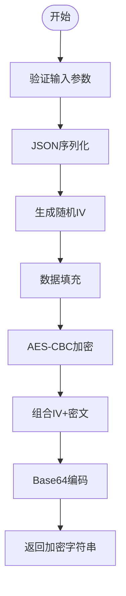
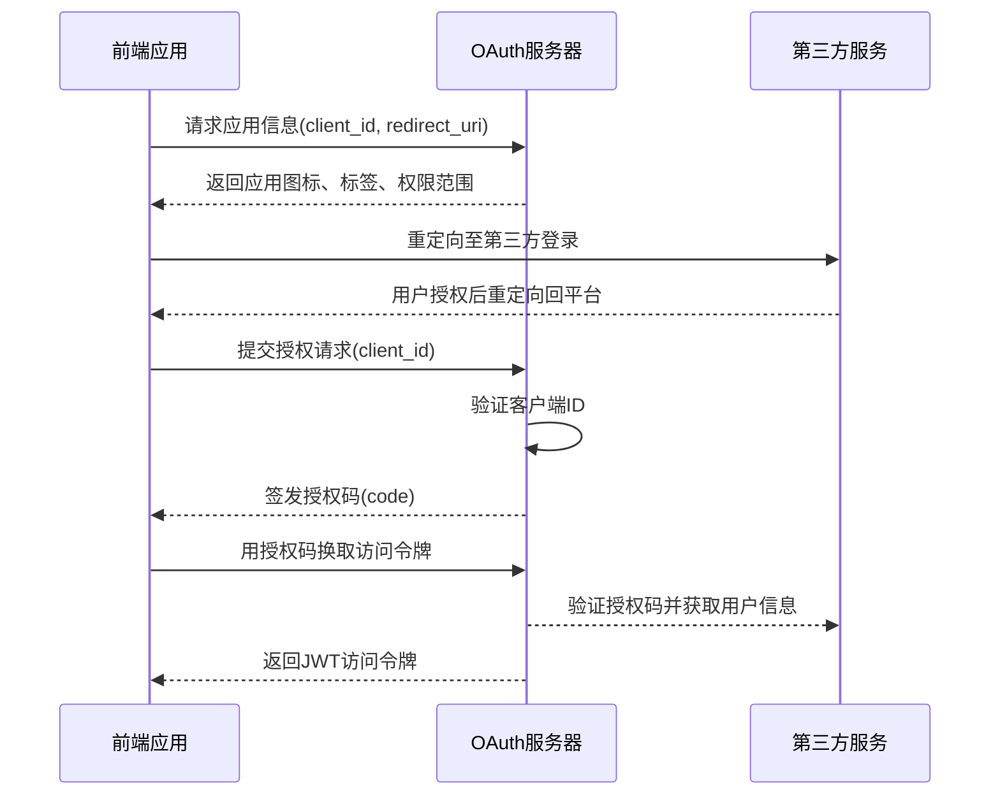
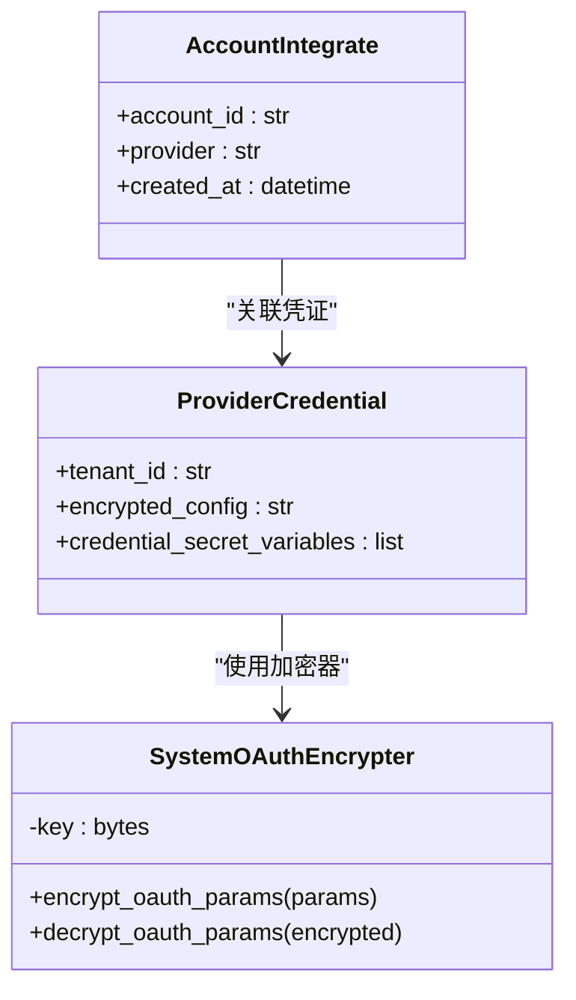
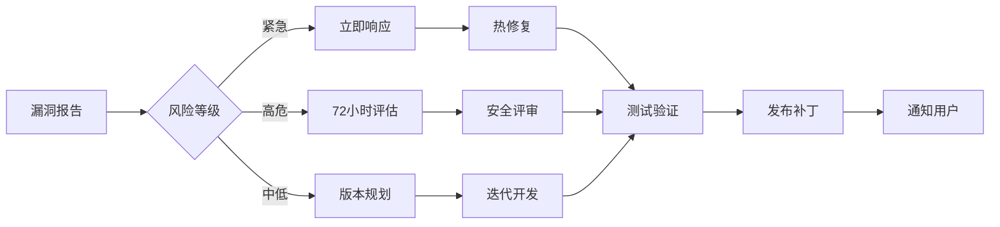

# 内置工具安全验证

<cite>
**本文档引用文件**  
- [system_oauth_encryption.py](file://api/core/tools/utils/system_oauth_encryption.py)
- [account.py](file://api/controllers/console/workspace/account.py)
- [oauth_server.py](file://api/controllers/console/auth/oauth_server.py)
- [test_system_oauth_encryption.py](file://api/tests/unit_tests/utils/oauth_encryption/test_system_oauth_encryption.py)
</cite>

## 目录
1. [引言](#引言)
2. [敏感参数加密存储机制](#敏感参数加密存储机制)
3. [OAuth认证集成实现](#oauth认证集成实现)
4. [输入验证与输出过滤策略](#输入验证与输出过滤策略)
5. [凭证管理与权限控制配置](#凭证管理与权限控制配置)
6. [审计日志配置方法](#审计日志配置方法)
7. [安全最佳实践指南](#安全最佳实践指南)
8. [安全漏洞检测与修复流程](#安全漏洞检测与修复流程)

## 引言
Dify平台内置工具的安全保障机制旨在为用户提供一个安全、可靠的应用开发环境。本文档系统阐述了平台在敏感参数加密、OAuth认证、输入验证、凭证管理等方面的安全设计与实现方式，帮助开发者理解并遵循安全最佳实践。

## 敏感参数加密存储机制

Dify平台通过AES-CBC加密算法对敏感OAuth参数进行加密存储，确保凭证信息在数据库中的安全性。系统使用应用级SECRET_KEY生成256位固定密钥，结合随机IV向量实现加密，防止重放攻击。

加密流程包括：
1. 使用SHA-256哈希函数基于SECRET_KEY生成256位密钥
2. 生成16字节随机IV向量
3. 对OAuth参数进行JSON序列化并填充
4. 使用AES-CBC模式加密数据
5. 将IV与密文组合后进行Base64编码存储

该机制支持嵌套JSON结构、多种数据类型（字符串、数字、布尔值、数组、对象等）的加密，且经过性能优化可处理大体积参数（如100KB以上数据）。

**Diagram sources**
- [system_oauth_encryption.py](file://api/core/tools/utils/system_oauth_encryption.py#L1-L187)

**Section sources**
- [system_oauth_encryption.py](file://api/core/tools/utils/system_oauth_encryption.py#L1-L187)

## OAuth认证集成实现

Dify平台实现了标准化的OAuth服务器功能，支持第三方服务（如GitHub、Google）的集成认证。系统通过客户端ID验证、授权码签发、令牌交换等环节确保认证过程的安全性。

核心流程包括：
- 客户端应用注册与重定向URI验证
- 用户授权界面展示应用图标、标签和权限范围
- 授权码生成与签发（基于客户端ID和用户账户ID）
- 令牌交换接口处理授权码到访问令牌的转换

前端通过`useOAuthCallback`钩子处理OAuth回调，后端控制器验证客户端ID并生成授权码，确保只有合法应用能完成认证流程。

**Diagram sources**
- [oauth_server.py](file://api/controllers/console/auth/oauth_server.py#L98-L134)
- [account.py](file://api/controllers/console/workspace/account.py#L223-L261)
- [use-oauth.ts](file://web/service/use-oauth.ts#L0-L28)

**Section sources**
- [oauth_server.py](file://api/controllers/console/auth/oauth_server.py#L98-L134)
- [account.py](file://api/controllers/console/workspace/account.py#L223-L261)

## 输入验证与输出过滤策略

平台实施严格的输入验证机制，防止XSS、SQL注入等常见攻击。所有用户输入均经过类型检查、长度限制和恶意内容过滤。

关键验证措施包括：
- 参数类型验证（字符串、数字、布尔值、文件等）
- 字符串长度限制（如账户名3-30字符）
- 特殊字符过滤与转义
- 文件上传类型与大小限制
- 工作流节点输入值类型匹配验证

系统通过`VarType`枚举定义变量类型，确保输入值与预期类型一致。对于代码执行节点，还设置了最大字符串长度限制，防止资源耗尽攻击。

**Section sources**
- [form-input-item.tsx](file://web/app/components/workflow/nodes/_base/components/form-input-item.tsx#L92-L132)
- [variable-assigner](file://api/core/workflow/nodes/variable_assigner/v2/helpers.py#L33-L71)
- [test_code.py](file://api/tests/integration_tests/workflow/nodes/test_code.py#L234-L275)

## 凭证管理与权限控制配置

Dify平台采用分层凭证管理体系，结合租户隔离、角色权限和访问控制策略确保资源安全。

主要特性包括：
- 凭证加密存储：使用租户特定密钥解密敏感字段
- 凭证名称唯一性校验：防止命名冲突
- 混合配置模式：支持自定义配置与系统预设
- 权限状态跟踪：记录授权、移除状态

凭证解密时会自动识别并解密标记为secret的变量，同时对敏感值进行脱敏处理，确保调试信息不会泄露密钥。

**Diagram sources**
- [provider_configuration.py](file://api/core/entities/provider_configuration.py#L219-L253)
- [system_oauth_encryption.py](file://api/core/tools/utils/system_oauth_encryption.py#L1-L187)

**Section sources**
- [provider_configuration.py](file://api/core/entities/provider_configuration.py#L219-L253)

## 审计日志配置方法

平台通过集成操作服务（ops_service）记录关键安全事件，包括：
- 用户登录/登出
- 凭证绑定/解绑
- 账户设置变更
- API密钥创建/删除
- 敏感操作审计

审计日志包含时间戳、用户ID、操作类型、IP地址等信息，支持追溯安全事件。系统使用多种追踪实例（如Langfuse、Arize Phoenix）实现分布式追踪。

**Section sources**
- [ops_trace_manager.py](file://api/core/ops/ops_trace_manager.py)
- [operation_service.py](file://api/services/operation_service.py)

## 安全最佳实践指南

### 防范注入攻击
- 使用参数化查询处理数据库操作
- 对用户输入进行白名单过滤
- 限制代码执行沙箱环境
- 验证工作流节点输入类型与结构

### 保护API密钥
- 使用环境变量或密钥管理服务存储密钥
- 定期轮换API密钥
- 限制密钥权限范围
- 监控异常使用模式

### 实现安全的回调验证
- 验证重定向URI的域名匹配
- 使用状态参数防止CSRF攻击
- 设置短时效的授权码
- 实施IP地址速率限制

### 输入验证最佳实践
- 前端与后端双重验证
- 使用正则表达式约束输入格式
- 限制输入长度（如字符串≤10000字符）
- 过滤HTML标签和脚本片段

**Section sources**
- [test_api_key_auth_service.py](file://api/tests/unit_tests/services/auth/test_api_key_auth_service.py#L281-L314)
- [helper.py](file://api/core/helper/moderation.py)

## 安全漏洞检测与修复流程

Dify平台建立了完整的安全漏洞管理流程：

1. **检测阶段**
   - 静态代码分析（pyright、eslint）
   - 单元测试覆盖边界条件
   - 集成测试模拟恶意输入
   - 依赖扫描（snyk、dependabot）

2. **验证阶段**
   - 单元测试验证加密解密一致性
   - 性能测试确保大负载下安全性
   - 随机IV测试验证加密随机性
   - 不同密钥测试验证隔离性

3. **修复流程**
   - 紧急漏洞：24小时内发布补丁
   - 高危漏洞：72小时内评估并修复
   - 中低风险：纳入版本迭代计划
   - 修复后必须通过回归测试

4. **预防机制**
   - 每周安全代码审查
   - 自动化安全测试集成CI/CD
   - 开发者安全培训
   - 安全配置默认开启

**Diagram sources**
- [test_system_oauth_encryption.py](file://api/tests/unit_tests/utils/oauth_encryption/test_system_oauth_encryption.py#L250-L338)
- [test_system_oauth_encryption.py](file://api/tests/unit_tests/utils/oauth_encryption/test_system_oauth_encryption.py#L560-L618)

**Section sources**
- [test_system_oauth_encryption.py](file://api/tests/unit_tests/utils/oauth_encryption/test_system_oauth_encryption.py#L250-L618)