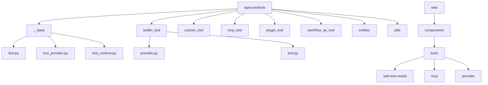
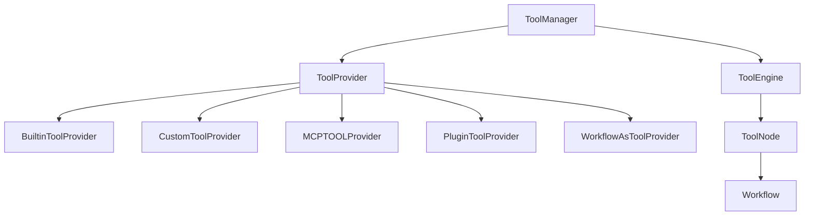
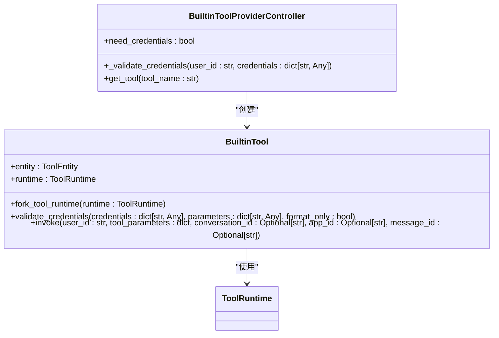

# 内置工具开发

<cite>
**本文档引用的文件**
- [tool.py](file://api/core/tools/__base/tool.py)
- [tool_provider.py](file://api/core/tools/__base/tool_provider.py)
- [tool_runtime.py](file://api/core/tools/__base/tool_runtime.py)
- [provider.py](file://api/core/tools/builtin_tool/provider.py)
- [tool.py](file://api/core/tools/builtin_tool/tool.py)
- [tool_manager.py](file://api/core/tools/tool_manager.py)
- [tool_engine.py](file://api/core/tools/tool_engine.py)
- [tool_node.py](file://api/core/workflow/nodes/tool/tool_node.py)
- [entities.py](file://api/core/tools/entities/tool_entities.py)
- [values.py](file://api/core/tools/entities/values.py)
- [errors.py](file://api/core/tools/errors.py)
- [builtin_tool](file://api/core/tools/builtin_tool)
- [use-tools.ts](file://web/service/use-tools.ts)
- [setting-built-in-tool.tsx](file://web/app/components/app/configuration/config/agent/agent-tools/setting-built-in-tool.tsx)
- [tool-item.tsx](file://web/app/components/tools/mcp/detail/tool-item.tsx)
- [tool_node.py](file://api/core/workflow/nodes/tool/tool_node.py)
</cite>

## 目录
1. [简介](#简介)
2. [项目结构](#项目结构)
3. [核心组件](#核心组件)
4. [架构概述](#架构概述)
5. [详细组件分析](#详细组件分析)
6. [依赖分析](#依赖分析)
7. [性能考虑](#性能考虑)
8. [故障排除指南](#故障排除指南)
9. [结论](#结论)

## 简介
Dify平台的内置工具开发文档旨在为开发者提供全面的指导，涵盖内置工具的开发流程和实现机制。本文档详细介绍了如何定义工具接口、配置参数、实现执行逻辑以及处理错误。通过代码示例展示内置工具的典型开发模式，包括工具类定义、参数验证、执行方法实现和结果返回。文档还包含工具注册机制、权限管理、性能监控和安全验证的最佳实践，以及如何通过配置文件和代码实现工具的扩展和定制。

## 项目结构
Dify平台的内置工具开发主要集中在`api/core/tools`目录下，该目录包含了内置工具的核心实现。内置工具的前端交互则在`web`目录下的相关组件中实现。整体项目结构清晰，便于开发者快速定位和理解各个模块的功能。

**图示来源**
- [tool.py](file://api/core/tools/__base/tool.py)
- [provider.py](file://api/core/tools/builtin_tool/provider.py)
- [add-tool-modal](file://web/app/components/tools/add-tool-modal)
- [mcp](file://web/app/components/tools/mcp)

**本节来源**
- [tool.py](file://api/core/tools/__base/tool.py)
- [provider.py](file://api/core/tools/builtin_tool/provider.py)

## 核心组件
内置工具开发的核心组件包括工具类定义、参数验证、执行逻辑实现和结果返回。这些组件共同构成了内置工具的基础框架，确保了工具的稳定性和可扩展性。

**本节来源**
- [tool.py](file://api/core/tools/__base/tool.py)
- [tool_provider.py](file://api/core/tools/__base/tool_provider.py)
- [tool_runtime.py](file://api/core/tools/__base/tool_runtime.py)

## 架构概述
Dify平台的内置工具架构设计遵循模块化原则，将工具的定义、配置、执行和管理分离，提高了代码的可维护性和可测试性。内置工具通过`ToolManager`进行统一管理，`ToolEngine`负责工具的执行，`ToolNode`则在工作流中调用工具。

**图示来源**
- [tool_manager.py](file://api/core/tools/tool_manager.py)
- [tool_engine.py](file://api/core/tools/tool_engine.py)
- [tool_node.py](file://api/core/workflow/nodes/tool/tool_node.py)

## 详细组件分析
### 内置工具分析
内置工具的开发主要涉及`BuiltinToolProviderController`和`BuiltinTool`两个核心类。`BuiltinToolProviderController`负责管理内置工具的生命周期，包括工具的注册、配置和验证。`BuiltinTool`则定义了工具的具体行为，包括执行逻辑和结果返回。

#### 类图

**图示来源**
- [provider.py](file://api/core/tools/builtin_tool/provider.py)
- [tool.py](file://api/core/tools/builtin_tool/tool.py)
- [tool_runtime.py](file://api/core/tools/__base/tool_runtime.py)

#### 参数验证
内置工具的参数验证是确保工具安全和正确执行的关键步骤。`validate_credentials`方法用于验证工具的凭据，确保用户提供的凭据符合要求。此方法支持格式验证和实际请求验证，以确保凭据的有效性。

**本节来源**
- [tool.py](file://api/core/tools/builtin_tool/tool.py)
- [tool_provider.py](file://api/core/tools/builtin_tool/provider.py)

#### 执行逻辑
内置工具的执行逻辑由`invoke`方法实现。该方法接收用户ID、工具参数、会话ID、应用ID和消息ID作为输入，执行工具的具体逻辑，并返回生成的工具调用消息或元数据。执行过程中，`ToolEngine`会捕获任何异常并记录错误信息，确保工具的健壮性。

**本节来源**
- [tool_engine.py](file://api/core/tools/tool_engine.py)
- [tool.py](file://api/core/tools/builtin_tool/tool.py)

#### 结果返回
内置工具的结果返回通过`ToolInvokeMessage`和`ToolInvokeMeta`对象实现。`ToolInvokeMessage`包含工具执行的结果，而`ToolInvokeMeta`则包含执行的元数据，如时间成本、错误信息等。这些对象通过生成器返回，支持异步执行和流式输出。

**本节来源**
- [tool_engine.py](file://api/core/tools/tool_engine.py)
- [tool.py](file://api/core/tools/builtin_tool/tool.py)

## 依赖分析
内置工具的开发依赖于多个核心模块，包括`ToolManager`、`ToolEngine`和`ToolNode`。这些模块之间的依赖关系确保了工具的注册、执行和管理的无缝集成。

**图示来源**
- [tool_manager.py](file://api/core/tools/tool_manager.py)
- [tool_engine.py](file://api/core/tools/tool_engine.py)
- [tool_node.py](file://api/core/workflow/nodes/tool/tool_node.py)

**本节来源**
- [tool_manager.py](file://api/core/tools/tool_manager.py)
- [tool_engine.py](file://api/core/tools/tool_engine.py)
- [tool_node.py](file://api/core/workflow/nodes/tool/tool_node.py)

## 性能考虑
内置工具的性能优化主要集中在减少执行时间和提高资源利用率。通过异步执行和流式输出，内置工具可以高效地处理大量数据。此外，`ToolEngine`通过缓存和复用工具实例，减少了重复创建和销毁的开销，进一步提升了性能。

## 故障排除指南
内置工具开发过程中常见的问题包括参数验证失败、执行逻辑错误和结果返回异常。以下是一些常见问题的解决方案：

- **参数验证失败**：检查用户提供的凭据是否符合要求，确保所有必需的参数都已提供。
- **执行逻辑错误**：使用`ToolEngine`的错误处理机制，捕获并记录异常信息，便于调试和修复。
- **结果返回异常**：确保`ToolInvokeMessage`和`ToolInvokeMeta`对象的正确构造，避免数据丢失或格式错误。

**本节来源**
- [errors.py](file://api/core/tools/errors.py)
- [tool_engine.py](file://api/core/tools/tool_engine.py)
- [tool.py](file://api/core/tools/builtin_tool/tool.py)

## 结论
Dify平台的内置工具开发文档为开发者提供了全面的指导，涵盖了从工具定义到执行的各个环节。通过遵循本文档中的最佳实践，开发者可以高效地开发和维护内置工具，确保其稳定性和可扩展性。未来，Dify平台将继续优化内置工具的开发体验，提供更多高级功能和支持。