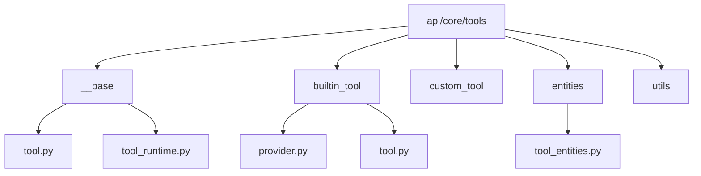
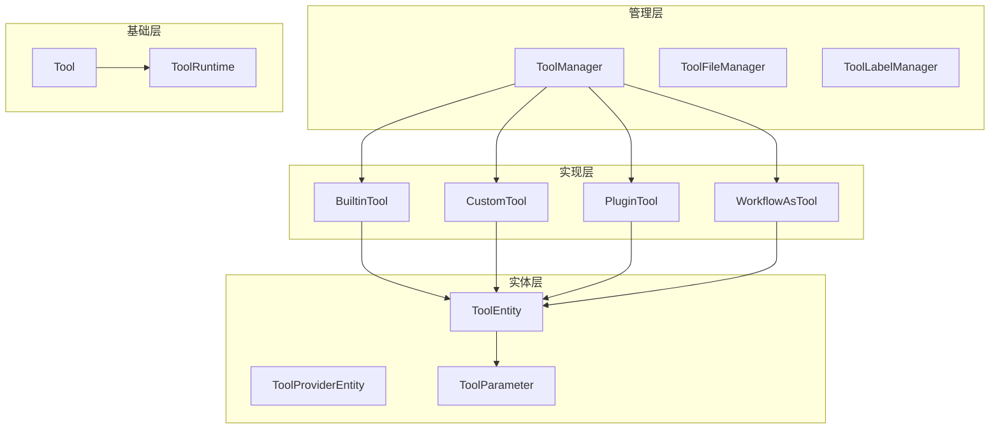
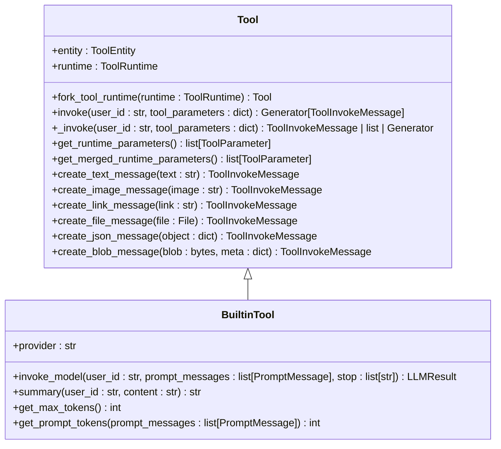
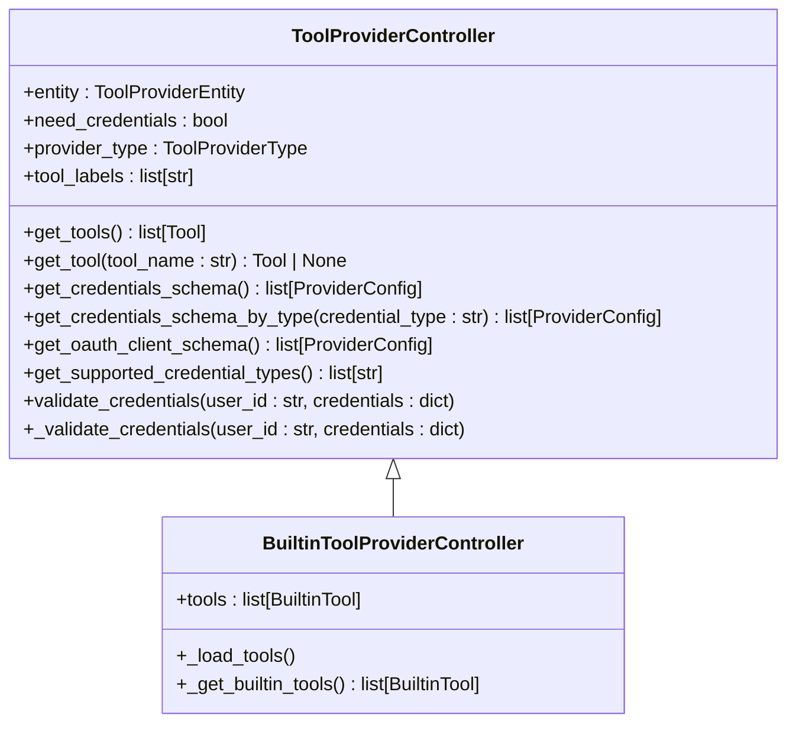
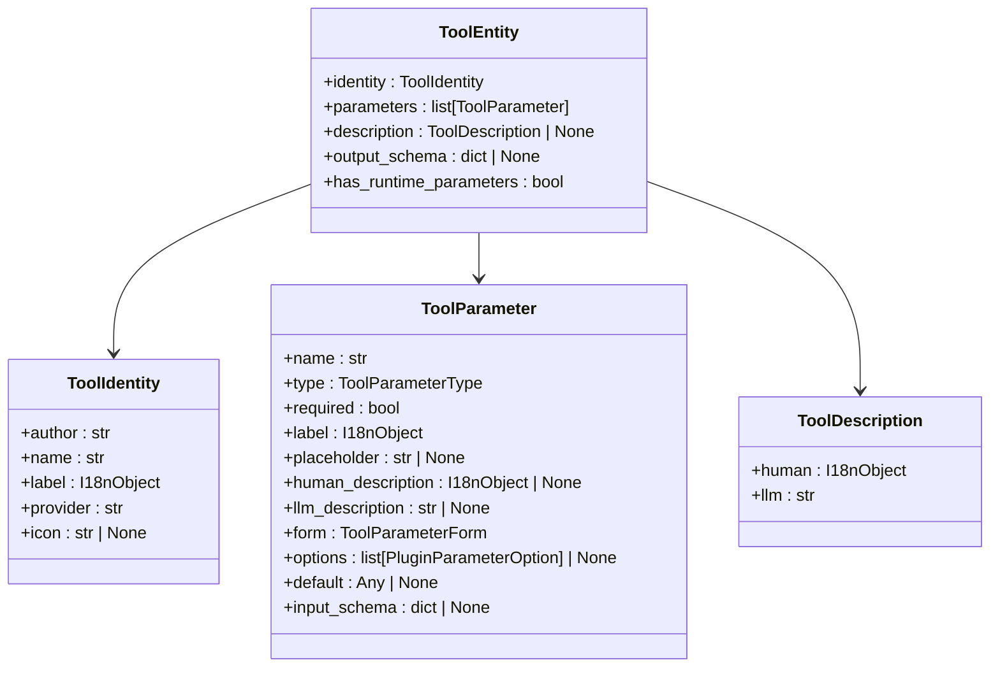
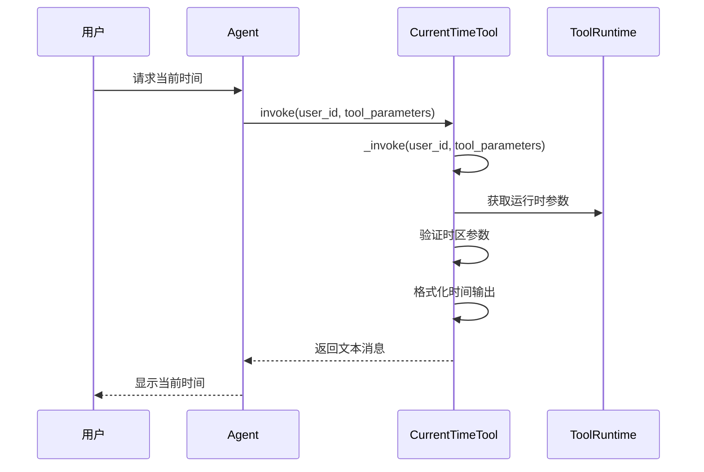
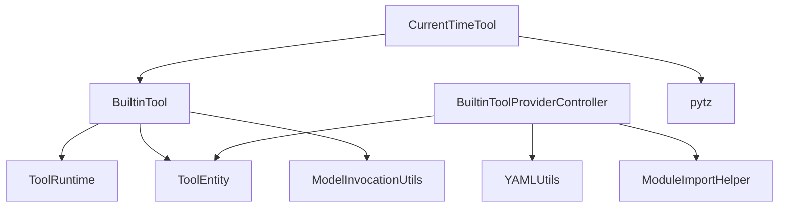

# 内置工具开发指南

<cite>
**本文档中引用的文件**  
- [tool.py](file://api/core/tools/builtin_tool/tool.py)
- [provider.py](file://api/core/tools/builtin_tool/provider.py)
- [tool_entities.py](file://api/core/tools/entities/tool_entities.py)
- [common_entities.py](file://api/core/tools/entities/common_entities.py)
- [tool.py](file://api/core/tools/__base/tool.py)
- [tool_runtime.py](file://api/core/tools/__base/tool_runtime.py)
- [current_time.py](file://api/core/tools/builtin_tool/providers/time/tools/current_time.py)
</cite>

## 目录
1. [简介](#简介)
2. [项目结构](#项目结构)
3. [核心组件](#核心组件)
4. [架构概述](#架构概述)
5. [详细组件分析](#详细组件分析)
6. [依赖分析](#依赖分析)
7. [性能考虑](#性能考虑)
8. [故障排除指南](#故障排除指南)
9. [结论](#结论)

## 简介
本文档旨在为Dify平台的内置工具开发提供全面的指导。涵盖从工具类定义、元数据配置、执行逻辑实现到标准化结果返回的完整开发流程。同时介绍工具注册机制、版本管理、依赖注入和测试验证的最佳实践，以及如何通过配置文件扩展工具功能。

## 项目结构
Dify平台的内置工具主要位于`api/core/tools`目录下，按照功能划分为多个子模块。核心结构包括基础工具类、内置工具实现、实体定义和工具管理器等。

**Diagram sources**
- [builtin_tool](file://api/core/tools/builtin_tool)
- [__base](file://api/core/tools/__base)
- [entities](file://api/core/tools/entities)

**Section sources**
- [builtin_tool](file://api/core/tools/builtin_tool)
- [__base](file://api/core/tools/__base)
- [entities](file://api/core/tools/entities)

## 核心组件
内置工具的核心组件包括工具基类、工具提供者控制器、工具实体和运行时环境。这些组件共同构成了工具的生命周期管理和执行框架。

**Section sources**
- [tool.py](file://api/core/tools/__base/tool.py)
- [tool_runtime.py](file://api/core/tools/__base/tool_runtime.py)
- [tool_entities.py](file://api/core/tools/entities/tool_entities.py)

## 架构概述
Dify内置工具采用分层架构设计，分为基础层、实体层、实现层和管理层。基础层定义了工具的通用接口和运行时环境，实体层定义了工具的元数据结构，实现层提供了具体工具的业务逻辑，管理层负责工具的注册和调用。

**Diagram sources**
- [tool_manager.py](file://api/core/tools/tool_manager.py)
- [tool.py](file://api/core/tools/__base/tool.py)
- [tool_entities.py](file://api/core/tools/entities/tool_entities.py)

## 详细组件分析

### 工具基类分析
工具基类定义了所有工具的通用接口和行为规范，包括工具调用、参数转换和消息创建等功能。

**Diagram sources**
- [tool.py](file://api/core/tools/__base/tool.py)
- [tool.py](file://api/core/tools/builtin_tool/tool.py)

**Section sources**
- [tool.py](file://api/core/tools/__base/tool.py)
- [tool.py](file://api/core/tools/builtin_tool/tool.py)

### 工具提供者分析
工具提供者控制器负责管理一组相关工具的生命周期，包括工具的加载、验证和调用。

**Diagram sources**
- [tool_provider.py](file://api/core/tools/__base/tool_provider.py)
- [provider.py](file://api/core/tools/builtin_tool/provider.py)

**Section sources**
- [provider.py](file://api/core/tools/builtin_tool/provider.py)

### 工具实体分析
工具实体定义了工具的元数据结构，包括身份信息、参数定义、描述信息和输出模式等。

**Diagram sources**
- [tool_entities.py](file://api/core/tools/entities/tool_entities.py)

**Section sources**
- [tool_entities.py](file://api/core/tools/entities/tool_entities.py)

### 时间工具实现分析
以时间工具为例，展示具体工具的实现方式和调用流程。

**Diagram sources**
- [current_time.py](file://api/core/tools/builtin_tool/providers/time/tools/current_time.py)

**Section sources**
- [current_time.py](file://api/core/tools/builtin_tool/providers/time/tools/current_time.py)

## 依赖分析
内置工具系统依赖于多个核心模块，包括模型运行时、实体定义和工具管理器等。这些依赖关系确保了工具能够正确地集成到Dify平台的整体架构中。

**Diagram sources**
- [tool.py](file://api/core/tools/builtin_tool/tool.py)
- [provider.py](file://api/core/tools/builtin_tool/provider.py)
- [current_time.py](file://api/core/tools/builtin_tool/providers/time/tools/current_time.py)

**Section sources**
- [tool.py](file://api/core/tools/builtin_tool/tool.py)
- [provider.py](file://api/core/tools/builtin_tool/provider.py)

## 性能考虑
在开发内置工具时，需要考虑以下几个性能方面：
- 工具调用的响应时间
- 参数验证的开销
- 模型调用的上下文长度限制
- 工具结果的缓存策略
- 并发调用的处理能力

## 故障排除指南
当内置工具出现问题时，可以按照以下步骤进行排查：
1. 检查工具参数是否正确
2. 验证工具运行时环境配置
3. 查看工具调用日志
4. 检查依赖服务的状态
5. 验证凭证信息的有效性

**Section sources**
- [errors.py](file://api/core/tools/errors.py)
- [tool_engine.py](file://api/core/tools/tool_engine.py)

## 结论
Dify平台的内置工具开发框架提供了完整的工具生命周期管理能力。通过遵循本文档中的指导原则，开发者可以快速创建功能完善、性能优良的内置工具，为平台用户提供丰富的功能扩展。