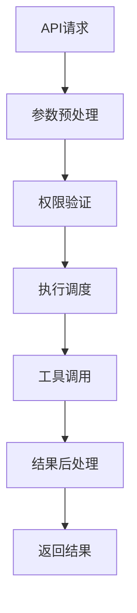
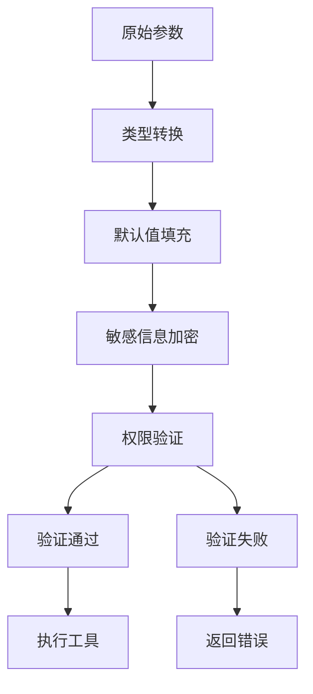
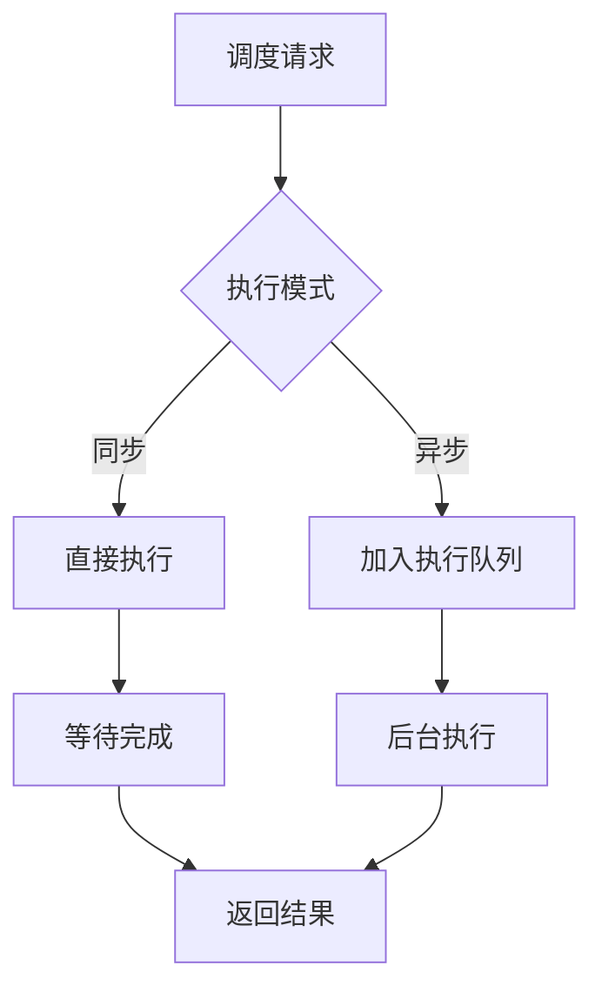
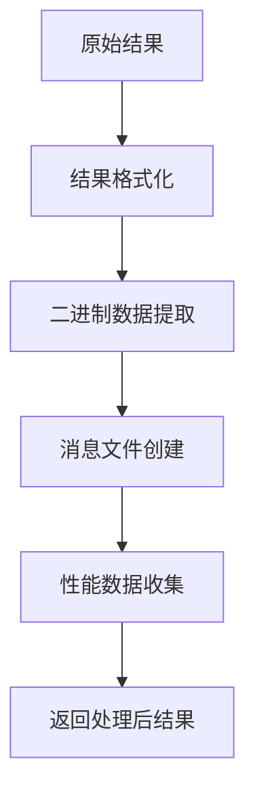
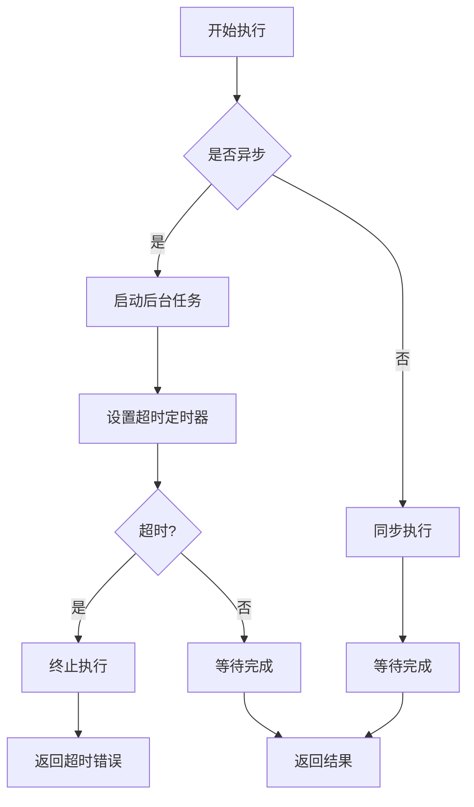
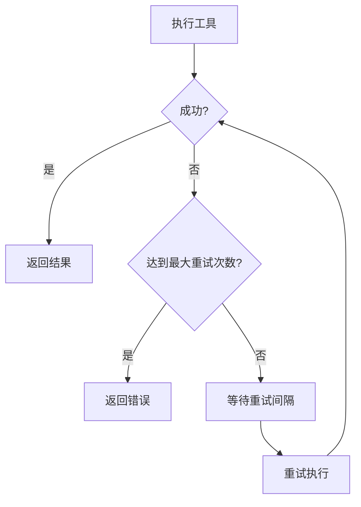
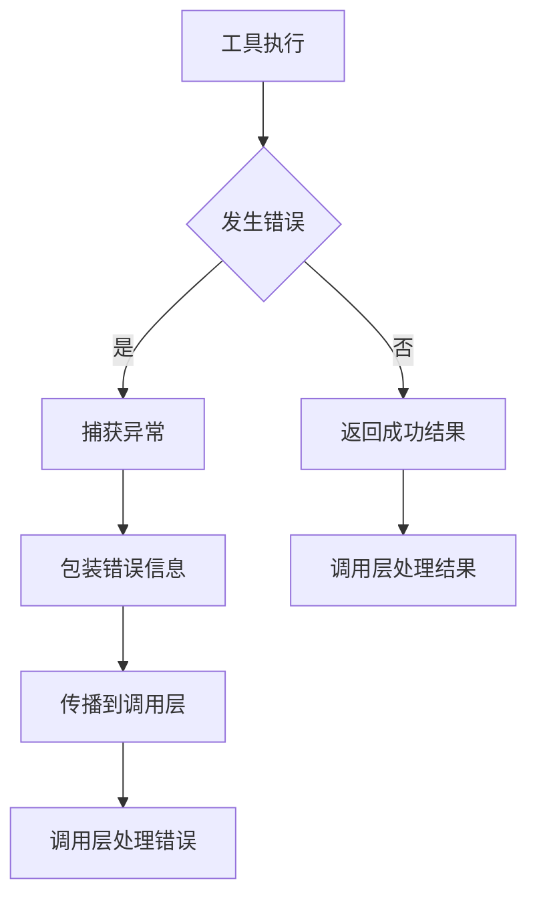
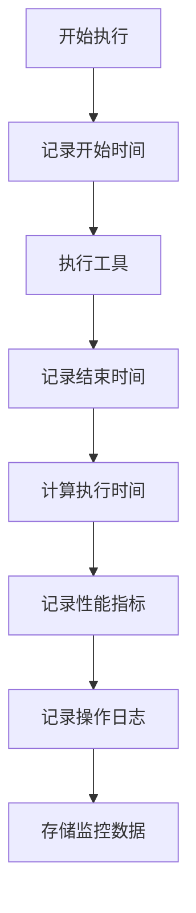

# 内置工具执行机制

<cite>
**本文档引用的文件**
- [tool_engine.py](file://api/core/tools/tool_engine.py)
- [tool_manager.py](file://api/core/tools/tool_manager.py)
- [tool.py](file://api/core/tools/__base/tool.py)
- [builtin_tool.py](file://api/core/tools/builtin_tool/tool.py)
- [workflow_as_tool.py](file://api/core/tools/workflow_as_tool/tool.py)
</cite>

## 目录
1. [简介](#简介)
2. [核心组件](#核心组件)
3. [执行流程](#执行流程)
4. [参数预处理与权限验证](#参数预处理与权限验证)
5. [执行调度机制](#执行调度机制)
6. [结果后处理](#结果后处理)
7. [异步执行与超时控制](#异步执行与超时控制)
8. [重试机制](#重试机制)
9. [错误传播](#错误传播)
10. [性能监控与日志记录](#性能监控与日志记录)

## 简介
本文档深入解析Dify平台内置工具的执行机制，详细说明工具调用的完整生命周期。文档涵盖从API请求到工具方法调用的完整链路，包括参数预处理、权限验证、执行调度、结果后处理等关键环节。同时，文档详细解释了异步执行、超时控制、重试机制和错误传播的实现方式，并展示了性能监控和日志记录的集成点。

## 核心组件

Dify平台的内置工具执行机制由多个核心组件构成，这些组件协同工作以确保工具调用的正确性和高效性。主要组件包括工具引擎、工具管理器、工具基类和各种具体工具实现。

**本文档引用的文件**
- [tool_engine.py](file://api/core/tools/tool_engine.py)
- [tool_manager.py](file://api/core/tools/tool_manager.py)
- [tool.py](file://api/core/tools/__base/tool.py)

## 执行流程

内置工具的执行流程遵循一个清晰的生命周期，从接收到调用请求开始，到返回执行结果结束。整个流程包括参数预处理、权限验证、执行调度、工具调用和结果后处理等阶段。

**图表来源**
- [tool_engine.py](file://api/core/tools/tool_engine.py#L1-L355)
- [tool_manager.py](file://api/core/tools/tool_manager.py#L1-L1022)

## 参数预处理与权限验证

在工具执行前，系统会对传入的参数进行预处理和权限验证。参数预处理包括类型转换、默认值填充和敏感信息加密等操作。权限验证则确保调用者具有执行该工具的必要权限。

**图表来源**
- [tool_manager.py](file://api/core/tools/tool_manager.py#L162-L195)
- [tool.py](file://api/core/tools/__base/tool.py#L49-L86)

## 执行调度机制

执行调度机制负责管理工具的执行过程，包括同步和异步执行模式的选择、执行上下文的管理以及执行结果的收集。调度器根据工具的特性和调用上下文决定最合适的执行策略。

**图表来源**
- [tool_engine.py](file://api/core/tools/tool_engine.py#L1-L355)
- [tool_manager.py](file://api/core/tools/tool_manager.py#L1-L1022)

## 结果后处理

工具执行完成后，系统会对返回的结果进行后处理，包括结果格式化、二进制数据提取、消息文件创建等操作。后处理确保返回给调用者的结果是结构化且易于使用的。

**图表来源**
- [tool_engine.py](file://api/core/tools/tool_engine.py#L1-L355)
- [tool.py](file://api/core/tools/__base/tool.py#L49-L86)

## 异步执行与超时控制

Dify平台支持工具的异步执行，并提供了完善的超时控制机制。异步执行允许长时间运行的工具在后台执行，而超时控制则防止工具执行时间过长影响系统性能。

**图表来源**
- [tool_engine.py](file://api/core/tools/tool_engine.py#L1-L355)
- [tool_manager.py](file://api/core/tools/tool_manager.py#L1-L1022)

## 重试机制

为了提高工具调用的可靠性，系统实现了重试机制。当工具执行失败时，系统会根据配置的重试策略自动重试，直到成功或达到最大重试次数。

**图表来源**
- [tool_engine.py](file://api/core/tools/tool_engine.py#L1-L355)
- [tool_manager.py](file://api/core/tools/tool_manager.py#L1-L1022)

## 错误传播

系统实现了完善的错误传播机制，确保错误信息能够准确地从工具执行层传递到调用层。错误信息包括错误类型、错误消息和调用堆栈等详细信息。

**图表来源**
- [tool_engine.py](file://api/core/tools/tool_engine.py#L1-L355)
- [tool.py](file://api/core/tools/__base/tool.py#L49-L86)

## 性能监控与日志记录

系统集成了性能监控和日志记录功能，用于跟踪工具执行的性能指标和操作日志。这些信息对于系统优化和故障排查至关重要。

**图表来源**
- [tool_engine.py](file://api/core/tools/tool_engine.py#L1-L355)
- [tool_manager.py](file://api/core/tools/tool_manager.py#L1-L1022)