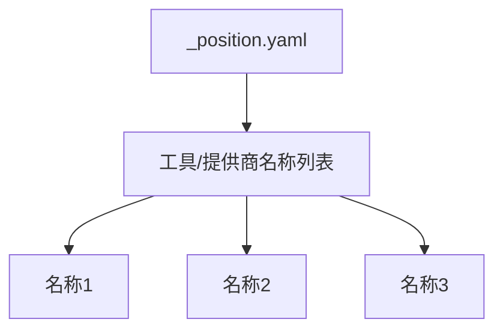
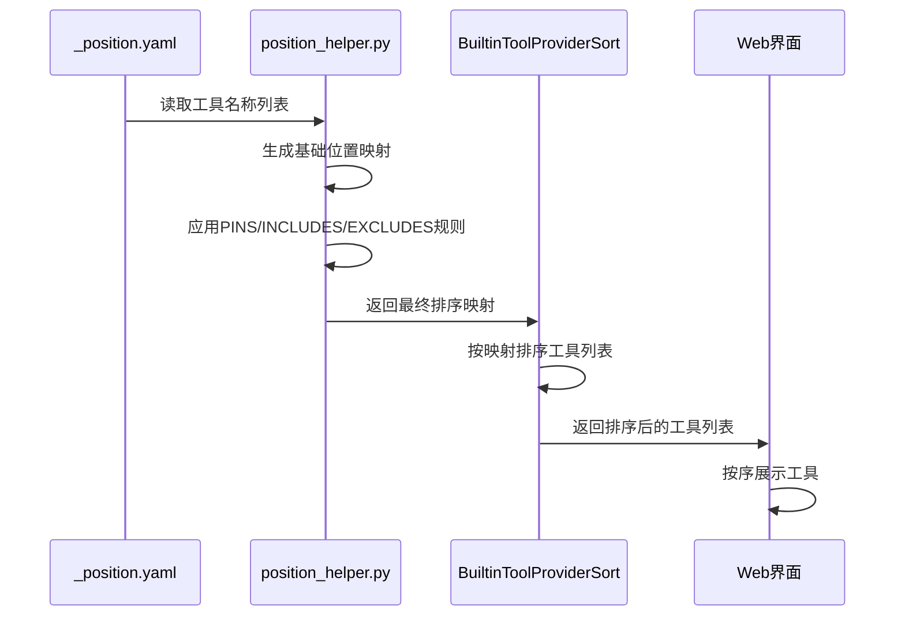
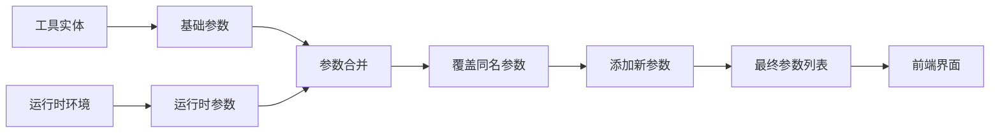
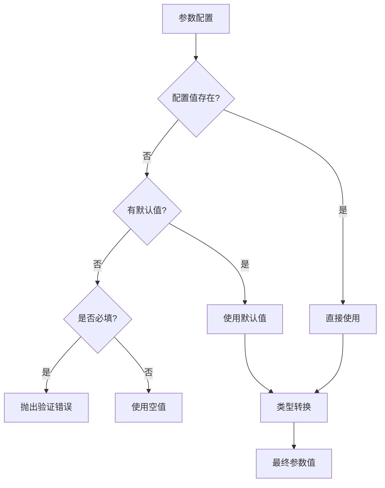
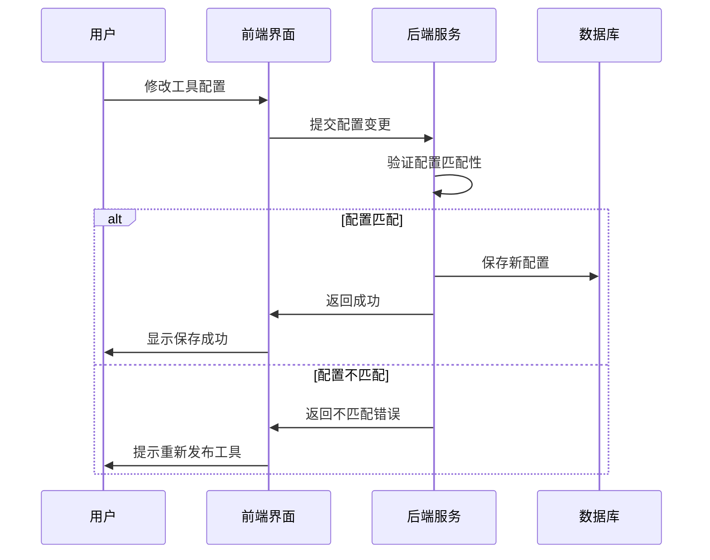
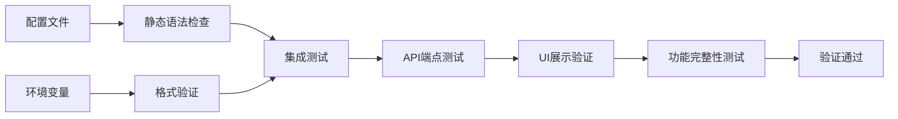

# 内置工具配置管理

<cite>
**本文档中引用的文件**  
- [\_position.yaml](file://api/core/tools/builtin_tool/_position.yaml)
- [\_position.yaml](file://api/core/model_runtime/model_providers/_position.yaml)
- [\_positions.py](file://api/core/tools/builtin_tool/providers/_positions.py)
- [position_helper.py](file://api/core/helper/position_helper.py)
- [__init__.py](file://api/configs/feature/__init__.py)
- [parameters.py](file://api/core/plugin/entities/parameters.py)
- [tool_manager.py](file://api/core/tools/tool_manager.py)
- [tools_transform_service.py](file://api/services/tools/tools_transform_service.py)
- [workflow_configuration_sync.py](file://api/core/tools/utils/workflow_configuration_sync.py)
- [use-config.ts](file://web/app/components/workflow/nodes/tool/use-config.ts)
- [default.ts](file://web/app/components/workflow/nodes/tool/default.ts)
</cite>

## 目录
1. [简介](#简介)
2. [位置配置文件结构](#位置配置文件结构)
3. [工具排序与可见性控制](#工具排序与可见性控制)
4. [工具参数配置机制](#工具参数配置机制)
5. [参数验证与默认值管理](#参数验证与默认值管理)
6. [配置变更生效机制](#配置变更生效机制)
7. [实际配置示例](#实际配置示例)
8. [配置验证方法](#配置验证方法)
9. [总结](#总结)

## 简介
Dify平台通过内置的配置体系实现对工具的灵活管理，其中`_position.yaml`文件是控制工具展示顺序和可见性的核心配置。本文档详细说明该配置体系的工作原理、字段含义、参数管理机制以及配置变更的处理流程，帮助开发者和管理员有效定制工具行为和界面展示。

## 位置配置文件结构

`_position.yaml`文件采用YAML格式定义工具或模型提供商的显示顺序。文件位于特定模块目录下，如`api/core/tools/builtin_tool/`和`api/core/model_runtime/model_providers/`，分别管理内置工具和模型提供商的排序。

文件内容为简单的字符串列表，每个条目代表一个工具或提供商的名称，列表顺序即为界面展示顺序。



**图示来源**  
- [\_position.yaml](file://api/core/tools/builtin_tool/_position.yaml)
- [\_position.yaml](file://api/core/model_runtime/model_providers/_position.yaml)

**本节来源**  
- [\_position.yaml](file://api/core/tools/builtin_tool/_position.yaml)
- [\_position.yaml](file://api/core/model_runtime/model_providers/_position.yaml)

## 工具排序与可见性控制

Dify平台通过多层机制实现工具的排序和可见性控制，结合静态配置文件和动态环境变量，提供灵活的管理能力。

### 排序机制
排序由`position_helper.py`中的`get_position_map`函数实现，该函数读取`_position.yaml`文件并生成名称到索引的映射字典。索引值越小，排序越靠前。

### 优先级控制
通过环境变量可动态调整排序，优先级规则为：排除 > 包含 > 置顶。相关配置字段包括：
- `POSITION_TOOL_PINS`: 置顶工具（逗号分隔）
- `POSITION_TOOL_INCLUDES`: 包含的工具列表
- `POSITION_TOOL_EXCLUDES`: 排除的工具列表

### 实现逻辑
`get_tool_position_map`函数首先获取基础位置映射，然后通过`pin_position_map`函数将置顶列表中的工具强制放置在排序最前面。



**图示来源**  
- [position_helper.py](file://api/core/helper/position_helper.py)
- [\_positions.py](file://api/core/tools/builtin_tool/providers/_positions.py)

**本节来源**  
- [position_helper.py](file://api/core/helper/position_helper.py)
- [\_positions.py](file://api/core/tools/builtin_tool/providers/_positions.py)
- [__init__.py](file://api/configs/feature/__init__.py)

## 工具参数配置机制

工具参数配置采用分层合并机制，结合静态定义和运行时配置，实现灵活的参数管理。

### 参数来源
工具参数来自两个主要来源：
1. **基础参数**：工具实体定义的静态参数
2. **运行时参数**：根据当前环境动态生成的参数

### 合并策略
`tools_transform_service.py`中的参数合并逻辑如下：
1. 首先处理基础参数，若存在同名运行时参数则用后者覆盖
2. 然后添加仅存在于运行时参数中的新参数
3. 保持参数的原始顺序，确保用户体验一致性

### 配置传递
在工作流节点中，工具配置通过`tool_configurations`对象传递，前端组件`use-config.ts`负责处理默认值填充和类型转换。



**图示来源**  
- [tools_transform_service.py](file://api/services/tools/tools_transform_service.py)
- [use-config.ts](file://web/app/components/workflow/nodes/tool/use-config.ts)

**本节来源**  
- [tools_transform_service.py](file://api/services/tools/tools_transform_service.py)
- [use-config.ts](file://web/app/components/workflow/nodes/tool/use-config.ts)
- [tool_manager.py](file://api/core/tools/tool_manager.py)

## 参数验证与默认值管理

Dify平台建立了完整的参数验证体系，确保配置的正确性和完整性。

### 默认值处理
`init_frontend_parameter`函数负责处理参数默认值：
- 若配置值为空且存在默认值，则使用默认值
- 若参数为必填且无配置值也无默认值，则抛出验证错误

### 类型验证
平台支持多种参数类型，每种类型有特定的验证规则：
- **SELECT类型**：验证值是否在选项列表中
- **BOOLEAN类型**：支持多种真值和假值表达
- **NUMBER类型**：自动转换字符串为数字
- **OBJECT类型**：支持JSON字符串解析

### 必填验证
前端组件`default.ts`实现必填字段验证，对`tool_parameters`和`tool_configurations`中的必填字段进行检查，确保用户配置完整。



**图示来源**  
- [parameters.py](file://api/core/plugin/entities/parameters.py)
- [default.ts](file://web/app/components/workflow/nodes/tool/default.ts)

**本节来源**  
- [parameters.py](file://api/core/plugin/entities/parameters.py)
- [default.ts](file://web/app/components/workflow/nodes/tool/default.ts)
- [tool_manager.py](file://api/core/tools/tool_manager.py)

## 配置变更生效机制

配置变更通过工作流发布机制生效，确保配置一致性。

### 变更检测
`workflow_configuration_sync.py`中的同步逻辑会检查参数配置与变量定义的匹配性：
- 配置数量必须与变量数量一致
- 每个配置参数必须对应一个变量

### 不匹配处理
当检测到配置不匹配时，系统会抛出"parameter configuration mismatch"错误，提示用户重新发布工具以更新配置。

### 前端处理
前端组件在检测到工具变更时，会自动调用`formattingParameters`函数，根据最新的配置模式填充默认值，确保界面状态与后端配置同步。



**图示来源**  
- [workflow_configuration_sync.py](file://api/core/tools/utils/workflow_configuration_sync.py)
- [use-config.ts](file://web/app/components/workflow/nodes/tool/use-config.ts)

**本节来源**  
- [workflow_configuration_sync.py](file://api/core/tools/utils/workflow_configuration_sync.py)
- [use-config.ts](file://web/app/components/workflow/nodes/tool/use-config.ts)

## 实际配置示例

以下为实际配置场景示例：

### 工具排序配置
```yaml
# api/core/tools/builtin_tool/_position.yaml
- audio
- code
- time
- webscraper
```

### 模型提供商排序配置
```yaml
# api/core/model_runtime/model_providers/_position.yaml
- openai
- deepseek
- anthropic
- azure_openai
- google
```

### 环境变量配置
```env
# 置顶特定工具
POSITION_TOOL_PINS=openai,code

# 仅显示特定工具
POSITION_TOOL_INCLUDES=openai,anthropic,code

# 排除特定工具
POSITION_TOOL_EXCLUDES=webscraper
```

### 参数配置示例
```json
{
  "tool_configurations": {
    "api_key": "sk-xxxx",
    "temperature": 0.7,
    "max_tokens": 1000
  },
  "tool_parameters": {
    "input_text": {
      "type": "variable",
      "value": "user_input"
    }
  }
}
```

**本节来源**  
- [\_position.yaml](file://api/core/tools/builtin_tool/_position.yaml)
- [\_position.yaml](file://api/core/model_runtime/model_providers/_position.yaml)
- [__init__.py](file://api/configs/feature/__init__.py)

## 配置验证方法

为确保配置正确性，建议采用以下验证方法：

### 静态验证
1. 检查`_position.yaml`文件语法正确性
2. 确认所有工具名称在系统中存在
3. 验证环境变量格式符合要求

### 动态验证
1. 通过API接口获取工具列表，验证排序是否符合预期
2. 尝试使用配置的工具，检查功能是否正常
3. 修改配置后观察界面变化，确认生效

### 自动化测试
平台提供单元测试验证配置逻辑：
- `test_tools_transform_service.py`验证参数合并逻辑
- `test_tool_parameter_type.py`验证参数类型转换
- `test_position_helper.py`验证排序算法



**本节来源**  
- [test_tools_transform_service.py](file://api/tests/unit_tests/services/tools/test_tools_transform_service.py)
- [test_tool_parameter_type.py](file://api/tests/unit_tests/core/tools/test_tool_parameter_type.py)

## 总结
Dify平台的内置工具配置管理体系通过`_position.yaml`文件和环境变量的结合，实现了灵活的工具排序和可见性控制。参数配置采用分层合并机制，确保静态定义与动态需求的平衡。完整的验证体系保障了配置的正确性和一致性，而清晰的变更生效机制则避免了配置冲突。通过合理使用这些配置机制，可以有效定制Dify平台的工具行为和界面展示，满足不同场景的需求。