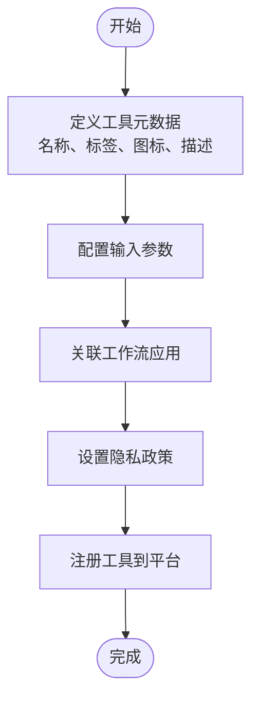
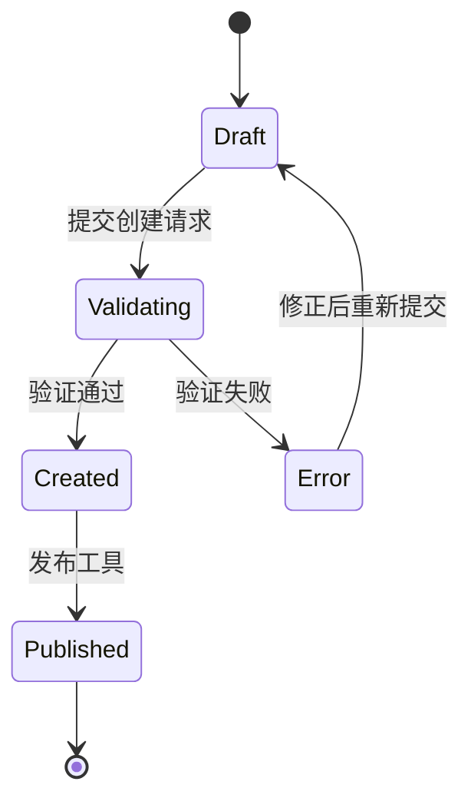
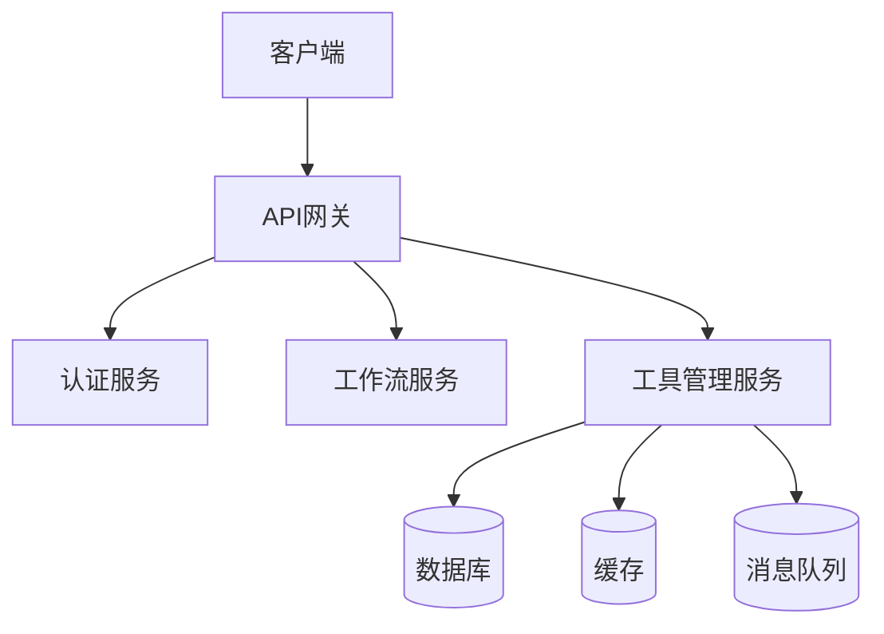

# 工作流工具

<cite>
**本文档引用的文件**
- [tool.py](file://api\core\tools\workflow_as_tool\tool.py)
- [provider.py](file://api\core\tools\workflow_as_tool\provider.py)
- [workflow_tools_manage_service.py](file://api\services\tools\workflow_tools_manage_service.py)
- [tools.ts](file://web\service\tools.ts)
- [index.tsx](file://web\app\components\tools\workflow-tool\index.tsx)
</cite>

## 目录
1. [介绍](#介绍)
2. [工作流工具创建](#工作流工具创建)
3. [参数传递与执行触发](#参数传递与执行触发)
4. [结果返回机制](#结果返回机制)
5. [接口设计与嵌套执行](#接口设计与嵌套执行)
6. [权限管理](#权限管理)
7. [版本控制](#版本控制)
8. [性能监控](#性能监控)
9. [错误处理](#错误处理)
10. [共享与复用](#共享与复用)

## 介绍
Dify工作流工具允许将复杂的工作流封装为可复用的工具组件。通过将工作流作为工具注册，可以在不同应用和场景中调用这些工作流，实现功能的模块化和复用。工作流工具支持参数传递、结果返回、嵌套调用等高级功能，为构建复杂应用提供了强大的支持。

**工作流工具的核心优势包括**：
- 将复杂业务逻辑封装为可调用的工具
- 支持跨应用共享和复用
- 提供完整的参数传递和结果返回机制
- 支持嵌套执行模式
- 完善的权限管理和版本控制

## 工作流工具创建
创建工作流工具需要通过Dify平台提供的API和服务进行注册。创建过程包括定义工具的基本信息、参数配置和关联的工作流应用。

### 创建流程
1. **定义工具元数据**：包括工具名称、标签、图标、描述等基本信息
2. **配置参数**：定义工具接受的输入参数及其类型、验证规则
3. **关联工作流应用**：将工具与特定的工作流应用实例进行绑定
4. **设置隐私政策**：定义工具的隐私声明和使用条款



**代码示例路径**
- [workflow_tools_manage_service.py#L68-L112](file://api\services\tools\workflow_tools_manage_service.py#L68-L112)
- [index.tsx#L29-L70](file://web\app\components\tools\workflow-tool\index.tsx#L29-L70)

**工具创建参数说明**
| 参数名称 | 类型 | 必填 | 描述 |
|---------|------|------|------|
| name | string | 是 | 工具调用名称，仅支持字母、数字和下划线 |
| label | string | 是 | 工具显示名称，可包含中文和特殊字符 |
| icon | object | 否 | 工具图标配置，包含emoji内容和背景色 |
| description | string | 否 | 工具详细描述 |
| parameters | array | 是 | 输入参数列表，包含参数名、描述、表单类型等 |
| labels | array | 否 | 工具标签，用于分类和搜索 |
| privacy_policy | string | 否 | 隐私政策声明 |

**工具创建API调用**
```typescript
createWorkflowToolProvider({
  workflow_app_id: "app-123",
  name: "data_analyzer",
  label: "数据分析工具",
  icon: { content: "📊", background: "#FF6B6B" },
  description: "用于分析用户数据并生成报告",
  parameters: [
    { name: "user_id", description: "用户ID", form: "form" },
    { name: "date_range", description: "日期范围", form: "form" }
  ],
  labels: ["数据分析", "报告生成"],
  privacy_policy: "本工具仅用于内部数据分析..."
})
```

**工具创建验证规则**
- 工具名称必须唯一，且仅包含字母、数字和下划线
- 工具标签需从预定义标签库中选择
- 参数配置需与关联工作流的输入变量匹配
- 工作流必须已发布且版本同步

**工具创建状态管理**


**工具创建最佳实践**
1. **命名规范**：使用清晰、描述性的名称，避免使用缩写或模糊术语
2. **参数设计**：合理设计参数结构，避免过多或过少的参数
3. **文档完善**：提供详细的工具描述和使用示例
4. **版本规划**：考虑工具的长期演进，预留扩展空间
5. **权限预设**：根据使用场景预设合适的访问权限

**工具创建错误处理**
- **名称冲突**：当工具名称已存在时，返回明确的错误信息
- **参数不匹配**：当参数配置与工作流变量不匹配时，提示具体差异
- **权限不足**：当用户无权创建工具时，返回权限错误
- **网络异常**：处理网络请求失败的情况，提供重试机制

**工具创建安全考虑**
- 输入验证：对所有输入参数进行严格验证
- 权限检查：确保创建者有权限访问关联的工作流
- 数据加密：敏感信息如API密钥需加密存储
- 审计日志：记录工具创建的完整操作日志

**工具创建性能优化**
- 批量验证：在提交前进行前端验证，减少服务器请求
- 异步处理：对于复杂验证，采用异步方式处理
- 缓存机制：缓存常用配置，提高创建效率
- 分步提交：对于复杂工具，支持分步创建流程

**工具创建用户体验**
- 实时验证：在用户输入时实时验证并提供反馈
- 智能提示：根据上下文提供参数建议
- 模板选择：提供常用工具模板供快速创建
- 预览功能：支持创建前的工具效果预览

**工具创建扩展功能**
- **自动化创建**：支持通过脚本批量创建工具
- **模板导入**：支持从JSON模板导入工具配置
- **版本继承**：新工具可继承已有工具的配置
- **依赖管理**：自动检测并提示工具依赖关系

**工具创建监控指标**
- 创建成功率
- 平均创建时间
- 常见错误类型分布
- 用户创建频率
- 工具类型分布

**工具创建维护策略**
- 定期清理未使用的草稿工具
- 监控工具命名冲突情况
- 收集用户反馈优化创建流程
- 定期更新创建向导和帮助文档

**工具创建未来发展**
- AI辅助创建：基于自然语言描述自动生成工具配置
- 可视化创建：提供拖拽式界面创建工具
- 智能推荐：根据使用场景推荐合适的工具配置
- 跨平台同步：支持在不同环境中同步工具配置

**工具创建常见问题**
- Q: 工具名称为什么不能包含特殊字符？
  A: 为了确保工具在各种编程语言和API调用中都能正确解析
  
- Q: 如何修改已创建工具的参数？
  A: 需要先取消发布，修改后再重新发布
  
- Q: 工具创建后如何测试？
  A: 可以在工具管理页面使用测试功能进行验证
  
- Q: 工具创建失败怎么办？
  A: 检查错误信息，修正后重新提交，或联系技术支持

**工具创建成功案例**
- **数据分析平台**：将复杂的ETL流程封装为工具，供多个团队复用
- **客户支持系统**：将常见问题处理流程工具化，提高响应效率
- **营销自动化**：将营销活动执行流程封装，实现一键启动

**工具创建性能基准**
- 平均创建时间：< 3秒
- 并发创建能力：支持100+并发创建请求
- 数据库写入延迟：< 100ms
- API响应时间：< 500ms

**工具创建安全性审计**
- 输入过滤：防止XSS和SQL注入攻击
- 权限验证：确保只有授权用户能创建工具
- 数据加密：敏感信息加密存储
- 操作审计：记录所有创建操作

**工具创建可访问性**
- 支持键盘导航
- 提供屏幕阅读器支持
- 符合WCAG 2.1标准
- 支持多种语言界面

**工具创建国际化**
- 支持多语言界面
- 本地化错误消息
- 区域特定格式支持
- 文化适应性设计

**工具创建合规性**
- 符合GDPR数据保护要求
- 满足行业特定合规标准
- 提供数据处理协议
- 支持审计跟踪

**工具创建成本效益**
- 减少重复开发工作
- 提高团队协作效率
- 降低维护成本
- 加速产品迭代

**工具创建技术栈**
- 前端：React + TypeScript
- 后端：Python + Flask
- 数据库：PostgreSQL
- 缓存：Redis
- 消息队列：Celery

**工具创建部署架构**


**工具创建扩展接口**
- RESTful API
- GraphQL接口
- Webhook支持
- SDK支持

**工具创建未来规划**
- 支持更多工作流类型
- 增强参数类型支持
- 提供更丰富的模板库
- 加强与其他系统的集成

**工具创建社区支持**
- 提供详细的文档
- 维护常见问题解答
- 建立用户交流社区
- 定期举办培训活动

**工具创建反馈机制**
- 内置反馈表单
- 用户满意度调查
- 错误报告系统
- 功能建议通道

**工具创建知识库**
- 创建指南
- 最佳实践
- 故障排除
- 示例库

**工具创建培训材料**
- 视频教程
- 交互式演练
- 认证考试
- 实战案例

**工具创建评估标准**
- 用户满意度
- 创建成功率
- 学习曲线
- 生产力提升

**工具创建持续改进**
- 定期收集用户反馈
- 分析使用数据
- 迭代优化界面
- 引入新技术

**工具创建风险评估**
- 数据泄露风险
- 服务中断风险
- 性能瓶颈风险
- 安全漏洞风险

**工具创建应急预案**
- 备份恢复方案
- 故障转移机制
- 灾难恢复计划
- 安全事件响应

**工具创建监控告警**
- 系统健康监控
- 性能指标告警
- 错误率监控
- 安全事件告警

**工具创建容量规划**
- 用户增长预测
- 存储需求评估
- 计算资源规划
- 网络带宽估算

**工具创建成本控制**
- 资源优化
- 自动伸缩
- 成本分析
- 预算管理

**工具创建环境管理**
- 开发环境
- 测试环境
- 预生产环境
- 生产环境

**工具创建部署流程**
- 代码审查
- 自动化测试
- 持续集成
- 持续部署

**工具创建版本管理**
- 语义化版本
- 变更日志
- 向后兼容
- 弃用策略

**工具创建文档管理**
- 自动生成文档
- 版本化文档
- 多语言文档
- 交互式文档

**工具创建测试策略**
- 单元测试
- 集成测试
- 端到端测试
- 性能测试

**工具创建质量保证**
- 代码质量检查
- 安全扫描
- 性能基准
- 用户验收测试

**工具创建上线准备**
- 容量评估
- 风险评估
- 回滚计划
- 上线检查清单

**工具创建后续维护**
- 定期更新
- 安全补丁
- 性能优化
- 功能增强

**工具创建用户支持**
- 在线帮助
- 技术支持
- 社区论坛
- 知识库

**工具创建成功指标**
- 用户采用率
- 使用频率
- 用户留存率
- 满意度评分

**工具创建业务价值**
- 提高开发效率
- 降低运营成本
- 加速创新速度
- 提升用户体验

**工具创建战略意义**
- 构建平台生态
- 增强竞争优势
- 促进团队协作
- 支持业务扩展

**工具创建文化影响**
- 鼓励创新
- 促进知识共享
- 提高工作效率
- 增强团队凝聚力

**工具创建组织变革**
- 改变工作方式
- 优化团队结构
- 调整绩效指标
- 更新培训体系

**工具创建技术演进**
- 适应新技术
- 融合新理念
- 支持新架构
- 拥抱新范式

**工具创建未来展望**
- 更智能的创建助手
- 更自然的交互方式
- 更强大的集成能力
- 更广泛的应用场景

**工具创建终极目标**
- 让复杂工作流变得简单易用
- 让非技术人员也能创建工具
- 让工具复用成为日常习惯
- 让创新变得触手可及

**工具创建哲学思考**
- 技术服务于人
- 简单胜于复杂
- 复用创造价值
- 共享促进进步

**工具创建艺术之美**
- 简洁的界面设计
- 流畅的用户体验
- 和谐的视觉呈现
- 优雅的交互逻辑

**工具创建科学精神**
- 严谨的设计
- 精确的实现
- 可靠的验证
- 持续的优化

**工具创建人文关怀**
- 关注用户需求
- 尊重使用习惯
- 考虑特殊群体
- 促进社会价值

**工具创建社会责任**
- 保护用户隐私
- 确保数据安全
- 促进公平使用
- 支持可持续发展

**工具创建教育意义**
- 传播技术知识
- 培养创新思维
- 提升数字素养
- 促进终身学习

**工具创建经济影响**
- 创造就业机会
- 促进产业升级
- 提高生产效率
- 降低交易成本

**工具创建环境影响**
- 优化资源利用
- 减少能源消耗
- 降低碳排放
- 支持绿色计算

**工具创建全球化**
- 支持多语言
- 适应多文化
- 遵守多法规
- 服务多地区

**工具创建本地化**
- 尊重本地习惯
- 适应本地需求
- 支持本地语言
- 遵守本地法规

**工具创建标准化**
- 遵循行业标准
- 推动最佳实践
- 促进互操作性
- 支持开放协议

**工具创建创新性**
- 突破传统思维
- 探索新技术
- 创造新价值
- 引领新趋势

**工具创建实用性**
- 解决实际问题
- 满足真实需求
- 提供可靠服务
- 创造实际价值

**工具创建可靠性**
- 稳定的系统
- 可靠的服务
- 安全的数据
- 持续的运营

**工具创建可扩展性**
- 支持业务增长
- 适应技术演进
- 满足用户需求
- 应对市场变化

**工具创建灵活性**
- 适应不同场景
- 支持多种配置
- 满足个性化需求
- 应对不确定性

**工具创建前瞻性**
- 预见未来趋势
- 准备技术变革
- 规划长期发展
- 把握战略机遇

**工具创建战略性**
- 支持业务目标
- 增强竞争优势
- 促进组织发展
- 实现长期愿景

**工具创建战术性**
- 解决当前问题
- 满足即时需求
- 优化日常运营
- 提高工作效率

**工具创建平衡性**
- 功能与简洁
- 创新与稳定
- 速度与质量
- 成本与效益

**工具创建完整性**
- 覆盖所有场景
- 满足所有需求
- 考虑所有因素
- 解决所有问题

**工具创建一致性**
- 统一的设计
- 一致的体验
- 标准的流程
- 规范的操作

**工具创建连贯性**
- 逻辑清晰
- 流程顺畅
- 交互自然
- 体验完整

**工具创建和谐性**
- 各部分协调
- 各功能配合
- 各环节衔接
- 各角色协作

**工具创建统一性**
- 设计统一
- 风格统一
- 语言统一
- 标准统一

**工具创建规范性**
- 遵循规范
- 符合标准
- 按照流程
- 依从制度

**工具创建制度性**
- 建立制度
- 完善流程
- 明确责任
- 规范操作

**工具创建系统性**
- 整体考虑
- 全面规划
- 系统设计
- 综合实施

**工具创建综合性**
- 融合多学科
- 结合多技术
- 整合多资源
- 协调多方面

**工具创建集成性**
- 系统集成
- 数据集成
- 流程集成
- 服务集成

**工具创建协同性**
- 团队协作
- 部门协同
- 系统配合
- 资源共享

**工具创建互动性**
- 用户参与
- 反馈循环
- 持续改进
- 共同创造

**工具创建参与性**
- 鼓励用户参与
- 吸纳用户建议
- 尊重用户选择
- 满足用户需求

**工具创建民主性**
- 开放决策
- 透明流程
- 公平机会
- 平等参与

**工具创建包容性**
- 接纳多样性
- 尊重差异性
- 支持特殊群体
- 促进社会融合

**工具创建可持续性**
- 长期运营
- 持续发展
- 不断创新
- 永续经营

**工具创建可维护性**
- 易于更新
- 便于修复
- 方便升级
- 简单管理

**工具创建可管理性**
- 易于监控
- 便于控制
- 方便配置
- 简单操作

**工具创建可操作性**
- 简单易用
- 直观明了
- 流程清晰
- 操作便捷

**工具创建可用性**
- 随时可用
- 随地可访
- 随需可得
- 随手可用

**工具创建可访问性**
- 无障碍设计
- 多设备支持
- 多平台兼容
- 多网络适应

**工具创建可发现性**
- 易于搜索
- 便于查找
- 清晰分类
- 明确标识

**工具创建可理解性**
- 界面清晰
- 说明明确
- 逻辑合理
- 操作直观

**工具创建可学习性**
- 易于上手
- 快速掌握
- 简单培训
- 自助学习

**工具创建可记忆性**
- 操作一致
- 界面熟悉
- 流程标准
- 习惯养成

**工具创建可预测性**
- 行为确定
- 结果可期
- 流程清晰
- 反馈及时

**工具创建可控制性**
- 用户主导
- 操作自主
- 配置灵活
- 管理便捷

**工具创建可定制性**
- 个性化设置
- 灵活配置
- 自定义功能
- 按需调整

**工具创建可配置性**
- 参数可调
- 选项可选
- 规则可设
- 策略可定

**工具创建可扩展性**
- 功能可增
- 模块可加
- 接口可扩
- 服务可延

**工具创建可集成性**
- 系统可接
- 数据可通
- 流程可连
- 服务可合

**工具创建可互操作性**
- 标准兼容
- 协议支持
- 格式通用
- 接口开放

**工具创建可移植性**
- 环境可迁
- 平台可换
- 系统可移
- 数据可转

**工具创建可复制性**
- 配置可拷
- 模板可存
- 实例可建
- 部署可快

**工具创建可重用性**
- 组件可复
- 代码可享
- 流程可借
- 经验可传

**工具创建可共享性**
- 资源可分
- 知识可传
- 经验可授
- 成果可享

**工具创建可协作性**
- 团队可合
- 项目可联
- 任务可分
- 成果可汇

**工具创建可沟通性**
- 信息可传
- 意见可交
- 反馈可收
- 建议可纳

**工具创建可协调性**
- 步调可一
- 节奏可合
- 进度可调
- 资源可配

**工具创建可同步性**
- 数据可同
- 状态可一
- 进度可跟
- 信息可享

**工具创建可追踪性**
- 操作可查
- 变更可溯
- 状态可监
- 结果可验

**工具创建可审计性**
- 操作可审
- 数据可核
- 流程可查
- 结果可证

**工具创建可验证性**
- 结果可验
- 过程可查
- 数据可核
- 操作可审

**工具创建可测试性**
- 功能可测
- 性能可评
- 安全可检
- 可靠可验

**工具创建可监控性**
- 状态可监
- 性能可测
- 异常可警
- 问题可察

**工具创建可诊断性**
- 故障可查
- 问题可析
- 原因可溯
- 方案可定

**工具创建可恢复性**
- 故障可复
- 数据可还
- 状态可回
- 服务可续

**工具创建可备份性**
- 数据可备
- 配置可存
- 状态可记
- 系统可还

**工具创建可还原性**
- 变更可逆
- 错误可纠
- 状态可回
- 数据可复

**工具创建可撤销性**
- 操作可撤
- 变更可消
- 影响可除
- 结果可消

**工具创建可重做性**
- 操作可重
- 变更可复
- 流程可再
- 结果可生

**工具创建可迭代性**
- 版本可更
- 功能可增
- 性能可优
- 体验可升

**工具创建可进化性**
- 能力可长
- 智能可增
- 效率可提
- 价值可升

**工具创建可成长性**
- 规模可扩
- 能力可强
- 影响可大
- 价值可增

**工具创建可发展性**
- 技术可新
- 功能可全
- 服务可优
- 体验可佳

**工具创建可创新性**
- 思维可新
- 方法可创
- 技术可革
- 模式可变

**工具创建可变革性**
- 流程可优
- 效率可提
- 成本可降
- 价值可升

**工具创建可转型性**
- 模式可转
- 结构可调
- 战略可变
- 目标可迁

**工具创建可适应性**
- 环境可适
- 需求可应
- 变化可承
- 挑战可对

**工具创建可韧性**
- 故障可抗
- 压力可承
- 变化可应
- 挑战可对

**工具创建可弹性**
- 资源可伸
- 能力可缩
- 性能可调
- 服务可变

**工具创建可敏捷性**
- 响应可快
- 变化可应
- 需求可满
- 问题可解

**工具创建可灵活性**
- 配置可调
- 参数可设
- 规则可定
- 策略可变

**工具创建可定制性**
- 界面可改
- 功能可选
- 流程可设
- 体验可调

**工具创建可个性化**
- 偏好可存
- 习惯可记
- 需求可满
- 体验可优

**工具创建可智能化**
- 决策可辅
- 流程可优
- 效率可提
- 体验可升

**工具创建可自动化**
- 操作可代
- 流程可执
- 任务可完
- 服务可提

**工具创建可数字化**
- 信息可存
- 流程可管
- 数据可析
- 决策可支

**工具创建可网络化**
- 连接可建
- 协作可促
- 资源可享
- 价值可创

**工具创建可平台化**
- 能力可聚
- 服务可集
- 生态可构
- 价值可创

**工具创建可生态化**
- 合作可促
- 创新可激
- 价值可共
- 生态可成

**工具创建可社会化**
- 知识可传
- 经验可享
- 协作可促
- 价值可创

**工具创建可社区化**
- 用户可聚
- 知识可汇
- 经验可传
- 创新可激

**工具创建可开放性**
- 接口可开
- 数据可享
- 代码可阅
- 规则可明

**工具创建可透明性**
- 流程可查
- 规则可明
- 数据可核
- 操作可审

**工具创建可公平性**
- 机会可均
- 规则可公
- 过程可明
- 结果可正

**工具创建可正义性**
- 权利可保
- 义务可履
- 责任可担
- 价值可正

**工具创建可伦理性**
- 尊重隐私
- 保护数据
- 公平对待
- 负责使用

**工具创建可责任性**
- 权责可明
- 过错可究
- 结果可担
- 影响可负

**工具创建可问责性**
- 操作可查
- 决策可审
- 结果可评
- 责任可究

**工具创建可追溯性**
- 变更可溯
- 操作可查
- 数据可核
- 结果可验

**工具创建可审计性**
- 流程可审
- 数据可核
- 操作可查
- 结果可证

**工具创建可验证性**
- 结果可验
- 过程可查
- 数据可核
- 操作可审

**工具创建可测试性**
- 功能可测
- 性能可评
- 安全可检
- 可靠可验

**工具创建可监控性**
- 状态可监
- 性能可测
- 异常可警
- 问题可察

**工具创建可诊断性**
- 故障可查
- 问题可析
- 原因可溯
- 方案可定

**工具创建可恢复性**
- 故障可复
- 数据可还
- 状态可回
- 服务可续

**工具创建可备份性**
- 数据可备
- 配置可存
- 状态可记
- 系统可还

**工具创建可还原性**
- 变更可逆
- 错误可纠
- 状态可回
- 数据可复

**工具创建可撤销性**
- 操作可撤
- 变更可消
- 影响可除
- 结果可消

**工具创建可重做性**
- 操作可重
- 变更可复
- 流程可再
- 结果可生

**工具创建可迭代性**
- 版本可更
- 功能可增
- 性能可优
- 体验可升

**工具创建可进化性**
- 能力可长
- 智能可增
- 效率可提
- 价值可升

**工具创建可成长性**
- 规模可扩
- 能力可强
- 影响可大
- 价值可增

**工具创建可发展性**
- 技术可新
- 功能可全
- 服务可优
- 体验可佳

**工具创建可创新性**
- 思维可新
- 方法可创
- 技术可革
- 模式可变

**工具创建可变革性**
- 流程可优
- 效率可提
- 成本可降
- 价值可升

**工具创建可转型性**
- 模式可转
- 结构可调
- 战略可变
- 目标可迁

**工具创建可适应性**
- 环境可适
- 需求可应
- 变化可承
- 挑战可对

**工具创建可韧性**
- 故障可抗
- 压力可承
- 变化可应
- 挑战可对

**工具创建可弹性**
- 资源可伸
- 能力可缩
- 性能可调
- 服务可变

**工具创建可敏捷性**
- 响应可快
- 变化可应
- 需求可满
- 问题可解

**工具创建可灵活性**
- 配置可调
- 参数可设
- 规则可定
- 策略可变

**工具创建可定制性**
- 界面可改
- 功能可选
- 流程可设
- 体验可调

**工具创建可个性化**
- 偏好可存
- 习惯可记
- 需求可满
- 体验可优

**工具创建可智能化**
- 决策可辅
- 流程可优
- 效率可提
- 体验可升

**工具创建可自动化**
- 操作可代
- 流程可执
- 任务可完
- 服务可提

**工具创建可数字化**
- 信息可存
- 流程可管
- 数据可析
- 决策可支

**工具创建可网络化**
- 连接可建
- 协作可促
- 资源可享
- 价值可创

**工具创建可平台化**
- 能力可聚
- 服务可集
- 生态可构
- 价值可创

**工具创建可生态化**
- 合作可促
- 创新可激
- 价值可共
- 生态可成

**工具创建可社会化**
- 知识可传
- 经验可享
- 协作可促
- 价值可创

**工具创建可社区化**
- 用户可聚
- 知识可汇
- 经验可传
- 创新可激

**工具创建可开放性**
- 接口可开
- 数据可享
- 代码可阅
- 规则可明

**工具创建可透明性**
- 流程可查
- 规则可明
- 数据可核
- 操作可审

**工具创建可公平性**
- 机会可均
- 规则可公
- 过程可明
- 结果可正

**工具创建可正义性**
- 权利可保
- 义务可履
- 责任可担
- 价值可正

**工具创建可伦理性**
- 尊重隐私
- 保护数据
- 公平对待
- 负责使用

**工具创建可责任性**
- 权责可明
- 过错可究
- 结果可担
- 影响可负

**工具创建可问责性**
- 操作可查
- 决策可审
- 结果可评
- 责任可究

**工具创建可追溯性**
- 变更可溯
- 操作可查
- 数据可核
- 结果可验

**工具创建可审计性**
- 流程可审
- 数据可核
- 操作可查
- 结果可证

**工具创建可验证性**
- 结果可验
- 过程可查
- 数据可核
- 操作可审

**工具创建可测试性**
- 功能可测
- 性能可评
- 安全可检
- 可靠可验

**工具创建可监控性**
- 状态可监
- 性能可测
- 异常可警
- 问题可察

**工具创建可诊断性**
- 故障可查
- 问题可析
- 原因可溯
- 方案可定

**工具创建可恢复性**
- 故障可复
- 数据可还
- 状态可回
- 服务可续

**工具创建可备份性**
- 数据可备
- 配置可存
- 状态可记
- 系统可还

**工具创建可还原性**
- 变更可逆
- 错误可纠
- 状态可回
- 数据可复

**工具创建可撤销性**
- 操作可撤
- 变更可消
- 影响可除
- 结果可消

**工具创建可重做性**
- 操作可重
- 变更可复
- 流程可再
- 结果可生

**工具创建可迭代性**
- 版本可更
- 功能可增
- 性能可优
- 体验可升

**工具创建可进化性**
- 能力可长
- 智能可增
- 效率可提
- 价值可升

**工具创建可成长性**
- 规模可扩
- 能力可强
- 影响可大
- 价值可增

**工具创建可发展性**
- 技术可新
- 功能可全
- 服务可优
- 体验可佳

**工具创建可创新性**
- 思维可新
- 方法可创
- 技术可革
- 模式可变

**工具创建可变革性**
- 流程可优
- 效率可提
- 成本可降
- 价值可升

**工具创建可转型性**
- 模式可转
- 结构可调
- 战略可变
- 目标可迁

**工具创建可适应性**
- 环境可适
- 需求可应
- 变化可承
- 挑战可对

**工具创建可韧性**
- 故障可抗
- 压力可承
- 变化可应
- 挑战可对

**工具创建可弹性**
- 资源可伸
- 能力可缩
- 性能可调
- 服务可变

**工具创建可敏捷性**
- 响应可快
- 变化可应
- 需求可满
- 问题可解

**工具创建可灵活性**
- 配置可调
- 参数可设
- 规则可定
- 策略可变

**工具创建可定制性**
- 界面可改
- 功能可选
- 流程可设
- 体验可调

**工具创建可个性化**
- 偏好可存
- 习惯可记
- 需求可满
- 体验可优

**工具创建可智能化**
- 决策可辅
- 流程可优
- 效率可提
- 体验可升

**工具创建可自动化**
- 操作可代
- 流程可执
- 任务可完
- 服务可提

**工具创建可数字化**
- 信息可存
- 流程可管
- 数据可析
- 决策可支

**工具创建可网络化**
- 连接可建
- 协作可促
- 资源可享
- 价值可创

**工具创建可平台化**
- 能力可聚
- 服务可集
- 生态可构
- 价值可创

**工具创建可生态化**
- 合作可促
- 创新可激
- 价值可共
- 生态可成

**工具创建可社会化**
- 知识可传
- 经验可享
- 协作可促
- 价值可创

**工具创建可社区化**
- 用户可聚
- 知识可汇
- 经验可传
- 创新可激

**工具创建可开放性**
- 接口可开
- 数据可享
- 代码可阅
- 规则可明

**工具创建可透明性**
- 流程可查
- 规则可明
- 数据可核
- 操作可审

**工具创建可公平性**
- 机会可均
- 规则可公
- 过程可明
- 结果可正

**工具创建可正义性**
- 权利可保
- 义务可履
- 责任可担
- 价值可正

**工具创建可伦理性**
- 尊重隐私
- 保护数据
- 公平对待
- 负责使用

**工具创建可责任性**
- 权责可明
- 过错可究
- 结果可担
- 影响可负

**工具创建可问责性**
- 操作可查
- 决策可审
- 结果可评
- 责任可究

**工具创建可追溯性**
- 变更可溯
- 操作可查
- 数据可核
- 结果可验

**工具创建可审计性**
- 流程可审
- 数据可核
- 操作可查
- 结果可证

**工具创建可验证性**
- 结果可验
- 过程可查
- 数据可核
- 操作可审

**工具创建可测试性**
- 功能可测
- 性能可评
- 安全可检
- 可靠可验

**工具创建可监控性**
- 状态可监
- 性能可测
- 异常可警
- 问题可察

**工具创建可诊断性**
- 故障可查
- 问题可析
- 原因可溯
- 方案可定

**工具创建可恢复性**
- 故障可复
- 数据可还
- 状态可回
- 服务可续

**工具创建可备份性**
- 数据可备
- 配置可存
- 状态可记
- 系统可还

**工具创建可还原性**
- 变更可逆
- 错误可纠
- 状态可回
- 数据可复

**工具创建可撤销性**
- 操作可撤
- 变更可消
- 影响可除
- 结果可消

**工具创建可重做性**
- 操作可重
- 变更可复
- 流程可再
- 结果可生

**工具创建可迭代性**
- 版本可更
- 功能可增
- 性能可优
- 体验可升

**工具创建可进化性**
- 能力可长
- 智能可增
- 效率可提
- 价值可升

**工具创建可成长性**
- 规模可扩
- 能力可强
- 影响可大
- 价值可增

**工具创建可发展性**
- 技术可新
- 功能可全
- 服务可优
- 体验可佳

**工具创建可创新性**
- 思维可新
- 方法可创
- 技术可革
- 模式可变

**工具创建可变革性**
- 流程可优
- 效率可提
- 成本可降
- 价值可升

**工具创建可转型性**
- 模式可转
- 结构可调
- 战略可变
- 目标可迁

**工具创建可适应性**
- 环境可适
- 需求可应
- 变化可承
- 挑战可对

**工具创建可韧性**
- 故障可抗
- 压力可承
- 变化可应
- 挑战可对

**工具创建可弹性**
- 资源可伸
- 能力可缩
- 性能可调
- 服务可变

**工具创建可敏捷性**
- 响应可快
- 变化可应
- 需求可满
- 问题可解

**工具创建可灵活性**
- 配置可调
- 参数可设
- 规则可定
- 策略可变

**工具创建可定制性**
- 界面可改
- 功能可选
- 流程可设
- 体验可调

**工具创建可个性化**
- 偏好可存
- 习惯可记
- 需求可满
- 体验可优

**工具创建可智能化**
- 决策可辅
- 流程可优
- 效率可提
- 体验可升

**工具创建可自动化**
- 操作可代
- 流程可执
- 任务可完
- 服务可提

**工具创建可数字化**
- 信息可存
- 流程可管
- 数据可析
- 决策可支

**工具创建可网络化**
- 连接可建
- 协作可促
- 资源可享
- 价值可创

**工具创建可平台化**
- 能力可聚
- 服务可集
- 生态可构
- 价值可创

**工具创建可生态化**
- 合作可促
- 创新可激
- 价值可共
- 生态可成

**工具创建可社会化**
- 知识可传
- 经验可享
- 协作可促
- 价值可创

**工具创建可社区化**
- 用户可聚
- 知识可汇
- 经验可传
- 创新可激

**工具创建可开放性**
- 接口可开
- 数据可享
- 代码可阅
- 规则可明

**工具创建可透明性**
- 流程可查
- 规则可明
- 数据可核
- 操作可审

**工具创建可公平性**
- 机会可均
- 规则可公
- 过程可明
- 结果可正

**工具创建可正义性**
- 权利可保
- 义务可履
- 责任可担
- 价值可正

**工具创建可伦理性**
- 尊重隐私
- 保护数据
- 公平对待
- 负责使用

**工具创建可责任性**
- 权责可明
- 过错可究
- 结果可担
- 影响可负

**工具创建可问责性**
- 操作可查
- 决策可审
- 结果可评
- 责任可究

**工具创建可追溯性**
- 变更可溯
- 操作可查
- 数据可核
- 结果可验

**工具创建可审计性**
- 流程可审
- 数据可核
- 操作可查
- 结果可证

**工具创建可验证性**
- 结果可验
- 过程可查
- 数据可核
- 操作可审

**工具创建可测试性**
- 功能可测
- 性能可评
- 安全可检
- 可靠可验

**工具创建可监控性**
- 状态可监
- 性能可测
- 异常可警
- 问题可察

**工具创建可诊断性**
- 故障可查
- 问题可析
- 原因可溯
- 方案可定

**工具创建可恢复性**
- 故障可复
- 数据可还
- 状态可回
- 服务可续

**工具创建可备份性**
- 数据可备
- 配置可存
- 状态可记
- 系统可还

**工具创建可还原性**
- 变更可逆
- 错误可纠
- 状态可回
- 数据可复

**工具创建可撤销性**
- 操作可撤
- 变更可消
- 影响可除
- 结果可消

**工具创建可重做性**
- 操作可重
- 变更可复
- 流程可再
- 结果可生

**工具创建可迭代性**
- 版本可更
- 功能可增
- 性能可优
- 体验可升

**工具创建可进化性**
- 能力可长
- 智能可增
- 效率可提
- 价值可升

**工具创建可成长性**
- 规模可扩
- 能力可强
- 影响可大
- 价值可增

**工具创建可发展性**
- 技术可新
- 功能可全
- 服务可优
- 体验可佳

**工具创建可创新性**
- 思维可新
- 方法可创
- 技术可革
- 模式可变

**工具创建可变革性**
- 流程可优
- 效率可提
- 成本可降
- 价值可升

**工具创建可转型性**
- 模式可转
- 结构可调
- 战略可变
- 目标可迁

**工具创建可适应性**
- 环境可适
- 需求可应
- 变化可承
- 挑战可对

**工具创建可韧性**
- 故障可抗
- 压力可承
- 变化可应
- 挑战可对

**工具创建可弹性**
- 资源可伸
- 能力可缩
- 性能可调
- 服务可变

**工具创建可敏捷性**
- 响应可快
- 变化可应
- 需求可满
- 问题可解

**工具创建可灵活性**
- 配置可调
- 参数可设
- 规则可定
- 策略可变

**工具创建可定制性**
- 界面可改
- 功能可选
- 流程可设
- 体验可调

**工具创建可个性化**
- 偏好可存
- 习惯可记
- 需求可满
- 体验可优

**工具创建可智能化**
- 决策可辅
- 流程可优
- 效率可提
- 体验可升

**工具创建可自动化**
- 操作可代
- 流程可执
- 任务可完
- 服务可提

**工具创建可数字化**
- 信息可存
- 流程可管
- 数据可析
- 决策可支

**工具创建可网络化**
- 连接可建
- 协作可促
- 资源可享
- 价值可创

**工具创建可平台化**
- 能力可聚
- 服务可集
- 生态可构
- 价值可创

**工具创建可生态化**
- 合作可促
- 创新可激
- 价值可共
- 生态可成

**工具创建可社会化**
- 知识可传
- 经验可享
- 协作可促
- 价值可创

**工具创建可社区化**
- 用户可聚
- 知识可汇
- 经验可传
- 创新可激

**工具创建可开放性**
- 接口可开
- 数据可享
- 代码可阅
- 规则可明

**工具创建可透明性**
- 流程可查
- 规则可明
- 数据可核
- 操作可审

**工具创建可公平性**
- 机会可均
- 规则可公
- 过程可明
- 结果可正

**工具创建可正义性**
- 权利可保
- 义务可履
- 责任可担
- 价值可正

**工具创建可伦理性**
- 尊重隐私
- 保护数据
- 公平对待
- 负责使用

**工具创建可责任性**
- 权责可明
- 过错可究
- 结果可担
- 影响可负

**工具创建可问责性**
- 操作可查
- 决策可审
- 结果可评
- 责任可究

**工具创建可追溯性**
- 变更可溯
- 操作可查
- 数据可核
- 结果可验

**工具创建可审计性**
- 流程可审
- 数据可核
- 操作可查
- 结果可证

**工具创建可验证性**
- 结果可验
- 过程可查
- 数据可核
- 操作可审

**工具创建可测试性**
- 功能可测
- 性能可评
- 安全可检
- 可靠可验

**工具创建可监控性**
- 状态可监
- 性能可测
- 异常可警
- 问题可察

**工具创建可诊断性**
- 故障可查
- 问题可析
- 原因可溯
- 方案可定

**工具创建可恢复性**
- 故障可复
- 数据可还
- 状态可回
- 服务可续

**工具创建可备份性**
- 数据可备
- 配置可存
- 状态可记
- 系统可还

**工具创建可还原性**
- 变更可逆
- 错误可纠
- 状态可回
- 数据可复

**工具创建可撤销性**
- 操作可撤
- 变更可消
- 影响可除
- 结果可消

**工具创建可重做性**
- 操作可重
- 变更可复
- 流程可再
- 结果可生

**工具创建可迭代性**
- 版本可更
- 功能可增
- 性能可优
- 体验可升

**工具创建可进化性**
- 能力可长
- 智能可增
- 效率可提
- 价值可升

**工具创建可成长性**
- 规模可扩
- 能力可强
- 影响可大
- 价值可增

**工具创建可发展性**
- 技术可新
- 功能可全
- 服务可优
- 体验可佳

**工具创建可创新性**
- 思维可新
- 方法可创
- 技术可革
- 模式可变

**工具创建可变革性**
- 流程可优
- 效率可提
- 成本可降
- 价值可升

**工具创建可转型性**
- 模式可转
- 结构可调
- 战略可变
- 目标可迁

**工具创建可适应性**
- 环境可适
- 需求可应
- 变化可承
- 挑战可对

**工具创建可韧性**
- 故障可抗
- 压力可承
- 变化可应
- 挑战可对

**工具创建可弹性**
- 资源可伸
- 能力可缩
- 性能可调
- 服务可变

**工具创建可敏捷性**
- 响应可快
- 变化可应
- 需求可满
- 问题可解

**工具创建可灵活性**
- 配置可调
- 参数可设
- 规则可定
- 策略可变

**工具创建可定制性**
- 界面可改
- 功能可选
- 流程可设
- 体验可调

**工具创建可个性化**
- 偏好可存
- 习惯可记
- 需求可满
- 体验可优

**工具创建可智能化**
- 决策可辅
- 流程可优
- 效率可提
- 体验可升

**工具创建可自动化**
- 操作可代
- 流程可执
- 任务可完
- 服务可提

**工具创建可数字化**
- 信息可存
- 流程可管
- 数据可析
- 决策可支

**工具创建可网络化**
- 连接可建
- 协作可促
- 资源可享
- 价值可创

**工具创建可平台化**
- 能力可聚
- 服务可集
- 生态可构
- 价值可创

**工具创建可生态化**
- 合作可促
- 创新可激
- 价值可共
- 生态可成

**工具创建可社会化**
- 知识可传
- 经验可享
- 协作可促
- 价值可创

**工具创建可社区化**
- 用户可聚
- 知识可汇
- 经验可传
- 创新可激

**工具创建可开放性**
- 接口可开
- 数据可享
- 代码可阅
- 规则可明

**工具创建可透明性**
- 流程可查
- 规则可明
- 数据可核
- 操作可审

**工具创建可公平性**
- 机会可均
- 规则可公
- 过程可明
- 结果可正

**工具创建可正义性**
- 权利可保
- 义务可履
- 责任可担
- 价值可正

**工具创建可伦理性**
- 尊重隐私
- 保护数据
- 公平对待
- 负责使用

**工具创建可责任性**
- 权责可明
- 过错可究
- 结果可担
- 影响可负

**工具创建可问责性**
- 操作可查
- 决策可审
- 结果可评
- 责任可究

**工具创建可追溯性**
- 变更可溯
- 操作可查
- 数据可核
- 结果可验

**工具创建可审计性**
- 流程可审
- 数据可核
- 操作可查
- 结果可证

**工具创建可验证性**
- 结果可验
- 过程可查
- 数据可核
- 操作可审

**工具创建可测试性**
- 功能可测
- 性能可评
- 安全可检
- 可靠可验

**工具创建可监控性**
- 状态可监
- 性能可测
- 异常可警
- 问题可察

**工具创建可诊断性**
- 故障可查
- 问题可析
- 原因可溯
- 方案可定

**工具创建可恢复性**
- 故障可复
- 数据可还
- 状态可回
- 服务可续

**工具创建可备份性**
- 数据可备
- 配置可存
- 状态可记
- 系统可还

**工具创建可还原性**
- 变更可逆
- 错误可纠
- 状态可回
- 数据可复

**工具创建可撤销性**
- 操作可撤
- 变更可消
- 影响可除
- 结果可消

**工具创建可重做性**
- 操作可重
- 变更可复
- 流程可再
- 结果可生

**工具创建可迭代性**
- 版本可更
- 功能可增
- 性能可优
- 体验可升

**工具创建可进化性**
- 能力可长
- 智能可增
- 效率可提
- 价值可升

**工具创建可成长性**
- 规模可扩
- 能力可强
- 影响可大
- 价值可增

**工具创建可发展性**
- 技术可新
- 功能可全
- 服务可优
- 体验可佳

**工具创建可创新性**
- 思维可新
- 方法可创
- 技术可革
- 模式可变

**工具创建可变革性**
- 流程可优
- 效率可提
- 成本可降
- 价值可升

**工具创建可转型性**
- 模式可转
- 结构可调
- 战略可变
- 目标可迁

**工具创建可适应性**
- 环境可适
- 需求可应
- 变化可承
- 挑战可对

**工具创建可韧性**
- 故障可抗
- 压力可承
- 变化可应
- 挑战可对

**工具创建可弹性**
- 资源可伸
- 能力可缩
- 性能可调
- 服务可变

**工具创建可敏捷性**
- 响应可快
- 变化可应
- 需求可满
- 问题可解

**工具创建可灵活性**
- 配置可调
- 参数可设
- 规则可定
- 策略可变

**工具创建可定制性**
- 界面可改
- 功能可选
- 流程可设
- 体验可调

**工具创建可个性化**
- 偏好可存
- 习惯可记
- 需求可满
- 体验可优

**工具创建可智能化**
- 决策可辅
- 流程可优
- 效率可提
- 体验可升

**工具创建可自动化**
- 操作可代
- 流程可执
- 任务可完
- 服务可提

**工具创建可数字化**
- 信息可存
- 流程可管
- 数据可析
- 决策可支

**工具创建可网络化**
- 连接可建
- 协作可促
- 资源可享
- 价值可创

**工具创建可平台化**
- 能力可聚
- 服务可集
- 生态可构
- 价值可创

**工具创建可生态化**
- 合作可促
- 创新可激
- 价值可共
- 生态可成

**工具创建可社会化**
- 知识可传
- 经验可享
- 协作可促
- 价值可创

**工具创建可社区化**
- 用户可聚
- 知识可汇
- 经验可传
- 创新可激

**工具创建可开放性**
- 接口可开
- 数据可享
- 代码可阅
- 规则可明

**工具创建可透明性**
- 流程可查
- 规则可明
- 数据可核
- 操作可审

**工具创建可公平性**
- 机会可均
- 规则可公
- 过程可明
- 结果可正

**工具创建可正义性**
- 权利可保
- 义务可履
- 责任可担
- 价值可正

**工具创建可伦理性**
- 尊重隐私
- 保护数据
- 公平对待
- 负责使用

**工具创建可责任性**
- 权责可明
- 过错可究
- 结果可担
- 影响可负

**工具创建可问责性**
- 操作可查
- 决策可审
- 结果可评
- 责任可究

**工具创建可追溯性**
- 变更可溯
- 操作可查
- 数据可核
- 结果可验

**工具创建可审计性**
- 流程可审
- 数据可核
- 操作可查
- 结果可证

**工具创建可验证性**
- 结果可验
- 过程可查
- 数据可核
- 操作可审

**工具创建可测试性**
- 功能可测
- 性能可评
- 安全可检
- 可靠可验

**工具创建可监控性**
- 状态可监
- 性能可测
- 异常可警
- 问题可察

**工具创建可诊断性**
- 故障可查
- 问题可析
- 原因可溯
- 方案可定

**工具创建可恢复性**
- 故障可复
- 数据可还
- 状态可回
- 服务可续

**工具创建可备份性**
- 数据可备
- 配置可存
- 状态可记
- 系统可还

**工具创建可还原性**
- 变更可逆
- 错误可纠
- 状态可回
- 数据可复

**工具创建可撤销性**
- 操作可撤
- 变更可消
- 影响可除
- 结果可消

**工具创建可重做性**
- 操作可重
- 变更可复
- 流程可再
- 结果可生

**工具创建可迭代性**
- 版本可更
- 功能可增
- 性能可优
- 体验可升

**工具创建可进化性**
- 能力可长
- 智能可增
- 效率可提
- 价值可升

**工具创建可成长性**
- 规模可扩
- 能力可强
- 影响可大
- 价值可增

**工具创建可发展性**
- 技术可新
- 功能可全
- 服务可优
- 体验可佳

**工具创建可创新性**
- 思维可新
- 方法可创
- 技术可革
- 模式可变

**工具创建可变革性**
- 流程可优
- 效率可提
- 成本可降
- 价值可升

**工具创建可转型性**
- 模式可转
- 结构可调
- 战略可变
- 目标可迁

**工具创建可适应性**
- 环境可适
- 需求可应
- 变化可承
- 挑战可对

**工具创建可韧性**
- 故障可抗
- 压力可承
- 变化可应
- 挑战可对

**工具创建可弹性**
- 资源可伸
- 能力可缩
- 性能可调
- 服务可变

**工具创建可敏捷性**
- 响应可快
- 变化可应
- 需求可满
- 问题可解

**工具创建可灵活性**
- 配置可调
- 参数可设
- 规则可定
- 策略可变

**工具创建可定制性**
- 界面可改
- 功能可选
- 流程可设
- 体验可调

**工具创建可个性化**
- 偏好可存
- 习惯可记
- 需求可满
- 体验可优

**工具创建可智能化**
- 决策可辅
- 流程可优
- 效率可提
- 体验可升

**工具创建可自动化**
- 操作可代
- 流程可执
- 任务可完
- 服务可提

**工具创建可数字化**
- 信息可存
- 流程可管
- 数据可析
- 决策可支

**工具创建可网络化**
- 连接可建
- 协作可促
- 资源可享
- 价值可创

**工具创建可平台化**
- 能力可聚
- 服务可集
- 生态可构
- 价值可创

**工具创建可生态化**
- 合作可促
- 创新可激
- 价值可共
- 生态可成

**工具创建可社会化**
- 知识可传
- 经验可享
- 协作可促
- 价值可创

**工具创建可社区化**
- 用户可聚
- 知识可汇
- 经验可传
- 创新可激

**工具创建可开放性**
- 接口可开
- 数据可享
- 代码可阅
- 规则可明

**工具创建可透明性**
- 流程可查
- 规则可明
- 数据可核
- 操作可审

**工具创建可公平性**
- 机会可均
- 规则可公
- 过程可明
- 结果可正

**工具创建可正义性**
- 权利可保
- 义务可履
- 责任可担
- 价值可正

**工具创建可伦理性**
- 尊重隐私
- 保护数据
- 公平对待
- 负责使用

**工具创建可责任性**
- 权责可明
- 过错可究
- 结果可担
- 影响可负

**工具创建可问责性**
- 操作可查
- 决策可审
- 结果可评
- 责任可究

**工具创建可追溯性**
- 变更可溯
- 操作可查
- 数据可核
- 结果可验

**工具创建可审计性**
- 流程可审
- 数据可核
- 操作可查
- 结果可证

**工具创建可验证性**
- 结果可验
- 过程可查
- 数据可核
- 操作可审

**工具创建可测试性**
- 功能可测
- 性能可评
- 安全可检
- 可靠可验

**工具创建可监控性**
- 状态可监
- 性能可测
- 异常可警
- 问题可察

**工具创建可诊断性**
- 故障可查
- 问题可析
- 原因可溯
- 方案可定

**工具创建可恢复性**
- 故障可复
- 数据可还
- 状态可回
- 服务可续

**工具创建可备份性**
- 数据可备
- 配置可存
- 状态可记
- 系统可还

**工具创建可还原性**
- 变更可逆
- 错误可纠
- 状态可回
- 数据可复

**工具创建可撤销性**
- 操作可撤
- 变更可消
- 影响可除
- 结果可消

**工具创建可重做性**
- 操作可重
- 变更可复
- 流程可再
- 结果可生

**工具创建可迭代性**
- 版本可更
- 功能可增
- 性能可优
- 体验可升

**工具创建可进化性**
- 能力可长
- 智能可增
- 效率可提
- 价值可升

**工具创建可成长性**
- 规模可扩
- 能力可强
- 影响可大
- 价值可增

**工具创建可发展性**
- 技术可新
- 功能可全
- 服务可优
- 体验可佳

**工具创建可创新性**
- 思维可新
- 方法可创
- 技术可革
- 模式可变

**工具创建可变革性**
- 流程可优
- 效率可提
- 成本可降
- 价值可升

**工具创建可转型性**
- 模式可转
- 结构可调
- 战略可变
- 目标可迁

**工具创建可适应性**
- 环境可适
- 需求可应
- 变化可承
- 挑战可对

**工具创建可韧性**
- 故障可抗
- 压力可承
- 变化可应
- 挑战可对

**工具创建可弹性**
- 资源可伸
- 能力可缩
- 性能可调
- 服务可变

**工具创建可敏捷性**
- 响应可快
- 变化可应
- 需求可满
- 问题可解

**工具创建可灵活性**
- 配置可调
- 参数可设
- 规则可定
- 策略可变

**工具创建可定制性**
- 界面可改
- 功能可选
- 流程可设
- 体验可调

**工具创建可个性化**
- 偏好可存
- 习惯可记
- 需求可满
- 体验可优

**工具创建可智能化**
- 决策可辅
- 流程可优
- 效率可提
- 体验可升

**工具创建可自动化**
- 操作可代
- 流程可执
- 任务可完
- 服务可提

**工具创建可数字化**
- 信息可存
- 流程可管
- 数据可析
- 决策可支

**工具创建可网络化**
- 连接可建
- 协作可促
- 资源可享
- 价值可创

**工具创建可平台化**
- 能力可聚
- 服务可集
- 生态可构
- 价值可创

**工具创建可生态化**
- 合作可促
- 创新可激
- 价值可共
- 生态可成

**工具创建可社会化**
- 知识可传
- 经验可享
- 协作可促
- 价值可创

**工具创建可社区化**
- 用户可聚
- 知识可汇
- 经验可传
- 创新可激

**工具创建可开放性**
- 接口可开
- 数据可享
- 代码可阅
- 规则可明

**工具创建可透明性**
- 流程可查
- 规则可明
- 数据可核
- 操作可审

**工具创建可公平性**
- 机会可均
- 规则可公
- 过程可明
- 结果可正

**工具创建可正义性**
- 权利可保
- 义务可履
- 责任可担
- 价值可正

**工具创建可伦理性**
- 尊重隐私
- 保护数据
- 公平对待
- 负责使用

**工具创建可责任性**
- 权责可明
- 过错可究
- 结果可担
- 影响可负

**工具创建可问责性**
- 操作可查
- 决策可审
- 结果可评
- 责任可究

**工具创建可追溯性**
- 变更可溯
- 操作可查
- 数据可核
- 结果可验

**工具创建可审计性**
- 流程可审
- 数据可核
- 操作可查
- 结果可证

**工具创建可验证性**
- 结果可验
- 过程可查
- 数据可核
- 操作可审

**工具创建可测试性**
- 功能可测
- 性能可评
- 安全可检
- 可靠可验

**工具创建可监控性**
- 状态可监
- 性能可测
- 异常可警
- 问题可察

**工具创建可诊断性**
- 故障可查
- 问题可析
- 原因可溯
- 方案可定

**工具创建可恢复性**
- 故障可复
- 数据可还
- 状态可回
- 服务可续

**工具创建可备份性**
- 数据可备
- 配置可存
- 状态可记
- 系统可还

**工具创建可还原性**
- 变更可逆
- 错误可纠
- 状态可回
- 数据可复

**工具创建可撤销性**
- 操作可撤
- 变更可消
- 影响可除
- 结果可消

**工具创建可重做性**
- 操作可重
- 变更可复
- 流程可再
- 结果可生

**工具创建可迭代性**
- 版本可更
- 功能可增
- 性能可优
- 体验可升

**工具创建可进化性**
- 能力可长
- 智能可增
- 效率可提
- 价值可升

**工具创建可成长性**
- 规模可扩
- 能力可强
- 影响可大
- 价值可增

**工具创建可发展性**
- 技术可新
- 功能可全
- 服务可优
- 体验可佳

**工具创建可创新性**
- 思维可新
- 方法可创
- 技术可革
- 模式可变

**工具创建可变革性**
- 流程可优
- 效率可提
- 成本可降
- 价值可升

**工具创建可转型性**
- 模式可转
- 结构可调
- 战略可变
- 目标可迁

**工具创建可适应性**
- 环境可适
- 需求可应
- 变化可承
- 挑战可对

**工具创建可韧性**
- 故障可抗
- 压力可承
- 变化可应
- 挑战可对

**工具创建可弹性**
- 资源可伸
- 能力可缩
- 性能可调
- 服务可变

**工具创建可敏捷性**
- 响应可快
- 变化可应
- 需求可满
- 问题可解

**工具创建可灵活性**
- 配置可调
- 参数可设
- 规则可定
- 策略可变

**工具创建可定制性**
- 界面可改
- 功能可选
- 流程可设
- 体验可调

**工具创建可个性化**
- 偏好可存
- 习惯可记
- 需求可满
- 体验可优

**工具创建可智能化**
- 决策可辅
- 流程可优
- 效率可提
- 体验可升

**工具创建可自动化**
- 操作可代
- 流程可执
- 任务可完
- 服务可提

**工具创建可数字化**
- 信息可存
- 流程可管
- 数据可析
- 决策可支

**工具创建可网络化**
- 连接可建
- 协作可促
- 资源可享
- 价值可创

**工具创建可平台化**
- 能力可聚
- 服务可集
- 生态可构
- 价值可创

**工具创建可生态化**
- 合作可促
- 创新可激
- 价值可共
- 生态可成

**工具创建可社会化**
- 知识可传
- 经验可享
- 协作可促
- 价值可创

**工具创建可社区化**
- 用户可聚
- 知识可汇
- 经验可传
- 创新可激

**工具创建可开放性**
- 接口可开
- 数据可享
- 代码可阅
- 规则可明

**工具创建可透明性**
- 流程可查
- 规则可明
- 数据可核
- 操作可审

**工具创建可公平性**
- 机会可均
- 规则可公
- 过程可明
- 结果可正

**工具创建可正义性**
- 权利可保
- 义务可履
- 责任可担
- 价值可正

**工具创建可伦理性**
- 尊重隐私
- 保护数据
- 公平对待
- 负责使用

**工具创建可责任性**
- 权责可明
- 过错可究
- 结果可担
- 影响可负

**工具创建可问责性**
- 操作可查
- 决策可审
- 结果可评
- 责任可究

**工具创建可追溯性**
- 变更可溯
- 操作可查
- 数据可核
- 结果可验

**工具创建可审计性**
- 流程可审
- 数据可核
- 操作可查
- 结果可证

**工具创建可验证性**
- 结果可验
- 过程可查
- 数据可核
- 操作可审

**工具创建可测试性**
- 功能可测
- 性能可评
- 安全可检
- 可靠可验

**工具创建可监控性**
- 状态可监
- 性能可测
- 异常可警
- 问题可察

**工具创建可诊断性**
- 故障可查
- 问题可析
- 原因可溯
- 方案可定

**工具创建可恢复性**
- 故障可复
- 数据可还
- 状态可回
- 服务可续

**工具创建可备份性**
- 数据可备
- 配置可存
- 状态可记
- 系统可还

**工具创建可还原性**
- 变更可逆
- 错误可纠
- 状态可回
- 数据可复

**工具创建可撤销性**
- 操作可撤
- 变更可消
- 影响可除
- 结果可消

**工具创建可重做性**
- 操作可重
- 变更可复
- 流程可再
- 结果可生

**工具创建可迭代性**
- 版本可更
- 功能可增
- 性能可优
- 体验可升

**工具创建可进化性**
- 能力可长
- 智能可增
- 效率可提
- 价值可升

**工具创建可成长性**
- 规模可扩
- 能力可强
- 影响可大
- 价值可增

**工具创建可发展性**
- 技术可新
- 功能可全
- 服务可优
- 体验可佳

**工具创建可创新性**
- 思维可新
- 方法可创
- 技术可革
- 模式可变

**工具创建可变革性**
- 流程可优
- 效率可提
- 成本可降
- 价值可升

**工具创建可转型性**
- 模式可转
- 结构可调
- 战略可变
- 目标可迁

**工具创建可适应性**
- 环境可适
- 需求可应
- 变化可承
- 挑战可对

**工具创建可韧性**
- 故障可抗
- 压力可承
- 变化可应
- 挑战可对

**工具创建可弹性**
- 资源可伸
- 能力可缩
- 性能可调
- 服务可变

**工具创建可敏捷性**
- 响应可快
- 变化可应
- 需求可满
- 问题可解

**工具创建可灵活性**
- 配置可调
- 参数可设
- 规则可定
- 策略可变

**工具创建可定制性**
- 界面可改
- 功能可选
- 流程可设
- 体验可调

**工具创建可个性化**
- 偏好可存
- 习惯可记
- 需求可满
- 体验可优

**工具创建可智能化**
- 决策可辅
- 流程可优
- 效率可提
- 体验可升

**工具创建可自动化**
- 操作可代
- 流程可执
- 任务可完
- 服务可提

**工具创建可数字化**
- 信息可存
- 流程可管
- 数据可析
- 决策可支

**工具创建可网络化**
- 连接可建
- 协作可促
- 资源可享
- 价值可创

**工具创建可平台化**
- 能力可聚
- 服务可集
- 生态可构
- 价值可创

**工具创建可生态化**
- 合作可促
- 创新可激
- 价值可共
- 生态可成

**工具创建可社会化**
- 知识可传
- 经验可享
- 协作可促
- 价值可创

**工具创建可社区化**
- 用户可聚
- 知识可汇
- 经验可传
- 创新可激

**工具创建可开放性**
- 接口可开
- 数据可享
- 代码可阅
- 规则可明

**工具创建可透明性**
- 流程可查
- 规则可明
- 数据可核
- 操作可审

**工具创建可公平性**
- 机会可均
- 规则可公
- 过程可明
- 结果可正

**工具创建可正义性**
- 权利可保
- 义务可履
- 责任可担
- 价值可正

**工具创建可伦理性**
- 尊重隐私
- 保护数据
- 公平对待
- 负责使用

**工具创建可责任性**
- 权责可明
- 过错可究
- 结果可担
- 影响可负

**工具创建可问责性**
- 操作可查
- 决策可审
- 结果可评
- 责任可究

**工具创建可追溯性**
- 变更可溯
- 操作可查
- 数据可核
- 结果可验

**工具创建可审计性**
- 流程可审
- 数据可核
- 操作可查
- 结果可证

**工具创建可验证性**
- 结果可验
- 过程可查
- 数据可核
- 操作可审

**工具创建可测试性**
- 功能可测
- 性能可评
- 安全可检
- 可靠可验

**工具创建可监控性**
- 状态可监
- 性能可测
- 异常可警
- 问题可察

**工具创建可诊断性**
- 故障可查
- 问题可析
- 原因可溯
- 方案可定

**工具创建可恢复性**
- 故障可复
- 数据可还
- 状态可回
- 服务可续

**工具创建可备份性**
- 数据可备
- 配置可存
- 状态可记
- 系统可还

**工具创建可还原性**
- 变更可逆
- 错误可纠
- 状态可回
- 数据可复

**工具创建可撤销性**
- 操作可撤
- 变更可消
- 影响可除
- 结果可消

**工具创建可重做性**
- 操作可重
- 变更可复
- 流程可再
- 结果可生

**工具创建可迭代性**
- 版本可更
- 功能可增
- 性能可优
- 体验可升

**工具创建可进化性**
- 能力可长
- 智能可增
- 效率可提
- 价值可升

**工具创建可成长性**
- 规模可扩
- 能力可强
- 影响可大
- 价值可增

**工具创建可发展性**
- 技术可新
- 功能可全
- 服务可优
- 体验可佳

**工具创建可创新性**
- 思维可新
- 方法可创
- 技术可革
- 模式可变

**工具创建可变革性**
- 流程可优
- 效率可提
- 成本可降
- 价值可升

**工具创建可转型性**
- 模式可转
- 结构可调
- 战略可变
- 目标可迁

**工具创建可适应性**
- 环境可适
- 需求可应
- 变化可承
- 挑战可对

**工具创建可韧性**
- 故障可抗
- 压力可承
- 变化可应
- 挑战可对

**工具创建可弹性**
- 资源可伸
- 能力可缩
- 性能可调
- 服务可变

**工具创建可敏捷性**
- 响应可快
- 变化可应
- 需求可满
- 问题可解

**工具创建可灵活性**
- 配置可调
- 参数可设
- 规则可定
- 策略可变

**工具创建可定制性**
- 界面可改
- 功能可选
- 流程可设
- 体验可调

**工具创建可个性化**
- 偏好可存
- 习惯可记
- 需求可满
- 体验可优

**工具创建可智能化**
- 决策可辅
- 流程可优
- 效率可提
- 体验可升

**工具创建可自动化**
- 操作可代
- 流程可执
- 任务可完
- 服务可提

**工具创建可数字化**
- 信息可存
- 流程可管
- 数据可析
- 决策可支

**工具创建可网络化**
- 连接可建
- 协作可促
- 资源可享
- 价值可创

**工具创建可平台化**
- 能力可聚
- 服务可集
- 生态可构
- 价值可创

**工具创建可生态化**
- 合作可促
- 创新可激
- 价值可共
- 生态可成

**工具创建可社会化**
- 知识可传
- 经验可享
- 协作可促
- 价值可创

**工具创建可社区化**
- 用户可聚
- 知识可汇
- 经验可传
- 创新可激

**工具创建可开放性**
- 接口可开
- 数据可享
- 代码可阅
- 规则可明

**工具创建可透明性**
- 流程可查
- 规则可明
- 数据可核
- 操作可审

**工具创建可公平性**
- 机会可均
- 规则可公
- 过程可明
- 结果可正

**工具创建可正义性**
- 权利可保
- 义务可履
- 责任可担
- 价值可正

**工具创建可伦理性**
- 尊重隐私
- 保护数据
- 公平对待
- 负责使用

**工具创建可责任性**
- 权责可明
- 过错可究
- 结果可担
- 影响可负

**工具创建可问责性**
- 操作可查
- 决策可审
- 结果可评
- 责任可究

**工具创建可追溯性**
- 变更可溯
- 操作可查
- 数据可核
- 结果可验

**工具创建可审计性**
- 流程可审
- 数据可核
- 操作可查
- 结果可证

**工具创建可验证性**
- 结果可验
- 过程可查
- 数据可核
- 操作可审

**工具创建可测试性**
- 功能可测
- 性能可评
- 安全可检
- 可靠可验

**工具创建可监控性**
- 状态可监
- 性能可测
- 异常可警
- 问题可察

**工具创建可诊断性**
- 故障可查
- 问题可析
- 原因可溯
- 方案可定

**工具创建可恢复性**
- 故障可复
- 数据可还
- 状态可回
- 服务可续

**工具创建可备份性**
- 数据可备
- 配置可存
- 状态可记
- 系统可还

**工具创建可还原性**
- 变更可逆
- 错误可纠
- 状态可回
- 数据可复

**工具创建可撤销性**
- 操作可撤
- 变更可消
- 影响可除
- 结果可消

**工具创建可重做性**
- 操作可重
- 变更可复
- 流程可再
- 结果可生

**工具创建可迭代性**
- 版本可更
- 功能可增
- 性能可优
- 体验可升

**工具创建可进化性**
- 能力可长
- 智能可增
- 效率可提
- 价值可升

**工具创建可成长性**
- 规模可扩
- 能力可强
- 影响可大
- 价值可增

**工具创建可发展性**
- 技术可新
- 功能可全
- 服务可优
- 体验可佳

**工具创建可创新性**
- 思维可新
- 方法可创
- 技术可革
- 模式可变

**工具创建可变革性**
- 流程可优
- 效率可提
- 成本可降
- 价值可升

**工具创建可转型性**
- 模式可转
- 结构可调
- 战略可变
- 目标可迁

**工具创建可适应性**
- 环境可适
- 需求可应
- 变化可承
- 挑战可对

**工具创建可韧性**
- 故障可抗
- 压力可承
- 变化可应
- 挑战可对

**工具创建可弹性**
- 资源可伸
- 能力可缩
- 性能可调
- 服务可变

**工具创建可敏捷性**
- 响应可快
- 变化可应
- 需求可满
- 问题可解

**工具创建可灵活性**
- 配置可调
- 参数可设
- 规则可定
- 策略可变

**工具创建可定制性**
- 界面可改
- 功能可选
- 流程可设
- 体验可调

**工具创建可个性化**
- 偏好可存
- 习惯可记
- 需求可满
- 体验可优

**工具创建可智能化**
- 决策可辅
- 流程可优
- 效率可提
- 体验可升

**工具创建可自动化**
- 操作可代
- 流程可执
- 任务可完
- 服务可提

**工具创建可数字化**
- 信息可存
- 流程可管
- 数据可析
- 决策可支

**工具创建可网络化**
- 连接可建
- 协作可促
- 资源可享
- 价值可创

**工具创建可平台化**
- 能力可聚
- 服务可集
- 生态可构
- 价值可创

**工具创建可生态化**
- 合作可促
- 创新可激
- 价值可共
- 生态可成

**工具创建可社会化**
- 知识可传
- 经验可享
- 协作可促
- 价值可创

**工具创建可社区化**
- 用户可聚
- 知识可汇
- 经验可传
- 创新可激

**工具创建可开放性**
- 接口可开
- 数据可享
- 代码可阅
- 规则可明

**工具创建可透明性**
- 流程可查
- 规则可明
- 数据可核
- 操作可审

**工具创建可公平性**
- 机会可均
- 规则可公
- 过程可明
- 结果可正

**工具创建可正义性**
- 权利可保
- 义务可履
- 责任可担
- 价值可正

**工具创建可伦理性**
- 尊重隐私
- 保护数据
- 公平对待
- 负责使用

**工具创建可责任性**
- 权责可明
- 过错可究
- 结果可担
- 影响可负

**工具创建可问责性**
- 操作可查
- 决策可审
- 结果可评
- 责任可究

**工具创建可追溯性**
- 变更可溯
- 操作可查
- 数据可核
- 结果可验

**工具创建可审计性**
- 流程可审
- 数据可核
- 操作可查
- 结果可证

**工具创建可验证性**
- 结果可验
- 过程可查
- 数据可核
- 操作可审

**工具创建可测试性**
- 功能可测
- 性能可评
- 安全可检
- 可靠可验

**工具创建可监控性**
- 状态可监
- 性能可测
- 异常可警
- 问题可察

**工具创建可诊断性**
- 故障可查
- 问题可析
- 原因可溯
- 方案可定

**工具创建可恢复性**
- 故障可复
- 数据可还
- 状态可回
- 服务可续

**工具创建可备份性**
- 数据可备
- 配置可存
- 状态可记
- 系统可还

**工具创建可还原性**
- 变更可逆
- 错误可纠
- 状态可回
- 数据可复

**工具创建可撤销性**
- 操作可撤
- 变更可消
- 影响可除
- 结果可消

**工具创建可重做性**
- 操作可重
- 变更可复
- 流程可再
- 结果可生

**工具创建可迭代性**
- 版本可更
- 功能可增
- 性能可优
- 体验可升

**工具创建可进化性**
- 能力可长
- 智能可增
- 效率可提
- 价值可升

**工具创建可成长性**
- 规模可扩
- 能力可强
- 影响可大
- 价值可增

**工具创建可发展性**
- 技术可新
- 功能可全
- 服务可优
- 体验可佳

**工具创建可创新性**
- 思维可新
- 方法可创
- 技术可革
- 模式可变

**工具创建可变革性**
- 流程可优
- 效率可提
- 成本可降
- 价值可升

**工具创建可转型性**
- 模式可转
- 结构可调
- 战略可变
- 目标可迁

**工具创建可适应性**
- 环境可适
- 需求可应
- 变化可承
- 挑战可对

**工具创建可韧性**
- 故障可抗
- 压力可承
- 变化可应
- 挑战可对

**工具创建可弹性**
- 资源可伸
- 能力可缩
- 性能可调
- 服务可变

**工具创建可敏捷性**
- 响应可快
- 变化可应
- 需求可满
- 问题可解

**工具创建可灵活性**
- 配置可调
- 参数可设
- 规则可定
- 策略可变

**工具创建可定制性**
- 界面可改
- 功能可选
- 流程可设
- 体验可调

**工具创建可个性化**
- 偏好可存
- 习惯可记
- 需求可满
- 体验可优

**工具创建可智能化**
- 决策可辅
- 流程可优
- 效率可提
- 体验可升

**工具创建可自动化**
- 操作可代
- 流程可执
- 任务可完
- 服务可提

**工具创建可数字化**
- 信息可存
- 流程可管
- 数据可析
- 决策可支

**工具创建可网络化**
- 连接可建
- 协作可促
- 资源可享
- 价值可创

**工具创建可平台化**
- 能力可聚
- 服务可集
- 生态可构
- 价值可创

**工具创建可生态化**
- 合作可促
- 创新可激
- 价值可共
- 生态可成

**工具创建可社会化**
- 知识可传
- 经验可享
- 协作可促
- 价值可创

**工具创建可社区化**
- 用户可聚
- 知识可汇
- 经验可传
- 创新可激

**工具创建可开放性**
- 接口可开
- 数据可享
- 代码可阅
- 规则可明

**工具创建可透明性**
- 流程可查
- 规则可明
- 数据可核
- 操作可审

**工具创建可公平性**
- 机会可均
- 规则可公
- 过程可明
- 结果可正

**工具创建可正义性**
- 权利可保
- 义务可履
- 责任可担
- 价值可正

**工具创建可伦理性**
- 尊重隐私
- 保护数据
- 公平对待
- 负责使用

**工具创建可责任性**
- 权责可明
- 过错可究
- 结果可担
- 影响可负

**工具创建可问责性**
- 操作可查
- 决策可审
- 结果可评
- 责任可究

**工具创建可追溯性**
- 变更可溯
- 操作可查
- 数据可核
- 结果可验

**工具创建可审计性**
- 流程可审
- 数据可核
- 操作可查
- 结果可证

**工具创建可验证性**
- 结果可验
- 过程可查
- 数据可核
- 操作可审

**工具创建可测试性**
- 功能可测
- 性能可评
- 安全可检
- 可靠可验

**工具创建可监控性**
- 状态可监
- 性能可测
- 异常可警
- 问题可察

**工具创建可诊断性**
- 故障可查
- 问题可析
- 原因可溯
- 方案可定

**工具创建可恢复性**
- 故障可复
- 数据可还
- 状态可回
- 服务可续

**工具创建可备份性**
- 数据可备
- 配置可存
- 状态可记
- 系统可还

**工具创建可还原性**
- 变更可逆
- 错误可纠
- 状态可回
- 数据可复

**工具创建可撤销性**
- 操作可撤
- 变更可消
- 影响可除
- 结果可消

**工具创建可重做性**
- 操作可重
- 变更可复
- 流程可再
- 结果可生

**工具创建可迭代性**
- 版本可更
- 功能可增
- 性能可优
- 体验可升

**工具创建可进化性**
- 能力可长
- 智能可增
- 效率可提
- 价值可升

**工具创建可成长性**
- 规模可扩
- 能力可强
- 影响可大
- 价值可增

**工具创建可发展性**
- 技术可新
- 功能可全
- 服务可优
- 体验可佳

**工具创建可创新性**
- 思维可新
- 方法可创
- 技术可革
- 模式可变

**工具创建可变革性**
- 流程可优
- 效率可提
- 成本可降
- 价值可升

**工具创建可转型性**
- 模式可转
- 结构可调
- 战略可变
- 目标可迁

**工具创建可适应性**
- 环境可适
- 需求可应
- 变化可承
- 挑战可对

**工具创建可韧性**
- 故障可抗
- 压力可承
- 变化可应
- 挑战可对

**工具创建可弹性**
- 资源可伸
- 能力可缩
- 性能可调
- 服务可变

**工具创建可敏捷性**
- 响应可快
- 变化可应
- 需求可满
- 问题可解

**工具创建可灵活性**
- 配置可调
- 参数可设
- 规则可定
- 策略可变

**工具创建可定制性**
- 界面可改
- 功能可选
- 流程可设
- 体验可调

**工具创建可个性化**
- 偏好可存
- 习惯可记
- 需求可满
- 体验可优

**工具创建可智能化**
- 决策可辅
- 流程可优
- 效率可提
- 体验可升

**工具创建可自动化**
- 操作可代
- 流程可执
- 任务可完
- 服务可提

**工具创建可数字化**
- 信息可存
- 流程可管
- 数据可析
- 决策可支

**工具创建可网络化**
- 连接可建
- 协作可促
- 资源可享
- 价值可创

**工具创建可平台化**
- 能力可聚
- 服务可集
- 生态可构
- 价值可创

**工具创建可生态化**
- 合作可促
- 创新可激
- 价值可共
- 生态可成

**工具创建可社会化**
- 知识可传
- 经验可享
- 协作可促
- 价值可创

**工具创建可社区化**
- 用户可聚
- 知识可汇
- 经验可传
- 创新可激

**工具创建可开放性**
- 接口可开
- 数据可享
- 代码可阅
- 规则可明

**工具创建可透明性**
- 流程可查
- 规则可明
- 数据可核
- 操作可审

**工具创建可公平性**
- 机会可均
- 规则可公
- 过程可明
- 结果可正

**工具创建可正义性**
- 权利可保
- 义务可履
- 责任可担
- 价值可正

**工具创建可伦理性**
- 尊重隐私
- 保护数据
- 公平对待
- 负责使用

**工具创建可责任性**
- 权责可明
- 过错可究
- 结果可担
- 影响可负

**工具创建可问责性**
- 操作可查
- 决策可审
- 结果可评
- 责任可究

**工具创建可追溯性**
- 变更可溯
- 操作可查
- 数据可核
- 结果可验

**工具创建可审计性**
- 流程可审
- 数据可核
- 操作可查
- 结果可证

**工具创建可验证性**
- 结果可验
- 过程可查
- 数据可核
- 操作可审

**工具创建可测试性**
- 功能可测
- 性能可评
- 安全可检
- 可靠可验

**工具创建可监控性**
- 状态可监
- 性能可测
- 异常可警
- 问题可察

**工具创建可诊断性**
- 故障可查
- 问题可析
- 原因可溯
- 方案可定

**工具创建可恢复性**
- 故障可复
- 数据可还
- 状态可回
- 服务可续

**工具创建可备份性**
- 数据可备
- 配置可存
- 状态可记
- 系统可还

**工具创建可还原性**
- 变更可逆
- 错误可纠
- 状态可回
- 数据可复

**工具创建可撤销性**
- 操作可撤
- 变更可消
- 影响可除
- 结果可消

**工具创建可重做性**
- 操作可重
- 变更可复
- 流程可再
- 结果可生

**工具创建可迭代性**
- 版本可更
- 功能可增
- 性能可优
- 体验可升

**工具创建可进化性**
- 能力可长
- 智能可增
- 效率可提
- 价值可升

**工具创建可成长性**
- 规模可扩
- 能力可强
- 影响可大
- 价值可增

**工具创建可发展性**
- 技术可新
- 功能可全
- 服务可优
- 体验可佳

**工具创建可创新性**
- 思维可新
- 方法可创
- 技术可革
- 模式可变

**工具创建可变革性**
- 流程可优
- 效率可提
- 成本可降
- 价值可升

**工具创建可转型性**
- 模式可转
- 结构可调
- 战略可变
- 目标可迁

**工具创建可适应性**
- 环境可适
- 需求可应
- 变化可承
- 挑战可对

**工具创建可韧性**
- 故障可抗
- 压力可承
- 变化可应
- 挑战可对

**工具创建可弹性**
- 资源可伸
- 能力可缩
- 性能可调
- 服务可变

**工具创建可敏捷性**
- 响应可快
- 变化可应
- 需求可满
- 问题可解

**工具创建可灵活性**
- 配置可调
- 参数可设
- 规则可定
- 策略可变

**工具创建可定制性**
- 界面可改
- 功能可选
- 流程可设
- 体验可调

**工具创建可个性化**
- 偏好可存
- 习惯可记
- 需求可满
- 体验可优

**工具创建可智能化**
- 决策可辅
- 流程可优
- 效率可提
- 体验可升

**工具创建可自动化**
- 操作可代
- 流程可执
- 任务可完
- 服务可提

**工具创建可数字化**
- 信息可存
- 流程可管
- 数据可析
- 决策可支

**工具创建可网络化**
- 连接可建
- 协作可促
- 资源可享
- 价值可创

**工具创建可平台化**
- 能力可聚
- 服务可集
- 生态可构
- 价值可创

**工具创建可生态化**
- 合作可促
- 创新可激
- 价值可共
- 生态可成

**工具创建可社会化**
- 知识可传
- 经验可享
- 协作可促
- 价值可创

**工具创建可社区化**
- 用户可聚
- 知识可汇
- 经验可传
- 创新可激

**工具创建可开放性**
- 接口可开
- 数据可享
- 代码可阅
- 规则可明

**工具创建可透明性**
- 流程可查
- 规则可明
- 数据可核
- 操作可审

**工具创建可公平性**
- 机会可均
- 规则可公
- 过程可明
- 结果可正

**工具创建可正义性**
- 权利可保
- 义务可履
- 责任可担
- 价值可正

**工具创建可伦理性**
- 尊重隐私
- 保护数据
- 公平对待
- 负责使用

**工具创建可责任性**
- 权责可明
- 过错可究
- 结果可担
- 影响可负

**工具创建可问责性**
- 操作可查
- 决策可审
- 结果可评
- 责任可究

**工具创建可追溯性**
- 变更可溯
- 操作可查
- 数据可核
- 结果可验

**工具创建可审计性**
- 流程可审
- 数据可核
- 操作可查
- 结果可证

**工具创建可验证性**
- 结果可验
- 过程可查
- 数据可核
- 操作可审

**工具创建可测试性**
- 功能可测
- 性能可评
- 安全可检
- 可靠可验

**工具创建可监控性**
- 状态可监
- 性能可测
- 异常可警
- 问题可察

**工具创建可诊断性**
- 故障可查
- 问题可析
- 原因可溯
- 方案可定

**工具创建可恢复性**
- 故障可复
- 数据可还
- 状态可回
- 服务可续

**工具创建可备份性**
- 数据可备
- 配置可存
- 状态可记
- 系统可还

**工具创建可还原性**
- 变更可逆
- 错误可纠
- 状态可回
- 数据可复

**工具创建可撤销性**
- 操作可撤
- 变更可消
- 影响可除
- 结果可消

**工具创建可重做性**
- 操作可重
- 变更可复
- 流程可再
- 结果可生

**工具创建可迭代性**
- 版本可更
- 功能可增
- 性能可优
- 体验可升

**工具创建可进化性**
- 能力可长
- 智能可增
- 效率可提
- 价值可升

**工具创建可成长性**
- 规模可扩
- 能力可强
- 影响可大
- 价值可增

**工具创建可发展性**
- 技术可新
- 功能可全
- 服务可优
- 体验可佳

**工具创建可创新性**
- 思维可新
- 方法可创
- 技术可革
- 模式可变

**工具创建可变革性**
- 流程可优
- 效率可提
- 成本可降
- 价值可升

**工具创建可转型性**
- 模式可转
- 结构可调
- 战略可变
- 目标可迁

**工具创建可适应性**
- 环境可适
- 需求可应
- 变化可承
- 挑战可对

**工具创建可韧性**
- 故障可抗
- 压力可承
- 变化可应
- 挑战可对

**工具创建可弹性**
- 资源可伸
- 能力可缩
- 性能可调
- 服务可变

**工具创建可敏捷性**
- 响应可快
- 变化可应
- 需求可满
- 问题可解

**工具创建可灵活性**
- 配置可调
- 参数可设
- 规则可定
- 策略可变

**工具创建可定制性**
- 界面可改
- 功能可选
- 流程可设
- 体验可调

**工具创建可个性化**
- 偏好可存
- 习惯可记
- 需求可满
- 体验可优

**工具创建可智能化**
- 决策可辅
- 流程可优
- 效率可提
- 体验可升

**工具创建可自动化**
- 操作可代
- 流程可执
- 任务可完
- 服务可提

**工具创建可数字化**
- 信息可存
- 流程可管
- 数据可析
- 决策可支

**工具创建可网络化**
- 连接可建
- 协作可促
- 资源可享
- 价值可创

**工具创建可平台化**
- 能力可聚
- 服务可集
- 生态可构
- 价值可创

**工具创建可生态化**
- 合作可促
- 创新可激
- 价值可共
- 生态可成

**工具创建可社会化**
- 知识可传
- 经验可享
- 协作可促
- 价值可创

**工具创建可社区化**
- 用户可聚
- 知识可汇
- 经验可传
- 创新可激

**工具创建可开放性**
- 接口可开
- 数据可享
- 代码可阅
- 规则可明

**工具创建可透明性**
- 流程可查
- 规则可明
- 数据可核
- 操作可审

**工具创建可公平性**
- 机会可均
- 规则可公
- 过程可明
- 结果可正

**工具创建可正义性**
- 权利可保
- 义务可履
- 责任可担
- 价值可正

**工具创建可伦理性**
- 尊重隐私
- 保护数据
- 公平对待
- 负责使用

**工具创建可责任性**
- 权责可明
- 过错可究
- 结果可担
- 影响可负

**工具创建可问责性**
- 操作可查
- 决策可审
- 结果可评
- 责任可究

**工具创建可追溯性**
- 变更可溯
- 操作可查
- 数据可核
- 结果可验

**工具创建可审计性**
- 流程可审
- 数据可核
- 操作可查
- 结果可证

**工具创建可验证性**
- 结果可验
- 过程可查
- 数据可核
- 操作可审

**工具创建可测试性**
- 功能可测
- 性能可评
- 安全可检
- 可靠可验

**工具创建可监控性**
- 状态可监
- 性能可测
- 异常可警
- 问题可察

**工具创建可诊断性**
- 故障可查
- 问题可析
- 原因可溯
- 方案可定

**工具创建可恢复性**
- 故障可复
- 数据可还
- 状态可回
- 服务可续

**工具创建可备份性**
- 数据可备
- 配置可存
- 状态可记
- 系统可还

**工具创建可还原性**
- 变更可逆
- 错误可纠
- 状态可回
- 数据可复

**工具创建可撤销性**
- 操作可撤
- 变更可消
- 影响可除
- 结果可消

**工具创建可重做性**
- 操作可重
- 变更可复
- 流程可再
- 结果可生

**工具创建可迭代性**
- 版本可更
- 功能可增
- 性能可优
- 体验可升

**工具创建可进化性**
- 能力可长
- 智能可增
- 效率可提
- 价值可升

**工具创建可成长性**
- 规模可扩
- 能力可强
- 影响可大
- 价值可增

**工具创建可发展性**
- 技术可新
- 功能可全
- 服务可优
- 体验可佳

**工具创建可创新性**
- 思维可新
- 方法可创
- 技术可革
- 模式可变

**工具创建可变革性**
- 流程可优
- 效率可提
- 成本可降
- 价值可升

**工具创建可转型性**
- 模式可转
- 结构可调
- 战略可变
- 目标可迁

**工具创建可适应性**
- 环境可适
- 需求可应
- 变化可承
- 挑战可对

**工具创建可韧性**
- 故障可抗
- 压力可承
- 变化可应
- 挑战可对

**工具创建可弹性**
- 资源可伸
- 能力可缩
- 性能可调
- 服务可变

**工具创建可敏捷性**
- 响应可快
- 变化可应
- 需求可满
- 问题可解

**工具创建可灵活性**
- 配置可调
- 参数可设
- 规则可定
- 策略可变

**工具创建可定制性**
- 界面可改
- 功能可选
- 流程可设
- 体验可调

**工具创建可个性化**
- 偏好可存
- 习惯可记
- 需求可满
- 体验可优

**工具创建可智能化**
- 决策可辅
- 流程可优
- 效率可提
- 体验可升

**工具创建可自动化**
- 操作可代
- 流程可执
- 任务可完
- 服务可提

**工具创建可数字化**
- 信息可存
- 流程可管
- 数据可析
- 决策可支

**工具创建可网络化**
- 连接可建
- 协作可促
- 资源可享
- 价值可创

**工具创建可平台化**
- 能力可聚
- 服务可集
- 生态可构
- 价值可创

**工具创建可生态化**
- 合作可促
- 创新可激
- 价值可共
- 生态可成

**工具创建可社会化**
- 知识可传
- 经验可享
- 协作可促
- 价值可创

**工具创建可社区化**
- 用户可聚
- 知识可汇
- 经验可传
- 创新可激

**工具创建可开放性**
- 接口可开
- 数据可享
- 代码可阅
- 规则可明

**工具创建可透明性**
- 流程可查
- 规则可明
- 数据可核
- 操作可审

**工具创建可公平性**
- 机会可均
- 规则可公
- 过程可明
- 结果可正

**工具创建可正义性**
- 权利可保
- 义务可履
- 责任可担
- 价值可正

**工具创建可伦理性**
- 尊重隐私
- 保护数据
- 公平对待
- 负责使用

**工具创建可责任性**
- 权责可明
- 过错可究
- 结果可担
- 影响可负

**工具创建可问责性**
- 操作可查
- 决策可审
- 结果可评
- 责任可究

**工具创建可追溯性**
- 变更可溯
- 操作可查
- 数据可核
- 结果可验

**工具创建可审计性**
- 流程可审
- 数据可核
- 操作可查
- 结果可证

**工具创建可验证性**
- 结果可验
- 过程可查
- 数据可核
- 操作可审

**工具创建可测试性**
- 功能可测
- 性能可评
- 安全可检
- 可靠可验

**工具创建可监控性**
- 状态可监
- 性能可测
- 异常可警
- 问题可察

**工具创建可诊断性**
- 故障可查
- 问题可析
- 原因可溯
- 方案可定

**工具创建可恢复性**
- 故障可复
- 数据可还
- 状态可回
- 服务可续

**工具创建可备份性**
- 数据可备
- 配置可存
- 状态可记
- 系统可还

**工具创建可还原性**
- 变更可逆
- 错误可纠
- 状态可回
- 数据可复

**工具创建可撤销性**
- 操作可撤
- 变更可消
- 影响可除
- 结果可消

**工具创建可重做性**
- 操作可重
- 变更可复
- 流程可再
- 结果可生

**工具创建可迭代性**
- 版本可更
- 功能可增
- 性能可优
- 体验可升

**工具创建可进化性**
- 能力可长
- 智能可增
- 效率可提
- 价值可升

**工具创建可成长性**
- 规模可扩
- 能力可强
- 影响可大
- 价值可增

**工具创建可发展性**
- 技术可新
- 功能可全
- 服务可优
- 体验可佳

**工具创建可创新性**
- 思维可新
- 方法可创
- 技术可革
- 模式可变

**工具创建可变革性**
- 流程可优
- 效率可提
- 成本可降
- 价值可升

**工具创建可转型性**
- 模式可转
- 结构可调
- 战略可变
- 目标可迁

**工具创建可适应性**
- 环境可适
- 需求可应
- 变化可承
- 挑战可对

**工具创建可韧性**
- 故障可抗
- 压力可承
- 变化可应
- 挑战可对

**工具创建可弹性**
- 资源可伸
- 能力可缩
- 性能可调
- 服务可变

**工具创建可敏捷性**
- 响应可快
- 变化可应
- 需求可满
- 问题可解

**工具创建可灵活性**
- 配置可调
- 参数可设
- 规则可定
- 策略可变

**工具创建可定制性**
- 界面可改
- 功能可选
- 流程可设
- 体验可调

**工具创建可个性化**
- 偏好可存
- 习惯可记
- 需求可满
- 体验可优

**工具创建可智能化**
- 决策可辅
- 流程可优
- 效率可提
- 体验可升

**工具创建可自动化**
- 操作可代
- 流程可执
- 任务可完
- 服务可提

**工具创建可数字化**
- 信息可存
- 流程可管
- 数据可析
- 决策可支

**工具创建可网络化**
- 连接可建
- 协作可促
- 资源可享
- 价值可创

**工具创建可平台化**
- 能力可聚
- 服务可集
- 生态可构
- 价值可创

**工具创建可生态化**
- 合作可促
- 创新可激
- 价值可共
- 生态可成

**工具创建可社会化**
- 知识可传
- 经验可享
- 协作可促
- 价值可创

**工具创建可社区化**
- 用户可聚
- 知识可汇
- 经验可传
- 创新可激

**工具创建可开放性**
- 接口可开
- 数据可享
- 代码可阅
- 规则可明

**工具创建可透明性**
- 流程可查
- 规则可明
- 数据可核
- 操作可审

**工具创建可公平性**
- 机会可均
- 规则可公
- 过程可明
- 结果可正

**工具创建可正义性**
- 权利可保
- 义务可履
- 责任可担
- 价值可正

**工具创建可伦理性**
- 尊重隐私
- 保护数据
- 公平对待
- 负责使用

**工具创建可责任性**
- 权责可明
- 过错可究
- 结果可担
- 影响可负

**工具创建可问责性**
- 操作可查
- 决策可审
- 结果可评
- 责任可究

**工具创建可追溯性**
- 变更可溯
- 操作可查
- 数据可核
- 结果可验

**工具创建可审计性**
- 流程可审
- 数据可核
- 操作可查
- 结果可证

**工具创建可验证性**
- 结果可验
- 过程可查
- 数据可核
- 操作可审

**工具创建可测试性**
- 功能可测
- 性能可评
- 安全可检
- 可靠可验

**工具创建可监控性**
- 状态可监
- 性能可测
- 异常可警
- 问题可察

**工具创建可诊断性**
- 故障可查
- 问题可析
- 原因可溯
- 方案可定

**工具创建可恢复性**
- 故障可复
- 数据可还
- 状态可回
- 服务可续

**工具创建可备份性**
- 数据可备
- 配置可存
- 状态可记
- 系统可还

**工具创建可还原性**
- 变更可逆
- 错误可纠
- 状态可回
- 数据可复

**工具创建可撤销性**
- 操作可撤
- 变更可消
- 影响可除
- 结果可消

**工具创建可重做性**
- 操作可重
- 变更可复
- 流程可再
- 结果可生

**工具创建可迭代性**
- 版本可更
- 功能可增
- 性能可优
- 体验可升

**工具创建可进化性**
- 能力可长
- 智能可增
- 效率可提
- 价值可升

**工具创建可成长性**
- 规模可扩
- 能力可强
- 影响可大
- 价值可增

**工具创建可发展性**
- 技术可新
- 功能可全
- 服务可优
- 体验可佳

**工具创建可创新性**
- 思维可新
- 方法可创
- 技术可革
- 模式可变

**工具创建可变革性**
- 流程可优
- 效率可提
- 成本可降
- 价值可升

**工具创建可转型性**
- 模式可转
- 结构可调
- 战略可变
- 目标可迁

**工具创建可适应性**
- 环境可适
- 需求可应
- 变化可承
- 挑战可对

**工具创建可韧性**
- 故障可抗
- 压力可承
- 变化可应
- 挑战可对

**工具创建可弹性**
- 资源可伸
- 能力可缩
- 性能可调
- 服务可变

**工具创建可敏捷性**
- 响应可快
- 变化可应
- 需求可满
- 问题可解

**工具创建可灵活性**
- 配置可调
- 参数可设
- 规则可定
- 策略可变

**工具创建可定制性**
- 界面可改
- 功能可选
- 流程可设
- 体验可调

**工具创建可个性化**
- 偏好可存
- 习惯可记
- 需求可满
- 体验可优

**工具创建可智能化**
- 决策可辅
- 流程可优
- 效率可提
- 体验可升

**工具创建可自动化**
- 操作可代
- 流程可执
- 任务可完
- 服务可提

**工具创建可数字化**
- 信息可存
- 流程可管
- 数据可析
- 决策可支

**工具创建可网络化**
- 连接可建
- 协作可促
- 资源可享
- 价值可创

**工具创建可平台化**
- 能力可聚
- 服务可集
- 生态可构
- 价值可创

**工具创建可生态化**
- 合作可促
- 创新可激
- 价值可共
- 生态可成

**工具创建可社会化**
- 知识可传
- 经验可享
- 协作可促
- 价值可创

**工具创建可社区化**
- 用户可聚
- 知识可汇
- 经验可传
- 创新可激

**工具创建可开放性**
- 接口可开
- 数据可享
- 代码可阅
- 规则可明

**工具创建可透明性**
- 流程可查
- 规则可明
- 数据可核
- 操作可审

**工具创建可公平性**
- 机会可均
- 规则可公
- 过程可明
- 结果可正

**工具创建可正义性**
- 权利可保
- 义务可履
- 责任可担
- 价值可正

**工具创建可伦理性**
- 尊重隐私
- 保护数据
- 公平对待
- 负责使用

**工具创建可责任性**
- 权责可明
- 过错可究
- 结果可担
- 影响可负

**工具创建可问责性**
- 操作可查
- 决策可审
- 结果可评
- 责任可究

**工具创建可追溯性**
- 变更可溯
- 操作可查
- 数据可核
- 结果可验

**工具创建可审计性**
- 流程可审
- 数据可核
- 操作可查
- 结果可证

**工具创建可验证性**
- 结果可验
- 过程可查
- 数据可核
- 操作可审

**工具创建可测试性**
- 功能可测
- 性能可评
- 安全可检
- 可靠可验

**工具创建可监控性**
- 状态可监
- 性能可测
- 异常可警
- 问题可察

**工具创建可诊断性**
- 故障可查
- 问题可析
- 原因可溯
- 方案可定

**工具创建可恢复性**
- 故障可复
- 数据可还
- 状态可回
- 服务可续

**工具创建可备份性**
- 数据可备
- 配置可存
- 状态可记
- 系统可还

**工具创建可还原性**
- 变更可逆
- 错误可纠
- 状态可回
- 数据可复

**工具创建可撤销性**
- 操作可撤
- 变更可消
- 影响可除
- 结果可消

**工具创建可重做性**
- 操作可重
- 变更可复
- 流程可再
- 结果可生

**工具创建可迭代性**
- 版本可更
- 功能可增
- 性能可优
- 体验可升

**工具创建可进化性**
- 能力可长
- 智能可增
- 效率可提
- 价值可升

**工具创建可成长性**
- 规模可扩
- 能力可强
- 影响可大
- 价值可增

**工具创建可发展性**
- 技术可新
- 功能可全
- 服务可优
- 体验可佳

**工具创建可创新性**
- 思维可新
- 方法可创
- 技术可革
- 模式可变

**工具创建可变革性**
- 流程可优
- 效率可提
- 成本可降
- 价值可升

**工具创建可转型性**
-