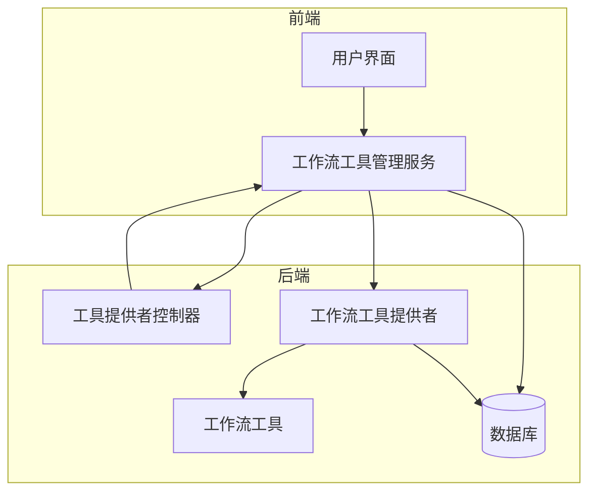
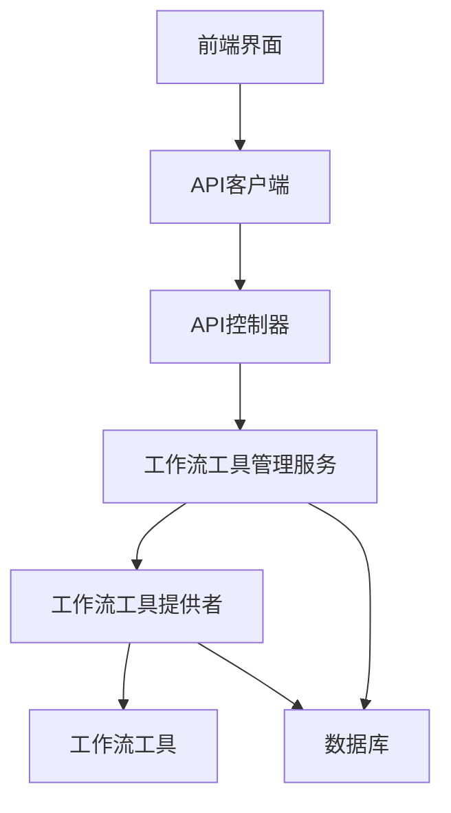
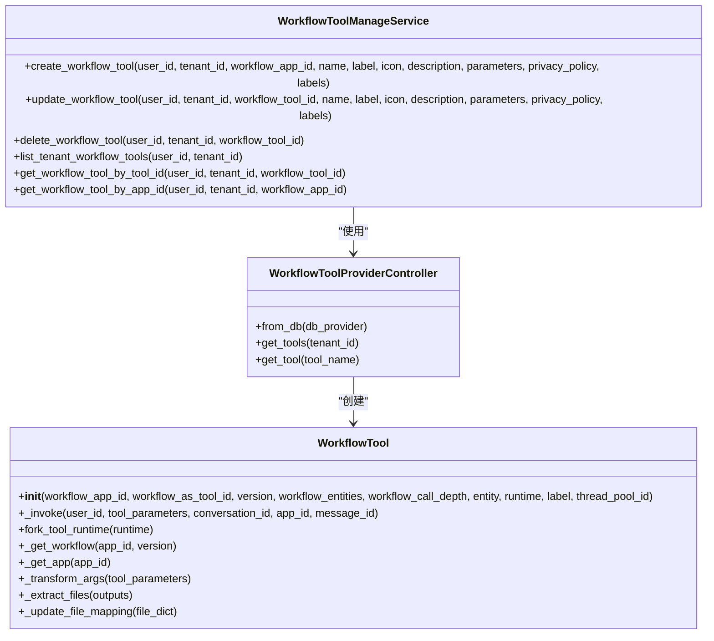
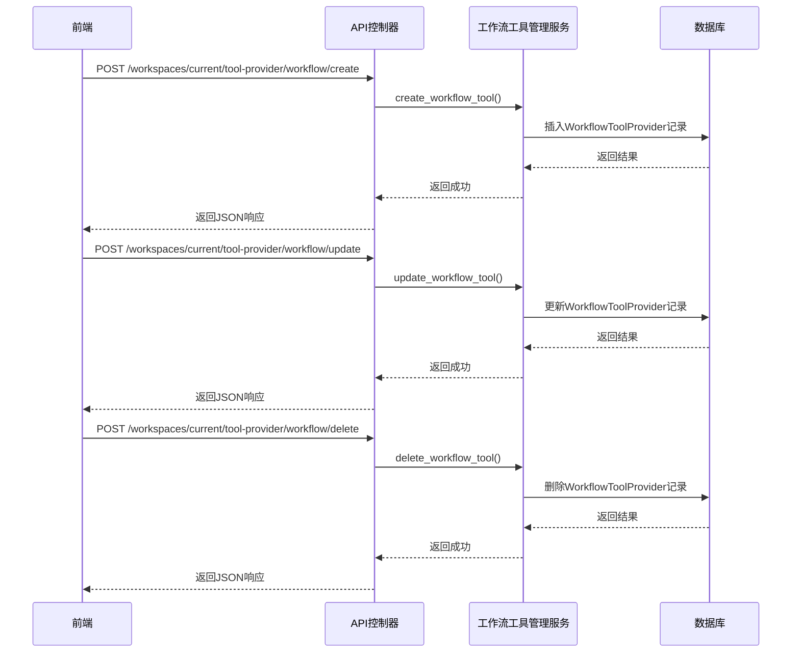
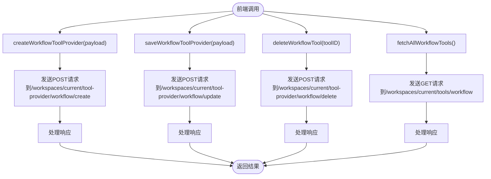
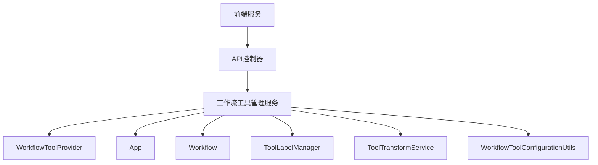

# 工作流工具创建指南

<cite>
**本文档中引用的文件**
- [workflow_tools_manage_service.py](file://api/services/tools/workflow_tools_manage_service.py)
- [provider.py](file://api/core/tools/workflow_as_tool/provider.py)
- [tool.py](file://api/core/tools/workflow_as_tool/tool.py)
- [tool_providers.py](file://api/controllers/console/workspace/tool_providers.py)
- [tools.ts](file://web/service/tools.ts)
</cite>

## 目录
1. [简介](#简介)
2. [项目结构](#项目结构)
3. [核心组件](#核心组件)
4. [架构概述](#架构概述)
5. [详细组件分析](#详细组件分析)
6. [依赖分析](#依赖分析)
7. [性能考虑](#性能考虑)
8. [故障排除指南](#故障排除指南)
9. [结论](#结论)
10. [附录](#附录)（如有必要）

## 简介
本文档详细说明了如何在Dify平台中创建可复用的工作流工具。涵盖了从现有工作流封装为工具的完整流程，包括参数定义、输入输出规范、元数据配置和版本管理。提供了实际代码示例展示如何通过API注册工作流工具，配置工具描述、图标和分类标签。解释了工作流工具的生命周期管理，包括创建、更新、发布和废弃的最佳实践。文档还包含了常见问题如参数类型不匹配、循环依赖检测和版本兼容性处理的解决方案。

## 项目结构
Dify平台的工作流工具功能主要分布在API服务层和前端服务层。核心逻辑位于`api/services/tools/`目录下的`workflow_tools_manage_service.py`文件中，该文件负责工作流工具的创建、更新、删除和查询操作。工作流工具的实体定义和运行时逻辑位于`api/core/tools/workflow_as_tool/`目录下，包括`provider.py`和`tool.py`两个核心文件。API控制器位于`api/controllers/console/workspace/`目录下的`tool_providers.py`文件中，处理所有与工作流工具相关的HTTP请求。前端服务通过`web/service/tools.ts`文件提供的API客户端与后端进行交互。

**Diagram sources**
- [workflow_tools_manage_service.py](file://api/services/tools/workflow_tools_manage_service.py#L1-L340)
- [provider.py](file://api/core/tools/workflow_as_tool/provider.py#L1-L225)
- [tool.py](file://api/core/tools/workflow_as_tool/tool.py#L1-L233)
- [tool_providers.py](file://api/controllers/console/workspace/tool_providers.py#L1-L1091)
- [tools.ts](file://web/service/tools.ts#L1-L165)

**Section sources**
- [workflow_tools_manage_service.py](file://api/services/tools/workflow_tools_manage_service.py#L1-L340)
- [provider.py](file://api/core/tools/workflow_as_tool/provider.py#L1-L225)
- [tool.py](file://api/core/tools/workflow_as_tool/tool.py#L1-L233)
- [tool_providers.py](file://api/controllers/console/workspace/tool_providers.py#L1-L1091)
- [tools.ts](file://web/service/tools.ts#L1-L165)

## 核心组件
Dify平台的工作流工具功能由多个核心组件构成。`WorkflowToolManageService`类是工作流工具管理的核心服务，提供了创建、更新、删除和查询工作流工具的方法。`WorkflowToolProviderController`类负责将数据库中的工作流工具提供者转换为可执行的工具控制器。`WorkflowTool`类代表具体的工作流工具实例，包含工具的元数据和执行逻辑。API控制器`ToolWorkflowProviderCreateApi`、`ToolWorkflowProviderUpdateApi`等处理前端请求并调用相应的服务方法。前端服务`tools.ts`提供了与后端API交互的客户端方法。

**Section sources**
- [workflow_tools_manage_service.py](file://api/services/tools/workflow_tools_manage_service.py#L1-L340)
- [provider.py](file://api/core/tools/workflow_as_tool/provider.py#L1-L225)
- [tool.py](file://api/core/tools/workflow_as_tool/tool.py#L1-L233)
- [tool_providers.py](file://api/controllers/console/workspace/tool_providers.py#L1-L1091)
- [tools.ts](file://web/service/tools.ts#L1-L165)

## 架构概述
Dify平台的工作流工具架构采用分层设计，从前端用户界面到后端服务层再到数据存储层。前端通过REST API与后端进行通信，后端服务层处理业务逻辑并与数据库交互。工作流工具的创建和管理通过一系列API端点实现，包括创建、更新、删除和查询。工具的元数据存储在`WorkflowToolProvider`数据库模型中，而工具的执行逻辑则由`WorkflowTool`类实现。整个架构支持工作流工具的版本管理和生命周期控制。

**Diagram sources**
- [workflow_tools_manage_service.py](file://api/services/tools/workflow_tools_manage_service.py#L1-L340)
- [provider.py](file://api/core/tools/workflow_as_tool/provider.py#L1-L225)
- [tool.py](file://api/core/tools/workflow_as_tool/tool.py#L1-L233)
- [tool_providers.py](file://api/controllers/console/workspace/tool_providers.py#L1-L1091)

## 详细组件分析

### 工作流工具管理服务分析
`WorkflowToolManageService`类是工作流工具管理的核心，提供了创建、更新、删除和查询工作流工具的方法。`create_workflow_tool`方法用于创建新的工作流工具，需要提供用户ID、租户ID、工作流应用ID、名称、标签、图标、描述、参数、隐私政策和标签等参数。`update_workflow_tool`方法用于更新现有工作流工具，参数与创建方法类似。`delete_workflow_tool`方法用于删除工作流工具，`list_tenant_workflow_tools`方法用于列出租户下的所有工作流工具。

**Diagram sources**
- [workflow_tools_manage_service.py](file://api/services/tools/workflow_tools_manage_service.py#L1-L340)
- [provider.py](file://api/core/tools/workflow_as_tool/provider.py#L1-L225)
- [tool.py](file://api/core/tools/workflow_as_tool/tool.py#L1-L233)

**Section sources**
- [workflow_tools_manage_service.py](file://api/services/tools/workflow_tools_manage_service.py#L1-L340)
- [provider.py](file://api/core/tools/workflow_as_tool/provider.py#L1-L225)
- [tool.py](file://api/core/tools/workflow_as_tool/tool.py#L1-L233)

### API控制器分析
API控制器负责处理前端发送的HTTP请求，并调用相应的服务方法。`ToolWorkflowProviderCreateApi`处理工作流工具的创建请求，`ToolWorkflowProviderUpdateApi`处理更新请求，`ToolWorkflowProviderDeleteApi`处理删除请求，`ToolWorkflowProviderGetApi`处理查询请求。这些控制器都继承自Flask-RESTx的`Resource`类，并使用装饰器进行权限验证和请求处理。

**Diagram sources**
- [tool_providers.py](file://api/controllers/console/workspace/tool_providers.py#L1-L1091)

**Section sources**
- [tool_providers.py](file://api/controllers/console/workspace/tool_providers.py#L1-L1091)

### 前端服务分析
前端服务通过`tools.ts`文件提供的API客户端与后端进行交互。`createWorkflowToolProvider`方法用于创建工作流工具，`saveWorkflowToolProvider`方法用于保存或更新工作流工具，`deleteWorkflowTool`方法用于删除工作流工具，`fetchAllWorkflowTools`方法用于获取所有工作流工具列表。这些方法都使用`post`或`get`函数发送HTTP请求到相应的API端点。

**Diagram sources**
- [tools.ts](file://web/service/tools.ts#L1-L165)

**Section sources**
- [tools.ts](file://web/service/tools.ts#L1-L165)

## 依赖分析
工作流工具功能依赖于多个其他组件和服务。核心依赖包括数据库模型`WorkflowToolProvider`、`App`和`Workflow`，这些模型定义了工作流工具的存储结构。`ToolLabelManager`用于管理工具标签，`ToolTransformService`用于在不同数据格式之间转换。`WorkflowToolConfigurationUtils`提供了工作流配置的验证和同步功能。前端服务依赖于API客户端库进行HTTP通信。

**Diagram sources**
- [workflow_tools_manage_service.py](file://api/services/tools/workflow_tools_manage_service.py#L1-L340)
- [provider.py](file://api/core/tools/workflow_as_tool/provider.py#L1-L225)
- [tool.py](file://api/core/tools/workflow_as_tool/tool.py#L1-L233)
- [tool_providers.py](file://api/controllers/console/workspace/tool_providers.py#L1-L1091)

**Section sources**
- [workflow_tools_manage_service.py](file://api/services/tools/workflow_tools_manage_service.py#L1-L340)
- [provider.py](file://api/core/tools/workflow_as_tool/provider.py#L1-L225)
- [tool.py](file://api/core/tools/workflow_as_tool/tool.py#L1-L233)
- [tool_providers.py](file://api/controllers/console/workspace/tool_providers.py#L1-L1091)

## 性能考虑
工作流工具的性能主要受以下几个因素影响：数据库查询效率、工作流执行时间、API响应时间和前端渲染性能。为了优化性能，建议对频繁查询的字段建立索引，如`WorkflowToolProvider`表的`tenant_id`和`app_id`字段。工作流执行时间可以通过优化工作流设计和使用缓存来减少。API响应时间可以通过异步处理和批量操作来改善。前端渲染性能可以通过分页和懒加载来优化。

## 故障排除指南
常见问题包括参数类型不匹配、循环依赖检测和版本兼容性处理。参数类型不匹配通常发生在工作流变量类型与工具参数类型不一致时，可以通过`VARIABLE_TO_PARAMETER_TYPE_MAPPING`映射表进行转换。循环依赖检测通过`workflow_call_depth`参数实现，防止工作流工具无限递归调用。版本兼容性处理通过`version`字段实现，确保工作流工具使用正确的版本。

**Section sources**
- [provider.py](file://api/core/tools/workflow_as_tool/provider.py#L1-L225)
- [tool.py](file://api/core/tools/workflow_as_tool/tool.py#L1-L233)

## 结论
Dify平台的工作流工具功能提供了一套完整的解决方案，用于创建、管理和使用可复用的工作流工具。通过合理的架构设计和清晰的API接口，开发者可以轻松地将现有工作流封装为工具，并在不同场景中复用。文档详细介绍了工作流工具的创建流程、核心组件、架构设计和常见问题解决方案，为开发者提供了全面的指导。