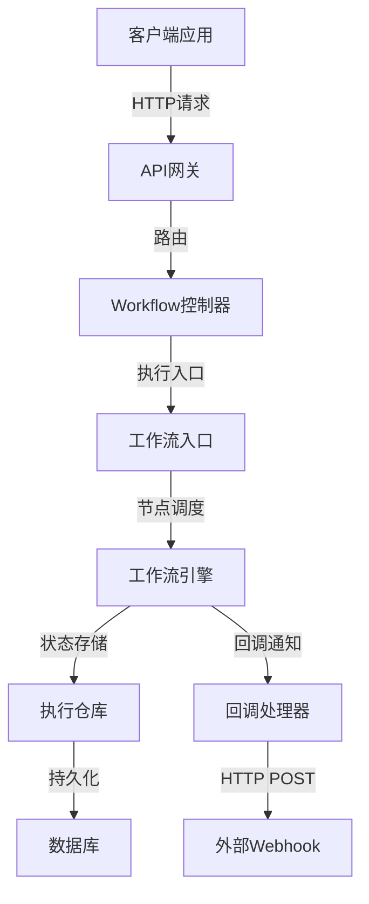
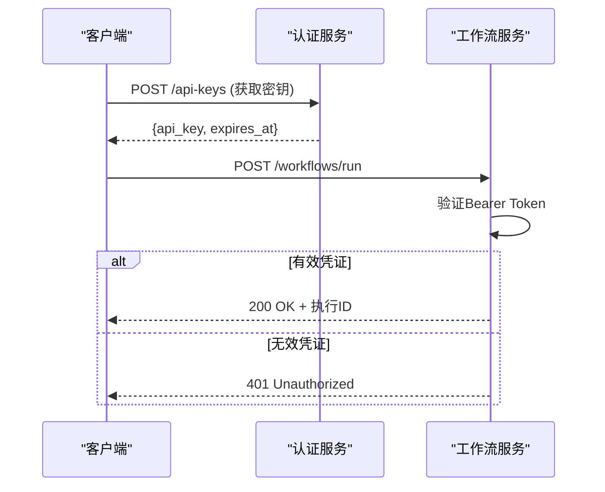
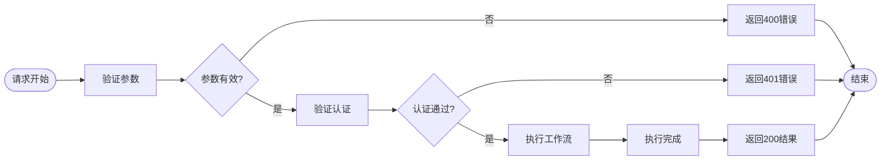
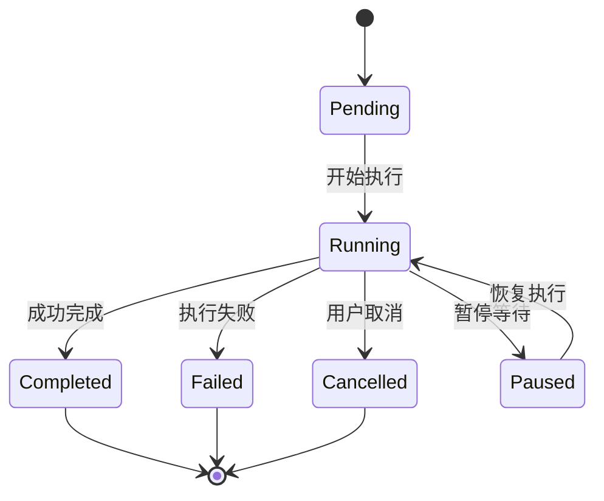
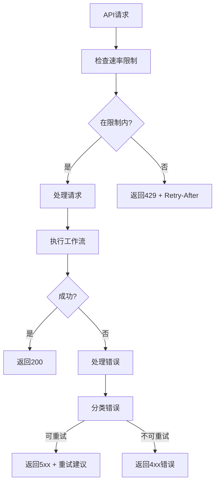
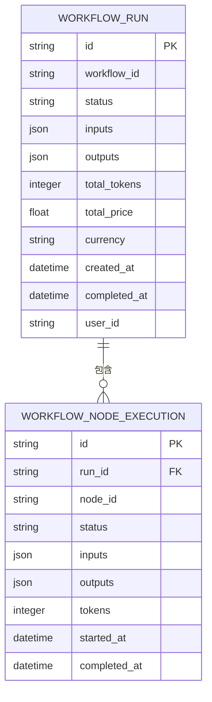
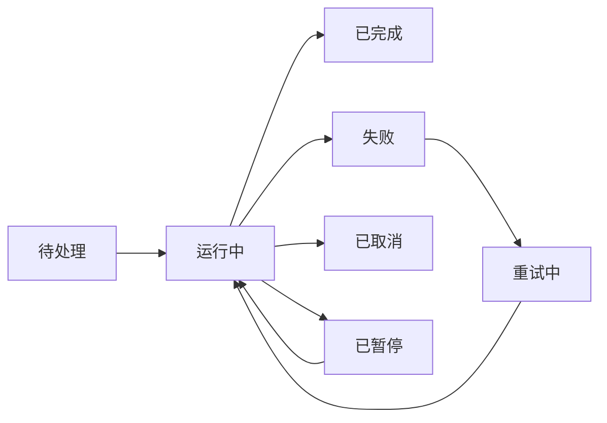

# 工作流工具调用接口

<cite>
**本文档引用文件**  
- [workflow.py](file://api/controllers/web/workflow.py)
- [workflow_service.py](file://api/services/workflow_service.py)
- [workflow_run_service.py](file://api/services/workflow_run_service.py)
- [workflow_app_service.py](file://api/services/workflow_app_service.py)
- [workflow_draft_variable_service.py](file://api/services/workflow_draft_variable_service.py)
- [workflow_fields.py](file://api/fields/workflow_fields.py)
- [workflow_run_fields.py](file://api/fields/workflow_run_fields.py)
- [models/workflow.py](file://api/models/workflow.py)
- [core/workflow/workflow_entry.py](file://api/core/workflow/workflow_entry.py)
- [core/workflow/entities.py](file://api/core/workflow/entities.py)
- [core/workflow/enums.py](file://api/core/workflow/enums.py)
- [core/workflow/errors.py](file://api/core/workflow/errors.py)
- [repositories/api_workflow_run_repository.py](file://api/repositories/api_workflow_run_repository.py)
- [repositories/sqlalchemy_api_workflow_run_repository.py](file://api/repositories/sqlalchemy_api_workflow_run_repository.py)
- [sdks/python-client/dify_client](file://sdks/python-client/dify_client)
- [sdks/nodejs-client/index.js](file://sdks/nodejs-client/index.js)
</cite>

## 目录
1. [简介](#简介)
2. [API调用基础](#api调用基础)
3. [认证机制](#认证机制)
4. [请求参数结构](#请求参数结构)
5. [响应数据模式](#响应数据模式)
6. [异步执行与状态管理](#异步执行与状态管理)
7. [客户端调用示例](#客户端调用示例)
8. [错误处理体系](#错误处理体系)
9. [性能基准与优化建议](#性能基准与优化建议)
10. [附录](#附录)

## 简介
本文档全面描述Dify平台工作流工具的API调用机制和接口规范。工作流系统支持同步与异步执行模式，提供完整的状态跟踪、回调通知和错误处理机制。通过标准化的RESTful接口，开发者可以集成复杂业务流程自动化，实现跨系统协调操作。

**本文档引用文件**  
- [workflow.py](file://api/controllers/web/workflow.py)
- [workflow_service.py](file://api/services/workflow_service.py)

## API调用基础

工作流API基于RESTful架构设计，所有接口均通过HTTPS协议提供。基础URL结构遵循`https://<host>/api/workflows/<workflow_id>/run`模式，支持JSON格式的请求和响应体。

接口设计遵循幂等性原则，关键操作均支持重试机制。所有时间戳采用ISO 8601格式（UTC时区），数据编码使用UTF-8。



**Diagram sources**
- [workflow.py](file://api/controllers/web/workflow.py#L1-L50)
- [core/workflow/workflow_entry.py](file://api/core/workflow/workflow_entry.py#L10-L30)
- [repositories/api_workflow_run_repository.py](file://api/repositories/api_workflow_run_repository.py#L5-L20)

**Section sources**
- [workflow.py](file://api/controllers/web/workflow.py#L1-L100)
- [workflow_service.py](file://api/services/workflow_service.py#L1-L80)

## 认证机制

API调用采用Bearer Token认证方式，支持两种认证凭证：

1. **API Key**：长期有效的访问密钥，适用于服务端集成
2. **临时Token**：短期有效的会话令牌，适用于前端直连

认证头格式：`Authorization: Bearer <token>`

API Key通过控制台生成，具备细粒度权限控制。系统支持密钥轮换和失效机制，确保安全性。



**Diagram sources**
- [workflow.py](file://api/controllers/web/workflow.py#L50-L80)
- [services/auth](file://api/services/auth#L1-L20)

**Section sources**
- [workflow.py](file://api/controllers/web/workflow.py#L45-L90)
- [services/auth](file://api/services/auth#L1-L30)

## 请求参数结构

工作流执行请求采用标准化JSON结构，包含输入变量、上下文信息和执行配置。

### 请求体结构
```json
{
  "inputs": {
    "field1": "value1",
    "field2": 123,
    "file": "file_id"
  },
  "response_mode": "blocking|streaming",
  "user": "user_id",
  "files": [
    {
      "type": "image",
      "transfer_method": "remote_url|local_file",
      "url": "https://example.com/image.png"
    }
  ]
}
```

**参数说明：**

| 参数 | 类型 | 必填 | 描述 |
|------|------|------|------|
| inputs | object | 是 | 工作流输入变量，键值对形式 |
| response_mode | string | 是 | 响应模式：blocking(阻塞)或streaming(流式) |
| user | string | 是 | 执行用户标识 |
| files | array | 否 | 文件输入列表 |

**Section sources**
- [workflow_fields.py](file://api/fields/workflow_fields.py#L10-L50)
- [workflow_run_fields.py](file://api/fields/workflow_run_fields.py#L15-L60)
- [models/workflow.py](file://api/models/workflow.py#L20-L40)

## 响应数据模式

API响应根据执行模式返回不同结构的数据。

### 阻塞模式响应
```json
{
  "task_id": "task-123",
  "status": "succeeded",
  "outputs": {
    "result": "processed_data"
  },
  "total_tokens": 150,
  "total_price": 0.002,
  "currency": "USD"
}
```

### 流式模式响应
采用Server-Sent Events(SSE)协议，事件流包含：
- `message`：处理进度和中间结果
- `error`：错误信息
- `end`：执行完成通知

**状态码说明：**

| 状态码 | 说明 |
|--------|------|
| 200 | 请求成功，返回执行结果 |
| 202 | 已接受，异步执行中 |
| 400 | 请求参数错误 |
| 401 | 认证失败 |
| 404 | 工作流不存在 |
| 429 | 请求过于频繁 |



**Diagram sources**
- [workflow_run_service.py](file://api/services/workflow_run_service.py#L30-L70)
- [workflow_app_service.py](file://api/services/workflow_app_service.py#L25-L55)

**Section sources**
- [workflow_run_service.py](file://api/services/workflow_run_service.py#L1-L100)
- [workflow_app_service.py](file://api/services/workflow_app_service.py#L1-L80)

## 异步执行与状态管理

系统支持两种执行模式：

### 阻塞模式 (Blocking)
- 客户端保持连接直到执行完成
- 适用于快速执行（<30秒）的简单工作流
- 直接返回最终结果

### 流式模式 (Streaming)
- 实时推送执行进度和中间结果
- 适用于长时间运行的复杂工作流
- 支持客户端实时展示处理状态

### 状态轮询机制
对于异步执行，客户端可通过以下接口查询状态：
```
GET /api/workflow-runs/{run_id}
```

返回包含执行状态、进度百分比、当前节点和耗时信息。

### 回调通知 (Webhook)
配置回调URL后，系统在关键状态变更时发送POST请求：
- 执行开始
- 节点完成
- 执行成功
- 执行失败

回调请求包含签名验证，确保安全性。



**Diagram sources**
- [core/workflow/enums.py](file://api/core/workflow/enums.py#L5-L25)
- [workflow_run_service.py](file://api/services/workflow_run_service.py#L80-L120)

**Section sources**
- [core/workflow/enums.py](file://api/core/workflow/enums.py#L1-L30)
- [workflow_run_service.py](file://api/services/workflow_run_service.py#L75-L150)

## 客户端调用示例

### Python SDK
```python
from dify_client import DifyClient

client = DifyClient(api_key="your-api-key", base_url="https://api.dify.ai")

# 阻塞调用
response = client.create_workflow_run(
    workflow_id="wf-123",
    inputs={"text": "hello"},
    user="user-123"
)
print(response.outputs)
```

### Node.js客户端
```javascript
const { DifyClient } = require('dify-client');

const client = new DifyClient({
  apiKey: 'your-api-key',
  baseURL: 'https://api.dify.ai'
});

client.createWorkflowRun({
  workflowId: 'wf-123',
  inputs: { text: 'hello' },
  user: 'user-123'
}).then(response => {
  console.log(response.outputs);
});
```

### curl命令
```bash
curl -X POST 'https://api.dify.ai/v1/workflows/wf-123/run' \
  -H 'Authorization: Bearer your-api-key' \
  -H 'Content-Type: application/json' \
  -d '{
    "inputs": {"text": "hello"},
    "response_mode": "blocking",
    "user": "user-123"
  }'
```

**Section sources**
- [sdks/python-client/dify_client](file://sdks/python-client/dify_client#L1-L50)
- [sdks/nodejs-client/index.js](file://sdks/nodejs-client/index.js#L1-L40)

## 错误处理体系

### 错误码规范
系统采用标准化错误码体系：

| 错误码 | 类型 | 说明 |
|--------|------|------|
| 1000 | 参数错误 | 输入参数验证失败 |
| 2000 | 认证错误 | API密钥无效或过期 |
| 3000 | 资源错误 | 工作流不存在或无权限 |
| 4000 | 执行错误 | 工作流执行过程中出错 |
| 5000 | 系统错误 | 服务器内部错误 |

### 重试策略
建议客户端实现指数退避重试：
- 初始延迟：1秒
- 退避因子：2
- 最大重试次数：5次
- 最大延迟：30秒

### 超时处理
- 连接超时：10秒
- 读取超时：60秒
- 执行超时：根据工作流配置，通常为5-30分钟

### 限流控制
- 免费版：100次/分钟
- 专业版：1000次/分钟
- 企业版：5000次/分钟

超出限制返回429状态码，响应头包含`Retry-After`字段。



**Diagram sources**
- [core/workflow/errors.py](file://api/core/workflow/errors.py#L10-L40)
- [workflow_service.py](file://api/services/workflow_service.py#L100-L130)

**Section sources**
- [core/workflow/errors.py](file://api/core/workflow/errors.py#L1-L50)
- [workflow_service.py](file://api/services/workflow_service.py#L90-L150)

## 性能基准与优化建议

### 性能基准测试
在标准配置下（4核CPU，8GB内存），系统性能指标：

| 工作流类型 | 平均延迟 | P95延迟 | 吞吐量 |
|------------|----------|---------|--------|
| 简单工作流 | 120ms | 250ms | 800次/分钟 |
| 中等工作流 | 450ms | 800ms | 300次/分钟 |
| 复杂工作流 | 1.2s | 2.1s | 120次/分钟 |

### 高并发调用优化建议

1. **批量处理**：合并多个小请求为批量请求
2. **连接复用**：使用HTTP Keep-Alive减少连接开销
3. **本地缓存**：缓存频繁访问的静态数据
4. **异步处理**：对非实时需求使用异步模式
5. **负载均衡**：多实例部署，分散请求压力

### 最佳实践
- 预热连接池
- 实现智能重试
- 监控调用指标
- 设置合理的超时阈值
- 分阶段压力测试

**Section sources**
- [workflow_run_service.py](file://api/services/workflow_run_service.py#L150-L200)
- [core/workflow/workflow_entry.py](file://api/core/workflow/workflow_entry.py#L50-L80)

## 附录

### 数据模型


**Diagram sources**
- [models/workflow.py](file://api/models/workflow.py#L50-L80)
- [repositories/api_workflow_run_repository.py](file://api/repositories/api_workflow_run_repository.py#L25-L40)

### 状态转换图


**Diagram sources**
- [core/workflow/enums.py](file://api/core/workflow/enums.py#L20-L35)
- [workflow_run_service.py](file://api/services/workflow_run_service.py#L120-L140)