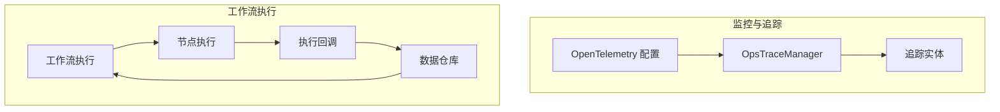
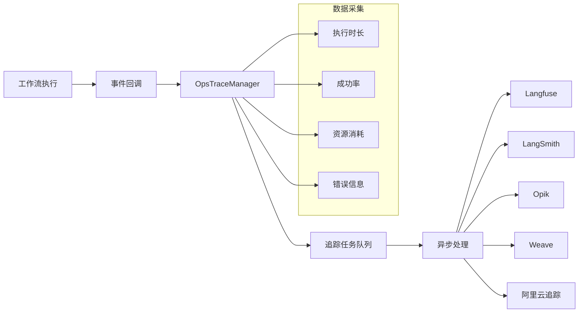
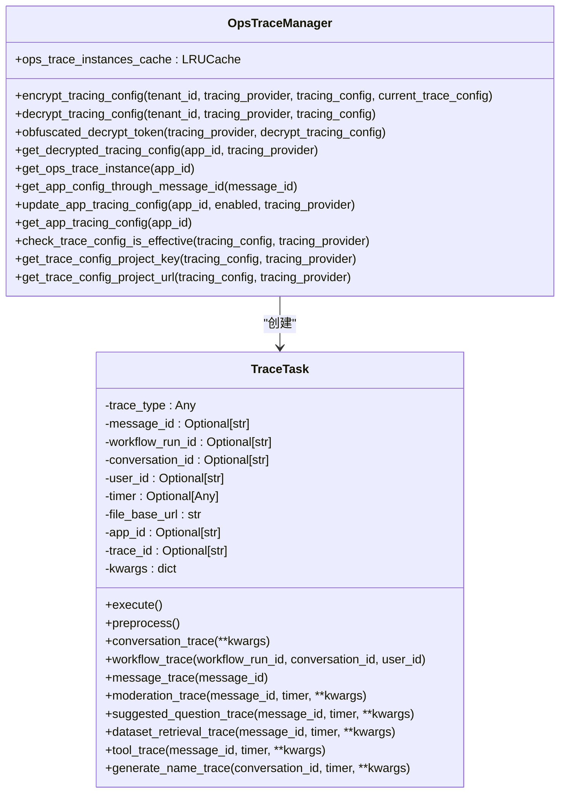
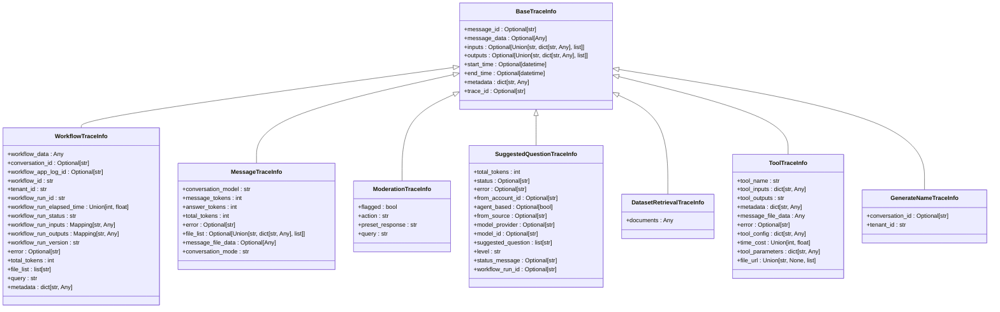
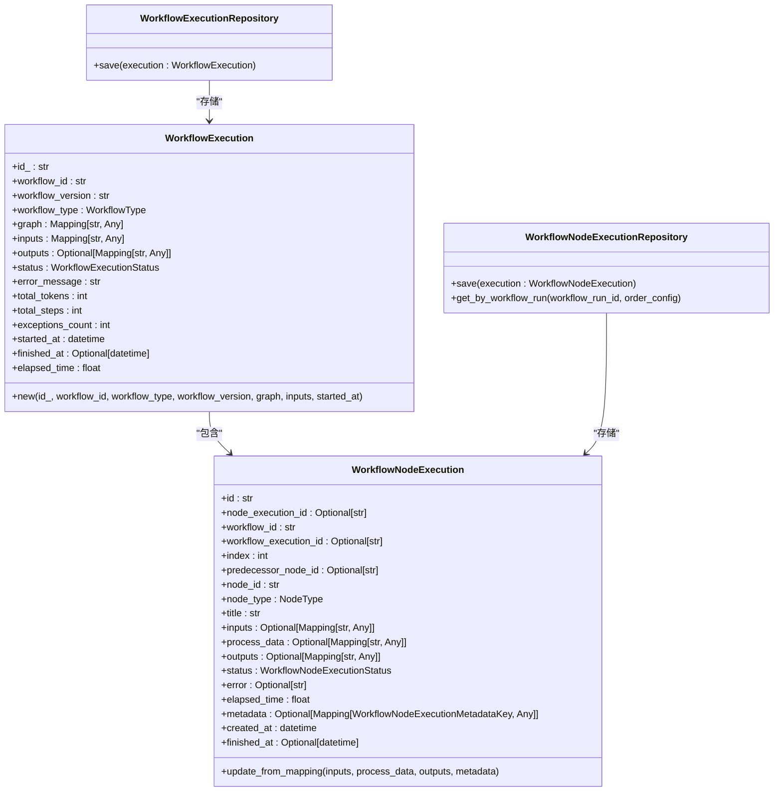
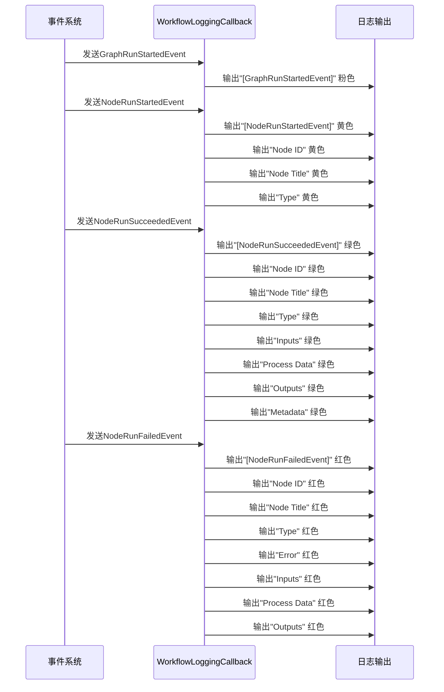
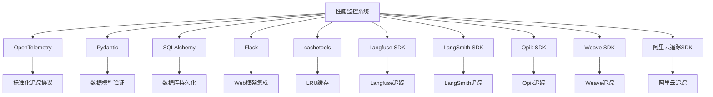

# 性能监控与优化

<cite>
**本文档引用的文件**
- [ops_trace_manager.py](file://api/core/ops/ops_trace_manager.py)
- [trace_entity.py](file://api/core/ops/entities/trace_entity.py)
- [workflow_execution.py](file://api/core/workflow/entities/workflow_execution.py)
- [workflow_node_execution.py](file://api/core/workflow/entities/workflow_node_execution.py)
- [workflow_execution_repository.py](file://api/core/workflow/repositories/workflow_execution_repository.py)
- [workflow_node_execution_repository.py](file://api/core/workflow/repositories/workflow_node_execution_repository.py)
- [workflow_logging_callback.py](file://api/core/workflow/callbacks/workflow_logging_callback.py)
- [otel_config.py](file://api/configs/observability/otel/otel_config.py)
</cite>

## 目录
1. [引言](#引言)
2. [项目结构](#项目结构)
3. [核心组件](#核心组件)
4. [架构概述](#架构概述)
5. [详细组件分析](#详细组件分析)
6. [依赖分析](#依赖分析)
7. [性能考虑](#性能考虑)
8. [故障排除指南](#故障排除指南)
9. [结论](#结论)

## 引言
本文档系统化地记录了工作流工具的监控体系和性能优化策略。详细说明了指标采集机制，包括执行时长、成功率、资源消耗等关键性能指标。指导如何配置告警规则、查看执行日志和分析性能瓶颈。提供优化建议如缓存策略、并行执行配置和资源配额调整。文档包含典型性能问题的诊断流程图和解决方案，以及如何利用追踪系统进行端到端性能分析。

## 项目结构
工作流监控与性能优化功能主要分布在`api/core/ops`和`api/core/workflow`目录下。`ops`模块负责操作追踪和性能数据管理，`workflow`模块包含工作流执行的核心实体和回调机制。配置文件位于`api/configs/observability`目录，用于配置OpenTelemetry等可观测性组件。

**图示来源**
- [otel_config.py](file://api/configs/observability/otel/otel_config.py)
- [ops_trace_manager.py](file://api/core/ops/ops_trace_manager.py)
- [trace_entity.py](file://api/core/ops/entities/trace_entity.py)
- [workflow_execution.py](file://api/core/workflow/entities/workflow_execution.py)
- [workflow_node_execution.py](file://api/core/workflow/entities/workflow_node_execution.py)
- [workflow_logging_callback.py](file://api/core/workflow/callbacks/workflow_logging_callback.py)
- [workflow_execution_repository.py](file://api/core/workflow/repositories/workflow_execution_repository.py)
- [workflow_node_execution_repository.py](file://api/core/workflow/repositories/workflow_node_execution_repository.py)

**本节来源**
- [api/core/ops](file://api/core/ops)
- [api/core/workflow](file://api/core/workflow)
- [api/configs/observability](file://api/configs/observability)

## 核心组件
系统的核心监控组件包括`OpsTraceManager`用于管理追踪实例和任务队列，`TraceEntity`定义了各种追踪信息的数据结构，以及工作流执行相关的`WorkflowExecution`和`WorkflowNodeExecution`实体。这些组件共同构成了完整的性能监控体系，能够采集工作流执行的全过程数据。

**本节来源**
- [ops_trace_manager.py](file://api/core/ops/ops_trace_manager.py)
- [trace_entity.py](file://api/core/ops/entities/trace_entity.py)
- [workflow_execution.py](file://api/core/workflow/entities/workflow_execution.py)
- [workflow_node_execution.py](file://api/core/workflow/entities/workflow_node_execution.py)

## 架构概述
系统的监控架构基于OpenTelemetry标准，通过`OpsTraceManager`统一管理多种追踪提供商（如Langfuse、LangSmith、Opik等）。工作流执行过程中产生的各种事件通过回调机制被捕获，并转换为标准化的追踪数据。这些数据包括工作流执行、消息处理、内容审核、数据集检索等关键环节的性能指标。

**图示来源**
- [ops_trace_manager.py](file://api/core/ops/ops_trace_manager.py)
- [workflow_logging_callback.py](file://api/core/workflow/callbacks/workflow_logging_callback.py)

## 详细组件分析

### 追踪管理器分析
`OpsTraceManager`是整个监控系统的核心，负责管理不同追踪提供商的实例和配置。它提供了加密/解密追踪配置、获取追踪实例、更新应用追踪配置等关键功能。通过LRU缓存机制，避免了频繁创建追踪实例的开销。

#### 追踪管理器类图

**图示来源**
- [ops_trace_manager.py](file://api/core/ops/ops_trace_manager.py)

**本节来源**
- [ops_trace_manager.py](file://api/core/ops/ops_trace_manager.py)

### 追踪实体分析
追踪实体定义了各种监控数据的结构，包括工作流执行、消息处理、内容审核等。这些实体基于Pydantic模型，确保了数据的类型安全和验证。每个追踪实体都包含基本信息如开始/结束时间、输入/输出数据，以及特定于场景的元数据。

#### 追踪实体类图

**图示来源**
- [trace_entity.py](file://api/core/ops/entities/trace_entity.py)

**本节来源**
- [trace_entity.py](file://api/core/ops/entities/trace_entity.py)

### 工作流执行分析
工作流执行组件负责管理整个工作流的生命周期，包括执行状态、输入输出、性能指标等。`WorkflowExecution`实体表示一次完整的工作流运行，而`WorkflowNodeExecution`表示其中单个节点的执行。这些实体通过仓库模式与数据存储解耦，保持了领域模型的纯净。

#### 工作流执行类图

**图示来源**
- [workflow_execution.py](file://api/core/workflow/entities/workflow_execution.py)
- [workflow_node_execution.py](file://api/core/workflow/entities/workflow_node_execution.py)
- [workflow_execution_repository.py](file://api/core/workflow/repositories/workflow_execution_repository.py)
- [workflow_node_execution_repository.py](file://api/core/workflow/repositories/workflow_node_execution_repository.py)

**本节来源**
- [workflow_execution.py](file://api/core/workflow/entities/workflow_execution.py)
- [workflow_node_execution.py](file://api/core/workflow/entities/workflow_node_execution.py)
- [workflow_execution_repository.py](file://api/core/workflow/repositories/workflow_execution_repository.py)
- [workflow_node_execution_repository.py](file://api/core/workflow/repositories/workflow_node_execution_repository.py)

### 执行日志回调分析
执行日志回调组件负责在工作流执行过程中捕获各种事件，并将其转换为可读的日志输出。它实现了`WorkflowCallback`接口，能够响应节点开始、成功、失败等各种事件，并以不同颜色区分不同类型的日志信息。

#### 执行日志回调序列图

**图示来源**
- [workflow_logging_callback.py](file://api/core/workflow/callbacks/workflow_logging_callback.py)

**本节来源**
- [workflow_logging_callback.py](file://api/core/workflow/callbacks/workflow_logging_callback.py)

## 依赖分析
系统依赖于多种外部组件和库来实现完整的监控功能。核心依赖包括OpenTelemetry用于标准化追踪，Pydantic用于数据模型验证，SQLAlchemy用于数据库操作，以及各种追踪提供商的SDK。这些依赖通过清晰的接口和抽象层进行管理，确保了系统的可扩展性和可维护性。

**图示来源**
- [ops_trace_manager.py](file://api/core/ops/ops_trace_manager.py)
- [requirements.txt](file://requirements.txt)

**本节来源**
- [ops_trace_manager.py](file://api/core/ops/ops_trace_manager.py)
- [pyproject.toml](file://pyproject.toml)

## 性能考虑
系统在设计时充分考虑了性能因素。通过LRU缓存避免了频繁创建追踪实例的开销，异步处理机制确保了追踪操作不会阻塞主工作流执行。数据采集采用事件驱动模式，只在必要时进行序列化和传输。对于大规模部署，建议配置适当的缓存大小和队列深度，以平衡性能和资源消耗。

## 故障排除指南
当遇到监控数据缺失或性能问题时，可按照以下步骤进行排查：
1. 检查`OpsTraceManager`是否成功获取了追踪实例
2. 验证追踪配置是否正确加密和解密
3. 确认追踪任务是否被正确添加到队列
4. 检查异步任务处理器是否正常运行
5. 验证目标追踪提供商的连接和认证信息

**本节来源**
- [ops_trace_manager.py](file://api/core/ops/ops_trace_manager.py)
- [workflow_logging_callback.py](file://api/core/workflow/callbacks/workflow_logging_callback.py)

## 结论
本文档详细介绍了工作流工具的监控体系和性能优化策略。通过`OpsTraceManager`统一管理多种追踪提供商，系统能够全面采集工作流执行的关键性能指标。基于领域驱动设计的实体模型确保了数据的一致性和可扩展性。异步处理机制和缓存策略保证了监控功能的高性能。建议在生产环境中启用适当的追踪配置，并定期分析性能数据以优化工作流设计。