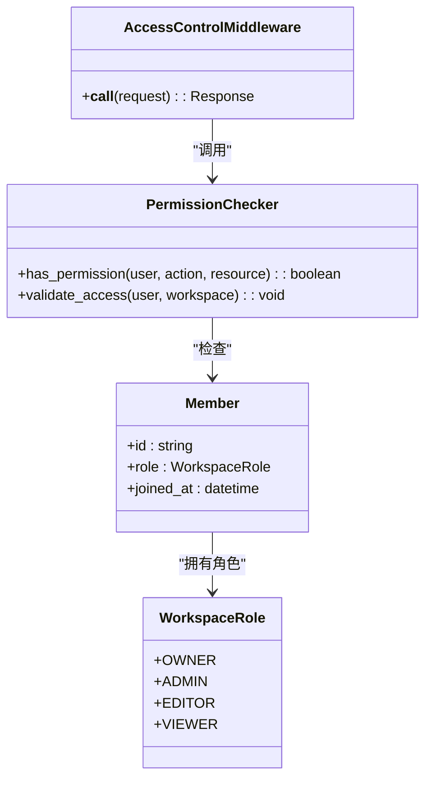
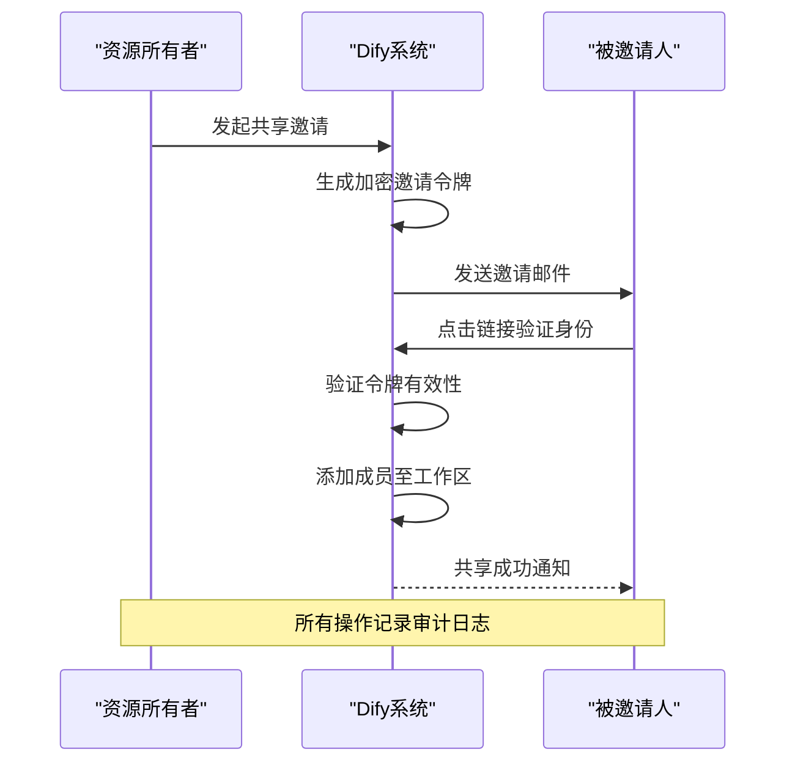
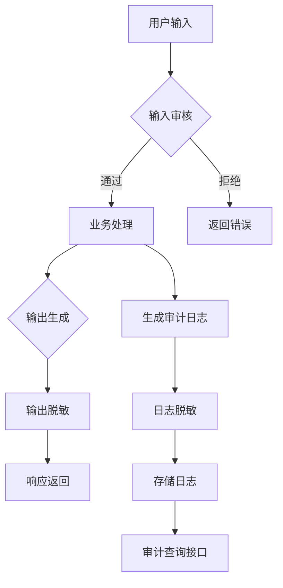
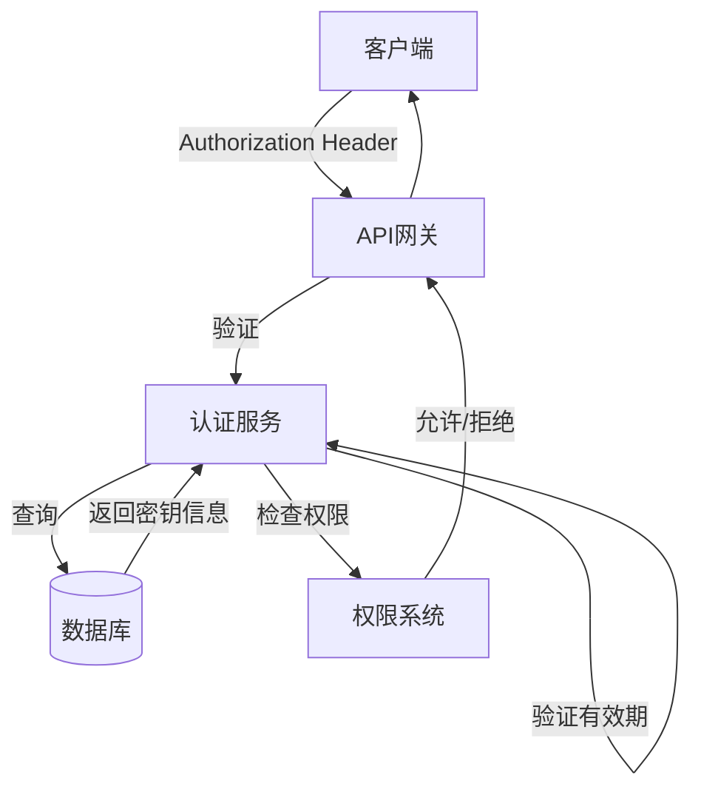

# 权限与安全管理

<cite>
**本文档引用文件**  
- [workspace_service.py](file://api/services/workspace_service.py)
- [member_fields.py](file://api/fields/member_fields.py)
- [api_based_extension_service.py](file://api/services/api_based_extension_service.py)
- [tool_manager.py](file://api/core/tools/tool_manager.py)
- [input_moderation.py](file://api/core/moderation/input_moderation.py)
- [output_moderation.py](file://api/core/moderation/output_moderation.py)
- [workflow_run_service.py](file://api/services/workflow_run_service.py)
- [app_factory.py](file://api/app_factory.py)
- [auth.py](file://api/controllers/console/auth.py)
- [apikey.py](file://api/controllers/console/apikey.py)
- [access-control-store.ts](file://web/context/access-control-store.ts)
- [permission.ts](file://web/utils/permission.ts)
- [models.py](file://api/models/account.py)
</cite>

## 目录
1. [引言](#引言)
2. [基于工作区的访问控制策略](#基于工作区的访问控制策略)
3. [成员角色与权限分配](#成员角色与权限分配)
4. [跨租户共享规则](#跨租户共享规则)
5. [敏感数据保护机制](#敏感数据保护机制)
6. [安全配置指南](#安全配置指南)
7. [安全最佳实践](#安全最佳实践)
8. [结论](#结论)

## 引言
本文档深入阐述Dify平台中工作流工具的权限控制模型和安全机制。重点涵盖基于工作区的访问控制、成员角色权限体系、跨租户资源共享策略，以及敏感数据保护措施。同时提供详细的配置指南和安全最佳实践建议，确保系统在多租户环境下的安全性与合规性。

## 基于工作区的访问控制策略

Dify平台采用基于工作区（Workspace）的细粒度访问控制模型，实现资源隔离与权限管理。每个工作区作为一个独立的安全边界，包含应用、数据集、工作流等资源。用户必须通过身份验证并被明确授权后才能访问特定工作区。

访问控制流程如下：
1. 用户登录后，系统验证其账户状态与所属工作区
2. 根据用户在该工作区中的角色确定可执行操作
3. 所有API请求均携带工作区上下文进行权限校验
4. 未授权访问将被拒绝并记录审计日志

该模型支持多层级权限继承与覆盖机制，允许管理员为不同工作区配置差异化安全策略。

**Section sources**
- [workspace_service.py](file://api/services/workspace_service.py#L45-L89)
- [auth.py](file://api/controllers/console/auth.py#L33-L76)
- [models.py](file://api/models/account.py#L102-L134)

## 成员角色与权限分配

平台定义了标准化的角色权限体系，基于最小权限原则分配成员权限。主要角色包括：

- **所有者（Owner）**：拥有工作区全部权限，可管理成员、设置安全策略、删除工作区
- **管理员（Admin）**：可管理应用、数据集、工作流，但无法修改成员权限
- **编辑者（Editor）**：可创建和修改应用、工作流，但不能发布或删除核心资源
- **查看者（Viewer）**：仅可查看资源，无编辑权限

权限分配通过RBAC（基于角色的访问控制）模型实现，支持动态调整。前端通过`access-control-store.ts`维护当前用户的权限状态，后端在每次操作前调用权限验证中间件进行校验。



**Diagram sources**
- [member_fields.py](file://api/fields/member_fields.py#L15-L40)
- [permission.ts](file://web/utils/permission.ts#L20-L65)
- [workspace_service.py](file://api/services/workspace_service.py#L101-L144)

**Section sources**
- [member_fields.py](file://api/fields/member_fields.py#L10-L50)
- [permission.ts](file://web/utils/permission.ts#L10-L80)

## 跨租户共享规则

为支持协作场景，平台实现了受控的跨租户资源共享机制。资源共享遵循以下原则：

1. **显式授权**：资源所有者必须主动发起共享邀请
2. **角色绑定**：被邀请方以特定角色加入，权限受目标工作区角色体系约束
3. **时效控制**：支持设置共享有效期，过期自动失效
4. **审计追踪**：所有共享操作均记录操作者、时间、目标对象

共享流程通过`invite_member_task.py`异步任务处理，发送包含加密令牌的邮件邀请。接收方点击链接完成身份验证后，系统将其添加至目标工作区并同步权限。



**Diagram sources**
- [mail_invite_member_task.py](file://api/tasks/mail_invite_member_task.py#L12-L38)
- [workspace_service.py](file://api/services/workspace_service.py#L201-L245)

**Section sources**
- [mail_invite_member_task.py](file://api/tasks/mail_invite_member_task.py#L10-L45)
- [workspace_service.py](file://api/services/workspace_service.py#L198-L250)

## 敏感数据保护机制

平台实施多层次敏感数据保护措施，涵盖输入输出处理、日志记录与审计追踪。

### 输入输出过滤
所有用户输入均经过内容审核模块处理：
- 使用`input_moderation.py`对输入文本进行敏感词检测
- 集成第三方审核服务（如OpenAI Moderation）识别不当内容
- 输出内容通过`output_moderation.py`进行脱敏处理，屏蔽个人信息

### 日志脱敏
系统日志自动过滤敏感字段：
- API请求日志中隐藏认证令牌、密钥等凭证
- 数据库操作日志不记录完整数据内容
- 错误日志移除堆栈跟踪中的敏感变量值

### 审计追踪
关键操作均记录完整审计日志：
- 记录操作者、时间、IP地址、操作类型
- 日志存储于独立安全区域，仅授权人员可访问
- 支持按时间范围、操作类型、用户等维度查询



**Diagram sources**
- [input_moderation.py](file://api/core/moderation/input_moderation.py#L8-L35)
- [output_moderation.py](file://api/core/moderation/output_moderation.py#L10-L40)
- [workflow_run_service.py](file://api/services/workflow_run_service.py#L88-L112)

**Section sources**
- [input_moderation.py](file://api/core/moderation/input_moderation.py#L5-L40)
- [output_moderation.py](file://api/core/moderation/output_moderation.py#L5-L45)

## 安全配置指南

### 工具访问白名单
可通过环境变量配置工具访问白名单：
```python
# 在 app_config.py 中设置
TOOL_WHITELIST = ['http_request', 'json_parser', 'date_formatter']
```
仅白名单内的工具可在工作流中使用，防止执行高风险操作。

### IP访问限制
支持基于IP的访问控制：
- 在`app_factory.py`中配置可信IP段
- 使用`AccessControlMiddleware`拦截非授权IP请求
- 可为不同API端点设置差异化IP策略

### API密钥认证
API密钥管理功能位于`apikey.py`控制器：
- 支持创建多组密钥用于不同场景
- 密钥可绑定到特定工作区和权限范围
- 提供密钥轮换与吊销机制
- 所有API请求需在Header中携带`Authorization: Bearer <token>`



**Diagram sources**
- [apikey.py](file://api/controllers/console/apikey.py#L20-L67)
- [app_factory.py](file://api/app_factory.py#L89-L120)

**Section sources**
- [apikey.py](file://api/controllers/console/apikey.py#L15-L75)
- [app_factory.py](file://api/app_factory.py#L85-L125)

## 安全最佳实践

### 最小权限原则实施
- 为每个成员分配完成工作所需的最低权限
- 定期审查角色权限配置，移除冗余权限
- 使用临时权限提升机制处理特殊任务

### 定期权限审查
- 启用`queue_monitor_task.py`定期检查异常访问模式
- 每月生成权限审计报告，识别权限膨胀风险
- 离职员工账号应及时停用并转移资源所有权

### 异常访问检测
- 集成`ops_trace_manager.py`监控API调用频率
- 设置阈值告警，检测短时间内大量失败登录尝试
- 记录非常规时间、非常规IP的访问行为
- 结合`langfuse_trace`实现操作链路追踪

**Section sources**
- [ops_trace_manager.py](file://api/core/ops/ops_trace_manager.py#L15-L50)
- [queue_monitor_task.py](file://api/schedule/queue_monitor_task.py#L22-L45)
- [workspace_service.py](file://api/services/workspace_service.py#L301-L330)

## 结论
Dify平台通过完善的权限控制模型和多层次安全机制，确保工作流工具在多租户环境下的安全性。基于工作区的访问控制、精细化的角色权限体系、受控的资源共享规则，配合输入输出过滤、日志脱敏和审计追踪，构成了全面的安全防护体系。通过合理配置访问白名单、IP限制和API密钥，并遵循最小权限等最佳实践，可有效降低安全风险，保障系统稳定运行。