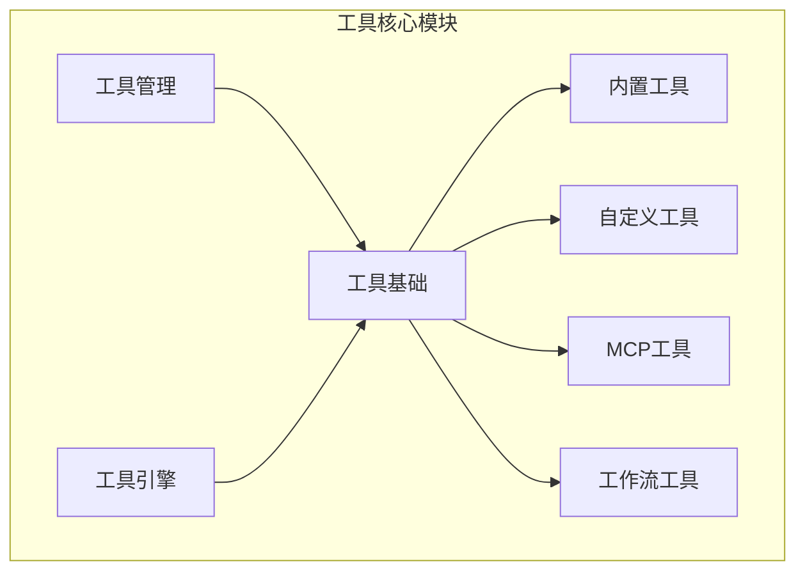
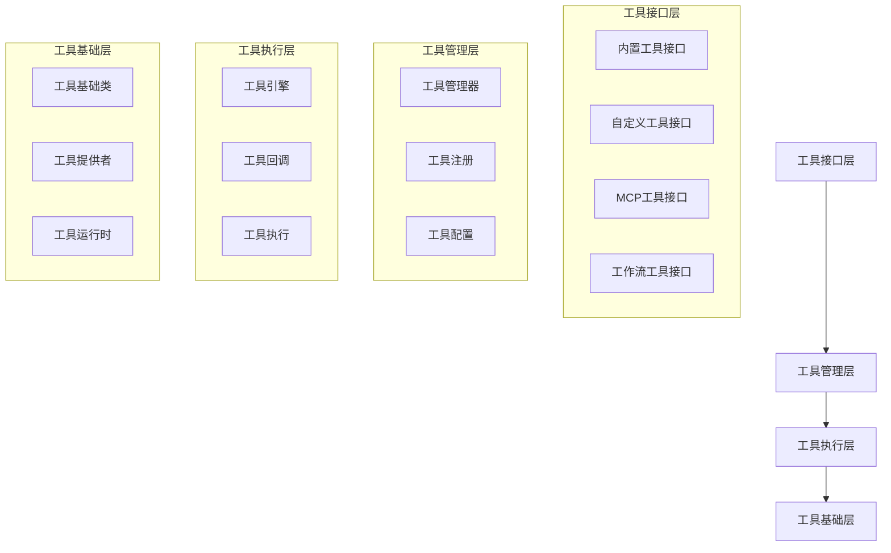
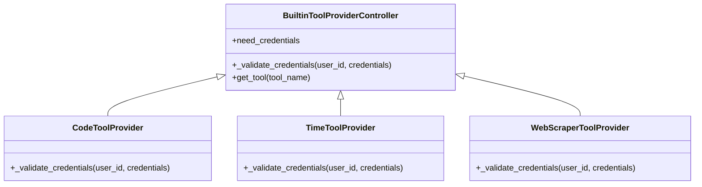
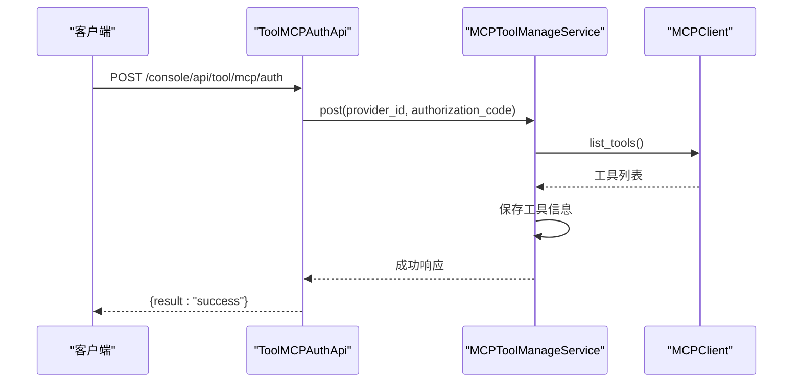
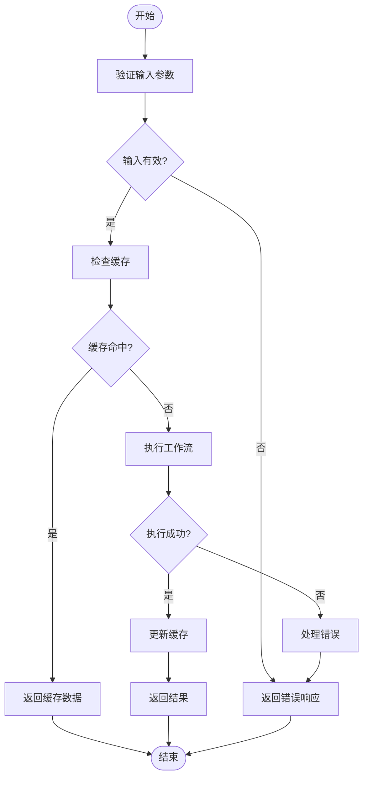
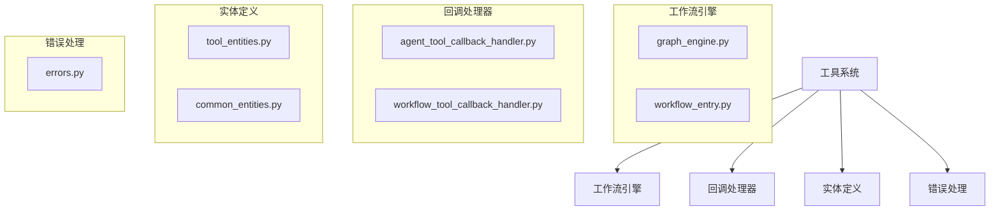

# 自定义工具

<cite>
**本文档引用的文件**
- [tool.py](file://api/core/tools/__base/tool.py)
- [tool_provider.py](file://api/core/tools/__base/tool_provider.py)
- [tool_runtime.py](file://api/core/tools/__base/tool_runtime.py)
- [provider.py](file://api/core/tools/builtin_tool/provider.py)
- [tool.py](file://api/core/tools/builtin_tool/tool.py)
- [provider.py](file://api/core/tools/custom_tool/provider.py)
- [tool.py](file://api/core/tools/custom_tool/tool.py)
- [provider.py](file://api/core/tools/mcp_tool/provider.py)
- [tool.py](file://api/core/tools/mcp_tool/tool.py)
- [provider.py](file://api/core/tools/workflow_as_tool/provider.py)
- [tool.py](file://api/core/tools/workflow_as_tool/tool.py)
- [tool_manager.py](file://api/core/tools/tool_manager.py)
- [tool_engine.py](file://api/core/tools/tool_engine.py)
- [tool_entities.py](file://api/core/tools/entities/tool_entities.py)
- [common_entities.py](file://api/core/tools/entities/common_entities.py)
- [mcp_client.py](file://api/core/mcp/mcp_client.py)
- [tool_node.py](file://api/core/workflow/nodes/tool/tool_node.py)
- [tool_providers.py](file://api/controllers/console/workspace/tool_providers.py)
- [mcp_tools_manage_service.py](file://api/services/tools/mcp_tools_manage_service.py)
- [builtin_tools_manage_service.py](file://api/services/tools/builtin_tools_manage_service.py)
- [tools_transform_service.py](file://api/services/tools/tools_transform_service.py)
</cite>

## 目录
1. [简介](#简介)
2. [项目结构](#项目结构)
3. [核心组件](#核心组件)
4. [架构概述](#架构概述)
5. [详细组件分析](#详细组件分析)
6. [依赖分析](#依赖分析)
7. [性能考虑](#性能考虑)
8. [故障排除指南](#故障排除指南)
9. [结论](#结论)

## 简介
本文档详细介绍了Dify平台的工具扩展能力，重点阐述了如何开发内置工具、MCP工具和工作流工具。文档涵盖了工具接口定义、参数配置、执行逻辑实现和错误处理等关键方面。通过代码示例展示了不同类型的工具开发模式，特别是代码执行工具和API集成工具。文档还包含了工具注册机制、权限管理、性能监控和安全验证的最佳实践，以及如何通过代码扩展方式添加新工具。

## 项目结构
Dify平台的工具系统主要位于`api/core/tools`目录下，该目录包含了各种工具类型的实现。工具系统分为多个子模块，包括内置工具、自定义工具、MCP工具和工作流工具。每个工具类型都有其特定的提供者和工具类，这些类继承自基础工具类并实现了特定的功能。

**图示来源**
- [tool.py](file://api/core/tools/__base/tool.py)
- [provider.py](file://api/core/tools/builtin_tool/provider.py)
- [provider.py](file://api/core/tools/custom_tool/provider.py)
- [provider.py](file://api/core/tools/mcp_tool/provider.py)
- [provider.py](file://api/core/tools/workflow_as_tool/provider.py)
- [tool_manager.py](file://api/core/tools/tool_manager.py)
- [tool_engine.py](file://api/core/tools/tool_engine.py)

**章节来源**
- [tool.py](file://api/core/tools/__base/tool.py)
- [tool_provider.py](file://api/core/tools/__base/tool_provider.py)
- [tool_runtime.py](file://api/core/tools/__base/tool_runtime.py)

## 核心组件
Dify平台的工具系统由多个核心组件构成，包括工具基础类、工具提供者、工具运行时、工具管理器和工具引擎。这些组件共同协作，实现了工具的注册、配置、执行和管理。

**章节来源**
- [tool.py](file://api/core/tools/__base/tool.py)
- [tool_provider.py](file://api/core/tools/__base/tool_provider.py)
- [tool_runtime.py](file://api/core/tools/__base/tool_runtime.py)
- [tool_manager.py](file://api/core/tools/tool_manager.py)
- [tool_engine.py](file://api/core/tools/tool_engine.py)

## 架构概述
Dify平台的工具系统采用分层架构设计，从上到下分为工具接口层、工具管理层、工具执行层和工具基础层。这种分层设计使得工具系统具有良好的可扩展性和可维护性。

**图示来源**
- [tool.py](file://api/core/tools/__base/tool.py)
- [tool_provider.py](file://api/core/tools/__base/tool_provider.py)
- [tool_runtime.py](file://api/core/tools/__base/tool_runtime.py)
- [tool_manager.py](file://api/core/tools/tool_manager.py)
- [tool_engine.py](file://api/core/tools/tool_engine.py)

## 详细组件分析
### 内置工具分析
内置工具是Dify平台预定义的工具，包括代码执行、时间处理、网页抓取等功能。这些工具通过继承`BuiltinToolProviderController`类来实现。

**图示来源**
- [provider.py](file://api/core/tools/builtin_tool/provider.py)
- [code.py](file://api/core/tools/builtin_tool/providers/code/code.py)
- [time.py](file://api/core/tools/builtin_tool/providers/time/time.py)
- [webscraper.py](file://api/core/tools/builtin_tool/providers/webscraper/webscraper.py)

**章节来源**
- [provider.py](file://api/core/tools/builtin_tool/provider.py)
- [code.py](file://api/core/tools/builtin_tool/providers/code/code.py)
- [time.py](file://api/core/tools/builtin_tool/providers/time/time.py)
- [webscraper.py](file://api/core/tools/builtin_tool/providers/webscraper/webscraper.py)

### MCP工具分析
MCP工具是通过MCP协议集成的外部工具，支持动态发现和调用。MCP工具的管理和服务通过`MCPToolManageService`类实现。

**图示来源**
- [tool_providers.py](file://api/controllers/console/workspace/tool_providers.py)
- [mcp_tools_manage_service.py](file://api/services/tools/mcp_tools_manage_service.py)
- [mcp_client.py](file://api/core/mcp/mcp_client.py)

**章节来源**
- [tool_providers.py](file://api/controllers/console/workspace/tool_providers.py)
- [mcp_tools_manage_service.py](file://api/services/tools/mcp_tools_manage_service.py)
- [mcp_client.py](file://api/core/mcp/mcp_client.py)

### 工作流工具分析
工作流工具是将整个工作流作为工具调用的机制，通过`WorkflowAsToolProvider`类实现。工作流工具可以被其他工作流或应用调用。

**图示来源**
- [provider.py](file://api/core/tools/workflow_as_tool/provider.py)
- [tool.py](file://api/core/tools/workflow_as_tool/tool.py)
- [tool_node.py](file://api/core/workflow/nodes/tool/tool_node.py)

**章节来源**
- [provider.py](file://api/core/tools/workflow_as_tool/provider.py)
- [tool.py](file://api/core/tools/workflow_as_tool/tool.py)
- [tool_node.py](file://api/core/workflow/nodes/tool/tool_node.py)

## 依赖分析
Dify平台的工具系统依赖于多个核心模块，包括工作流引擎、回调处理器、实体定义和错误处理。这些模块共同构成了工具系统的运行基础。

**图示来源**
- [tool_node.py](file://api/core/workflow/nodes/tool/tool_node.py)
- [callback_handler.py](file://api/core/callback_handler/workflow_tool_callback_handler.py)
- [tool_entities.py](file://api/core/tools/entities/tool_entities.py)
- [common_entities.py](file://api/core/tools/entities/common_entities.py)
- [errors.py](file://api/core/tools/errors.py)

**章节来源**
- [tool_node.py](file://api/core/workflow/nodes/tool/tool_node.py)
- [callback_handler.py](file://api/core/callback_handler/workflow_tool_callback_handler.py)
- [tool_entities.py](file://api/core/tools/entities/tool_entities.py)
- [common_entities.py](file://api/core/tools/entities/common_entities.py)
- [errors.py](file://api/core/tools/errors.py)

## 性能考虑
在开发和使用Dify平台的工具时，需要考虑以下几个性能方面：
1. 工具执行的响应时间
2. 缓存机制的有效性
3. 并发处理能力
4. 资源消耗监控
5. 错误处理的效率

通过合理配置工具的超时时间和SSE读取超时，可以有效控制工具执行的性能。同时，利用缓存机制可以显著提高工具调用的效率。

## 故障排除指南
在使用Dify平台的工具时，可能会遇到以下常见问题：
1. 工具调用超时
2. 认证失败
3. 参数配置错误
4. 工具未正确注册
5. 权限不足

对于这些问题，可以通过检查工具配置、验证认证信息、确认参数设置和检查权限配置来解决。同时，查看系统日志和错误信息也是诊断问题的重要手段。

**章节来源**
- [errors.py](file://api/core/tools/errors.py)
- [tool_providers.py](file://api/controllers/console/workspace/tool_providers.py)
- [mcp_tools_manage_service.py](file://api/services/tools/mcp_tools_manage_service.py)

## 结论
Dify平台的工具系统提供了强大的扩展能力，支持多种类型的工具开发和集成。通过内置工具、自定义工具、MCP工具和工作流工具的组合，可以构建出功能丰富、灵活多样的应用。工具系统的分层架构设计和模块化实现，使得系统具有良好的可扩展性和可维护性。在开发和使用工具时，需要注意性能优化和错误处理，以确保系统的稳定运行。