# 关系概览

<cite>
**本文档中引用的文件**
- [account.py](file://api/models/account.py)
- [dataset.py](file://api/models/dataset.py)
- [model.py](file://api/models/model.py)
- [workflow.py](file://api/models/workflow.py)
</cite>

## 目录
1. [数据模型概览](#数据模型概览)
2. [核心实体关系图](#核心实体关系图)
3. [设计理念与架构原则](#设计理念与架构原则)
4. [实体分层结构与领域划分](#实体分层结构与领域划分)
5. [跨域查询路径示例](#跨域查询路径示例)

## 数据模型概览

Dify平台的核心数据模型围绕多个关键实体构建，包括App、Dataset、Document、Message、Workflow和User。这些实体通过复杂的关系相互连接，支持多租户环境下的数据隔离和级联操作。

**Section sources**
- [account.py](file://api/models/account.py#L1-L340)
- [dataset.py](file://api/models/dataset.py#L1-L800)
- [model.py](file://api/models/model.py#L1-L800)
- [workflow.py](file://api/models/workflow.py#L1-L800)

## 核心实体关系图

```mermaid
erDiagram
USER {
string id PK
string name
string email
string password
string avatar
string interface_language
string interface_theme
string timezone
datetime last_login_at
string last_login_ip
datetime last_active_at
string status
datetime initialized_at
datetime created_at
datetime updated_at
}
TENANT {
string id PK
string name
string encrypt_public_key
string plan
string status
text custom_config
datetime created_at
datetime updated_at
}
APP {
string id PK
string tenant_id FK
string name
text description
string mode
string icon_type
string icon
string icon_background
string app_model_config_id FK
string workflow_id FK
string status
boolean enable_site
boolean enable_api
int api_rpm
int api_rph
boolean is_demo
boolean is_public
boolean is_universal
text tracing
int max_active_requests
string created_by FK
datetime created_at
datetime updated_at
boolean use_icon_as_answer_icon
}
DATASET {
string id PK
string tenant_id FK
string name
text description
string provider
string permission
string data_source_type
string indexing_technique
text index_struct
string created_by FK
datetime created_at
string updated_by
datetime updated_at
string embedding_model
string embedding_model_provider
string collection_binding_id
jsonb retrieval_model
boolean built_in_field_enabled
}
DOCUMENT {
string id PK
string tenant_id FK
string dataset_id FK
int position
string data_source_type
text data_source_info
string dataset_process_rule_id FK
string batch
string name
string created_from
string created_by FK
string created_api_request_id
datetime created_at
datetime processing_started_at
int word_count
datetime parsing_completed_at
datetime cleaning_completed_at
datetime splitting_completed_at
int tokens
float indexing_latency
datetime completed_at
boolean is_paused
string paused_by
datetime paused_at
text error
datetime stopped_at
string indexing_status
boolean enabled
datetime disabled_at
string disabled_by
boolean archived
string archived_reason
string archived_by
datetime archived_at
datetime updated_at
string doc_type
jsonb doc_metadata
string doc_form
string doc_language
}
WORKFLOW {
string id PK
string tenant_id FK
string app_id FK
string type
string version
string marked_name
string marked_comment
text graph
text features
string created_by FK
datetime created_at
string updated_by
datetime updated_at
text environment_variables
text conversation_variables
}
MESSAGE {
string id PK
string app_id FK
string conversation_id FK
string inputs
string query
string answer
string message_position
string parent_message_id
string response_metadata
string provider_response_latency
string from_source
string from_end_user_id
string from_account_id
string agent_based_id
string workflow_run_id
string status
datetime created_at
datetime updated_at
int message_tokens
int answer_tokens
int provider_response_tokens
int total_tokens
float provider_calculation_tokens
float provider_latency
float total_price
string currency
string message_unit_price
float message_price
string cost_type
int message_files_count
string model_id
string model_provider
string override_model_configs
string dataset_query
string dataset_id
string annotation_reply_to
string annotation
string annotation_id
string saved_message_id
string pinned_message_id
string external_user_id
string external_user_from
string external_user_source
string external_user_workspace_id
string external_user_tenant_id
string external_user_app_id
string external_user_conversation_id
string external_user_message_id
string external_user_message_position
string external_user_message_parent_id
string external_user_message_status
string external_user_message_created_at
string external_user_message_updated_at
string external_user_message_message_tokens
string external_user_message_answer_tokens
string external_user_message_provider_response_tokens
string external_user_message_total_tokens
string external_user_message_provider_calculation_tokens
string external_user_message_provider_latency
string external_user_message_total_price
string external_user_message_currency
string external_user_message_message_unit_price
string external_user_message_message_price
string external_user_message_cost_type
string external_user_message_message_files_count
string external_user_message_model_id
string external_user_message_model_provider
string external_user_message_override_model_configs
string external_user_message_dataset_query
string external_user_message_dataset_id
string external_user_message_annotation_reply_to
string external_user_message_annotation
string external_user_message_annotation_id
string external_user_message_saved_message_id
string external_user_message_pinned_message_id
}
USER ||--o{ TENANT : "belongs to"
TENANT ||--o{ APP : "owns"
TENANT ||--o{ DATASET : "owns"
TENANT ||--o{ WORKFLOW : "owns"
USER ||--o{ APP : "creates"
USER ||--o{ DATASET : "creates"
USER ||--o{ WORKFLOW : "creates"
APP ||--o{ WORKFLOW : "uses"
APP ||--o{ DATASET : "uses"
DATASET ||--o{ DOCUMENT : "contains"
WORKFLOW ||--o{ WORKFLOW_RUN : "executes"
APP ||--o{ CONVERSATION : "has"
CONVERSATION ||--o{ MESSAGE : "contains"
USER ||--o{ CONVERSATION : "initiates"
USER ||--o{ MESSAGE : "sends"
```



**Diagram sources**
- [account.py](file://api/models/account.py#L1-L340)
- [dataset.py](file://api/models/dataset.py#L1-L800)
- [model.py](file://api/models/model.py#L1-L800)
- [workflow.py](file://api/models/workflow.py#L1-L800)

## 设计理念与架构原则

Dify平台的数据模型设计遵循以下核心原则：

1. **多租户支持**：通过`tenant_id`字段在所有核心实体中实现多租户隔离，确保不同工作区的数据完全分离。

2. **数据隔离策略**：采用严格的访问控制机制，通过`TenantAccountJoin`表管理用户与租户的关系和角色权限，实现细粒度的数据访问控制。

3. **级联操作规则**：
   - 当删除App时，相关的Workflow、Conversation和Message将被级联删除
   - 当删除Dataset时，其包含的所有Document和DocumentSegment将被级联删除
   - 当删除User时，其创建的所有资源将被标记为已删除但保留历史记录

4. **扩展性设计**：使用JSONB字段存储灵活的配置信息（如`retrieval_model`、`features`等），支持未来功能的无缝扩展。

5. **性能优化**：通过合理的索引设计（如GIN索引用于JSONB字段）和查询优化，确保大规模数据下的高效访问。

**Section sources**
- [account.py](file://api/models/account.py#L1-L340)
- [dataset.py](file://api/models/dataset.py#L1-L800)
- [model.py](file://api/models/model.py#L1-L800)
- [workflow.py](file://api/models/workflow.py#L1-L800)

## 实体分层结构与领域划分

Dify平台的实体分层结构清晰地划分为三个主要领域：

### 应用域
- **App**：应用的核心实体，包含应用的基本信息、模式和配置
- **Workflow**：工作流实体，支持复杂的业务流程编排
- **Message**：消息实体，记录用户与AI的交互内容

### 数据域
- **Dataset**：数据集实体，管理知识库和训练数据
- **Document**：文档实体，表示数据集中的单个文档
- **DocumentSegment**：文档片段实体，用于向量索引和检索

### 用户域
- **User**：用户实体，管理平台用户的基本信息
- **Tenant**：租户实体，表示独立的工作区或组织
- **TenantAccountJoin**：用户与租户的关系实体，管理用户在租户中的角色和权限

这些领域之间的交互模式通过外键约束和业务逻辑实现，确保数据的一致性和完整性。

**Section sources**
- [account.py](file://api/models/account.py#L1-L340)
- [dataset.py](file://api/models/dataset.py#L1-L800)
- [model.py](file://api/models/model.py#L1-L800)
- [workflow.py](file://api/models/workflow.py#L1-L800)

## 跨域查询路径示例

以下是几个典型的跨域查询路径示例：

1. **获取用户在特定租户中的所有应用**：
   ```sql
   SELECT a.* FROM apps a 
   JOIN tenant_account_joins taj ON a.tenant_id = taj.tenant_id 
   WHERE taj.account_id = 'user_id' AND taj.tenant_id = 'tenant_id';
   ```

2. **查询应用关联的所有数据集及其文档统计**：
   ```sql
   SELECT d.*, 
   (SELECT COUNT(*) FROM documents doc WHERE doc.dataset_id = d.id) as document_count,
   (SELECT SUM(doc.word_count) FROM documents doc WHERE doc.dataset_id = d.id) as total_word_count
   FROM datasets d 
   JOIN app_dataset_joins adj ON d.id = adj.dataset_id 
   WHERE adj.app_id = 'app_id';
   ```

3. **获取工作流执行的完整上下文**：
   ```sql
   SELECT w.*, 
   (SELECT c.* FROM conversations c WHERE c.workflow_run_id = wr.id) as conversation,
   (SELECT m.* FROM messages m WHERE m.workflow_run_id = wr.id ORDER BY m.created_at) as messages
   FROM workflow_runs wr 
   JOIN workflows w ON wr.workflow_id = w.id 
   WHERE wr.id = 'workflow_run_id';
   ```

这些查询路径展示了如何通过实体间的关系高效地获取跨领域数据。

**Section sources**
- [account.py](file://api/models/account.py#L1-L340)
- [dataset.py](file://api/models/dataset.py#L1-L800)
- [model.py](file://api/models/model.py#L1-L800)
- [workflow.py](file://api/models/workflow.py#L1-L800)