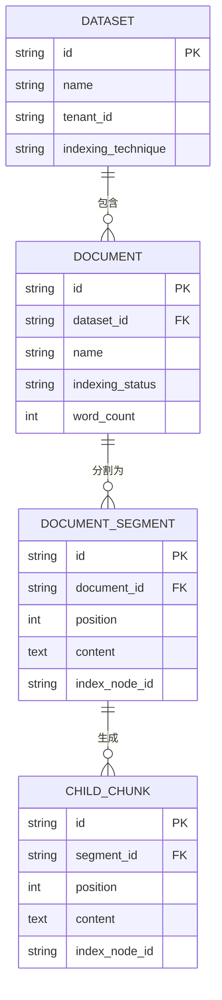
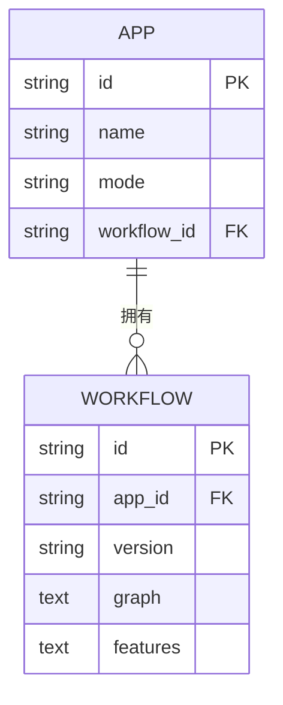
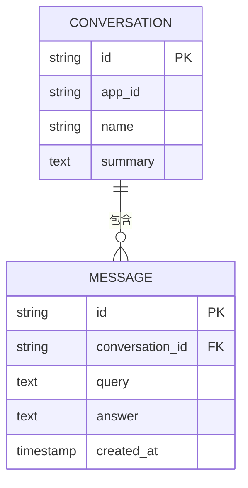
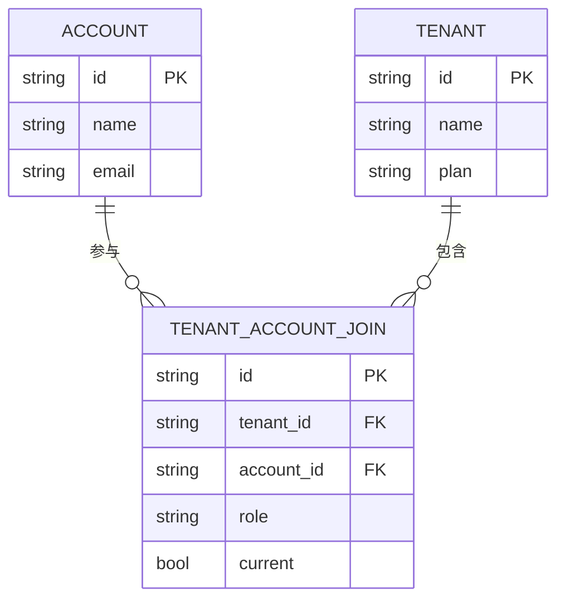
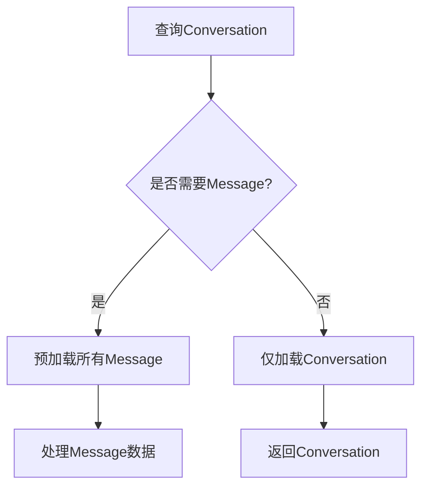

# 具体关联实现

<cite>
**本文档中引用的文件**   
- [dataset.py](file://api/models/dataset.py)
- [workflow.py](file://api/models/workflow.py)
- [account.py](file://api/models/account.py)
- [model.py](file://api/models/model.py)
</cite>

## 目录
1. [引言](#引言)
2. [Dataset与Document的一对多关系及索引策略](#dataset与document的一对多关系及索引策略)
3. [App与Workflow的绑定机制](#app与workflow的绑定机制)
4. [Conversation与Message的级联删除逻辑](#conversation与message的级联删除逻辑)
5. [User与Workspace的成员关系管理](#user与workspace的成员关系管理)
6. [复杂关联的ORM实现](#复杂关联的orm实现)
7. [关联查询性能优化](#关联查询性能优化)
8. [最佳实践建议](#最佳实践建议)

## 引言
Dify平台通过精心设计的实体关联模型，实现了知识库、应用、工作流、对话等核心功能的高效协同。本文档深入分析各核心实体间的具体关联实现细节，涵盖一对多关系、绑定机制、级联删除逻辑、成员关系管理、复杂ORM实现以及查询性能优化等方面，旨在为开发者提供全面的技术参考。

## Dataset与Document的一对多关系及索引策略

Dataset（数据集）与Document（文档）之间存在明确的一对多关系。一个Dataset可以包含多个Document，而每个Document只能属于一个Dataset。这种关系通过`Document`模型中的`dataset_id`外键字段实现。

索引策略方面，Dify平台采用了多种技术来优化查询性能。在`Document`模型中，定义了多个数据库索引，如`document_dataset_id_idx`用于加速基于`dataset_id`的查询，`document_metadata_idx`使用GIN索引支持JSONB字段的高效查询。此外，平台还实现了分层索引（hierarchical indexing）策略，通过`ChildChunk`模型将文档段落（DocumentSegment）进一步细分为子块，以支持更精细的检索。

**图示来源**
- [dataset.py](file://api/models/dataset.py#L300-L399)

**本节来源**
- [dataset.py](file://api/models/dataset.py#L300-L399)

## App与Workflow的绑定机制

App（应用）与Workflow（工作流）之间的绑定机制是Dify平台的核心功能之一。这种绑定通过`App`模型中的`workflow_id`字段实现，该字段作为外键引用`Workflow`模型的主键。当一个应用以工作流模式运行时，其`mode`字段值为"workflow"，并且`workflow_id`字段指向一个具体的工作流实例。

`Workflow`模型本身存储了工作流的完整配置，包括节点（nodes）、边（edges）和执行逻辑。通过`App.workflow`属性，可以方便地访问与应用关联的工作流对象。这种设计使得应用可以灵活地切换不同的工作流配置，同时保持应用级别的设置（如名称、图标、描述等）独立于工作流逻辑。

**图示来源**
- [model.py](file://api/models/model.py#L150-L250)
- [workflow.py](file://api/models/workflow.py#L50-L150)

**本节来源**
- [model.py](file://api/models/model.py#L150-L250)
- [workflow.py](file://api/models/workflow.py#L50-L150)

## Conversation与Message的级联删除逻辑

Conversation（对话）与Message（消息）之间存在严格的级联删除关系。`Message`模型通过`conversation_id`外键字段与`Conversation`模型关联，并在数据库层面配置了`passive_deletes="all"`选项，确保当一个对话被删除时，其包含的所有消息也会被自动删除。

这种级联删除逻辑在`Conversation`模型的定义中明确指定：`messages = db.relationship("Message", backref="conversation", lazy="select", passive_deletes="all")`。这意味着删除操作会由数据库自动处理，无需在应用代码中显式遍历并删除每条消息，从而提高了数据一致性和操作效率。

**图示来源**
- [model.py](file://api/models/model.py#L800-L900)

**本节来源**
- [model.py](file://api/models/model.py#L800-L900)

## User与Workspace的成员关系管理

User（用户）与Workspace（工作空间，即Tenant）之间的成员关系通过`TenantAccountJoin`模型进行管理。这是一个典型的多对多关系表，记录了用户在特定工作空间中的角色和状态。

`TenantAccountJoin`模型包含`tenant_id`和`account_id`两个外键，分别指向`Tenant`和`Account`模型。此外，`role`字段定义了用户在工作空间中的权限级别，如"owner"、"admin"、"editor"等。`Account`模型通过`current_tenant`和`current_role`属性提供了便捷的访问接口，允许在运行时快速获取当前用户在当前工作空间的角色信息。

**图示来源**
- [account.py](file://api/models/account.py#L200-L300)

**本节来源**
- [account.py](file://api/models/account.py#L200-L300)

## 复杂关联的ORM实现

Dify平台的ORM实现中包含了多种复杂关联模式，如多态关联、自引用树结构和联合主键。

多态关联在`MessageFile`模型中有所体现，该模型通过`transfer_method`字段区分文件的不同来源（如本地文件、远程URL、工具文件），实现了对多种文件类型的统一管理。自引用树结构在`DocumentSegment`模型中通过`previous_segment`和`next_segment`属性实现，用于维护文档段落的顺序关系。联合主键的概念在多个索引定义中得到应用，例如`TagBinding`模型虽然没有显式的联合主键，但通过唯一约束`unique_tenant_app`确保了`tenant_id`和`app_id`的组合唯一性。

## 关联查询性能优化

为优化关联查询性能，Dify平台采用了预加载、延迟加载和批量查询等技术。

预加载通过`db.relationship`的`lazy="select"`参数实现，确保在访问关联对象时能够一次性加载所有相关数据，减少数据库查询次数。延迟加载则用于处理大型或不常用的关联数据，如`DocumentSegment`的`child_chunks`属性，仅在需要时才进行查询。批量查询在`Conversation`模型的`status_count`属性中得到应用，通过一次SQL查询统计所有消息的状态，而不是为每种状态单独查询。

**图示来源**
- [model.py](file://api/models/model.py#L900-L1000)

**本节来源**
- [model.py](file://api/models/model.py#L900-L1000)

## 最佳实践建议

1. **合理使用索引**：根据查询模式为常用查询字段创建索引，但避免过度索引影响写入性能。
2. **优化关联查询**：根据数据访问模式选择合适的加载策略，预加载用于频繁访问的关联数据，延迟加载用于大型或不常用的关联数据。
3. **利用数据库级联**：对于必须保持一致性的数据关系，使用数据库级联删除，减少应用代码的复杂性。
4. **避免N+1查询**：在循环中访问关联对象时，确保已预加载相关数据，防止产生大量单条查询。
5. **监控查询性能**：定期审查慢查询日志，识别并优化性能瓶颈。