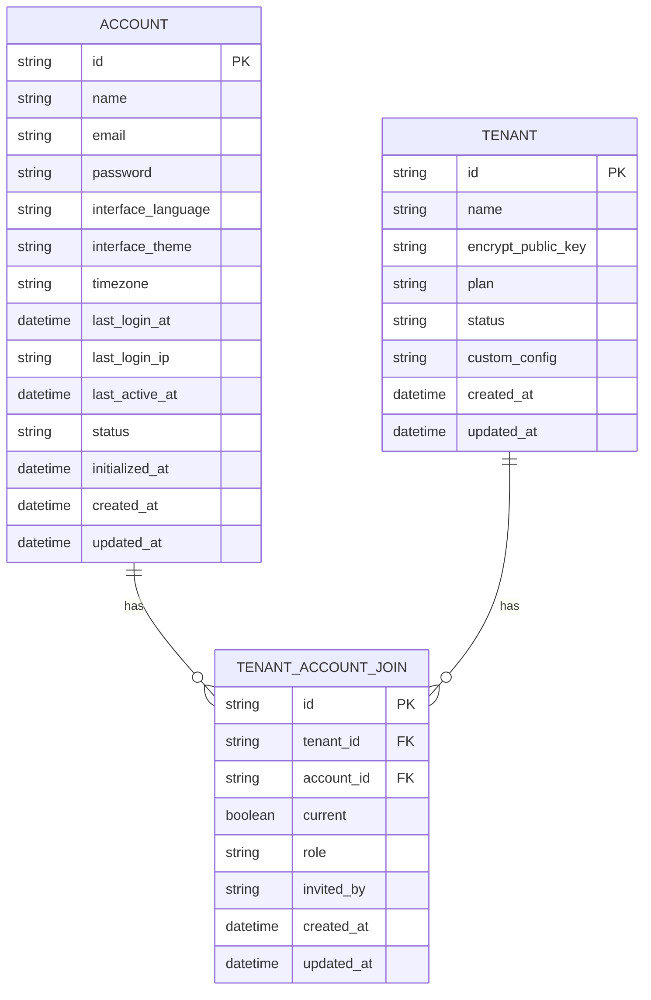

# 实体关系图解

<cite>
**本文档中引用的文件**  
- [account.py](file://api/models/account.py)
- [dataset.py](file://api/models/dataset.py)
- [model.py](file://api/models/model.py)
- [workflow.py](file://api/models/workflow.py)
- [base.py](file://api/models/base.py)
- [types.py](file://api/models/types.py)
- [engine.py](file://api/models/engine.py)
- [enums.py](file://api/models/enums.py)
- [provider.py](file://api/models/provider.py)
</cite>

## 目录
1. [引言](#引言)
2. [核心实体与关系](#核心实体与关系)
3. [数据访问路径与查询机制](#数据访问路径与查询机制)
4. [ORM特性说明](#orm特性说明)
5. [复杂关系处理策略](#复杂关系处理策略)
6. [实际查询示例](#实际查询示例)
7. [实体关系图](#实体关系图)
8. [结论](#结论)

## 引言
Dify平台是一个基于AI的应用开发平台，其数据模型设计体现了复杂的实体关系和灵活的扩展能力。本文档旨在深入解析Dify平台的核心数据模型，展示各实体之间的关联关系，解释数据访问路径和查询机制，并通过ER图直观呈现整体架构。

**Section sources**
- [account.py](file://api/models/account.py#L1-L340)
- [dataset.py](file://api/models/dataset.py#L1-L800)
- [model.py](file://api/models/model.py#L1-L800)
- [workflow.py](file://api/models/workflow.py#L1-L800)

## 核心实体与关系
Dify平台的数据模型围绕多个核心实体构建，这些实体通过外键约束、一对多、多对多等关系模式相互关联。

### 账户与租户关系
`Account`（账户）和`Tenant`（租户）之间存在多对多关系，通过`TenantAccountJoin`关联表实现。一个账户可以属于多个租户，一个租户也可以包含多个账户。



**Diagram sources**
- [account.py](file://api/models/account.py#L150-L250)

### 数据集与文档关系
`Dataset`（数据集）和`Document`（文档）之间存在一对多关系。一个数据集可以包含多个文档，每个文档都归属于一个特定的数据集。


**Diagram sources**
- [dataset.py](file://api/models/dataset.py#L50-L400)

### 应用与工作流关系
`App`（应用）和`Workflow`（工作流）之间存在一对一关系。每个应用可以关联一个工作流，工作流的版本管理支持草稿和发布版本。


**Diagram sources**
- [model.py](file://api/models/model.py#L200-L400)
- [workflow.py](file://api/models/workflow.py#L100-L300)

### 工作流节点执行关系
`WorkflowNodeExecutionModel`（工作流节点执行）与`WorkflowRun`（工作流运行）之间存在一对多关系。每次工作流运行可以触发多个节点的执行。


**Diagram sources**
- [workflow.py](file://api/models/workflow.py#L400-L800)

## 数据访问路径与查询机制
Dify平台通过SQLAlchemy ORM实现了高效的数据访问路径和查询机制。

### 外键约束
所有外键都通过`mapped_column`定义，并使用`StringUUID`类型确保数据一致性。例如，`Document`实体中的`dataset_id`字段作为外键引用`Dataset`实体的`id`字段。

### 一对多关系
一对多关系通过`db.relationship`实现，如`Conversation`与`Message`之间的关系。这种设计允许通过父实体直接访问所有子实体，简化了数据查询。

### 多对多关系
多对多关系通过关联表实现，如`Account`与`Tenant`之间的关系。`TenantAccountJoin`表作为中间表，存储两个实体之间的关联信息。

**Section sources**
- [model.py](file://api/models/model.py#L400-L600)
- [workflow.py](file://api/models/workflow.py#L800-L1000)

## ORM特性说明
Dify平台充分利用了SQLAlchemy ORM的高级特性来优化数据操作。

### 级联删除
通过`passive_deletes="all"`参数实现级联删除。当删除父实体时，所有相关的子实体也会被自动删除，确保数据完整性。

### 延迟加载
使用`lazy="select"`参数实现延迟加载。只有在实际访问关联数据时才会执行查询，提高了性能。

### 属性映射
通过`@property`装饰器定义计算属性，如`Account`实体中的`current_tenant`属性。这些属性提供了便捷的数据访问方式，同时保持了数据封装性。

**Section sources**
- [account.py](file://api/models/account.py#L100-L150)
- [model.py](file://api/models/model.py#L600-L800)

## 复杂关系处理策略
Dify平台采用多种策略处理复杂的关系模式。

### 多态关联
通过`created_by_role`字段区分不同类型的创建者（账户或终端用户），实现了多态关联。这种设计允许同一个字段引用不同类型的实体。

### 自引用关系
`DocumentSegment`实体通过`previous_segment`和`next_segment`属性实现了自引用关系，用于构建文档片段的链式结构。

### 枚举类型
使用`StrEnum`定义枚举类型，如`TenantAccountRole`和`AppMode`。这不仅提高了代码可读性，还确保了数据一致性。

**Section sources**
- [enums.py](file://api/models/enums.py#L1-L33)
- [dataset.py](file://api/models/dataset.py#L400-L600)

## 实际查询示例
以下是一些常见的跨表关联查询示例：

### 获取特定租户的所有应用
```python
apps = db.session.query(App).filter(App.tenant_id == tenant_id).all()
```

### 获取特定数据集的所有文档及其段落
```python
documents = db.session.query(Document).filter(Document.dataset_id == dataset_id).all()
for document in documents:
    segments = db.session.query(DocumentSegment).filter(DocumentSegment.document_id == document.id).all()
```

### 获取特定工作流的所有执行记录
```python
runs = db.session.query(WorkflowRun).filter(WorkflowRun.workflow_id == workflow_id).all()
```

**Section sources**
- [model.py](file://api/models/model.py#L800-L1000)
- [workflow.py](file://api/models/workflow.py#L1000-L1200)

## 实体关系图
综合以上分析，Dify平台的完整实体关系图如下：


**Diagram sources**
- [account.py](file://api/models/account.py#L1-L340)
- [dataset.py](file://api/models/dataset.py#L1-L800)
- [model.py](file://api/models/model.py#L1-L800)
- [workflow.py](file://api/models/workflow.py#L1-L800)
- [provider.py](file://api/models/provider.py#L1-L312)

## 结论
Dify平台的数据模型设计充分考虑了灵活性、可扩展性和性能需求。通过合理的实体关系设计和ORM特性应用，实现了复杂业务逻辑的高效管理。该模型不仅支持当前的功能需求，还为未来的功能扩展提供了坚实的基础。