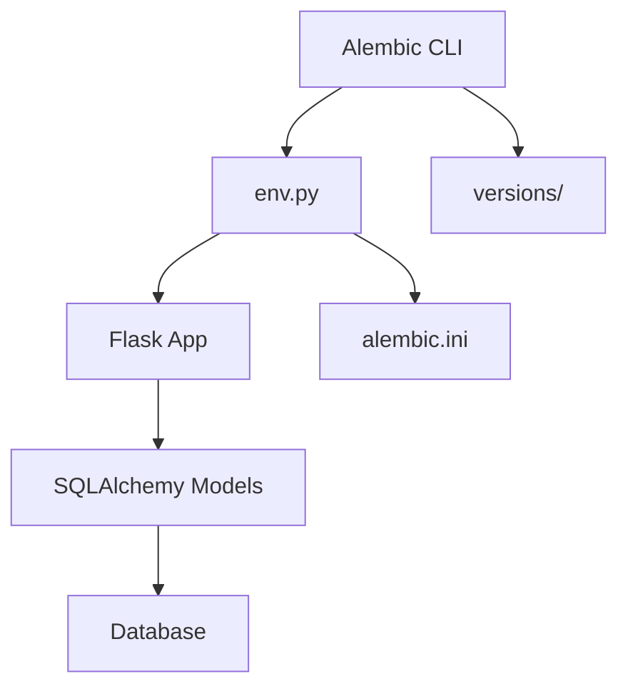
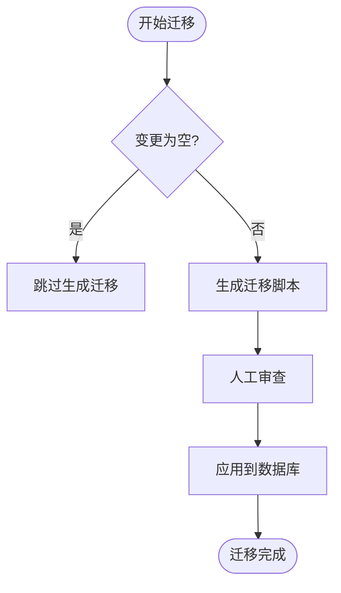
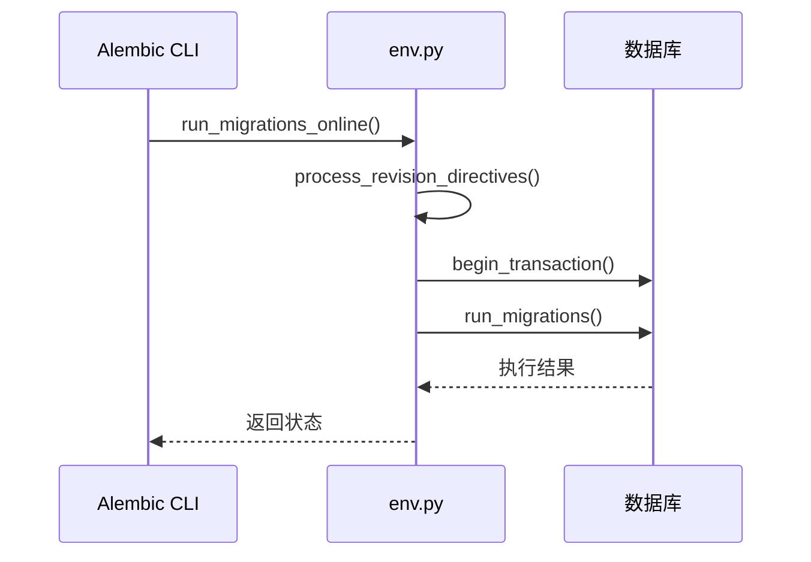

# 数据库迁移策略

<cite>
**本文档引用的文件**
- [env.py](file://api/migrations/env.py)
- [alembic.ini](file://api/migrations/alembic.ini)
- [README](file://api/migrations/README)
- [add_provider_credential_pool_support.py](file://api/migrations/versions/2025_08_09_1553-e8446f481c1e_add_provider_credential_pool_support.py)
- [data_migration.py](file://api/services/plugin/data_migration.py)
- [commands.py](file://api/commands.py)
</cite>

## 目录
1. [引言](#引言)
2. [迁移架构与Alembic配置](#迁移架构与alembic配置)
3. [迁移脚本结构与编写规范](#迁移脚本结构与编写规范)
4. [常见迁移操作示例](#常见迁移操作示例)
5. [数据迁移实现](#数据迁移实现)
6. [风险控制与回滚机制](#风险控制与回滚机制)
7. [最佳实践与常见问题](#最佳实践与常见问题)

## 引言
Dify平台采用Alembic作为数据库迁移工具，结合Flask-Migrate实现自动化版本控制。该策略确保数据库模式变更与代码部署同步，支持安全的升级与降级操作，并提供完整的数据迁移能力。本文详细说明Dify的数据库迁移管理流程、脚本编写规范、实际操作示例及风险控制措施。

## 迁移架构与Alembic配置

Dify的数据库迁移系统位于`api/migrations`目录，核心组件包括：

- `env.py`：迁移环境配置，集成Flask应用上下文
- `alembic.ini`：Alembic全局配置文件
- `versions/`：存储所有版本化迁移脚本



**Diagram sources**
- [env.py](file://api/migrations/env.py)
- [alembic.ini](file://api/migrations/alembic.ini)

**Section sources**
- [env.py](file://api/migrations/env.py#L1-L110)
- [alembic.ini](file://api/migrations/alembic.ini#L1-L50)
- [README](file://api/migrations/README#L1-L3)

## 迁移脚本结构与编写规范

Dify的迁移脚本遵循标准Alembic格式，每个脚本包含`upgrade()`和`downgrade()`两个核心函数：

- `upgrade()`：定义模式升级操作
- `downgrade()`：定义回滚操作，确保可逆性

脚本通过`op`对象执行数据库操作，如`op.create_table()`、`op.add_column()`等。文件名采用时间戳+描述的命名规范（如`2025_08_09_1553-e8446f481c1e_add_provider_credential_pool_support.py`），确保版本顺序。

**Section sources**
- [add_provider_credential_pool_support.py](file://api/migrations/versions/2025_08_09_1553-e8446f481c1e_add_provider_credential_pool_support.py)

## 常见迁移操作示例

### 添加新字段
使用`op.add_column()`在指定表中添加新列，需明确定义字段类型、约束和默认值。

### 修改表结构
通过`op.alter_column()`修改字段属性，或使用`op.drop_column()`和`op.create_index()`调整索引。

### 表结构调整
对于复杂变更（如表拆分），结合`op.create_table()`创建新表，迁移数据后使用`op.drop_table()`删除旧表。



**Diagram sources**
- [env.py](file://api/migrations/env.py#L45-L87)
- [env.py](file://api/migrations/env.py#L85-L109)

**Section sources**
- [env.py](file://api/migrations/env.py#L45-L109)

## 数据迁移实现

Dify在模式变更之外，还实现了复杂的数据迁移逻辑。例如，在`add_provider_credential_pool_support.py`中，通过原生SQL查询和`op.get_bind()`获取连接，将`providers`表数据迁移至新的`provider_credentials`表。

数据迁移采用分页处理，避免内存溢出，并包含完整的异常处理和日志记录：

```python
def migrate_existing_providers_data():
    providers_table = table('providers', column('id', ...))
    provider_credential_table = table('provider_credentials', ...)
    conn = op.get_bind()
    existing_providers = conn.execute(sa.select(...))
```

此外，平台还提供命令行工具进行数据迁移，如`commands.py`中的元数据迁移任务，支持分页处理和错误恢复。

**Section sources**
- [add_provider_credential_pool_support.py](file://api/migrations/versions/2025_08_09_1553-e8446f481c1e_add_provider_credential_pool_support.py#L58-L91)
- [commands.py](file://api/commands.py#L554-L586)
- [data_migration.py](file://api/services/plugin/data_migration.py#L104-L138)

## 风险控制与回滚机制

Dify的迁移系统内置多重风险控制措施：

1. **空变更检测**：`env.py`中的`process_revision_directives`回调检测无变更情况，避免生成无效迁移。
2. **事务保护**：所有迁移操作在事务中执行，确保原子性。
3. **降级支持**：每个`upgrade()`操作都有对应的`downgrade()`实现，支持版本回滚。
4. **外键约束处理**：`include_object`函数过滤外键约束，避免迁移冲突。



**Diagram sources**
- [env.py](file://api/migrations/env.py#L85-L109)

**Section sources**
- [env.py](file://api/migrations/env.py#L85-L109)

## 最佳实践与常见问题

### 最佳实践
- **测试先行**：在开发环境充分测试迁移脚本
- **小步迭代**：避免单个迁移包含过多变更
- **数据备份**：生产环境迁移前执行完整备份
- **文档记录**：为复杂迁移添加详细注释

### 常见问题解决方案
- **迁移冲突**：协调团队成员的迁移脚本顺序
- **数据丢失风险**：删除字段前确认无依赖
- **性能问题**：大表变更选择低峰期执行
- **回滚失败**：确保`downgrade()`逻辑经过验证

通过严格的迁移管理策略，Dify平台实现了数据库变更的安全、可控和可追溯，保障了系统的稳定性和数据完整性。

**Section sources**
- [env.py](file://api/migrations/env.py)
- [alembic.ini](file://api/migrations/alembic.ini)
- [add_provider_credential_pool_support.py](file://api/migrations/versions/2025_08_09_1553-e8446f481c1e_add_provider_credential_pool_support.py)
- [data_migration.py](file://api/services/plugin/data_migration.py)
- [commands.py](file://api/commands.py)