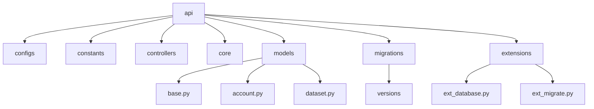
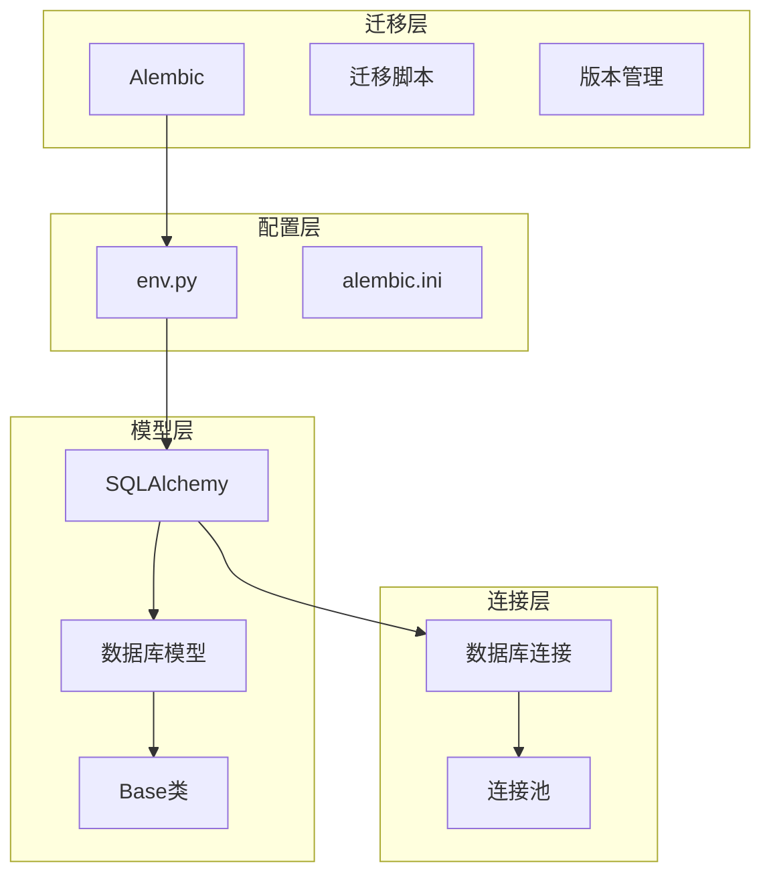
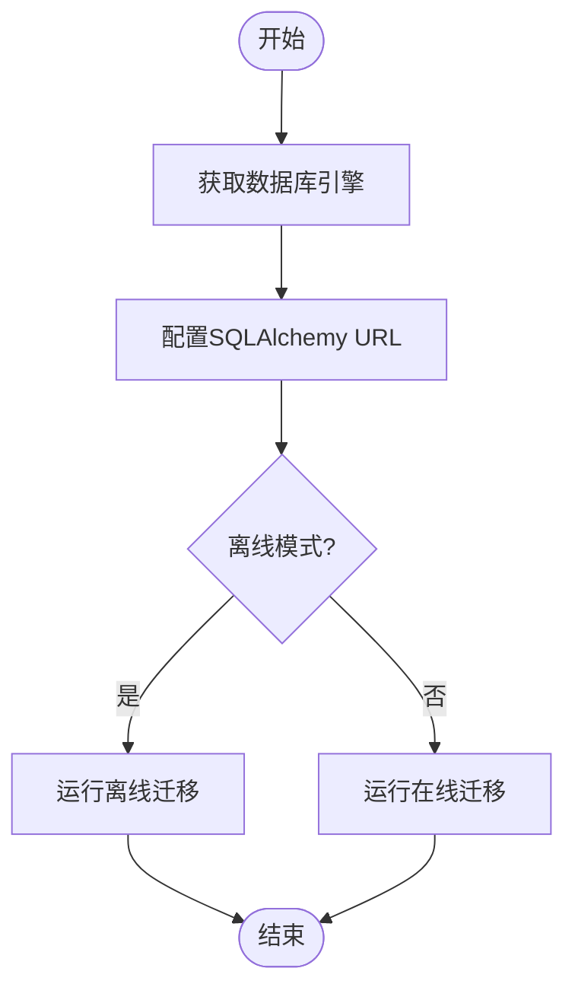
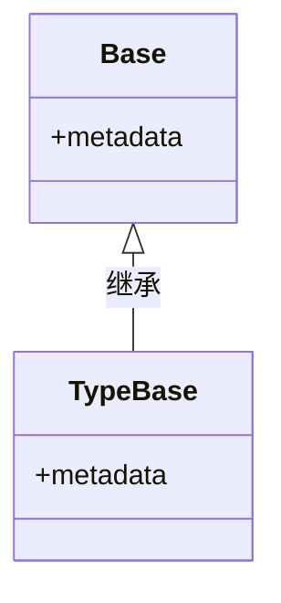
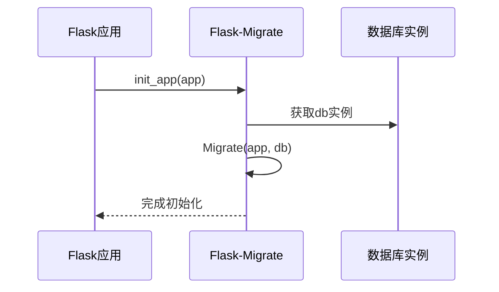
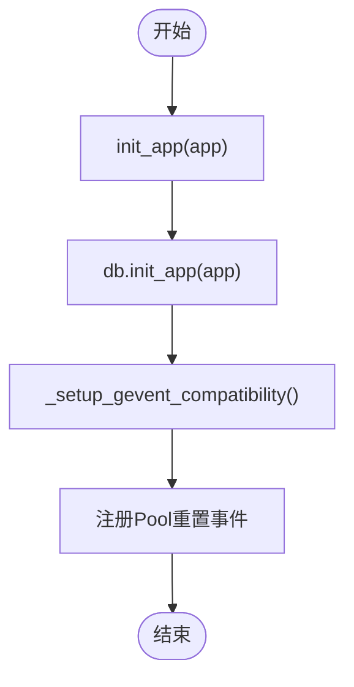
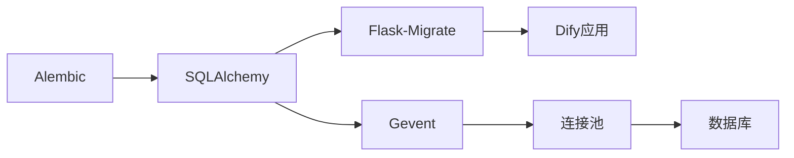

# 最佳实践

<cite>
**本文档中引用的文件**  
- [env.py](file://api/migrations/env.py)
- [base.py](file://api/models/base.py)
- [account.py](file://api/models/account.py)
- [dataset.py](file://api/models/dataset.py)
- [ext_migrate.py](file://api/extensions/ext_migrate.py)
- [ext_database.py](file://api/extensions/ext_database.py)
</cite>

## 目录
1. [引言](#引言)
2. [项目结构](#项目结构)
3. [核心组件](#核心组件)
4. [架构概述](#架构概述)
5. [详细组件分析](#详细组件分析)
6. [依赖分析](#依赖分析)
7. [性能考虑](#性能考虑)
8. [故障排除指南](#故障排除指南)
9. [结论](#结论)

## 引言
本文档旨在总结Dify平台数据库迁移的最佳实践和常见问题解决方案。重点介绍如何设计可逆的迁移操作，确保在出现问题时能够安全回滚。同时说明零停机迁移的实现策略，包括分阶段迁移、影子表技术和读写分离方案。提供处理大数据量迁移的优化技巧，如分批处理、索引管理和平滑迁移。解释如何进行迁移前后的数据一致性验证，包括校验和计算、数据抽样比对等方法。描述迁移过程中的监控和日志记录要求，确保迁移操作的可追溯性。列举常见的迁移陷阱和错误，如循环依赖、数据丢失风险、性能瓶颈等，并提供相应的预防措施。

## 项目结构
Dify平台的后端API部分采用模块化设计，主要包含配置、常量、控制器、核心逻辑、数据库模型、服务和任务等目录。数据库迁移相关功能集中在`migrations`目录中，使用Alembic作为迁移工具。数据库模型定义在`models`目录下，通过SQLAlchemy ORM进行管理。扩展功能如数据库连接和迁移初始化在`extensions`目录中实现。

**Diagram sources**
- [api](file://api)
- [migrations](file://api/migrations)
- [models](file://api/models)
- [extensions](file://api/extensions)

**Section sources**
- [api](file://api)
- [migrations](file://api/migrations)
- [models](file://api/models)

## 核心组件
Dify平台的数据库迁移系统基于Alembic和SQLAlchemy构建，主要组件包括迁移环境配置、数据库模型定义、迁移扩展初始化和数据库连接管理。系统通过`env.py`配置迁移环境，`base.py`定义基础模型类，`ext_migrate.py`初始化迁移扩展，`ext_database.py`管理数据库连接。

**Section sources**
- [env.py](file://api/migrations/env.py)
- [base.py](file://api/models/base.py)
- [ext_migrate.py](file://api/extensions/ext_migrate.py)
- [ext_database.py](file://api/extensions/ext_database.py)

## 架构概述
Dify平台的数据库迁移架构采用分层设计，上层为迁移脚本和版本管理，中层为迁移环境和配置，底层为数据库模型和连接。Alembic作为迁移工具，通过`env.py`读取Flask应用的数据库配置，利用SQLAlchemy的元数据生成迁移脚本。所有数据库模型继承自`Base`类，确保元数据一致性。

**Diagram sources**
- [env.py](file://api/migrations/env.py)
- [base.py](file://api/models/base.py)
- [ext_database.py](file://api/extensions/ext_database.py)

## 详细组件分析

### 迁移环境配置分析
迁移环境配置文件`env.py`负责初始化Alembic的运行环境，获取Flask应用的数据库引擎和URL，配置日志记录，并定义离线和在线迁移模式。文件通过`get_engine()`和`get_engine_url()`函数获取数据库连接信息，确保迁移操作与应用使用相同的数据库配置。

**Diagram sources**
- [env.py](file://api/migrations/env.py#L0-L110)

**Section sources**
- [env.py](file://api/migrations/env.py#L0-L110)

### 基础模型类分析
基础模型类`Base`定义在`base.py`中，继承自SQLAlchemy的`DeclarativeBase`，为所有数据库模型提供统一的元数据管理。该类确保所有模型共享相同的元数据实例，便于Alembic进行模式对比和迁移生成。

**Diagram sources**
- [base.py](file://api/models/base.py#L0-L15)

**Section sources**
- [base.py](file://api/models/base.py#L0-L15)

### 迁移扩展初始化分析
迁移扩展初始化函数`init_app`定义在`ext_migrate.py`中，负责将Flask-Migrate集成到Dify应用中。该函数导入`flask_migrate`并使用`Migrate`类将数据库实例与Flask应用关联，为后续的迁移操作提供支持。

**Diagram sources**
- [ext_migrate.py](file://api/extensions/ext_migrate.py#L0-L9)

**Section sources**
- [ext_migrate.py](file://api/extensions/ext_migrate.py#L0-L9)

### 数据库连接管理分析
数据库连接管理模块`ext_database.py`负责初始化数据库连接并设置Gevent兼容性。该模块通过`init_app`函数将数据库实例与Flask应用关联，并通过`_setup_gevent_compatibility`函数确保在Gevent环境下连接重置的安全性。

**Diagram sources**
- [ext_database.py](file://api/extensions/ext_database.py#L0-L55)

**Section sources**
- [ext_database.py](file://api/extensions/ext_database.py#L0-L55)

## 依赖分析
Dify平台的数据库迁移系统依赖于多个核心组件和外部库。主要依赖关系包括：Alembic作为迁移工具，SQLAlchemy作为ORM框架，Flask-Migrate作为Flask集成层，以及Gevent作为并发库。这些组件通过清晰的接口和配置进行交互，确保迁移系统的稳定性和可维护性。

**Diagram sources**
- [env.py](file://api/migrations/env.py)
- [ext_migrate.py](file://api/extensions/ext_migrate.py)
- [ext_database.py](file://api/extensions/ext_database.py)

**Section sources**
- [env.py](file://api/migrations/env.py)
- [ext_migrate.py](file://api/extensions/ext_migrate.py)
- [ext_database.py](file://api/extensions/ext_database.py)

## 性能考虑
在进行数据库迁移时，需要考虑多个性能因素。对于大数据量的表，建议采用分批处理策略，避免长时间锁定表。在添加索引时，应考虑使用并发索引创建（如果数据库支持），以减少对在线业务的影响。对于复杂的模式变更，建议先在影子表上测试，验证性能影响后再应用到生产表。

## 故障排除指南
常见的数据库迁移问题包括迁移脚本冲突、数据丢失风险和性能瓶颈。为避免迁移脚本冲突，团队应建立清晰的迁移脚本命名和版本管理规范。为防止数据丢失，所有破坏性操作（如删除列或表）都应先备份数据，并设计可逆的迁移操作。对于性能瓶颈，建议在非高峰时段执行大型迁移操作，并密切监控数据库性能指标。

**Section sources**
- [env.py](file://api/migrations/env.py)
- [base.py](file://api/models/base.py)
- [account.py](file://api/models/account.py)
- [dataset.py](file://api/models/dataset.py)

## 结论
Dify平台的数据库迁移系统基于成熟的Alembic和SQLAlchemy技术栈，具有良好的可维护性和扩展性。通过合理的设计和最佳实践，可以确保数据库迁移的安全性、可靠性和高效性。建议在实际操作中遵循本文档提供的指导原则，特别是在处理生产环境的数据库变更时，务必谨慎操作，做好充分的测试和备份。